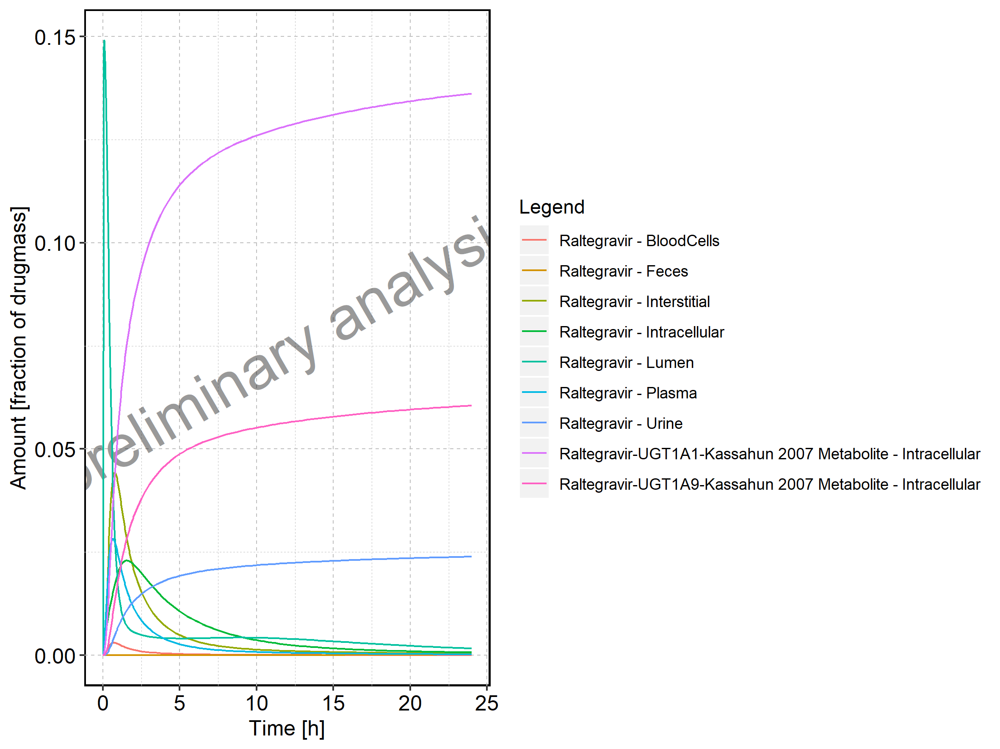
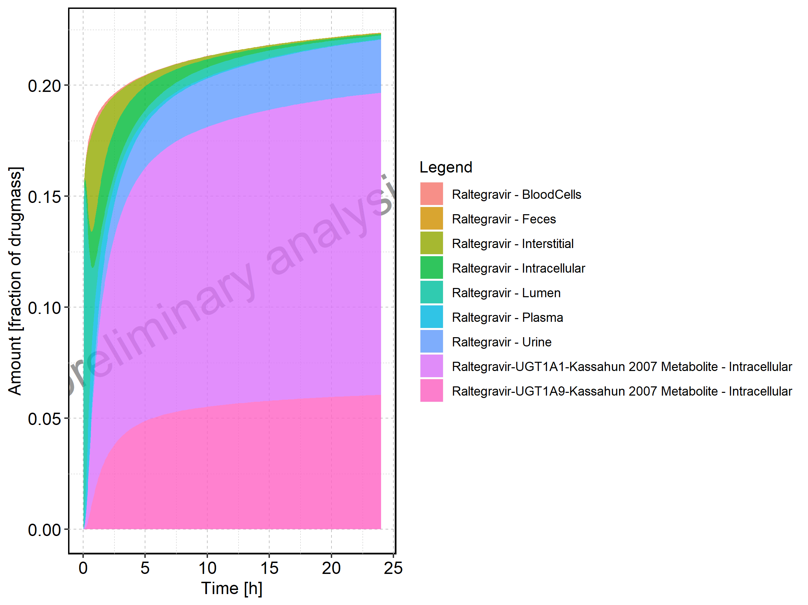
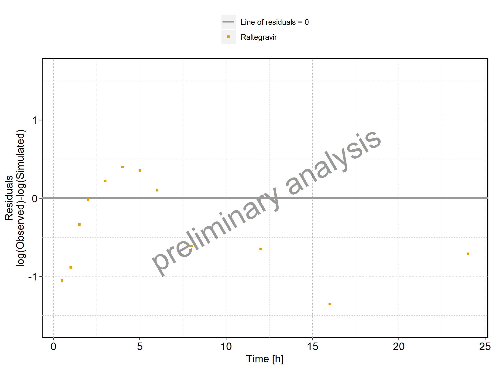
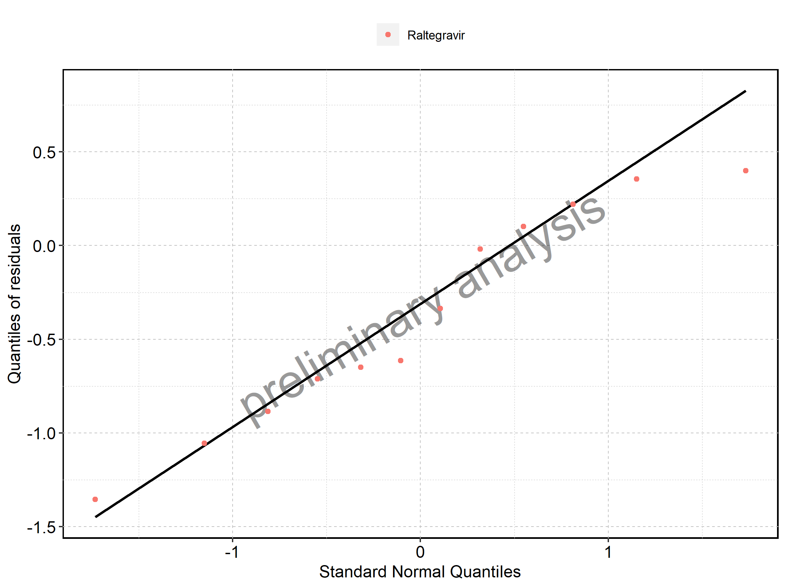

 - [1. PK parameters](#1.-pk-parameters)
   - [1.1. PK parameters for Raltegravir 10 mg (lactose formulation)](#1.1.-pk-parameters-for-raltegravir-10-mg-(lactose-formulation))
   - [1.2. PK parameters for Raltegravir 25 mg (lactose formulation)](#1.2.-pk-parameters-for-raltegravir-25-mg-(lactose-formulation))
   - [1.3. PK parameters for Raltegravir 50 mg (lactose formulation)](#1.3.-pk-parameters-for-raltegravir-50-mg-(lactose-formulation))
   - [1.4. PK parameters for Raltegravir 100 mg (lactose formulation)](#1.4.-pk-parameters-for-raltegravir-100-mg-(lactose-formulation))
   - [1.5. PK parameters for Raltegravir 200 mg (lactose formulation)](#1.5.-pk-parameters-for-raltegravir-200-mg-(lactose-formulation))
   - [1.6. PK parameters for Raltegravir 400mg (lactose formulation)](#1.6.-pk-parameters-for-raltegravir-400mg-(lactose-formulation))
   - [1.7. PK parameters for Raltegravir 800 mg (lactose formulation)](#1.7.-pk-parameters-for-raltegravir-800-mg-(lactose-formulation))
   - [1.8. PK parameters for Raltegravir 1200 mg (lactose formulation)](#1.8.-pk-parameters-for-raltegravir-1200-mg-(lactose-formulation))
   - [1.9. PK parameters for Raltegravir 1600 mg (lactose formulation)](#1.9.-pk-parameters-for-raltegravir-1600-mg-(lactose-formulation))
   - [1.10. PK parameters for Raltegravir 100 mg filmcoated tablet md](#1.10.-pk-parameters-for-raltegravir-100-mg-filmcoated-tablet-md)
   - [1.11. PK parameters for Raltegravir 200 mg filmcoated tablet md](#1.11.-pk-parameters-for-raltegravir-200-mg-filmcoated-tablet-md)
   - [1.12. PK parameters for Filmcoated_tablet_400mg_sd](#1.12.-pk-parameters-for-filmcoated_tablet_400mg_sd)
   - [1.13. PK parameters for Raltegravir 400 mg filmcoated tablet md](#1.13.-pk-parameters-for-raltegravir-400-mg-filmcoated-tablet-md)
   - [1.14. PK parameters for Raltegravir 400mg chewable fasted](#1.14.-pk-parameters-for-raltegravir-400mg-chewable-fasted)
   - [1.15. PK parameters for Raltegravir 400mg chewable fed](#1.15.-pk-parameters-for-raltegravir-400mg-chewable-fed)
   - [1.16. PK parameters for Raltegravir 400mg (granules in suspension)](#1.16.-pk-parameters-for-raltegravir-400mg-(granules-in-suspension))
 - [2. Absorption](#2.-absorption)
   - [2.1. Absorption for Raltegravir 10 mg (lactose formulation)](#2.1.-absorption-for-raltegravir-10-mg-(lactose-formulation))
   - [2.2. Absorption for Raltegravir 25 mg (lactose formulation)](#2.2.-absorption-for-raltegravir-25-mg-(lactose-formulation))
   - [2.3. Absorption for Raltegravir 50 mg (lactose formulation)](#2.3.-absorption-for-raltegravir-50-mg-(lactose-formulation))
   - [2.4. Absorption for Raltegravir 100 mg (lactose formulation)](#2.4.-absorption-for-raltegravir-100-mg-(lactose-formulation))
   - [2.5. Absorption for Raltegravir 200 mg (lactose formulation)](#2.5.-absorption-for-raltegravir-200-mg-(lactose-formulation))
   - [2.6. Absorption for Raltegravir 400mg (lactose formulation)](#2.6.-absorption-for-raltegravir-400mg-(lactose-formulation))
   - [2.7. Absorption for Raltegravir 800 mg (lactose formulation)](#2.7.-absorption-for-raltegravir-800-mg-(lactose-formulation))
   - [2.8. Absorption for Raltegravir 1200 mg (lactose formulation)](#2.8.-absorption-for-raltegravir-1200-mg-(lactose-formulation))
   - [2.9. Absorption for Raltegravir 1600 mg (lactose formulation)](#2.9.-absorption-for-raltegravir-1600-mg-(lactose-formulation))
   - [2.10. Absorption for Raltegravir 100 mg filmcoated tablet md](#2.10.-absorption-for-raltegravir-100-mg-filmcoated-tablet-md)
   - [2.11. Absorption for Raltegravir 200 mg filmcoated tablet md](#2.11.-absorption-for-raltegravir-200-mg-filmcoated-tablet-md)
   - [2.12. Absorption for Filmcoated_tablet_400mg_sd](#2.12.-absorption-for-filmcoated_tablet_400mg_sd)
   - [2.13. Absorption for Raltegravir 400 mg filmcoated tablet md](#2.13.-absorption-for-raltegravir-400-mg-filmcoated-tablet-md)
   - [2.14. Absorption for Raltegravir 400mg chewable fasted](#2.14.-absorption-for-raltegravir-400mg-chewable-fasted)
   - [2.15. Absorption for Raltegravir 400mg chewable fed](#2.15.-absorption-for-raltegravir-400mg-chewable-fed)
   - [2.16. Absorption for Raltegravir 400mg (granules in suspension)](#2.16.-absorption-for-raltegravir-400mg-(granules-in-suspension))
 - [3. Mass Balance](#3.-mass-balance)
   - [3.1. Mass Balance for Raltegravir 10 mg (lactose formulation)](#3.1.-mass-balance-for-raltegravir-10-mg-(lactose-formulation))
   - [3.2. Mass Balance for Raltegravir 25 mg (lactose formulation)](#3.2.-mass-balance-for-raltegravir-25-mg-(lactose-formulation))
   - [3.3. Mass Balance for Raltegravir 50 mg (lactose formulation)](#3.3.-mass-balance-for-raltegravir-50-mg-(lactose-formulation))
   - [3.4. Mass Balance for Raltegravir 100 mg (lactose formulation)](#3.4.-mass-balance-for-raltegravir-100-mg-(lactose-formulation))
   - [3.5. Mass Balance for Raltegravir 200 mg (lactose formulation)](#3.5.-mass-balance-for-raltegravir-200-mg-(lactose-formulation))
   - [3.6. Mass Balance for Raltegravir 400mg (lactose formulation)](#3.6.-mass-balance-for-raltegravir-400mg-(lactose-formulation))
   - [3.7. Mass Balance for Raltegravir 800 mg (lactose formulation)](#3.7.-mass-balance-for-raltegravir-800-mg-(lactose-formulation))
   - [3.8. Mass Balance for Raltegravir 1200 mg (lactose formulation)](#3.8.-mass-balance-for-raltegravir-1200-mg-(lactose-formulation))
   - [3.9. Mass Balance for Raltegravir 1600 mg (lactose formulation)](#3.9.-mass-balance-for-raltegravir-1600-mg-(lactose-formulation))
   - [3.10. Mass Balance for Raltegravir 100 mg filmcoated tablet md](#3.10.-mass-balance-for-raltegravir-100-mg-filmcoated-tablet-md)
   - [3.11. Mass Balance for Raltegravir 200 mg filmcoated tablet md](#3.11.-mass-balance-for-raltegravir-200-mg-filmcoated-tablet-md)
   - [3.12. Mass Balance for Filmcoated_tablet_400mg_sd](#3.12.-mass-balance-for-filmcoated_tablet_400mg_sd)
   - [3.13. Mass Balance for Raltegravir 400 mg filmcoated tablet md](#3.13.-mass-balance-for-raltegravir-400-mg-filmcoated-tablet-md)
   - [3.14. Mass Balance for Raltegravir 400mg chewable fasted](#3.14.-mass-balance-for-raltegravir-400mg-chewable-fasted)
   - [3.15. Mass Balance for Raltegravir 400mg chewable fed](#3.15.-mass-balance-for-raltegravir-400mg-chewable-fed)
   - [3.16. Mass Balance for Raltegravir 400mg (granules in suspension)](#3.16.-mass-balance-for-raltegravir-400mg-(granules-in-suspension))
 - [4. Time profiles and residual plots](#4.-time-profiles-and-residual-plots)
   - [4.1. Time profiles and residual plots for Raltegravir 10 mg (lactose formulation)](#4.1.-time-profiles-and-residual-plots-for-raltegravir-10-mg-(lactose-formulation))
   - [4.2. Time profiles and residual plots for Raltegravir 25 mg (lactose formulation)](#4.2.-time-profiles-and-residual-plots-for-raltegravir-25-mg-(lactose-formulation))
   - [4.3. Time profiles and residual plots for Raltegravir 50 mg (lactose formulation)](#4.3.-time-profiles-and-residual-plots-for-raltegravir-50-mg-(lactose-formulation))
   - [4.4. Time profiles and residual plots for Raltegravir 100 mg (lactose formulation)](#4.4.-time-profiles-and-residual-plots-for-raltegravir-100-mg-(lactose-formulation))
   - [4.5. Time profiles and residual plots for Raltegravir 200 mg (lactose formulation)](#4.5.-time-profiles-and-residual-plots-for-raltegravir-200-mg-(lactose-formulation))
   - [4.6. Time profiles and residual plots for Raltegravir 400mg (lactose formulation)](#4.6.-time-profiles-and-residual-plots-for-raltegravir-400mg-(lactose-formulation))
   - [4.7. Time profiles and residual plots for Raltegravir 800 mg (lactose formulation)](#4.7.-time-profiles-and-residual-plots-for-raltegravir-800-mg-(lactose-formulation))
   - [4.8. Time profiles and residual plots for Raltegravir 1200 mg (lactose formulation)](#4.8.-time-profiles-and-residual-plots-for-raltegravir-1200-mg-(lactose-formulation))
   - [4.9. Time profiles and residual plots for Raltegravir 1600 mg (lactose formulation)](#4.9.-time-profiles-and-residual-plots-for-raltegravir-1600-mg-(lactose-formulation))
   - [4.10. Time profiles and residual plots for Raltegravir 100 mg filmcoated tablet md](#4.10.-time-profiles-and-residual-plots-for-raltegravir-100-mg-filmcoated-tablet-md)
   - [4.10.1. For total simulation time range](#4.10.1.-for-total-simulation-time-range)
   - [4.10.2. For first application range](#4.10.2.-for-first-application-range)
   - [4.10.3. For last application range](#4.10.3.-for-last-application-range)
   - [4.11. Time profiles and residual plots for Raltegravir 200 mg filmcoated tablet md](#4.11.-time-profiles-and-residual-plots-for-raltegravir-200-mg-filmcoated-tablet-md)
   - [4.11.1. For total simulation time range](#4.11.1.-for-total-simulation-time-range)
   - [4.11.2. For first application range](#4.11.2.-for-first-application-range)
   - [4.11.3. For last application range](#4.11.3.-for-last-application-range)
   - [4.12. Time profiles and residual plots for Filmcoated_tablet_400mg_sd](#4.12.-time-profiles-and-residual-plots-for-filmcoated_tablet_400mg_sd)
   - [4.13. Time profiles and residual plots for Raltegravir 400 mg filmcoated tablet md](#4.13.-time-profiles-and-residual-plots-for-raltegravir-400-mg-filmcoated-tablet-md)
   - [4.13.1. For total simulation time range](#4.13.1.-for-total-simulation-time-range)
   - [4.13.2. For first application range](#4.13.2.-for-first-application-range)
   - [4.13.3. For last application range](#4.13.3.-for-last-application-range)
   - [4.14. Time profiles and residual plots for Raltegravir 400mg chewable fasted](#4.14.-time-profiles-and-residual-plots-for-raltegravir-400mg-chewable-fasted)
   - [4.15. Time profiles and residual plots for Raltegravir 400mg chewable fed](#4.15.-time-profiles-and-residual-plots-for-raltegravir-400mg-chewable-fed)
   - [4.16. Time profiles and residual plots for Raltegravir 400mg (granules in suspension)](#4.16.-time-profiles-and-residual-plots-for-raltegravir-400mg-(granules-in-suspension))
   - [4.17. Residuals across all simulations](#4.17.-residuals-across-all-simulations)

# 1. PK parameters

## 1.1. PK parameters for Raltegravir 10 mg (lactose formulation)

|Path        |Parameter    |        Value|Unit      |
|:-----------|:------------|------------:|:---------|
|Raltegravir |C_max        |  110.4938945|µg/l      |
|Raltegravir |C_max_norm   |    0.8066055|kg/l      |
|Raltegravir |t_max        |    0.7500000|h         |
|Raltegravir |C_tEnd       |    1.9563139|µg/l      |
|Raltegravir |AUC          |  241.6052506|µg*h/l    |
|Raltegravir |AUC_norm     |    1.7637182|kg*h/l    |
|Raltegravir |AUC_inf      |  255.1373571|µg*h/l    |
|Raltegravir |AUC_inf_norm |    1.8625028|kg*h/l    |
|Raltegravir |MRT          |    3.3293592|h         |
|Raltegravir |Thalf        |    4.7946014|h         |
|Raltegravir |CL           |    8.9485329|ml/min/kg |
|Raltegravir |Vss          | 1787.5727415|ml/kg     |
|Raltegravir |Vd           | 3713.8993740|ml/kg     |

## 1.2. PK parameters for Raltegravir 25 mg (lactose formulation)

|Path        |Parameter    |       Value|Unit      |
|:-----------|:------------|-----------:|:---------|
|Raltegravir |C_max        |  276.849301|µg/l      |
|Raltegravir |C_max_norm   |    0.808400|kg/l      |
|Raltegravir |t_max        |    0.750000|h         |
|Raltegravir |C_tEnd       |    4.894139|µg/l      |
|Raltegravir |AUC          |  605.060435|µg*h/l    |
|Raltegravir |AUC_norm     |    1.766776|kg*h/l    |
|Raltegravir |AUC_inf      |  638.895505|µg*h/l    |
|Raltegravir |AUC_inf_norm |    1.865575|kg*h/l    |
|Raltegravir |MRT          |    3.327076|h         |
|Raltegravir |Thalf        |    4.791995|h         |
|Raltegravir |CL           |    8.933796|ml/min/kg |
|Raltegravir |Vss          | 1783.405542|ml/kg     |
|Raltegravir |Vd           | 3705.768108|ml/kg     |

## 1.3. PK parameters for Raltegravir 50 mg (lactose formulation)

|Path        |Parameter    |        Value|Unit      |
|:-----------|:------------|------------:|:---------|
|Raltegravir |C_max        |  556.5958396|µg/l      |
|Raltegravir |C_max_norm   |    0.8126299|kg/l      |
|Raltegravir |t_max        |    0.7500000|h         |
|Raltegravir |C_tEnd       |    1.5273094|µg/l      |
|Raltegravir |AUC          | 1296.6526164|µg*h/l    |
|Raltegravir |AUC_norm     |    1.8931128|kg*h/l    |
|Raltegravir |AUC_inf      | 1317.0856667|µg*h/l    |
|Raltegravir |AUC_inf_norm |    1.9229450|kg*h/l    |
|Raltegravir |MRT          |    4.1443489|h         |
|Raltegravir |Thalf        |    9.2732239|h         |
|Raltegravir |CL           |    8.6672613|ml/min/kg |
|Raltegravir |Vss          | 2155.2090645|ml/kg     |
|Raltegravir |Vd           | 6957.2629929|ml/kg     |

## 1.4. PK parameters for Raltegravir 100 mg (lactose formulation)

|Path        |Parameter    |        Value|Unit      |
|:-----------|:------------|------------:|:---------|
|Raltegravir |C_max        | 1123.8968432|µg/l      |
|Raltegravir |C_max_norm   |    0.8204447|kg/l      |
|Raltegravir |t_max        |    0.7500000|h         |
|Raltegravir |C_tEnd       |    2.8365190|µg/l      |
|Raltegravir |AUC          | 2615.7731116|µg*h/l    |
|Raltegravir |AUC_norm     |    1.9095144|kg*h/l    |
|Raltegravir |AUC_inf      | 2654.0634656|µg*h/l    |
|Raltegravir |AUC_inf_norm |    1.9374663|kg*h/l    |
|Raltegravir |MRT          |    4.1381223|h         |
|Raltegravir |Thalf        |    9.3568461|h         |
|Raltegravir |CL           |    8.6022997|ml/min/kg |
|Raltegravir |Vss          | 2135.8420849|ml/kg     |
|Raltegravir |Vd           | 6967.3857689|ml/kg     |

## 1.5. PK parameters for Raltegravir 200 mg (lactose formulation)

|Path        |Parameter    |       Value|Unit      |
|:-----------|:------------|-----------:|:---------|
|Raltegravir |C_max        | 2283.843895|µg/l      |
|Raltegravir |C_max_norm   |    0.833603|kg/l      |
|Raltegravir |t_max        |    0.750000|h         |
|Raltegravir |C_tEnd       |    1.918062|µg/l      |
|Raltegravir |AUC          | 5349.761122|µg*h/l    |
|Raltegravir |AUC_norm     |    1.952663|kg*h/l    |
|Raltegravir |AUC_inf      | 5376.252319|µg*h/l    |
|Raltegravir |AUC_inf_norm |    1.962332|kg*h/l    |
|Raltegravir |MRT          |    4.134027|h         |
|Raltegravir |Thalf        |    9.573441|h         |
|Raltegravir |CL           |    8.493296|ml/min/kg |
|Raltegravir |Vss          | 2106.690645|ml/kg     |
|Raltegravir |Vd           | 7038.337707|ml/kg     |

## 1.6. PK parameters for Raltegravir 400mg (lactose formulation)

|Path        |Parameter    |        Value|Unit      |
|:-----------|:------------|------------:|:---------|
|Raltegravir |C_max        |  4673.726268|µg/l      |
|Raltegravir |C_max_norm   |     0.852955|kg/l      |
|Raltegravir |t_max        |     0.750000|h         |
|Raltegravir |C_tEnd       |     3.837874|µg/l      |
|Raltegravir |AUC          | 10899.606324|µg*h/l    |
|Raltegravir |AUC_norm     |     1.989178|kg*h/l    |
|Raltegravir |AUC_inf      | 10952.620364|µg*h/l    |
|Raltegravir |AUC_inf_norm |     1.998853|kg*h/l    |
|Raltegravir |MRT          |     4.109855|h         |
|Raltegravir |Thalf        |     9.574743|h         |
|Raltegravir |CL           |     8.338114|ml/min/kg |
|Raltegravir |Vss          |  2056.106567|ml/kg     |
|Raltegravir |Vd           |  6910.678864|ml/kg     |

## 1.7. PK parameters for Raltegravir 800 mg (lactose formulation)

|Path        |Parameter    |        Value|Unit      |
|:-----------|:------------|------------:|:---------|
|Raltegravir |C_max        | 9.613040e+03|µg/l      |
|Raltegravir |C_max_norm   | 8.771899e-01|kg/l      |
|Raltegravir |t_max        | 7.500000e-01|h         |
|Raltegravir |C_tEnd       | 6.643868e+00|µg/l      |
|Raltegravir |AUC          | 2.234232e+04|µg*h/l    |
|Raltegravir |AUC_norm     | 2.038736e+00|kg*h/l    |
|Raltegravir |AUC_inf      | 2.243378e+04|µg*h/l    |
|Raltegravir |AUC_inf_norm | 2.047083e+00|kg*h/l    |
|Raltegravir |MRT          | 4.084571e+00|h         |
|Raltegravir |Thalf        | 9.542753e+00|h         |
|Raltegravir |CL           | 8.141668e+00|ml/min/kg |
|Raltegravir |Vss          | 1.995313e+03|ml/kg     |
|Raltegravir |Vd           | 6.725318e+03|ml/kg     |

## 1.8. PK parameters for Raltegravir 1200 mg (lactose formulation)

|Path        |Parameter    |        Value|Unit      |
|:-----------|:------------|------------:|:---------|
|Raltegravir |C_max        | 1.468291e+04|µg/l      |
|Raltegravir |C_max_norm   | 8.932101e-01|kg/l      |
|Raltegravir |t_max        | 7.500000e-01|h         |
|Raltegravir |C_tEnd       | 1.997039e+00|µg/l      |
|Raltegravir |AUC          | 3.417676e+04|µg*h/l    |
|Raltegravir |AUC_norm     | 2.079086e+00|kg*h/l    |
|Raltegravir |AUC_inf      | 3.420447e+04|µg*h/l    |
|Raltegravir |AUC_inf_norm | 2.080772e+00|kg*h/l    |
|Raltegravir |MRT          | 4.095406e+00|h         |
|Raltegravir |Thalf        | 9.617984e+00|h         |
|Raltegravir |CL           | 8.009847e+00|ml/min/kg |
|Raltegravir |Vss          | 1.968214e+03|ml/kg     |
|Raltegravir |Vd           | 6.668591e+03|ml/kg     |

## 1.9. PK parameters for Raltegravir 1600 mg (lactose formulation)

|Path        |Parameter    |        Value|Unit      |
|:-----------|:------------|------------:|:---------|
|Raltegravir |C_max        | 1.979954e+04|µg/l      |
|Raltegravir |C_max_norm   | 9.033539e-01|kg/l      |
|Raltegravir |t_max        | 7.500000e-01|h         |
|Raltegravir |C_tEnd       | 2.665646e+00|µg/l      |
|Raltegravir |AUC          | 4.607060e+04|µg*h/l    |
|Raltegravir |AUC_norm     | 2.101971e+00|kg*h/l    |
|Raltegravir |AUC_inf      | 4.610762e+04|µg*h/l    |
|Raltegravir |AUC_inf_norm | 2.103660e+00|kg*h/l    |
|Raltegravir |MRT          | 4.125340e+00|h         |
|Raltegravir |Thalf        | 9.626328e+00|h         |
|Raltegravir |CL           | 7.922700e+00|ml/min/kg |
|Raltegravir |Vss          | 1.961030e+03|ml/kg     |
|Raltegravir |Vd           | 6.601758e+03|ml/kg     |

## 1.10. PK parameters for Raltegravir 100 mg filmcoated tablet md

|Path        |Parameter                    |        Value|Unit   |
|:-----------|:----------------------------|------------:|:------|
|Raltegravir |C_max                        |  894.0838340|µg/l   |
|Raltegravir |C_max_norm                   |    0.0326341|kg/l   |
|Raltegravir |C_max_t1_t2                  |  863.1595648|µg/l   |
|Raltegravir |C_max_t1_t2_norm             |    0.6301065|kg/l   |
|Raltegravir |C_max_tLast_tEnd             |  892.6719556|µg/l   |
|Raltegravir |C_max_tLast_tEnd_norm        |    0.6516506|kg/l   |
|Raltegravir |t_max                        |  168.7500000|h      |
|Raltegravir |t_max_t1_t2                  |    0.7500000|h      |
|Raltegravir |t_max_tLast_tEnd             |  228.7500000|h      |
|Raltegravir |C_trough_t2                  |   19.6617510|µg/l   |
|Raltegravir |C_trough_tLast               |   31.9225175|µg/l   |
|Raltegravir |AUC_t1_t2                    | 1978.7565232|µg*h/l |
|Raltegravir |AUC_t1_t2_norm               |    1.4444923|kg*h/l |
|Raltegravir |AUC_tLast_minus_1_tLast      | 2218.5627070|µg*h/l |
|Raltegravir |AUC_tLast_minus_1_tLast_norm |    1.6195509|kg*h/l |
|Raltegravir |AUC_inf_t1                   | 2144.3461704|µg*h/l |
|Raltegravir |AUC_inf_t1_norm              |    1.5653726|kg*h/l |
|Raltegravir |AUC_inf_tLast                | 2536.5542696|µg*h/l |
|Raltegravir |AUC_inf_tLast_norm           |    1.8516847|kg*h/l |
|Raltegravir |MRT                          |    3.9621429|h      |
|Raltegravir |Thalf                        |    5.8376226|h      |
|Raltegravir |Thalf_tLast_tEnd             |    6.9001592|h      |

## 1.11. PK parameters for Raltegravir 200 mg filmcoated tablet md

|Path        |Parameter                    |        Value|Unit   |
|:-----------|:----------------------------|------------:|:------|
|Raltegravir |C_max                        | 1812.3013054|µg/l   |
|Raltegravir |C_max_norm                   |    0.0330745|kg/l   |
|Raltegravir |C_max_t1_t2                  | 1748.6577478|µg/l   |
|Raltegravir |C_max_t1_t2_norm             |    0.6382601|kg/l   |
|Raltegravir |C_max_tLast_tEnd             | 1808.6423947|µg/l   |
|Raltegravir |C_max_tLast_tEnd_norm        |    0.6601545|kg/l   |
|Raltegravir |t_max                        |   72.7500000|h      |
|Raltegravir |t_max_t1_t2                  |    0.7500000|h      |
|Raltegravir |t_max_tLast_tEnd             |  228.7500000|h      |
|Raltegravir |C_trough_t2                  |   39.4742325|µg/l   |
|Raltegravir |C_trough_tLast               |   64.0305196|µg/l   |
|Raltegravir |AUC_t1_t2                    | 3998.1178427|µg*h/l |
|Raltegravir |AUC_t1_t2_norm               |    1.4593130|kg*h/l |
|Raltegravir |AUC_tLast_minus_1_tLast      | 4483.5973516|µg*h/l |
|Raltegravir |AUC_tLast_minus_1_tLast_norm |    1.6365131|kg*h/l |
|Raltegravir |AUC_inf_t1                   | 4329.1330307|µg*h/l |
|Raltegravir |AUC_inf_t1_norm              |    1.5801335|kg*h/l |
|Raltegravir |AUC_inf_tLast                | 5115.6988866|µg*h/l |
|Raltegravir |AUC_inf_tLast_norm           |    1.8672301|kg*h/l |
|Raltegravir |MRT                          |    3.9411664|h      |
|Raltegravir |Thalf                        |    5.8124568|h      |
|Raltegravir |Thalf_tLast_tEnd             |    6.8734080|h      |

## 1.12. PK parameters for Filmcoated_tablet_400mg_sd

|Path        |Parameter    |        Value|Unit      |
|:-----------|:------------|------------:|:---------|
|Raltegravir |C_max        | 3568.5563894|µg/l      |
|Raltegravir |C_max_norm   |    0.6512616|kg/l      |
|Raltegravir |t_max        |    0.7500000|h         |
|Raltegravir |C_tEnd       |   28.2685935|µg/l      |
|Raltegravir |AUC          | 8703.6498337|µg*h/l    |
|Raltegravir |AUC_norm     |    1.5884161|kg*h/l    |
|Raltegravir |AUC_inf      | 9072.4244034|µg*h/l    |
|Raltegravir |AUC_inf_norm |    1.6557174|kg*h/l    |
|Raltegravir |MRT          |    4.8922185|h         |
|Raltegravir |Thalf        |    9.0423584|h         |
|Raltegravir |CL           |   10.0661302|ml/min/kg |
|Raltegravir |Vss          | 2954.7424316|ml/kg     |
|Raltegravir |Vd           | 7878.9811134|ml/kg     |

## 1.13. PK parameters for Raltegravir 400 mg filmcoated tablet md

|Path        |Parameter                    |        Value|Unit   |
|:-----------|:----------------------------|------------:|:------|
|Raltegravir |C_max                        | 3.696229e+03|µg/l   |
|Raltegravir |C_max_norm                   | 3.372810e-02|kg/l   |
|Raltegravir |C_max_t1_t2                  | 3.569008e+03|µg/l   |
|Raltegravir |C_max_t1_t2_norm             | 6.513440e-01|kg/l   |
|Raltegravir |C_max_tLast_tEnd             | 3.689995e+03|µg/l   |
|Raltegravir |C_max_tLast_tEnd_norm        | 6.734241e-01|kg/l   |
|Raltegravir |t_max                        | 8.475000e+01|h      |
|Raltegravir |t_max_t1_t2                  | 7.500000e-01|h      |
|Raltegravir |t_max_tLast_tEnd             | 2.287500e+02|h      |
|Raltegravir |C_trough_t2                  | 7.975313e+01|µg/l   |
|Raltegravir |C_trough_tLast               | 1.291935e+02|µg/l   |
|Raltegravir |AUC_t1_t2                    | 8.128051e+03|µg*h/l |
|Raltegravir |AUC_t1_t2_norm               | 1.483369e+00|kg*h/l |
|Raltegravir |AUC_tLast_minus_1_tLast      | 9.098474e+03|µg*h/l |
|Raltegravir |AUC_tLast_minus_1_tLast_norm | 1.660472e+00|kg*h/l |
|Raltegravir |AUC_inf_t1                   | 8.798719e+03|µg*h/l |
|Raltegravir |AUC_inf_t1_norm              | 1.605766e+00|kg*h/l |
|Raltegravir |AUC_inf_tLast                | 1.036592e+04|µg*h/l |
|Raltegravir |AUC_inf_tLast_norm           | 1.891780e+00|kg*h/l |
|Raltegravir |MRT                          | 3.934582e+00|h      |
|Raltegravir |Thalf                        | 5.828885e+00|h      |
|Raltegravir |Thalf_tLast_tEnd             | 6.799164e+00|h      |

## 1.14. PK parameters for Raltegravir 400mg chewable fasted

|Path        |Parameter    |        Value|Unit      |
|:-----------|:------------|------------:|:---------|
|Raltegravir |C_max        |  6330.518996|µg/l      |
|Raltegravir |C_max_norm   |     1.155320|kg/l      |
|Raltegravir |t_max        |     0.750000|h         |
|Raltegravir |C_tEnd       |    35.836480|µg/l      |
|Raltegravir |AUC          | 14694.827674|µg*h/l    |
|Raltegravir |AUC_norm     |     2.681806|kg*h/l    |
|Raltegravir |AUC_inf      | 15124.213097|µg*h/l    |
|Raltegravir |AUC_inf_norm |     2.760169|kg*h/l    |
|Raltegravir |MRT          |     4.186335|h         |
|Raltegravir |Thalf        |     8.305142|h         |
|Raltegravir |CL           |     6.038278|ml/min/kg |
|Raltegravir |Vss          |  1516.695142|ml/kg     |
|Raltegravir |Vd           |  4340.961456|ml/kg     |

## 1.15. PK parameters for Raltegravir 400mg chewable fed

|Path        |Parameter    |        Value|Unit      |
|:-----------|:------------|------------:|:---------|
|Raltegravir |C_max        | 2.580439e+03|µg/l      |
|Raltegravir |C_max_norm   | 4.709301e-01|kg/l      |
|Raltegravir |t_max        | 2.500000e+00|h         |
|Raltegravir |C_tEnd       | 3.592768e+01|µg/l      |
|Raltegravir |AUC          | 1.411909e+04|µg*h/l    |
|Raltegravir |AUC_norm     | 2.576734e+00|kg*h/l    |
|Raltegravir |AUC_inf      | 1.460635e+04|µg*h/l    |
|Raltegravir |AUC_inf_norm | 2.665660e+00|kg*h/l    |
|Raltegravir |MRT          | 5.989332e+00|h         |
|Raltegravir |Thalf        | 9.400702e+00|h         |
|Raltegravir |CL           | 6.252361e+00|ml/min/kg |
|Raltegravir |Vss          | 2.246848e+03|ml/kg     |
|Raltegravir |Vd           | 5.087801e+03|ml/kg     |

## 1.16. PK parameters for Raltegravir 400mg (granules in suspension)

|Path        |Parameter    |        Value|Unit      |
|:-----------|:------------|------------:|:---------|
|Raltegravir |C_max        |  8156.789686|µg/l      |
|Raltegravir |C_max_norm   |     1.488614|kg/l      |
|Raltegravir |t_max        |     0.700000|h         |
|Raltegravir |C_tEnd       |    42.186887|µg/l      |
|Raltegravir |AUC          | 18791.010143|µg*h/l    |
|Raltegravir |AUC_norm     |     3.429359|kg*h/l    |
|Raltegravir |AUC_inf      | 19278.707122|µg*h/l    |
|Raltegravir |AUC_inf_norm |     3.518364|kg*h/l    |
|Raltegravir |MRT          |     4.020312|h         |
|Raltegravir |Thalf        |     8.013054|h         |
|Raltegravir |CL           |     4.737050|ml/min/kg |
|Raltegravir |Vss          |  1142.665029|ml/kg     |
|Raltegravir |Vd           |  3285.730123|ml/kg     |

# 2. Absorption

## 2.1. Absorption for Raltegravir 10 mg (lactose formulation)

\newpage
Figure 1: Absorption of Raltegravir

-Raltegravir.png)

## 2.2. Absorption for Raltegravir 25 mg (lactose formulation)

\newpage
Figure 2: Absorption of Raltegravir

-Raltegravir.png)

## 2.3. Absorption for Raltegravir 50 mg (lactose formulation)

\newpage
Figure 3: Absorption of Raltegravir

-Raltegravir.png)

## 2.4. Absorption for Raltegravir 100 mg (lactose formulation)

\newpage
Figure 4: Absorption of Raltegravir

-Raltegravir.png)

## 2.5. Absorption for Raltegravir 200 mg (lactose formulation)

\newpage
Figure 5: Absorption of Raltegravir

-Raltegravir.png)

## 2.6. Absorption for Raltegravir 400mg (lactose formulation)

\newpage
Figure 6: Absorption of Raltegravir

-Raltegravir.png)

## 2.7. Absorption for Raltegravir 800 mg (lactose formulation)

\newpage
Figure 7: Absorption of Raltegravir

-Raltegravir.png)

## 2.8. Absorption for Raltegravir 1200 mg (lactose formulation)

\newpage
Figure 8: Absorption of Raltegravir

-Raltegravir.png)

## 2.9. Absorption for Raltegravir 1600 mg (lactose formulation)

\newpage
Figure 9: Absorption of Raltegravir

-Raltegravir.png)

## 2.10. Absorption for Raltegravir 100 mg filmcoated tablet md

\newpage
Figure 10: Absorption of Raltegravir

## 2.11. Absorption for Raltegravir 200 mg filmcoated tablet md

\newpage
Figure 11: Absorption of Raltegravir

## 2.12. Absorption for Filmcoated_tablet_400mg_sd

\newpage
Figure 12: Absorption of Raltegravir

## 2.13. Absorption for Raltegravir 400 mg filmcoated tablet md

\newpage
Figure 13: Absorption of Raltegravir

## 2.14. Absorption for Raltegravir 400mg chewable fasted

\newpage
Figure 14: Absorption of Raltegravir

## 2.15. Absorption for Raltegravir 400mg chewable fed

\newpage
Figure 15: Absorption of Raltegravir

## 2.16. Absorption for Raltegravir 400mg (granules in suspension)

\newpage
Figure 16: Absorption of Raltegravir

-Raltegravir.png)

# 3. Mass Balance

## 3.1. Mass Balance for Raltegravir 10 mg (lactose formulation)

\newpage
Figure 17: Amount of drug vs time within the different compartments.

-timeProfile.png)

\newpage
Figure 18: Cumulated amount of drug vs time within the different compartments

-cumulativeTimeProfile.png)

\newpage
Figure 19: Amount of drug vs time within the different compartments normalized to applicated drugmass.

-normalizedTimeProfile.png)

\newpage
Figure 20: Cumulated amount of drug vs time within the different compartments normalized to applicated drugmass.

-normalizedCumulativeTimeProfile.png)

\newpage
Figure 21: Fraction of drug  within the different compartments at 12h.

-pieChart.png)

## 3.2. Mass Balance for Raltegravir 25 mg (lactose formulation)

\newpage
Figure 22: Amount of drug vs time within the different compartments.

-timeProfile.png)

\newpage
Figure 23: Cumulated amount of drug vs time within the different compartments

-cumulativeTimeProfile.png)

\newpage
Figure 24: Amount of drug vs time within the different compartments normalized to applicated drugmass.

-normalizedTimeProfile.png)

\newpage
Figure 25: Cumulated amount of drug vs time within the different compartments normalized to applicated drugmass.

-normalizedCumulativeTimeProfile.png)

\newpage
Figure 26: Fraction of drug  within the different compartments at 12h.

-pieChart.png)

## 3.3. Mass Balance for Raltegravir 50 mg (lactose formulation)

\newpage
Figure 27: Amount of drug vs time within the different compartments.

-timeProfile.png)

\newpage
Figure 28: Cumulated amount of drug vs time within the different compartments

-cumulativeTimeProfile.png)

\newpage
Figure 29: Amount of drug vs time within the different compartments normalized to applicated drugmass.

-normalizedTimeProfile.png)

\newpage
Figure 30: Cumulated amount of drug vs time within the different compartments normalized to applicated drugmass.

-normalizedCumulativeTimeProfile.png)

\newpage
Figure 31: Fraction of drug  within the different compartments at 32h.

-pieChart.png)

## 3.4. Mass Balance for Raltegravir 100 mg (lactose formulation)

\newpage
Figure 32: Amount of drug vs time within the different compartments.

-timeProfile.png)

\newpage
Figure 33: Cumulated amount of drug vs time within the different compartments

-cumulativeTimeProfile.png)

\newpage
Figure 34: Amount of drug vs time within the different compartments normalized to applicated drugmass.

-normalizedTimeProfile.png)

\newpage
Figure 35: Cumulated amount of drug vs time within the different compartments normalized to applicated drugmass.

-normalizedCumulativeTimeProfile.png)

\newpage
Figure 36: Fraction of drug  within the different compartments at 33h.

-pieChart.png)

## 3.5. Mass Balance for Raltegravir 200 mg (lactose formulation)

\newpage
Figure 37: Amount of drug vs time within the different compartments.

-timeProfile.png)

\newpage
Figure 38: Cumulated amount of drug vs time within the different compartments

-cumulativeTimeProfile.png)

\newpage
Figure 39: Amount of drug vs time within the different compartments normalized to applicated drugmass.

-normalizedTimeProfile.png)

\newpage
Figure 40: Cumulated amount of drug vs time within the different compartments normalized to applicated drugmass.

-normalizedCumulativeTimeProfile.png)

\newpage
Figure 41: Fraction of drug  within the different compartments at 48h.

-pieChart.png)

## 3.6. Mass Balance for Raltegravir 400mg (lactose formulation)

\newpage
Figure 42: Amount of drug vs time within the different compartments.

-timeProfile.png)

\newpage
Figure 43: Cumulated amount of drug vs time within the different compartments

-cumulativeTimeProfile.png)

\newpage
Figure 44: Amount of drug vs time within the different compartments normalized to applicated drugmass.

-normalizedTimeProfile.png)

\newpage
Figure 45: Cumulated amount of drug vs time within the different compartments normalized to applicated drugmass.

-normalizedCumulativeTimeProfile.png)

\newpage
Figure 46: Fraction of drug  within the different compartments at 48h.

-pieChart.png)

## 3.7. Mass Balance for Raltegravir 800 mg (lactose formulation)

\newpage
Figure 47: Amount of drug vs time within the different compartments.

-timeProfile.png)

\newpage
Figure 48: Cumulated amount of drug vs time within the different compartments

-cumulativeTimeProfile.png)

\newpage
Figure 49: Amount of drug vs time within the different compartments normalized to applicated drugmass.

-normalizedTimeProfile.png)

\newpage
Figure 50: Cumulated amount of drug vs time within the different compartments normalized to applicated drugmass.

-normalizedCumulativeTimeProfile.png)

\newpage
Figure 51: Fraction of drug  within the different compartments at 50h.

-pieChart.png)

## 3.8. Mass Balance for Raltegravir 1200 mg (lactose formulation)

\newpage
Figure 52: Amount of drug vs time within the different compartments.

-timeProfile.png)

\newpage
Figure 53: Cumulated amount of drug vs time within the different compartments

-cumulativeTimeProfile.png)

\newpage
Figure 54: Amount of drug vs time within the different compartments normalized to applicated drugmass.

-normalizedTimeProfile.png)

\newpage
Figure 55: Cumulated amount of drug vs time within the different compartments normalized to applicated drugmass.

-normalizedCumulativeTimeProfile.png)

\newpage
Figure 56: Fraction of drug  within the different compartments at 72h.

-pieChart.png)

## 3.9. Mass Balance for Raltegravir 1600 mg (lactose formulation)

\newpage
Figure 57: Amount of drug vs time within the different compartments.

-timeProfile.png)

\newpage
Figure 58: Cumulated amount of drug vs time within the different compartments

-cumulativeTimeProfile.png)

\newpage
Figure 59: Amount of drug vs time within the different compartments normalized to applicated drugmass.

-normalizedTimeProfile.png)

\newpage
Figure 60: Cumulated amount of drug vs time within the different compartments normalized to applicated drugmass.

-normalizedCumulativeTimeProfile.png)

\newpage
Figure 61: Fraction of drug  within the different compartments at 72h.

-pieChart.png)

## 3.10. Mass Balance for Raltegravir 100 mg filmcoated tablet md

\newpage
Figure 62: Amount of drug vs time within the different compartments.

\newpage
Figure 63: Cumulated amount of drug vs time within the different compartments

\newpage
Figure 64: Amount of drug vs time within the different compartments normalized to applicated drugmass.

\newpage
Figure 65: Cumulated amount of drug vs time within the different compartments normalized to applicated drugmass.

\newpage
Figure 66: Fraction of drug  within the different compartments at 240h.

## 3.11. Mass Balance for Raltegravir 200 mg filmcoated tablet md

\newpage
Figure 67: Amount of drug vs time within the different compartments.

\newpage
Figure 68: Cumulated amount of drug vs time within the different compartments

\newpage
Figure 69: Amount of drug vs time within the different compartments normalized to applicated drugmass.

\newpage
Figure 70: Cumulated amount of drug vs time within the different compartments normalized to applicated drugmass.

\newpage
Figure 71: Fraction of drug  within the different compartments at 240h.

## 3.12. Mass Balance for Filmcoated_tablet_400mg_sd

\newpage
Figure 72: Amount of drug vs time within the different compartments.

\newpage
Figure 73: Cumulated amount of drug vs time within the different compartments

\newpage
Figure 74: Amount of drug vs time within the different compartments normalized to applicated drugmass.

\newpage
Figure 75: Cumulated amount of drug vs time within the different compartments normalized to applicated drugmass.

\newpage
Figure 76: Fraction of drug  within the different compartments at 24h.

## 3.13. Mass Balance for Raltegravir 400 mg filmcoated tablet md

\newpage
Figure 77: Amount of drug vs time within the different compartments.

\newpage
Figure 78: Cumulated amount of drug vs time within the different compartments

\newpage
Figure 79: Amount of drug vs time within the different compartments normalized to applicated drugmass.

\newpage
Figure 80: Cumulated amount of drug vs time within the different compartments normalized to applicated drugmass.

\newpage
Figure 81: Fraction of drug  within the different compartments at 240h.

## 3.14. Mass Balance for Raltegravir 400mg chewable fasted

\newpage
Figure 82: Amount of drug vs time within the different compartments.

\newpage
Figure 83: Cumulated amount of drug vs time within the different compartments

\newpage
Figure 84: Amount of drug vs time within the different compartments normalized to applicated drugmass.

\newpage
Figure 85: Cumulated amount of drug vs time within the different compartments normalized to applicated drugmass.

\newpage
Figure 86: Fraction of drug  within the different compartments at 24h.

## 3.15. Mass Balance for Raltegravir 400mg chewable fed

\newpage
Figure 87: Amount of drug vs time within the different compartments.

\newpage
Figure 88: Cumulated amount of drug vs time within the different compartments

\newpage
Figure 89: Amount of drug vs time within the different compartments normalized to applicated drugmass.

\newpage
Figure 90: Cumulated amount of drug vs time within the different compartments normalized to applicated drugmass.

\newpage
Figure 91: Fraction of drug  within the different compartments at 24h.

## 3.16. Mass Balance for Raltegravir 400mg (granules in suspension)

\newpage
Figure 92: Amount of drug vs time within the different compartments.

-timeProfile.png)

\newpage
Figure 93: Cumulated amount of drug vs time within the different compartments

-cumulativeTimeProfile.png)

\newpage
Figure 94: Amount of drug vs time within the different compartments normalized to applicated drugmass.

-normalizedTimeProfile.png)

\newpage
Figure 95: Cumulated amount of drug vs time within the different compartments normalized to applicated drugmass.

-normalizedCumulativeTimeProfile.png)

\newpage
Figure 96: Fraction of drug  within the different compartments at 24h.

-pieChart.png)

# 4. Time profiles and residual plots

## 4.1. Time profiles and residual plots for Raltegravir 10 mg (lactose formulation)

\newpage
Figure 97: Predicted vs observed of Raltegravir 10 mg (lactose formulation) for Raltegravir 10 mg   (lactose formulation). Data source: Data/Raltegravir_PK.txt. Predictions and observations are plotted in a linear scale.

-obsVsPred-Concentration%20(molar)-totalRange.png)

\newpage
Figure 98: Predicted vs observed of Raltegravir 10 mg (lactose formulation) for Raltegravir 10 mg   (lactose formulation). Data source: Data/Raltegravir_PK.txt. Predictions and observations are plotted in a logarithmic scale.

-obsVsPredLog-Concentration%20(molar)-totalRange.png)

\newpage
Figure 99: Logarithmic residuals vs predicted values of Raltegravir 10 mg (lactose formulation) for Raltegravir 10 mg   (lactose formulation). Data source: Data/Raltegravir_PK.txt.

-resVsPred-Concentration%20(molar)-totalRange.png)

\newpage
Figure 100: Logarithmic residuals vs time of Raltegravir 10 mg (lactose formulation) for Raltegravir 10 mg   (lactose formulation). Data source: Data/Raltegravir_PK.txt.

-resVsTime-totalRange.png)

\newpage
Figure 101: Logarithmic residuals distribution of Raltegravir 10 mg (lactose formulation) for Raltegravir 10 mg   (lactose formulation). Data source: Data/Raltegravir_PK.txt.

-resHisto-totalRange.png)

\newpage
Figure 102: Logarithmic residuals of Raltegravir 10 mg (lactose formulation) for Raltegravir 10 mg   (lactose formulation) as quantile-quantile plot. Data source: Data/Raltegravir_PK.txt.

-resQQPlot-totalRange.png)

## 4.2. Time profiles and residual plots for Raltegravir 25 mg (lactose formulation)

\newpage
Figure 103: Predicted vs observed of Raltegravir 25 mg (lactose formulation) for Raltegravir 25 mg  (lactose formulation). Data source: Data/Raltegravir_PK.txt. Predictions and observations are plotted in a linear scale.

-obsVsPred-Concentration%20(molar)-totalRange.png)

\newpage
Figure 104: Predicted vs observed of Raltegravir 25 mg (lactose formulation) for Raltegravir 25 mg  (lactose formulation). Data source: Data/Raltegravir_PK.txt. Predictions and observations are plotted in a logarithmic scale.

-obsVsPredLog-Concentration%20(molar)-totalRange.png)

\newpage
Figure 105: Logarithmic residuals vs predicted values of Raltegravir 25 mg (lactose formulation) for Raltegravir 25 mg  (lactose formulation). Data source: Data/Raltegravir_PK.txt.

-resVsPred-Concentration%20(molar)-totalRange.png)

\newpage
Figure 106: Logarithmic residuals vs time of Raltegravir 25 mg (lactose formulation) for Raltegravir 25 mg  (lactose formulation). Data source: Data/Raltegravir_PK.txt.

-resVsTime-totalRange.png)

\newpage
Figure 107: Logarithmic residuals distribution of Raltegravir 25 mg (lactose formulation) for Raltegravir 25 mg  (lactose formulation). Data source: Data/Raltegravir_PK.txt.

-resHisto-totalRange.png)

\newpage
Figure 108: Logarithmic residuals of Raltegravir 25 mg (lactose formulation) for Raltegravir 25 mg  (lactose formulation) as quantile-quantile plot. Data source: Data/Raltegravir_PK.txt.

-resQQPlot-totalRange.png)

## 4.3. Time profiles and residual plots for Raltegravir 50 mg (lactose formulation)

\newpage
Figure 109: Predicted vs observed of Raltegravir 50 mg (lactose formulation) for Raltegravir 50 mg  (lactose formulation). Data source: Data/Raltegravir_PK.txt. Predictions and observations are plotted in a linear scale.

-obsVsPred-Concentration%20(molar)-totalRange.png)

\newpage
Figure 110: Predicted vs observed of Raltegravir 50 mg (lactose formulation) for Raltegravir 50 mg  (lactose formulation). Data source: Data/Raltegravir_PK.txt. Predictions and observations are plotted in a logarithmic scale.

-obsVsPredLog-Concentration%20(molar)-totalRange.png)

\newpage
Figure 111: Logarithmic residuals vs predicted values of Raltegravir 50 mg (lactose formulation) for Raltegravir 50 mg  (lactose formulation). Data source: Data/Raltegravir_PK.txt.

-resVsPred-Concentration%20(molar)-totalRange.png)

\newpage
Figure 112: Logarithmic residuals vs time of Raltegravir 50 mg (lactose formulation) for Raltegravir 50 mg  (lactose formulation). Data source: Data/Raltegravir_PK.txt.

-resVsTime-totalRange.png)

\newpage
Figure 113: Logarithmic residuals distribution of Raltegravir 50 mg (lactose formulation) for Raltegravir 50 mg  (lactose formulation). Data source: Data/Raltegravir_PK.txt.

-resHisto-totalRange.png)

\newpage
Figure 114: Logarithmic residuals of Raltegravir 50 mg (lactose formulation) for Raltegravir 50 mg  (lactose formulation) as quantile-quantile plot. Data source: Data/Raltegravir_PK.txt.

-resQQPlot-totalRange.png)

## 4.4. Time profiles and residual plots for Raltegravir 100 mg (lactose formulation)

\newpage
Figure 115: Predicted vs observed of Raltegravir 100 mg (lactose formulation) for Raltegravir 100 mg  (lactose formulation). Data source: Data/Raltegravir_PK.txt. Predictions and observations are plotted in a linear scale.

-obsVsPred-Concentration%20(molar)-totalRange.png)

\newpage
Figure 116: Predicted vs observed of Raltegravir 100 mg (lactose formulation) for Raltegravir 100 mg  (lactose formulation). Data source: Data/Raltegravir_PK.txt. Predictions and observations are plotted in a logarithmic scale.

-obsVsPredLog-Concentration%20(molar)-totalRange.png)

\newpage
Figure 117: Logarithmic residuals vs predicted values of Raltegravir 100 mg (lactose formulation) for Raltegravir 100 mg  (lactose formulation). Data source: Data/Raltegravir_PK.txt.

-resVsPred-Concentration%20(molar)-totalRange.png)

\newpage
Figure 118: Logarithmic residuals vs time of Raltegravir 100 mg (lactose formulation) for Raltegravir 100 mg  (lactose formulation). Data source: Data/Raltegravir_PK.txt.

-resVsTime-totalRange.png)

\newpage
Figure 119: Logarithmic residuals distribution of Raltegravir 100 mg (lactose formulation) for Raltegravir 100 mg  (lactose formulation). Data source: Data/Raltegravir_PK.txt.

-resHisto-totalRange.png)

\newpage
Figure 120: Logarithmic residuals of Raltegravir 100 mg (lactose formulation) for Raltegravir 100 mg  (lactose formulation) as quantile-quantile plot. Data source: Data/Raltegravir_PK.txt.

-resQQPlot-totalRange.png)

## 4.5. Time profiles and residual plots for Raltegravir 200 mg (lactose formulation)

\newpage
Figure 121: Predicted vs observed of Raltegravir 200 mg (lactose formulation) for Raltegravir 200 mg   (lactose formulation). Data source: Data/Raltegravir_PK.txt. Predictions and observations are plotted in a linear scale.

-obsVsPred-Concentration%20(molar)-totalRange.png)

\newpage
Figure 122: Predicted vs observed of Raltegravir 200 mg (lactose formulation) for Raltegravir 200 mg   (lactose formulation). Data source: Data/Raltegravir_PK.txt. Predictions and observations are plotted in a logarithmic scale.

-obsVsPredLog-Concentration%20(molar)-totalRange.png)

\newpage
Figure 123: Logarithmic residuals vs predicted values of Raltegravir 200 mg (lactose formulation) for Raltegravir 200 mg   (lactose formulation). Data source: Data/Raltegravir_PK.txt.

-resVsPred-Concentration%20(molar)-totalRange.png)

\newpage
Figure 124: Logarithmic residuals vs time of Raltegravir 200 mg (lactose formulation) for Raltegravir 200 mg   (lactose formulation). Data source: Data/Raltegravir_PK.txt.

-resVsTime-totalRange.png)

\newpage
Figure 125: Logarithmic residuals distribution of Raltegravir 200 mg (lactose formulation) for Raltegravir 200 mg   (lactose formulation). Data source: Data/Raltegravir_PK.txt.

-resHisto-totalRange.png)

\newpage
Figure 126: Logarithmic residuals of Raltegravir 200 mg (lactose formulation) for Raltegravir 200 mg   (lactose formulation) as quantile-quantile plot. Data source: Data/Raltegravir_PK.txt.

-resQQPlot-totalRange.png)

## 4.6. Time profiles and residual plots for Raltegravir 400mg (lactose formulation)

\newpage
Figure 127: Predicted vs observed of Raltegravir 400mg (lactose formulation) for Raltegravir 400mg (lactose formulation). Data source: Data/Raltegravir_PK.txt. Predictions and observations are plotted in a linear scale.

-obsVsPred-Concentration%20(molar)-totalRange.png)

\newpage
Figure 128: Predicted vs observed of Raltegravir 400mg (lactose formulation) for Raltegravir 400mg (lactose formulation). Data source: Data/Raltegravir_PK.txt. Predictions and observations are plotted in a logarithmic scale.

-obsVsPredLog-Concentration%20(molar)-totalRange.png)

\newpage
Figure 129: Logarithmic residuals vs predicted values of Raltegravir 400mg (lactose formulation) for Raltegravir 400mg (lactose formulation). Data source: Data/Raltegravir_PK.txt.

-resVsPred-Concentration%20(molar)-totalRange.png)

\newpage
Figure 130: Logarithmic residuals vs time of Raltegravir 400mg (lactose formulation) for Raltegravir 400mg (lactose formulation). Data source: Data/Raltegravir_PK.txt.

-resVsTime-totalRange.png)

\newpage
Figure 131: Logarithmic residuals distribution of Raltegravir 400mg (lactose formulation) for Raltegravir 400mg (lactose formulation). Data source: Data/Raltegravir_PK.txt.

-resHisto-totalRange.png)

\newpage
Figure 132: Logarithmic residuals of Raltegravir 400mg (lactose formulation) for Raltegravir 400mg (lactose formulation) as quantile-quantile plot. Data source: Data/Raltegravir_PK.txt.

-resQQPlot-totalRange.png)

## 4.7. Time profiles and residual plots for Raltegravir 800 mg (lactose formulation)

\newpage
Figure 133: Predicted vs observed of Raltegravir 800 mg (lactose formulation) for Raltegravir 800 mg  (lactose formulation). Data source: Data/Raltegravir_PK.txt. Predictions and observations are plotted in a linear scale.

-obsVsPred-Concentration%20(molar)-totalRange.png)

\newpage
Figure 134: Predicted vs observed of Raltegravir 800 mg (lactose formulation) for Raltegravir 800 mg  (lactose formulation). Data source: Data/Raltegravir_PK.txt. Predictions and observations are plotted in a logarithmic scale.

-obsVsPredLog-Concentration%20(molar)-totalRange.png)

\newpage
Figure 135: Logarithmic residuals vs predicted values of Raltegravir 800 mg (lactose formulation) for Raltegravir 800 mg  (lactose formulation). Data source: Data/Raltegravir_PK.txt.

-resVsPred-Concentration%20(molar)-totalRange.png)

\newpage
Figure 136: Logarithmic residuals vs time of Raltegravir 800 mg (lactose formulation) for Raltegravir 800 mg  (lactose formulation). Data source: Data/Raltegravir_PK.txt.

-resVsTime-totalRange.png)

\newpage
Figure 137: Logarithmic residuals distribution of Raltegravir 800 mg (lactose formulation) for Raltegravir 800 mg  (lactose formulation). Data source: Data/Raltegravir_PK.txt.

-resHisto-totalRange.png)

\newpage
Figure 138: Logarithmic residuals of Raltegravir 800 mg (lactose formulation) for Raltegravir 800 mg  (lactose formulation) as quantile-quantile plot. Data source: Data/Raltegravir_PK.txt.

-resQQPlot-totalRange.png)

## 4.8. Time profiles and residual plots for Raltegravir 1200 mg (lactose formulation)

\newpage
Figure 139: Predicted vs observed of Raltegravir 1200 mg (lactose formulation) for Raltegravir 1200 mg   (lactose formulation). Data source: Data/Raltegravir_PK.txt. Predictions and observations are plotted in a linear scale.

-obsVsPred-Concentration%20(molar)-totalRange.png)

\newpage
Figure 140: Predicted vs observed of Raltegravir 1200 mg (lactose formulation) for Raltegravir 1200 mg   (lactose formulation). Data source: Data/Raltegravir_PK.txt. Predictions and observations are plotted in a logarithmic scale.

-obsVsPredLog-Concentration%20(molar)-totalRange.png)

\newpage
Figure 141: Logarithmic residuals vs predicted values of Raltegravir 1200 mg (lactose formulation) for Raltegravir 1200 mg   (lactose formulation). Data source: Data/Raltegravir_PK.txt.

-resVsPred-Concentration%20(molar)-totalRange.png)

\newpage
Figure 142: Logarithmic residuals vs time of Raltegravir 1200 mg (lactose formulation) for Raltegravir 1200 mg   (lactose formulation). Data source: Data/Raltegravir_PK.txt.

-resVsTime-totalRange.png)

\newpage
Figure 143: Logarithmic residuals distribution of Raltegravir 1200 mg (lactose formulation) for Raltegravir 1200 mg   (lactose formulation). Data source: Data/Raltegravir_PK.txt.

-resHisto-totalRange.png)

\newpage
Figure 144: Logarithmic residuals of Raltegravir 1200 mg (lactose formulation) for Raltegravir 1200 mg   (lactose formulation) as quantile-quantile plot. Data source: Data/Raltegravir_PK.txt.

-resQQPlot-totalRange.png)

## 4.9. Time profiles and residual plots for Raltegravir 1600 mg (lactose formulation)

\newpage
Figure 145: Predicted vs observed of Raltegravir 1600 mg (lactose formulation) for Raltegravir 1600 mg  (lactose formulation). Data source: Data/Raltegravir_PK.txt. Predictions and observations are plotted in a linear scale.

-obsVsPred-Concentration%20(molar)-totalRange.png)

\newpage
Figure 146: Predicted vs observed of Raltegravir 1600 mg (lactose formulation) for Raltegravir 1600 mg  (lactose formulation). Data source: Data/Raltegravir_PK.txt. Predictions and observations are plotted in a logarithmic scale.

-obsVsPredLog-Concentration%20(molar)-totalRange.png)

\newpage
Figure 147: Logarithmic residuals vs predicted values of Raltegravir 1600 mg (lactose formulation) for Raltegravir 1600 mg  (lactose formulation). Data source: Data/Raltegravir_PK.txt.

-resVsPred-Concentration%20(molar)-totalRange.png)

\newpage
Figure 148: Logarithmic residuals vs time of Raltegravir 1600 mg (lactose formulation) for Raltegravir 1600 mg  (lactose formulation). Data source: Data/Raltegravir_PK.txt.

-resVsTime-totalRange.png)

\newpage
Figure 149: Logarithmic residuals distribution of Raltegravir 1600 mg (lactose formulation) for Raltegravir 1600 mg  (lactose formulation). Data source: Data/Raltegravir_PK.txt.

-resHisto-totalRange.png)

\newpage
Figure 150: Logarithmic residuals of Raltegravir 1600 mg (lactose formulation) for Raltegravir 1600 mg  (lactose formulation) as quantile-quantile plot. Data source: Data/Raltegravir_PK.txt.

-resQQPlot-totalRange.png)

## 4.10. Time profiles and residual plots for Raltegravir 100 mg filmcoated tablet md

### 4.10.1. For total simulation time range

\newpage
Figure 151: Predicted vs observed of Raltegravir 100 mg filmcoated tablet md for Raltegravir 100 mg filmcoated tablet md. Data source: Data/Raltegravir_PK.txt. Predictions and observations are plotted in a linear scale.

-totalRange.png)

\newpage
Figure 152: Predicted vs observed of Raltegravir 100 mg filmcoated tablet md for Raltegravir 100 mg filmcoated tablet md. Data source: Data/Raltegravir_PK.txt. Predictions and observations are plotted in a logarithmic scale.

-totalRange.png)

\newpage
Figure 153: Logarithmic residuals vs predicted values of Raltegravir 100 mg filmcoated tablet md for Raltegravir 100 mg filmcoated tablet md. Data source: Data/Raltegravir_PK.txt.

-totalRange.png)

\newpage
Figure 154: Logarithmic residuals vs time of Raltegravir 100 mg filmcoated tablet md for Raltegravir 100 mg filmcoated tablet md. Data source: Data/Raltegravir_PK.txt.

\newpage
Figure 155: Logarithmic residuals distribution of Raltegravir 100 mg filmcoated tablet md for Raltegravir 100 mg filmcoated tablet md. Data source: Data/Raltegravir_PK.txt.

\newpage
Figure 156: Logarithmic residuals of Raltegravir 100 mg filmcoated tablet md for Raltegravir 100 mg filmcoated tablet md as quantile-quantile plot. Data source: Data/Raltegravir_PK.txt.

### 4.10.2. For first application range

### 4.10.3. For last application range

\newpage
Figure 157: Predicted vs observed of Raltegravir 100 mg filmcoated tablet md for Raltegravir 100 mg filmcoated tablet md. Data source: Data/Raltegravir_PK.txt. Predictions and observations are plotted in a linear scale.

-lastApplicationRange.png)

\newpage
Figure 158: Predicted vs observed of Raltegravir 100 mg filmcoated tablet md for Raltegravir 100 mg filmcoated tablet md. Data source: Data/Raltegravir_PK.txt. Predictions and observations are plotted in a logarithmic scale.

-lastApplicationRange.png)

\newpage
Figure 159: Logarithmic residuals vs predicted values of Raltegravir 100 mg filmcoated tablet md for Raltegravir 100 mg filmcoated tablet md. Data source: Data/Raltegravir_PK.txt.

-lastApplicationRange.png)

\newpage
Figure 160: Logarithmic residuals vs time of Raltegravir 100 mg filmcoated tablet md for Raltegravir 100 mg filmcoated tablet md. Data source: Data/Raltegravir_PK.txt.

\newpage
Figure 161: Logarithmic residuals distribution of Raltegravir 100 mg filmcoated tablet md for Raltegravir 100 mg filmcoated tablet md. Data source: Data/Raltegravir_PK.txt.

\newpage
Figure 162: Logarithmic residuals of Raltegravir 100 mg filmcoated tablet md for Raltegravir 100 mg filmcoated tablet md as quantile-quantile plot. Data source: Data/Raltegravir_PK.txt.

## 4.11. Time profiles and residual plots for Raltegravir 200 mg filmcoated tablet md

### 4.11.1. For total simulation time range

\newpage
Figure 163: Predicted vs observed of Raltegravir 200 mg filmcoated tablet md for Raltegravir 200 mg filmcoated tablet md. Data source: Data/Raltegravir_PK.txt. Predictions and observations are plotted in a linear scale.

-totalRange.png)

\newpage
Figure 164: Predicted vs observed of Raltegravir 200 mg filmcoated tablet md for Raltegravir 200 mg filmcoated tablet md. Data source: Data/Raltegravir_PK.txt. Predictions and observations are plotted in a logarithmic scale.

-totalRange.png)

\newpage
Figure 165: Logarithmic residuals vs predicted values of Raltegravir 200 mg filmcoated tablet md for Raltegravir 200 mg filmcoated tablet md. Data source: Data/Raltegravir_PK.txt.

-totalRange.png)

\newpage
Figure 166: Logarithmic residuals vs time of Raltegravir 200 mg filmcoated tablet md for Raltegravir 200 mg filmcoated tablet md. Data source: Data/Raltegravir_PK.txt.

\newpage
Figure 167: Logarithmic residuals distribution of Raltegravir 200 mg filmcoated tablet md for Raltegravir 200 mg filmcoated tablet md. Data source: Data/Raltegravir_PK.txt.

\newpage
Figure 168: Logarithmic residuals of Raltegravir 200 mg filmcoated tablet md for Raltegravir 200 mg filmcoated tablet md as quantile-quantile plot. Data source: Data/Raltegravir_PK.txt.

### 4.11.2. For first application range

### 4.11.3. For last application range

\newpage
Figure 169: Predicted vs observed of Raltegravir 200 mg filmcoated tablet md for Raltegravir 200 mg filmcoated tablet md. Data source: Data/Raltegravir_PK.txt. Predictions and observations are plotted in a linear scale.

-lastApplicationRange.png)

\newpage
Figure 170: Predicted vs observed of Raltegravir 200 mg filmcoated tablet md for Raltegravir 200 mg filmcoated tablet md. Data source: Data/Raltegravir_PK.txt. Predictions and observations are plotted in a logarithmic scale.

-lastApplicationRange.png)

\newpage
Figure 171: Logarithmic residuals vs predicted values of Raltegravir 200 mg filmcoated tablet md for Raltegravir 200 mg filmcoated tablet md. Data source: Data/Raltegravir_PK.txt.

-lastApplicationRange.png)

\newpage
Figure 172: Logarithmic residuals vs time of Raltegravir 200 mg filmcoated tablet md for Raltegravir 200 mg filmcoated tablet md. Data source: Data/Raltegravir_PK.txt.

\newpage
Figure 173: Logarithmic residuals distribution of Raltegravir 200 mg filmcoated tablet md for Raltegravir 200 mg filmcoated tablet md. Data source: Data/Raltegravir_PK.txt.

\newpage
Figure 174: Logarithmic residuals of Raltegravir 200 mg filmcoated tablet md for Raltegravir 200 mg filmcoated tablet md as quantile-quantile plot. Data source: Data/Raltegravir_PK.txt.

## 4.12. Time profiles and residual plots for Filmcoated_tablet_400mg_sd

\newpage
Figure 175: Predicted vs observed of Filmcoated_tablet_400mg_sd for Raltegravir 400mg filmcoated tablet. Data source: Data/Raltegravir_PK.txt. Predictions and observations are plotted in a linear scale.

-totalRange.png)

\newpage
Figure 176: Predicted vs observed of Filmcoated_tablet_400mg_sd for Raltegravir 400mg filmcoated tablet. Data source: Data/Raltegravir_PK.txt. Predictions and observations are plotted in a logarithmic scale.

-totalRange.png)

\newpage
Figure 177: Logarithmic residuals vs predicted values of Filmcoated_tablet_400mg_sd for Raltegravir 400mg filmcoated tablet. Data source: Data/Raltegravir_PK.txt.

-totalRange.png)

\newpage
Figure 178: Logarithmic residuals vs time of Filmcoated_tablet_400mg_sd for Raltegravir 400mg filmcoated tablet. Data source: Data/Raltegravir_PK.txt.

\newpage
Figure 179: Logarithmic residuals distribution of Filmcoated_tablet_400mg_sd for Raltegravir 400mg filmcoated tablet. Data source: Data/Raltegravir_PK.txt.

\newpage
Figure 180: Logarithmic residuals of Filmcoated_tablet_400mg_sd for Raltegravir 400mg filmcoated tablet as quantile-quantile plot. Data source: Data/Raltegravir_PK.txt.

## 4.13. Time profiles and residual plots for Raltegravir 400 mg filmcoated tablet md

### 4.13.1. For total simulation time range

\newpage
Figure 181: Predicted vs observed of Raltegravir 400 mg filmcoated tablet md for Raltegravir 400 mg filmcoated tablet md. Data source: Data/Raltegravir_PK.txt. Predictions and observations are plotted in a linear scale.

-totalRange.png)

\newpage
Figure 182: Predicted vs observed of Raltegravir 400 mg filmcoated tablet md for Raltegravir 400 mg filmcoated tablet md. Data source: Data/Raltegravir_PK.txt. Predictions and observations are plotted in a logarithmic scale.

-totalRange.png)

\newpage
Figure 183: Logarithmic residuals vs predicted values of Raltegravir 400 mg filmcoated tablet md for Raltegravir 400 mg filmcoated tablet md. Data source: Data/Raltegravir_PK.txt.

-totalRange.png)

\newpage
Figure 184: Logarithmic residuals vs time of Raltegravir 400 mg filmcoated tablet md for Raltegravir 400 mg filmcoated tablet md. Data source: Data/Raltegravir_PK.txt.

\newpage
Figure 185: Logarithmic residuals distribution of Raltegravir 400 mg filmcoated tablet md for Raltegravir 400 mg filmcoated tablet md. Data source: Data/Raltegravir_PK.txt.

\newpage
Figure 186: Logarithmic residuals of Raltegravir 400 mg filmcoated tablet md for Raltegravir 400 mg filmcoated tablet md as quantile-quantile plot. Data source: Data/Raltegravir_PK.txt.

### 4.13.2. For first application range

### 4.13.3. For last application range

\newpage
Figure 187: Predicted vs observed of Raltegravir 400 mg filmcoated tablet md for Raltegravir 400 mg filmcoated tablet md. Data source: Data/Raltegravir_PK.txt. Predictions and observations are plotted in a linear scale.

-lastApplicationRange.png)

\newpage
Figure 188: Predicted vs observed of Raltegravir 400 mg filmcoated tablet md for Raltegravir 400 mg filmcoated tablet md. Data source: Data/Raltegravir_PK.txt. Predictions and observations are plotted in a logarithmic scale.

-lastApplicationRange.png)

\newpage
Figure 189: Logarithmic residuals vs predicted values of Raltegravir 400 mg filmcoated tablet md for Raltegravir 400 mg filmcoated tablet md. Data source: Data/Raltegravir_PK.txt.

-lastApplicationRange.png)

\newpage
Figure 190: Logarithmic residuals vs time of Raltegravir 400 mg filmcoated tablet md for Raltegravir 400 mg filmcoated tablet md. Data source: Data/Raltegravir_PK.txt.

\newpage
Figure 191: Logarithmic residuals distribution of Raltegravir 400 mg filmcoated tablet md for Raltegravir 400 mg filmcoated tablet md. Data source: Data/Raltegravir_PK.txt.

\newpage
Figure 192: Logarithmic residuals of Raltegravir 400 mg filmcoated tablet md for Raltegravir 400 mg filmcoated tablet md as quantile-quantile plot. Data source: Data/Raltegravir_PK.txt.

## 4.14. Time profiles and residual plots for Raltegravir 400mg chewable fasted

\newpage
Figure 193: Predicted vs observed of Raltegravir 400mg chewable fasted for Raltegravir 400mg chewable fasted. Data source: Data/Raltegravir_PK.txt. Predictions and observations are plotted in a linear scale.

-totalRange.png)

\newpage
Figure 194: Predicted vs observed of Raltegravir 400mg chewable fasted for Raltegravir 400mg chewable fasted. Data source: Data/Raltegravir_PK.txt. Predictions and observations are plotted in a logarithmic scale.

-totalRange.png)

\newpage
Figure 195: Logarithmic residuals vs predicted values of Raltegravir 400mg chewable fasted for Raltegravir 400mg chewable fasted. Data source: Data/Raltegravir_PK.txt.

-totalRange.png)

\newpage
Figure 196: Logarithmic residuals vs time of Raltegravir 400mg chewable fasted for Raltegravir 400mg chewable fasted. Data source: Data/Raltegravir_PK.txt.

\newpage
Figure 197: Logarithmic residuals distribution of Raltegravir 400mg chewable fasted for Raltegravir 400mg chewable fasted. Data source: Data/Raltegravir_PK.txt.

\newpage
Figure 198: Logarithmic residuals of Raltegravir 400mg chewable fasted for Raltegravir 400mg chewable fasted as quantile-quantile plot. Data source: Data/Raltegravir_PK.txt.

## 4.15. Time profiles and residual plots for Raltegravir 400mg chewable fed

\newpage
Figure 199: Predicted vs observed of Raltegravir 400mg chewable fed for Raltegravir 400mg chewable fed. Data source: Data/Raltegravir_PK.txt. Predictions and observations are plotted in a linear scale.

-totalRange.png)

\newpage
Figure 200: Predicted vs observed of Raltegravir 400mg chewable fed for Raltegravir 400mg chewable fed. Data source: Data/Raltegravir_PK.txt. Predictions and observations are plotted in a logarithmic scale.

-totalRange.png)

\newpage
Figure 201: Logarithmic residuals vs predicted values of Raltegravir 400mg chewable fed for Raltegravir 400mg chewable fed. Data source: Data/Raltegravir_PK.txt.

-totalRange.png)

\newpage
Figure 202: Logarithmic residuals vs time of Raltegravir 400mg chewable fed for Raltegravir 400mg chewable fed. Data source: Data/Raltegravir_PK.txt.

\newpage
Figure 203: Logarithmic residuals distribution of Raltegravir 400mg chewable fed for Raltegravir 400mg chewable fed. Data source: Data/Raltegravir_PK.txt.

\newpage
Figure 204: Logarithmic residuals of Raltegravir 400mg chewable fed for Raltegravir 400mg chewable fed as quantile-quantile plot. Data source: Data/Raltegravir_PK.txt.

## 4.16. Time profiles and residual plots for Raltegravir 400mg (granules in suspension)

\newpage
Figure 205: Predicted vs observed of Raltegravir 400mg (granules in suspension) for Raltegravir 400mg (granules in suspension). Data source: Data/Raltegravir_PK.txt. Predictions and observations are plotted in a linear scale.

-obsVsPred-Concentration%20(molar)-totalRange.png)

\newpage
Figure 206: Predicted vs observed of Raltegravir 400mg (granules in suspension) for Raltegravir 400mg (granules in suspension). Data source: Data/Raltegravir_PK.txt. Predictions and observations are plotted in a logarithmic scale.

-obsVsPredLog-Concentration%20(molar)-totalRange.png)

\newpage
Figure 207: Logarithmic residuals vs predicted values of Raltegravir 400mg (granules in suspension) for Raltegravir 400mg (granules in suspension). Data source: Data/Raltegravir_PK.txt.

-resVsPred-Concentration%20(molar)-totalRange.png)

\newpage
Figure 208: Logarithmic residuals vs time of Raltegravir 400mg (granules in suspension) for Raltegravir 400mg (granules in suspension). Data source: Data/Raltegravir_PK.txt.

-resVsTime-totalRange.png)

\newpage
Figure 209: Logarithmic residuals distribution of Raltegravir 400mg (granules in suspension) for Raltegravir 400mg (granules in suspension). Data source: Data/Raltegravir_PK.txt.

-resHisto-totalRange.png)

\newpage
Figure 210: Logarithmic residuals of Raltegravir 400mg (granules in suspension) for Raltegravir 400mg (granules in suspension) as quantile-quantile plot. Data source: Data/Raltegravir_PK.txt.

-resQQPlot-totalRange.png)

## 4.17. Residuals across all simulations

\newpage
Figure 211: Distribution of residuals for Raltegravir 10 mg (lactose formulation), Raltegravir 25 mg (lactose formulation), Raltegravir 50 mg (lactose formulation), Raltegravir 100 mg (lactose formulation), Raltegravir 200 mg (lactose formulation), Raltegravir 400mg (lactose formulation), Raltegravir 800 mg (lactose formulation), Raltegravir 1200 mg (lactose formulation), Raltegravir 1600 mg (lactose formulation), Raltegravir 100 mg filmcoated tablet md, Raltegravir 200 mg filmcoated tablet md, Filmcoated_tablet_400mg_sd, Raltegravir 400 mg filmcoated tablet md, Raltegravir 400mg chewable fasted, Raltegravir 400mg chewable fed, Raltegravir 400mg (granules in suspension)

\newpage
Figure 212: Residuals for Raltegravir 10 mg (lactose formulation), Raltegravir 25 mg (lactose formulation), Raltegravir 50 mg (lactose formulation), Raltegravir 100 mg (lactose formulation), Raltegravir 200 mg (lactose formulation), Raltegravir 400mg (lactose formulation), Raltegravir 800 mg (lactose formulation), Raltegravir 1200 mg (lactose formulation), Raltegravir 1600 mg (lactose formulation), Raltegravir 100 mg filmcoated tablet md, Raltegravir 200 mg filmcoated tablet md, Filmcoated_tablet_400mg_sd, Raltegravir 400 mg filmcoated tablet md, Raltegravir 400mg chewable fasted, Raltegravir 400mg chewable fed, Raltegravir 400mg (granules in suspension) as quantile-quantile plot.

