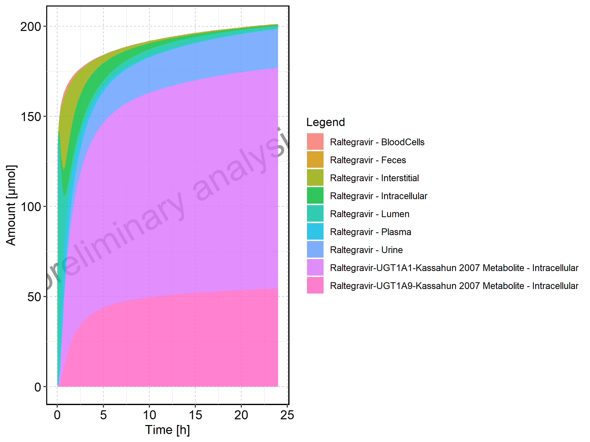
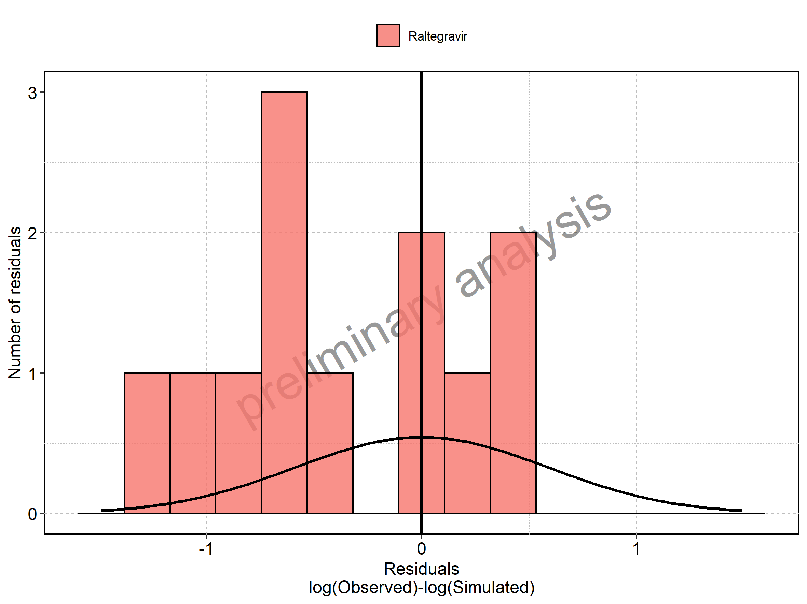

 * [1. Sensitivity Analysis](#1-sensitivity-analysis)
   * [1.1. Sensitivity Analysis for Raltegravir 10 mg (lactose formulation)](#11-sensitivity-analysis-for-raltegravir-10-mg-lactose-formulation)
   * [1.2. Sensitivity Analysis for Raltegravir 25 mg (lactose formulation)](#12-sensitivity-analysis-for-raltegravir-25-mg-lactose-formulation)
   * [1.3. Sensitivity Analysis for Raltegravir 50 mg (lactose formulation)](#13-sensitivity-analysis-for-raltegravir-50-mg-lactose-formulation)
   * [1.4. Sensitivity Analysis for Raltegravir 100 mg (lactose formulation)](#14-sensitivity-analysis-for-raltegravir-100-mg-lactose-formulation)
   * [1.5. Sensitivity Analysis for Raltegravir 200 mg (lactose formulation)](#15-sensitivity-analysis-for-raltegravir-200-mg-lactose-formulation)
   * [1.6. Sensitivity Analysis for Raltegravir 400mg (lactose formulation)](#16-sensitivity-analysis-for-raltegravir-400mg-lactose-formulation)
   * [1.7. Sensitivity Analysis for Raltegravir 800 mg (lactose formulation)](#17-sensitivity-analysis-for-raltegravir-800-mg-lactose-formulation)
   * [1.8. Sensitivity Analysis for Raltegravir 1200 mg (lactose formulation)](#18-sensitivity-analysis-for-raltegravir-1200-mg-lactose-formulation)
   * [1.9. Sensitivity Analysis for Raltegravir 1600 mg (lactose formulation)](#19-sensitivity-analysis-for-raltegravir-1600-mg-lactose-formulation)
   * [1.10. Sensitivity Analysis for Raltegravir 100 mg filmcoated tablet md](#110-sensitivity-analysis-for-raltegravir-100-mg-filmcoated-tablet-md)
   * [1.11. Sensitivity Analysis for Raltegravir 200 mg filmcoated tablet md](#111-sensitivity-analysis-for-raltegravir-200-mg-filmcoated-tablet-md)
   * [1.12. Sensitivity Analysis for Filmcoated_tablet_400mg_sd](#112-sensitivity-analysis-for-filmcoatedtablet400mgsd)
   * [1.13. Sensitivity Analysis for Raltegravir 400 mg filmcoated tablet md](#113-sensitivity-analysis-for-raltegravir-400-mg-filmcoated-tablet-md)
   * [1.14. Sensitivity Analysis for Raltegravir 400mg chewable fasted](#114-sensitivity-analysis-for-raltegravir-400mg-chewable-fasted)
   * [1.15. Sensitivity Analysis for Raltegravir 400mg chewable fed](#115-sensitivity-analysis-for-raltegravir-400mg-chewable-fed)
   * [1.16. Sensitivity Analysis for Raltegravir 400mg (granules in suspension)](#116-sensitivity-analysis-for-raltegravir-400mg-granules-in-suspension)
 * [2. PK parameters](#2-pk-parameters)
   * [2.1. PK parameters for Raltegravir 10 mg (lactose formulation)](#21-pk-parameters-for-raltegravir-10-mg-lactose-formulation)
   * [2.2. PK parameters for Raltegravir 25 mg (lactose formulation)](#22-pk-parameters-for-raltegravir-25-mg-lactose-formulation)
   * [2.3. PK parameters for Raltegravir 50 mg (lactose formulation)](#23-pk-parameters-for-raltegravir-50-mg-lactose-formulation)
   * [2.4. PK parameters for Raltegravir 100 mg (lactose formulation)](#24-pk-parameters-for-raltegravir-100-mg-lactose-formulation)
   * [2.5. PK parameters for Raltegravir 200 mg (lactose formulation)](#25-pk-parameters-for-raltegravir-200-mg-lactose-formulation)
   * [2.6. PK parameters for Raltegravir 400mg (lactose formulation)](#26-pk-parameters-for-raltegravir-400mg-lactose-formulation)
   * [2.7. PK parameters for Raltegravir 800 mg (lactose formulation)](#27-pk-parameters-for-raltegravir-800-mg-lactose-formulation)
   * [2.8. PK parameters for Raltegravir 1200 mg (lactose formulation)](#28-pk-parameters-for-raltegravir-1200-mg-lactose-formulation)
   * [2.9. PK parameters for Raltegravir 1600 mg (lactose formulation)](#29-pk-parameters-for-raltegravir-1600-mg-lactose-formulation)
   * [2.10. PK parameters for Raltegravir 100 mg filmcoated tablet md](#210-pk-parameters-for-raltegravir-100-mg-filmcoated-tablet-md)
   * [2.11. PK parameters for Raltegravir 200 mg filmcoated tablet md](#211-pk-parameters-for-raltegravir-200-mg-filmcoated-tablet-md)
   * [2.12. PK parameters for Filmcoated_tablet_400mg_sd](#212-pk-parameters-for-filmcoatedtablet400mgsd)
   * [2.13. PK parameters for Raltegravir 400 mg filmcoated tablet md](#213-pk-parameters-for-raltegravir-400-mg-filmcoated-tablet-md)
   * [2.14. PK parameters for Raltegravir 400mg chewable fasted](#214-pk-parameters-for-raltegravir-400mg-chewable-fasted)
   * [2.15. PK parameters for Raltegravir 400mg chewable fed](#215-pk-parameters-for-raltegravir-400mg-chewable-fed)
   * [2.16. PK parameters for Raltegravir 400mg (granules in suspension)](#216-pk-parameters-for-raltegravir-400mg-granules-in-suspension)
 * [3. Absorption](#3-absorption)
   * [3.1. Absorption for Raltegravir 10 mg (lactose formulation)](#31-absorption-for-raltegravir-10-mg-lactose-formulation)
   * [3.2. Absorption for Raltegravir 25 mg (lactose formulation)](#32-absorption-for-raltegravir-25-mg-lactose-formulation)
   * [3.3. Absorption for Raltegravir 50 mg (lactose formulation)](#33-absorption-for-raltegravir-50-mg-lactose-formulation)
   * [3.4. Absorption for Raltegravir 100 mg (lactose formulation)](#34-absorption-for-raltegravir-100-mg-lactose-formulation)
   * [3.5. Absorption for Raltegravir 200 mg (lactose formulation)](#35-absorption-for-raltegravir-200-mg-lactose-formulation)
   * [3.6. Absorption for Raltegravir 400mg (lactose formulation)](#36-absorption-for-raltegravir-400mg-lactose-formulation)
   * [3.7. Absorption for Raltegravir 800 mg (lactose formulation)](#37-absorption-for-raltegravir-800-mg-lactose-formulation)
   * [3.8. Absorption for Raltegravir 1200 mg (lactose formulation)](#38-absorption-for-raltegravir-1200-mg-lactose-formulation)
   * [3.9. Absorption for Raltegravir 1600 mg (lactose formulation)](#39-absorption-for-raltegravir-1600-mg-lactose-formulation)
   * [3.10. Absorption for Raltegravir 100 mg filmcoated tablet md](#310-absorption-for-raltegravir-100-mg-filmcoated-tablet-md)
   * [3.11. Absorption for Raltegravir 200 mg filmcoated tablet md](#311-absorption-for-raltegravir-200-mg-filmcoated-tablet-md)
   * [3.12. Absorption for Filmcoated_tablet_400mg_sd](#312-absorption-for-filmcoatedtablet400mgsd)
   * [3.13. Absorption for Raltegravir 400 mg filmcoated tablet md](#313-absorption-for-raltegravir-400-mg-filmcoated-tablet-md)
   * [3.14. Absorption for Raltegravir 400mg chewable fasted](#314-absorption-for-raltegravir-400mg-chewable-fasted)
   * [3.15. Absorption for Raltegravir 400mg chewable fed](#315-absorption-for-raltegravir-400mg-chewable-fed)
   * [3.16. Absorption for Raltegravir 400mg (granules in suspension)](#316-absorption-for-raltegravir-400mg-granules-in-suspension)
 * [4. Mass Balance](#4-mass-balance)
   * [4.1. Mass Balance for Raltegravir 10 mg (lactose formulation)](#41-mass-balance-for-raltegravir-10-mg-lactose-formulation)
   * [4.2. Mass Balance for Raltegravir 25 mg (lactose formulation)](#42-mass-balance-for-raltegravir-25-mg-lactose-formulation)
   * [4.3. Mass Balance for Raltegravir 50 mg (lactose formulation)](#43-mass-balance-for-raltegravir-50-mg-lactose-formulation)
   * [4.4. Mass Balance for Raltegravir 100 mg (lactose formulation)](#44-mass-balance-for-raltegravir-100-mg-lactose-formulation)
   * [4.5. Mass Balance for Raltegravir 200 mg (lactose formulation)](#45-mass-balance-for-raltegravir-200-mg-lactose-formulation)
   * [4.6. Mass Balance for Raltegravir 400mg (lactose formulation)](#46-mass-balance-for-raltegravir-400mg-lactose-formulation)
   * [4.7. Mass Balance for Raltegravir 800 mg (lactose formulation)](#47-mass-balance-for-raltegravir-800-mg-lactose-formulation)
   * [4.8. Mass Balance for Raltegravir 1200 mg (lactose formulation)](#48-mass-balance-for-raltegravir-1200-mg-lactose-formulation)
   * [4.9. Mass Balance for Raltegravir 1600 mg (lactose formulation)](#49-mass-balance-for-raltegravir-1600-mg-lactose-formulation)
   * [4.10. Mass Balance for Raltegravir 100 mg filmcoated tablet md](#410-mass-balance-for-raltegravir-100-mg-filmcoated-tablet-md)
   * [4.11. Mass Balance for Raltegravir 200 mg filmcoated tablet md](#411-mass-balance-for-raltegravir-200-mg-filmcoated-tablet-md)
   * [4.12. Mass Balance for Filmcoated_tablet_400mg_sd](#412-mass-balance-for-filmcoatedtablet400mgsd)
   * [4.13. Mass Balance for Raltegravir 400 mg filmcoated tablet md](#413-mass-balance-for-raltegravir-400-mg-filmcoated-tablet-md)
   * [4.14. Mass Balance for Raltegravir 400mg chewable fasted](#414-mass-balance-for-raltegravir-400mg-chewable-fasted)
   * [4.15. Mass Balance for Raltegravir 400mg chewable fed](#415-mass-balance-for-raltegravir-400mg-chewable-fed)
   * [4.16. Mass Balance for Raltegravir 400mg (granules in suspension)](#416-mass-balance-for-raltegravir-400mg-granules-in-suspension)
 * [5. Time profiles and residual plots](#5-time-profiles-and-residual-plots)
   * [5.1. Time profiles and residual plots for Raltegravir 10 mg (lactose formulation)](#51-time-profiles-and-residual-plots-for-raltegravir-10-mg-lactose-formulation)
   * [5.2. Time profiles and residual plots for Raltegravir 25 mg (lactose formulation)](#52-time-profiles-and-residual-plots-for-raltegravir-25-mg-lactose-formulation)
   * [5.3. Time profiles and residual plots for Raltegravir 50 mg (lactose formulation)](#53-time-profiles-and-residual-plots-for-raltegravir-50-mg-lactose-formulation)
   * [5.4. Time profiles and residual plots for Raltegravir 100 mg (lactose formulation)](#54-time-profiles-and-residual-plots-for-raltegravir-100-mg-lactose-formulation)
   * [5.5. Time profiles and residual plots for Raltegravir 200 mg (lactose formulation)](#55-time-profiles-and-residual-plots-for-raltegravir-200-mg-lactose-formulation)
   * [5.6. Time profiles and residual plots for Raltegravir 400mg (lactose formulation)](#56-time-profiles-and-residual-plots-for-raltegravir-400mg-lactose-formulation)
   * [5.7. Time profiles and residual plots for Raltegravir 800 mg (lactose formulation)](#57-time-profiles-and-residual-plots-for-raltegravir-800-mg-lactose-formulation)
   * [5.8. Time profiles and residual plots for Raltegravir 1200 mg (lactose formulation)](#58-time-profiles-and-residual-plots-for-raltegravir-1200-mg-lactose-formulation)
   * [5.9. Time profiles and residual plots for Raltegravir 1600 mg (lactose formulation)](#59-time-profiles-and-residual-plots-for-raltegravir-1600-mg-lactose-formulation)
   * [5.10. Time profiles and residual plots for Raltegravir 100 mg filmcoated tablet md](#510-time-profiles-and-residual-plots-for-raltegravir-100-mg-filmcoated-tablet-md)
     * [5.10.1. For total simulation time range](#5101-for-total-simulation-time-range)
     * [5.10.2. For first application range](#5102-for-first-application-range)
     * [5.10.3. For last application range](#5103-for-last-application-range)
   * [5.11. Time profiles and residual plots for Raltegravir 200 mg filmcoated tablet md](#511-time-profiles-and-residual-plots-for-raltegravir-200-mg-filmcoated-tablet-md)
     * [5.11.1. For total simulation time range](#5111-for-total-simulation-time-range)
     * [5.11.2. For first application range](#5112-for-first-application-range)
     * [5.11.3. For last application range](#5113-for-last-application-range)
   * [5.12. Time profiles and residual plots for Filmcoated_tablet_400mg_sd](#512-time-profiles-and-residual-plots-for-filmcoatedtablet400mgsd)
   * [5.13. Time profiles and residual plots for Raltegravir 400 mg filmcoated tablet md](#513-time-profiles-and-residual-plots-for-raltegravir-400-mg-filmcoated-tablet-md)
     * [5.13.1. For total simulation time range](#5131-for-total-simulation-time-range)
     * [5.13.2. For first application range](#5132-for-first-application-range)
     * [5.13.3. For last application range](#5133-for-last-application-range)
   * [5.14. Time profiles and residual plots for Raltegravir 400mg chewable fasted](#514-time-profiles-and-residual-plots-for-raltegravir-400mg-chewable-fasted)
   * [5.15. Time profiles and residual plots for Raltegravir 400mg chewable fed](#515-time-profiles-and-residual-plots-for-raltegravir-400mg-chewable-fed)
   * [5.16. Time profiles and residual plots for Raltegravir 400mg (granules in suspension)](#516-time-profiles-and-residual-plots-for-raltegravir-400mg-granules-in-suspension)
   * [5.17. Residuals across all simulations](#517-residuals-across-all-simulations)

# 1. Sensitivity Analysis

## 1.1. Sensitivity Analysis for Raltegravir 10 mg (lactose formulation)

Figure 1: Most sensitive parameters for C_max of Raltegravir.

-C_max-Plasma%20(Peripheral%20Venous%20Blood).png)

Figure 2: Most sensitive parameters for t_max of Raltegravir.

-t_max-Plasma%20(Peripheral%20Venous%20Blood).png)

Figure 3: Most sensitive parameters for C_tEnd of Raltegravir.

-C_tEnd-Plasma%20(Peripheral%20Venous%20Blood).png)

Figure 4: Most sensitive parameters for AUC of Raltegravir.

-AUC_tEnd-Plasma%20(Peripheral%20Venous%20Blood).png)

Figure 5: Most sensitive parameters for AUC_inf of Raltegravir.

-AUC_inf-Plasma%20(Peripheral%20Venous%20Blood).png)

Figure 6: Most sensitive parameters for MRT of Raltegravir.

-MRT-Plasma%20(Peripheral%20Venous%20Blood).png)

Figure 7: Most sensitive parameters for Thalf of Raltegravir.

-Thalf-Plasma%20(Peripheral%20Venous%20Blood).png)

Figure 8: Most sensitive parameters for CL of Raltegravir.

-CL-Plasma%20(Peripheral%20Venous%20Blood).png)

Figure 9: Most sensitive parameters for Vss of Raltegravir.

-Vss-Plasma%20(Peripheral%20Venous%20Blood).png)

Figure 10: Most sensitive parameters for Vd of Raltegravir.

-Vd-Plasma%20(Peripheral%20Venous%20Blood).png)

## 1.2. Sensitivity Analysis for Raltegravir 25 mg (lactose formulation)

Figure 11: Most sensitive parameters for C_max of Raltegravir.

-C_max-Plasma%20(Peripheral%20Venous%20Blood).png)

Figure 12: Most sensitive parameters for t_max of Raltegravir.

-t_max-Plasma%20(Peripheral%20Venous%20Blood).png)

Figure 13: Most sensitive parameters for C_tEnd of Raltegravir.

-C_tEnd-Plasma%20(Peripheral%20Venous%20Blood).png)

Figure 14: Most sensitive parameters for AUC of Raltegravir.

-AUC_tEnd-Plasma%20(Peripheral%20Venous%20Blood).png)

Figure 15: Most sensitive parameters for AUC_inf of Raltegravir.

-AUC_inf-Plasma%20(Peripheral%20Venous%20Blood).png)

Figure 16: Most sensitive parameters for MRT of Raltegravir.

-MRT-Plasma%20(Peripheral%20Venous%20Blood).png)

Figure 17: Most sensitive parameters for Thalf of Raltegravir.

-Thalf-Plasma%20(Peripheral%20Venous%20Blood).png)

Figure 18: Most sensitive parameters for CL of Raltegravir.

-CL-Plasma%20(Peripheral%20Venous%20Blood).png)

Figure 19: Most sensitive parameters for Vss of Raltegravir.

-Vss-Plasma%20(Peripheral%20Venous%20Blood).png)

Figure 20: Most sensitive parameters for Vd of Raltegravir.

-Vd-Plasma%20(Peripheral%20Venous%20Blood).png)

## 1.3. Sensitivity Analysis for Raltegravir 50 mg (lactose formulation)

Figure 21: Most sensitive parameters for C_max of Raltegravir.

-C_max-Plasma%20(Peripheral%20Venous%20Blood).png)

Figure 22: Most sensitive parameters for t_max of Raltegravir.

-t_max-Plasma%20(Peripheral%20Venous%20Blood).png)

Figure 23: Most sensitive parameters for C_tEnd of Raltegravir.

-C_tEnd-Plasma%20(Peripheral%20Venous%20Blood).png)

Figure 24: Most sensitive parameters for AUC of Raltegravir.

-AUC_tEnd-Plasma%20(Peripheral%20Venous%20Blood).png)

Figure 25: Most sensitive parameters for AUC_inf of Raltegravir.

-AUC_inf-Plasma%20(Peripheral%20Venous%20Blood).png)

Figure 26: Most sensitive parameters for MRT of Raltegravir.

-MRT-Plasma%20(Peripheral%20Venous%20Blood).png)

Figure 27: Most sensitive parameters for Thalf of Raltegravir.

-Thalf-Plasma%20(Peripheral%20Venous%20Blood).png)

Figure 28: Most sensitive parameters for CL of Raltegravir.

-CL-Plasma%20(Peripheral%20Venous%20Blood).png)

Figure 29: Most sensitive parameters for Vss of Raltegravir.

-Vss-Plasma%20(Peripheral%20Venous%20Blood).png)

Figure 30: Most sensitive parameters for Vd of Raltegravir.

-Vd-Plasma%20(Peripheral%20Venous%20Blood).png)

## 1.4. Sensitivity Analysis for Raltegravir 100 mg (lactose formulation)

Figure 31: Most sensitive parameters for C_max of Raltegravir.

-C_max-Plasma%20(Peripheral%20Venous%20Blood).png)

Figure 32: Most sensitive parameters for t_max of Raltegravir.

-t_max-Plasma%20(Peripheral%20Venous%20Blood).png)

Figure 33: Most sensitive parameters for C_tEnd of Raltegravir.

-C_tEnd-Plasma%20(Peripheral%20Venous%20Blood).png)

Figure 34: Most sensitive parameters for AUC of Raltegravir.

-AUC_tEnd-Plasma%20(Peripheral%20Venous%20Blood).png)

Figure 35: Most sensitive parameters for AUC_inf of Raltegravir.

-AUC_inf-Plasma%20(Peripheral%20Venous%20Blood).png)

Figure 36: Most sensitive parameters for MRT of Raltegravir.

-MRT-Plasma%20(Peripheral%20Venous%20Blood).png)

Figure 37: Most sensitive parameters for Thalf of Raltegravir.

-Thalf-Plasma%20(Peripheral%20Venous%20Blood).png)

Figure 38: Most sensitive parameters for CL of Raltegravir.

-CL-Plasma%20(Peripheral%20Venous%20Blood).png)

Figure 39: Most sensitive parameters for Vss of Raltegravir.

-Vss-Plasma%20(Peripheral%20Venous%20Blood).png)

Figure 40: Most sensitive parameters for Vd of Raltegravir.

-Vd-Plasma%20(Peripheral%20Venous%20Blood).png)

## 1.5. Sensitivity Analysis for Raltegravir 200 mg (lactose formulation)

Figure 41: Most sensitive parameters for C_max of Raltegravir.

-C_max-Plasma%20(Peripheral%20Venous%20Blood).png)

Figure 42: Most sensitive parameters for t_max of Raltegravir.

-t_max-Plasma%20(Peripheral%20Venous%20Blood).png)

Figure 43: Most sensitive parameters for C_tEnd of Raltegravir.

-C_tEnd-Plasma%20(Peripheral%20Venous%20Blood).png)

Figure 44: Most sensitive parameters for AUC of Raltegravir.

-AUC_tEnd-Plasma%20(Peripheral%20Venous%20Blood).png)

Figure 45: Most sensitive parameters for AUC_inf of Raltegravir.

-AUC_inf-Plasma%20(Peripheral%20Venous%20Blood).png)

Figure 46: Most sensitive parameters for MRT of Raltegravir.

-MRT-Plasma%20(Peripheral%20Venous%20Blood).png)

Figure 47: Most sensitive parameters for Thalf of Raltegravir.

-Thalf-Plasma%20(Peripheral%20Venous%20Blood).png)

Figure 48: Most sensitive parameters for CL of Raltegravir.

-CL-Plasma%20(Peripheral%20Venous%20Blood).png)

Figure 49: Most sensitive parameters for Vss of Raltegravir.

-Vss-Plasma%20(Peripheral%20Venous%20Blood).png)

Figure 50: Most sensitive parameters for Vd of Raltegravir.

-Vd-Plasma%20(Peripheral%20Venous%20Blood).png)

## 1.6. Sensitivity Analysis for Raltegravir 400mg (lactose formulation)

Figure 51: Most sensitive parameters for C_max of Raltegravir.

-C_max-Plasma%20(Peripheral%20Venous%20Blood).png)

Figure 52: Most sensitive parameters for t_max of Raltegravir.

-t_max-Plasma%20(Peripheral%20Venous%20Blood).png)

Figure 53: Most sensitive parameters for C_tEnd of Raltegravir.

-C_tEnd-Plasma%20(Peripheral%20Venous%20Blood).png)

Figure 54: Most sensitive parameters for AUC of Raltegravir.

-AUC_tEnd-Plasma%20(Peripheral%20Venous%20Blood).png)

Figure 55: Most sensitive parameters for AUC_inf of Raltegravir.

-AUC_inf-Plasma%20(Peripheral%20Venous%20Blood).png)

Figure 56: Most sensitive parameters for MRT of Raltegravir.

-MRT-Plasma%20(Peripheral%20Venous%20Blood).png)

Figure 57: Most sensitive parameters for Thalf of Raltegravir.

-Thalf-Plasma%20(Peripheral%20Venous%20Blood).png)

Figure 58: Most sensitive parameters for CL of Raltegravir.

-CL-Plasma%20(Peripheral%20Venous%20Blood).png)

Figure 59: Most sensitive parameters for Vss of Raltegravir.

-Vss-Plasma%20(Peripheral%20Venous%20Blood).png)

Figure 60: Most sensitive parameters for Vd of Raltegravir.

-Vd-Plasma%20(Peripheral%20Venous%20Blood).png)

## 1.7. Sensitivity Analysis for Raltegravir 800 mg (lactose formulation)

Figure 61: Most sensitive parameters for C_max of Raltegravir.

-C_max-Plasma%20(Peripheral%20Venous%20Blood).png)

Figure 62: Most sensitive parameters for t_max of Raltegravir.

-t_max-Plasma%20(Peripheral%20Venous%20Blood).png)

Figure 63: Most sensitive parameters for C_tEnd of Raltegravir.

-C_tEnd-Plasma%20(Peripheral%20Venous%20Blood).png)

Figure 64: Most sensitive parameters for AUC of Raltegravir.

-AUC_tEnd-Plasma%20(Peripheral%20Venous%20Blood).png)

Figure 65: Most sensitive parameters for AUC_inf of Raltegravir.

-AUC_inf-Plasma%20(Peripheral%20Venous%20Blood).png)

Figure 66: Most sensitive parameters for MRT of Raltegravir.

-MRT-Plasma%20(Peripheral%20Venous%20Blood).png)

Figure 67: Most sensitive parameters for Thalf of Raltegravir.

-Thalf-Plasma%20(Peripheral%20Venous%20Blood).png)

Figure 68: Most sensitive parameters for CL of Raltegravir.

-CL-Plasma%20(Peripheral%20Venous%20Blood).png)

Figure 69: Most sensitive parameters for Vss of Raltegravir.

-Vss-Plasma%20(Peripheral%20Venous%20Blood).png)

Figure 70: Most sensitive parameters for Vd of Raltegravir.

-Vd-Plasma%20(Peripheral%20Venous%20Blood).png)

## 1.8. Sensitivity Analysis for Raltegravir 1200 mg (lactose formulation)

Figure 71: Most sensitive parameters for C_max of Raltegravir.

-C_max-Plasma%20(Peripheral%20Venous%20Blood).png)

Figure 72: Most sensitive parameters for t_max of Raltegravir.

-t_max-Plasma%20(Peripheral%20Venous%20Blood).png)

Figure 73: Most sensitive parameters for C_tEnd of Raltegravir.

-C_tEnd-Plasma%20(Peripheral%20Venous%20Blood).png)

Figure 74: Most sensitive parameters for AUC of Raltegravir.

-AUC_tEnd-Plasma%20(Peripheral%20Venous%20Blood).png)

Figure 75: Most sensitive parameters for AUC_inf of Raltegravir.

-AUC_inf-Plasma%20(Peripheral%20Venous%20Blood).png)

Figure 76: Most sensitive parameters for MRT of Raltegravir.

-MRT-Plasma%20(Peripheral%20Venous%20Blood).png)

Figure 77: Most sensitive parameters for Thalf of Raltegravir.

-Thalf-Plasma%20(Peripheral%20Venous%20Blood).png)

Figure 78: Most sensitive parameters for CL of Raltegravir.

-CL-Plasma%20(Peripheral%20Venous%20Blood).png)

Figure 79: Most sensitive parameters for Vss of Raltegravir.

-Vss-Plasma%20(Peripheral%20Venous%20Blood).png)

Figure 80: Most sensitive parameters for Vd of Raltegravir.

-Vd-Plasma%20(Peripheral%20Venous%20Blood).png)

## 1.9. Sensitivity Analysis for Raltegravir 1600 mg (lactose formulation)

Figure 81: Most sensitive parameters for C_max of Raltegravir.

-C_max-Plasma%20(Peripheral%20Venous%20Blood).png)

Figure 82: Most sensitive parameters for t_max of Raltegravir.

-t_max-Plasma%20(Peripheral%20Venous%20Blood).png)

Figure 83: Most sensitive parameters for C_tEnd of Raltegravir.

-C_tEnd-Plasma%20(Peripheral%20Venous%20Blood).png)

Figure 84: Most sensitive parameters for AUC of Raltegravir.

-AUC_tEnd-Plasma%20(Peripheral%20Venous%20Blood).png)

Figure 85: Most sensitive parameters for AUC_inf of Raltegravir.

-AUC_inf-Plasma%20(Peripheral%20Venous%20Blood).png)

Figure 86: Most sensitive parameters for MRT of Raltegravir.

-MRT-Plasma%20(Peripheral%20Venous%20Blood).png)

Figure 87: Most sensitive parameters for Thalf of Raltegravir.

-Thalf-Plasma%20(Peripheral%20Venous%20Blood).png)

Figure 88: Most sensitive parameters for CL of Raltegravir.

-CL-Plasma%20(Peripheral%20Venous%20Blood).png)

Figure 89: Most sensitive parameters for Vss of Raltegravir.

-Vss-Plasma%20(Peripheral%20Venous%20Blood).png)

Figure 90: Most sensitive parameters for Vd of Raltegravir.

-Vd-Plasma%20(Peripheral%20Venous%20Blood).png)

## 1.10. Sensitivity Analysis for Raltegravir 100 mg filmcoated tablet md

Figure 91: Most sensitive parameters for C_max of Raltegravir.

.png)

Figure 92: Most sensitive parameters for C_max_t1_t2 of Raltegravir.

.png)

Figure 93: Most sensitive parameters for C_max_tLast_tEnd of Raltegravir.

.png)

Figure 94: Most sensitive parameters for t_max of Raltegravir.

.png)

Figure 95: Most sensitive parameters for t_max_t1_t2 of Raltegravir.

.png)

Figure 96: Most sensitive parameters for t_max_tLast_tEnd of Raltegravir.

.png)

Figure 97: Most sensitive parameters for C_trough_t2 of Raltegravir.

.png)

Figure 98: Most sensitive parameters for C_trough_tLast of Raltegravir.

.png)

Figure 99: Most sensitive parameters for AUC_t1_t2 of Raltegravir.

.png)

Figure 100: Most sensitive parameters for AUC_tLast_minus_1_tLast of Raltegravir.

.png)

Figure 101: Most sensitive parameters for AUC_inf_t1 of Raltegravir.

.png)

Figure 102: Most sensitive parameters for AUC_inf_tLast of Raltegravir.

.png)

Figure 103: Most sensitive parameters for MRT of Raltegravir.

.png)

Figure 104: Most sensitive parameters for Thalf of Raltegravir.

.png)

Figure 105: Most sensitive parameters for Thalf_tLast_tEnd of Raltegravir.

.png)

## 1.11. Sensitivity Analysis for Raltegravir 200 mg filmcoated tablet md

Figure 106: Most sensitive parameters for C_max of Raltegravir.

.png)

Figure 107: Most sensitive parameters for C_max_t1_t2 of Raltegravir.

.png)

Figure 108: Most sensitive parameters for C_max_tLast_tEnd of Raltegravir.

.png)

Figure 109: Most sensitive parameters for t_max of Raltegravir.

.png)

Figure 110: Most sensitive parameters for t_max_t1_t2 of Raltegravir.

.png)

Figure 111: Most sensitive parameters for t_max_tLast_tEnd of Raltegravir.

.png)

Figure 112: Most sensitive parameters for C_trough_t2 of Raltegravir.

.png)

Figure 113: Most sensitive parameters for C_trough_tLast of Raltegravir.

.png)

Figure 114: Most sensitive parameters for AUC_t1_t2 of Raltegravir.

.png)

Figure 115: Most sensitive parameters for AUC_tLast_minus_1_tLast of Raltegravir.

.png)

Figure 116: Most sensitive parameters for AUC_inf_t1 of Raltegravir.

.png)

Figure 117: Most sensitive parameters for AUC_inf_tLast of Raltegravir.

.png)

Figure 118: Most sensitive parameters for MRT of Raltegravir.

.png)

Figure 119: Most sensitive parameters for Thalf of Raltegravir.

.png)

Figure 120: Most sensitive parameters for Thalf_tLast_tEnd of Raltegravir.

.png)

## 1.12. Sensitivity Analysis for Filmcoated_tablet_400mg_sd

Figure 121: Most sensitive parameters for C_max of Raltegravir.

.png)

Figure 122: Most sensitive parameters for t_max of Raltegravir.

.png)

Figure 123: Most sensitive parameters for C_tEnd of Raltegravir.

.png)

Figure 124: Most sensitive parameters for AUC of Raltegravir.

.png)

Figure 125: Most sensitive parameters for AUC_inf of Raltegravir.

.png)

Figure 126: Most sensitive parameters for MRT of Raltegravir.

.png)

Figure 127: Most sensitive parameters for Thalf of Raltegravir.

.png)

Figure 128: Most sensitive parameters for CL of Raltegravir.

.png)

Figure 129: Most sensitive parameters for Vss of Raltegravir.

.png)

Figure 130: Most sensitive parameters for Vd of Raltegravir.

.png)

## 1.13. Sensitivity Analysis for Raltegravir 400 mg filmcoated tablet md

Figure 131: Most sensitive parameters for C_max of Raltegravir.

.png)

Figure 132: Most sensitive parameters for C_max_t1_t2 of Raltegravir.

.png)

Figure 133: Most sensitive parameters for C_max_tLast_tEnd of Raltegravir.

.png)

Figure 134: Most sensitive parameters for t_max of Raltegravir.

.png)

Figure 135: Most sensitive parameters for t_max_t1_t2 of Raltegravir.

.png)

Figure 136: Most sensitive parameters for t_max_tLast_tEnd of Raltegravir.

.png)

Figure 137: Most sensitive parameters for C_trough_t2 of Raltegravir.

.png)

Figure 138: Most sensitive parameters for C_trough_tLast of Raltegravir.

.png)

Figure 139: Most sensitive parameters for AUC_t1_t2 of Raltegravir.

.png)

Figure 140: Most sensitive parameters for AUC_tLast_minus_1_tLast of Raltegravir.

.png)

Figure 141: Most sensitive parameters for AUC_inf_t1 of Raltegravir.

.png)

Figure 142: Most sensitive parameters for AUC_inf_tLast of Raltegravir.

.png)

Figure 143: Most sensitive parameters for MRT of Raltegravir.

.png)

Figure 144: Most sensitive parameters for Thalf of Raltegravir.

.png)

Figure 145: Most sensitive parameters for Thalf_tLast_tEnd of Raltegravir.

.png)

## 1.14. Sensitivity Analysis for Raltegravir 400mg chewable fasted

Figure 146: Most sensitive parameters for C_max of Raltegravir.

.png)

Figure 147: Most sensitive parameters for t_max of Raltegravir.

.png)

Figure 148: Most sensitive parameters for C_tEnd of Raltegravir.

.png)

Figure 149: Most sensitive parameters for AUC of Raltegravir.

.png)

Figure 150: Most sensitive parameters for AUC_inf of Raltegravir.

.png)

Figure 151: Most sensitive parameters for MRT of Raltegravir.

.png)

Figure 152: Most sensitive parameters for Thalf of Raltegravir.

.png)

Figure 153: Most sensitive parameters for CL of Raltegravir.

.png)

Figure 154: Most sensitive parameters for Vss of Raltegravir.

.png)

Figure 155: Most sensitive parameters for Vd of Raltegravir.

.png)

## 1.15. Sensitivity Analysis for Raltegravir 400mg chewable fed

Figure 156: Most sensitive parameters for C_max of Raltegravir.

.png)

Figure 157: Most sensitive parameters for t_max of Raltegravir.

.png)

Figure 158: Most sensitive parameters for C_tEnd of Raltegravir.

.png)

Figure 159: Most sensitive parameters for AUC of Raltegravir.

.png)

Figure 160: Most sensitive parameters for AUC_inf of Raltegravir.

.png)

Figure 161: Most sensitive parameters for MRT of Raltegravir.

.png)

Figure 162: Most sensitive parameters for Thalf of Raltegravir.

.png)

Figure 163: Most sensitive parameters for CL of Raltegravir.

.png)

Figure 164: Most sensitive parameters for Vss of Raltegravir.

.png)

Figure 165: Most sensitive parameters for Vd of Raltegravir.

.png)

## 1.16. Sensitivity Analysis for Raltegravir 400mg (granules in suspension)

Figure 166: Most sensitive parameters for C_max of Raltegravir.

-C_max-Plasma%20(Peripheral%20Venous%20Blood).png)

Figure 167: Most sensitive parameters for t_max of Raltegravir.

-t_max-Plasma%20(Peripheral%20Venous%20Blood).png)

Figure 168: Most sensitive parameters for C_tEnd of Raltegravir.

-C_tEnd-Plasma%20(Peripheral%20Venous%20Blood).png)

Figure 169: Most sensitive parameters for AUC of Raltegravir.

-AUC_tEnd-Plasma%20(Peripheral%20Venous%20Blood).png)

Figure 170: Most sensitive parameters for AUC_inf of Raltegravir.

-AUC_inf-Plasma%20(Peripheral%20Venous%20Blood).png)

Figure 171: Most sensitive parameters for MRT of Raltegravir.

-MRT-Plasma%20(Peripheral%20Venous%20Blood).png)

Figure 172: Most sensitive parameters for Thalf of Raltegravir.

-Thalf-Plasma%20(Peripheral%20Venous%20Blood).png)

Figure 173: Most sensitive parameters for CL of Raltegravir.

-CL-Plasma%20(Peripheral%20Venous%20Blood).png)

Figure 174: Most sensitive parameters for Vss of Raltegravir.

-Vss-Plasma%20(Peripheral%20Venous%20Blood).png)

Figure 175: Most sensitive parameters for Vd of Raltegravir.

-Vd-Plasma%20(Peripheral%20Venous%20Blood).png)

# 2. PK parameters

## 2.1. PK parameters for Raltegravir 10 mg (lactose formulation)

|Path        |Parameter    |        Value|Unit      |
|:-----------|:------------|------------:|:---------|
|Raltegravir |C_max        |  110.4938945|µg/l      |
|Raltegravir |C_max_norm   |    0.8066055|kg/l      |
|Raltegravir |t_max        |    0.7500000|h         |
|Raltegravir |C_tEnd       |    1.9563139|µg/l      |
|Raltegravir |AUC          |  241.6052506|µg*h/l    |
|Raltegravir |AUC_norm     |    1.7637182|kg*h/l    |
|Raltegravir |AUC_inf      |  255.1373571|µg*h/l    |
|Raltegravir |AUC_inf_norm |    1.8625028|kg*h/l    |
|Raltegravir |MRT          |    3.3293592|h         |
|Raltegravir |Thalf        |    4.7946014|h         |
|Raltegravir |CL           |    8.9485329|ml/min/kg |
|Raltegravir |Vss          | 1787.5727415|ml/kg     |
|Raltegravir |Vd           | 3713.8993740|ml/kg     |

## 2.2. PK parameters for Raltegravir 25 mg (lactose formulation)

|Path        |Parameter    |       Value|Unit      |
|:-----------|:------------|-----------:|:---------|
|Raltegravir |C_max        |  276.849301|µg/l      |
|Raltegravir |C_max_norm   |    0.808400|kg/l      |
|Raltegravir |t_max        |    0.750000|h         |
|Raltegravir |C_tEnd       |    4.894139|µg/l      |
|Raltegravir |AUC          |  605.060435|µg*h/l    |
|Raltegravir |AUC_norm     |    1.766776|kg*h/l    |
|Raltegravir |AUC_inf      |  638.895505|µg*h/l    |
|Raltegravir |AUC_inf_norm |    1.865575|kg*h/l    |
|Raltegravir |MRT          |    3.327076|h         |
|Raltegravir |Thalf        |    4.791995|h         |
|Raltegravir |CL           |    8.933796|ml/min/kg |
|Raltegravir |Vss          | 1783.405542|ml/kg     |
|Raltegravir |Vd           | 3705.768108|ml/kg     |

## 2.3. PK parameters for Raltegravir 50 mg (lactose formulation)

|Path        |Parameter    |        Value|Unit      |
|:-----------|:------------|------------:|:---------|
|Raltegravir |C_max        |  556.5980647|µg/l      |
|Raltegravir |C_max_norm   |    0.8126331|kg/l      |
|Raltegravir |t_max        |    0.7500000|h         |
|Raltegravir |C_tEnd       |    1.5273094|µg/l      |
|Raltegravir |AUC          | 1296.6529555|µg*h/l    |
|Raltegravir |AUC_norm     |    1.8931133|kg*h/l    |
|Raltegravir |AUC_inf      | 1317.0860058|µg*h/l    |
|Raltegravir |AUC_inf_norm |    1.9229455|kg*h/l    |
|Raltegravir |MRT          |    4.1443451|h         |
|Raltegravir |Thalf        |    9.2732239|h         |
|Raltegravir |CL           |    8.6672585|ml/min/kg |
|Raltegravir |Vss          | 2155.2066803|ml/kg     |
|Raltegravir |Vd           | 6957.2610855|ml/kg     |

## 2.4. PK parameters for Raltegravir 100 mg (lactose formulation)

|Path        |Parameter    |       Value|Unit      |
|:-----------|:------------|-----------:|:---------|
|Raltegravir |C_max        | 1123.897267|µg/l      |
|Raltegravir |C_max_norm   |    0.820445|kg/l      |
|Raltegravir |t_max        |    0.750000|h         |
|Raltegravir |C_tEnd       |    2.836519|µg/l      |
|Raltegravir |AUC          | 2615.773112|µg*h/l    |
|Raltegravir |AUC_norm     |    1.909514|kg*h/l    |
|Raltegravir |AUC_inf      | 2654.063466|µg*h/l    |
|Raltegravir |AUC_inf_norm |    1.937466|kg*h/l    |
|Raltegravir |MRT          |    4.138122|h         |
|Raltegravir |Thalf        |    9.356846|h         |
|Raltegravir |CL           |    8.602300|ml/min/kg |
|Raltegravir |Vss          | 2135.842085|ml/kg     |
|Raltegravir |Vd           | 6967.385769|ml/kg     |

## 2.5. PK parameters for Raltegravir 200 mg (lactose formulation)

|Path        |Parameter    |       Value|Unit      |
|:-----------|:------------|-----------:|:---------|
|Raltegravir |C_max        | 2283.843895|µg/l      |
|Raltegravir |C_max_norm   |    0.833603|kg/l      |
|Raltegravir |t_max        |    0.750000|h         |
|Raltegravir |C_tEnd       |    1.918062|µg/l      |
|Raltegravir |AUC          | 5349.761122|µg*h/l    |
|Raltegravir |AUC_norm     |    1.952663|kg*h/l    |
|Raltegravir |AUC_inf      | 5376.252319|µg*h/l    |
|Raltegravir |AUC_inf_norm |    1.962332|kg*h/l    |
|Raltegravir |MRT          |    4.134027|h         |
|Raltegravir |Thalf        |    9.573441|h         |
|Raltegravir |CL           |    8.493296|ml/min/kg |
|Raltegravir |Vss          | 2106.690645|ml/kg     |
|Raltegravir |Vd           | 7038.337707|ml/kg     |

## 2.6. PK parameters for Raltegravir 400mg (lactose formulation)

|Path        |Parameter    |        Value|Unit      |
|:-----------|:------------|------------:|:---------|
|Raltegravir |C_max        |  4673.726268|µg/l      |
|Raltegravir |C_max_norm   |     0.852955|kg/l      |
|Raltegravir |t_max        |     0.750000|h         |
|Raltegravir |C_tEnd       |     3.837874|µg/l      |
|Raltegravir |AUC          | 10899.606324|µg*h/l    |
|Raltegravir |AUC_norm     |     1.989178|kg*h/l    |
|Raltegravir |AUC_inf      | 10952.620364|µg*h/l    |
|Raltegravir |AUC_inf_norm |     1.998853|kg*h/l    |
|Raltegravir |MRT          |     4.109855|h         |
|Raltegravir |Thalf        |     9.574743|h         |
|Raltegravir |CL           |     8.338114|ml/min/kg |
|Raltegravir |Vss          |  2056.106567|ml/kg     |
|Raltegravir |Vd           |  6910.678864|ml/kg     |

## 2.7. PK parameters for Raltegravir 800 mg (lactose formulation)

|Path        |Parameter    |        Value|Unit      |
|:-----------|:------------|------------:|:---------|
|Raltegravir |C_max        | 9.613040e+03|µg/l      |
|Raltegravir |C_max_norm   | 8.771899e-01|kg/l      |
|Raltegravir |t_max        | 7.500000e-01|h         |
|Raltegravir |C_tEnd       | 6.643868e+00|µg/l      |
|Raltegravir |AUC          | 2.234232e+04|µg*h/l    |
|Raltegravir |AUC_norm     | 2.038736e+00|kg*h/l    |
|Raltegravir |AUC_inf      | 2.243378e+04|µg*h/l    |
|Raltegravir |AUC_inf_norm | 2.047083e+00|kg*h/l    |
|Raltegravir |MRT          | 4.084571e+00|h         |
|Raltegravir |Thalf        | 9.542753e+00|h         |
|Raltegravir |CL           | 8.141668e+00|ml/min/kg |
|Raltegravir |Vss          | 1.995313e+03|ml/kg     |
|Raltegravir |Vd           | 6.725318e+03|ml/kg     |

## 2.8. PK parameters for Raltegravir 1200 mg (lactose formulation)

|Path        |Parameter    |        Value|Unit      |
|:-----------|:------------|------------:|:---------|
|Raltegravir |C_max        | 1.468291e+04|µg/l      |
|Raltegravir |C_max_norm   | 8.932101e-01|kg/l      |
|Raltegravir |t_max        | 7.500000e-01|h         |
|Raltegravir |C_tEnd       | 1.997039e+00|µg/l      |
|Raltegravir |AUC          | 3.417676e+04|µg*h/l    |
|Raltegravir |AUC_norm     | 2.079086e+00|kg*h/l    |
|Raltegravir |AUC_inf      | 3.420447e+04|µg*h/l    |
|Raltegravir |AUC_inf_norm | 2.080772e+00|kg*h/l    |
|Raltegravir |MRT          | 4.095406e+00|h         |
|Raltegravir |Thalf        | 9.617984e+00|h         |
|Raltegravir |CL           | 8.009847e+00|ml/min/kg |
|Raltegravir |Vss          | 1.968214e+03|ml/kg     |
|Raltegravir |Vd           | 6.668591e+03|ml/kg     |

## 2.9. PK parameters for Raltegravir 1600 mg (lactose formulation)

|Path        |Parameter    |        Value|Unit      |
|:-----------|:------------|------------:|:---------|
|Raltegravir |C_max        | 1.979954e+04|µg/l      |
|Raltegravir |C_max_norm   | 9.033539e-01|kg/l      |
|Raltegravir |t_max        | 7.500000e-01|h         |
|Raltegravir |C_tEnd       | 2.665646e+00|µg/l      |
|Raltegravir |AUC          | 4.607060e+04|µg*h/l    |
|Raltegravir |AUC_norm     | 2.101971e+00|kg*h/l    |
|Raltegravir |AUC_inf      | 4.610762e+04|µg*h/l    |
|Raltegravir |AUC_inf_norm | 2.103660e+00|kg*h/l    |
|Raltegravir |MRT          | 4.125340e+00|h         |
|Raltegravir |Thalf        | 9.626328e+00|h         |
|Raltegravir |CL           | 7.922700e+00|ml/min/kg |
|Raltegravir |Vss          | 1.961030e+03|ml/kg     |
|Raltegravir |Vd           | 6.601758e+03|ml/kg     |

## 2.10. PK parameters for Raltegravir 100 mg filmcoated tablet md

|Path        |Parameter                    |        Value|Unit   |
|:-----------|:----------------------------|------------:|:------|
|Raltegravir |C_max                        |  893.8029417|µg/l   |
|Raltegravir |C_max_norm                   |    0.0326238|kg/l   |
|Raltegravir |C_max_t1_t2                  |  863.1595648|µg/l   |
|Raltegravir |C_max_t1_t2_norm             |    0.6301065|kg/l   |
|Raltegravir |C_max_tLast_tEnd             |  892.6807501|µg/l   |
|Raltegravir |C_max_tLast_tEnd_norm        |    0.6516570|kg/l   |
|Raltegravir |t_max                        |   84.7500000|h      |
|Raltegravir |t_max_t1_t2                  |    0.7500000|h      |
|Raltegravir |t_max_tLast_tEnd             |  228.7500000|h      |
|Raltegravir |C_trough_t2                  |   19.6617510|µg/l   |
|Raltegravir |C_trough_tLast               |   31.9226996|µg/l   |
|Raltegravir |AUC_t1_t2                    | 1978.7565232|µg*h/l |
|Raltegravir |AUC_t1_t2_norm               |    1.4444923|kg*h/l |
|Raltegravir |AUC_tLast_minus_1_tLast      | 2219.2012751|µg*h/l |
|Raltegravir |AUC_tLast_minus_1_tLast_norm |    1.6200169|kg*h/l |
|Raltegravir |AUC_inf_t1                   | 2144.3461704|µg*h/l |
|Raltegravir |AUC_inf_t1_norm              |    1.5653726|kg*h/l |
|Raltegravir |AUC_inf_tLast                | 2536.5938269|µg*h/l |
|Raltegravir |AUC_inf_tLast_norm           |    1.8517136|kg*h/l |
|Raltegravir |MRT                          |    3.9621429|h      |
|Raltegravir |Thalf                        |    5.8376226|h      |
|Raltegravir |Thalf_tLast_tEnd             |    6.9004822|h      |

## 2.11. PK parameters for Raltegravir 200 mg filmcoated tablet md

|Path        |Parameter                    |        Value|Unit   |
|:-----------|:----------------------------|------------:|:------|
|Raltegravir |C_max                        | 1810.3639857|µg/l   |
|Raltegravir |C_max_norm                   |    0.0330391|kg/l   |
|Raltegravir |C_max_t1_t2                  | 1748.6577478|µg/l   |
|Raltegravir |C_max_t1_t2_norm             |    0.6382601|kg/l   |
|Raltegravir |C_max_tLast_tEnd             | 1808.4366260|µg/l   |
|Raltegravir |C_max_tLast_tEnd_norm        |    0.6600794|kg/l   |
|Raltegravir |t_max                        |  180.7500000|h      |
|Raltegravir |t_max_t1_t2                  |    0.7500000|h      |
|Raltegravir |t_max_tLast_tEnd             |  228.7500000|h      |
|Raltegravir |C_trough_t2                  |   39.4742325|µg/l   |
|Raltegravir |C_trough_tLast               |   64.0288309|µg/l   |
|Raltegravir |AUC_t1_t2                    | 3998.1178427|µg*h/l |
|Raltegravir |AUC_t1_t2_norm               |    1.4593130|kg*h/l |
|Raltegravir |AUC_tLast_minus_1_tLast      | 4483.4029557|µg*h/l |
|Raltegravir |AUC_tLast_minus_1_tLast_norm |    1.6364421|kg*h/l |
|Raltegravir |AUC_inf_t1                   | 4329.1330307|µg*h/l |
|Raltegravir |AUC_inf_t1_norm              |    1.5801335|kg*h/l |
|Raltegravir |AUC_inf_tLast                | 5115.3598239|µg*h/l |
|Raltegravir |AUC_inf_tLast_norm           |    1.8671063|kg*h/l |
|Raltegravir |MRT                          |    3.9411664|h      |
|Raltegravir |Thalf                        |    5.8124568|h      |
|Raltegravir |Thalf_tLast_tEnd             |    6.8742091|h      |

## 2.12. PK parameters for Filmcoated_tablet_400mg_sd

|Path        |Parameter    |        Value|Unit      |
|:-----------|:------------|------------:|:---------|
|Raltegravir |C_max        | 3568.5563894|µg/l      |
|Raltegravir |C_max_norm   |    0.6512616|kg/l      |
|Raltegravir |t_max        |    0.7500000|h         |
|Raltegravir |C_tEnd       |   28.2685935|µg/l      |
|Raltegravir |AUC          | 8703.6498337|µg*h/l    |
|Raltegravir |AUC_norm     |    1.5884161|kg*h/l    |
|Raltegravir |AUC_inf      | 9072.4244034|µg*h/l    |
|Raltegravir |AUC_inf_norm |    1.6557174|kg*h/l    |
|Raltegravir |MRT          |    4.8922185|h         |
|Raltegravir |Thalf        |    9.0423584|h         |
|Raltegravir |CL           |   10.0661302|ml/min/kg |
|Raltegravir |Vss          | 2954.7424316|ml/kg     |
|Raltegravir |Vd           | 7878.9811134|ml/kg     |

## 2.13. PK parameters for Raltegravir 400 mg filmcoated tablet md

|Path        |Parameter                    |        Value|Unit   |
|:-----------|:----------------------------|------------:|:------|
|Raltegravir |C_max                        | 3.694358e+03|µg/l   |
|Raltegravir |C_max_norm                   | 3.371100e-02|kg/l   |
|Raltegravir |C_max_t1_t2                  | 3.569008e+03|µg/l   |
|Raltegravir |C_max_t1_t2_norm             | 6.513440e-01|kg/l   |
|Raltegravir |C_max_tLast_tEnd             | 3.689981e+03|µg/l   |
|Raltegravir |C_max_tLast_tEnd_norm        | 6.734216e-01|kg/l   |
|Raltegravir |t_max                        | 9.675000e+01|h      |
|Raltegravir |t_max_t1_t2                  | 7.500000e-01|h      |
|Raltegravir |t_max_tLast_tEnd             | 2.287500e+02|h      |
|Raltegravir |C_trough_t2                  | 7.975313e+01|µg/l   |
|Raltegravir |C_trough_tLast               | 1.291934e+02|µg/l   |
|Raltegravir |AUC_t1_t2                    | 8.128051e+03|µg*h/l |
|Raltegravir |AUC_t1_t2_norm               | 1.483369e+00|kg*h/l |
|Raltegravir |AUC_tLast_minus_1_tLast      | 9.098431e+03|µg*h/l |
|Raltegravir |AUC_tLast_minus_1_tLast_norm | 1.660464e+00|kg*h/l |
|Raltegravir |AUC_inf_t1                   | 8.798719e+03|µg*h/l |
|Raltegravir |AUC_inf_t1_norm              | 1.605766e+00|kg*h/l |
|Raltegravir |AUC_inf_tLast                | 1.036587e+04|µg*h/l |
|Raltegravir |AUC_inf_tLast_norm           | 1.891771e+00|kg*h/l |
|Raltegravir |MRT                          | 3.934582e+00|h      |
|Raltegravir |Thalf                        | 5.828885e+00|h      |
|Raltegravir |Thalf_tLast_tEnd             | 6.799025e+00|h      |

## 2.14. PK parameters for Raltegravir 400mg chewable fasted

|Path        |Parameter    |        Value|Unit      |
|:-----------|:------------|------------:|:---------|
|Raltegravir |C_max        |  6330.518996|µg/l      |
|Raltegravir |C_max_norm   |     1.155320|kg/l      |
|Raltegravir |t_max        |     0.750000|h         |
|Raltegravir |C_tEnd       |    35.836480|µg/l      |
|Raltegravir |AUC          | 14694.827674|µg*h/l    |
|Raltegravir |AUC_norm     |     2.681806|kg*h/l    |
|Raltegravir |AUC_inf      | 15124.213097|µg*h/l    |
|Raltegravir |AUC_inf_norm |     2.760169|kg*h/l    |
|Raltegravir |MRT          |     4.186335|h         |
|Raltegravir |Thalf        |     8.305142|h         |
|Raltegravir |CL           |     6.038278|ml/min/kg |
|Raltegravir |Vss          |  1516.695142|ml/kg     |
|Raltegravir |Vd           |  4340.961456|ml/kg     |

## 2.15. PK parameters for Raltegravir 400mg chewable fed

|Path        |Parameter    |        Value|Unit      |
|:-----------|:------------|------------:|:---------|
|Raltegravir |C_max        | 2.580439e+03|µg/l      |
|Raltegravir |C_max_norm   | 4.709301e-01|kg/l      |
|Raltegravir |t_max        | 2.500000e+00|h         |
|Raltegravir |C_tEnd       | 3.592768e+01|µg/l      |
|Raltegravir |AUC          | 1.411909e+04|µg*h/l    |
|Raltegravir |AUC_norm     | 2.576734e+00|kg*h/l    |
|Raltegravir |AUC_inf      | 1.460635e+04|µg*h/l    |
|Raltegravir |AUC_inf_norm | 2.665660e+00|kg*h/l    |
|Raltegravir |MRT          | 5.989332e+00|h         |
|Raltegravir |Thalf        | 9.400702e+00|h         |
|Raltegravir |CL           | 6.252361e+00|ml/min/kg |
|Raltegravir |Vss          | 2.246848e+03|ml/kg     |
|Raltegravir |Vd           | 5.087801e+03|ml/kg     |

## 2.16. PK parameters for Raltegravir 400mg (granules in suspension)

|Path        |Parameter    |        Value|Unit      |
|:-----------|:------------|------------:|:---------|
|Raltegravir |C_max        |  8156.789686|µg/l      |
|Raltegravir |C_max_norm   |     1.488614|kg/l      |
|Raltegravir |t_max        |     0.700000|h         |
|Raltegravir |C_tEnd       |    42.186887|µg/l      |
|Raltegravir |AUC          | 18791.010143|µg*h/l    |
|Raltegravir |AUC_norm     |     3.429359|kg*h/l    |
|Raltegravir |AUC_inf      | 19278.707122|µg*h/l    |
|Raltegravir |AUC_inf_norm |     3.518364|kg*h/l    |
|Raltegravir |MRT          |     4.020312|h         |
|Raltegravir |Thalf        |     8.013054|h         |
|Raltegravir |CL           |     4.737050|ml/min/kg |
|Raltegravir |Vss          |  1142.665029|ml/kg     |
|Raltegravir |Vd           |  3285.730123|ml/kg     |

# 3. Absorption

## 3.1. Absorption for Raltegravir 10 mg (lactose formulation)

Figure 176: Absorption of Raltegravir

-Raltegravir.png)

## 3.2. Absorption for Raltegravir 25 mg (lactose formulation)

Figure 177: Absorption of Raltegravir

-Raltegravir.png)

## 3.3. Absorption for Raltegravir 50 mg (lactose formulation)

Figure 178: Absorption of Raltegravir

-Raltegravir.png)

## 3.4. Absorption for Raltegravir 100 mg (lactose formulation)

Figure 179: Absorption of Raltegravir

-Raltegravir.png)

## 3.5. Absorption for Raltegravir 200 mg (lactose formulation)

Figure 180: Absorption of Raltegravir

-Raltegravir.png)

## 3.6. Absorption for Raltegravir 400mg (lactose formulation)

Figure 181: Absorption of Raltegravir

-Raltegravir.png)

## 3.7. Absorption for Raltegravir 800 mg (lactose formulation)

Figure 182: Absorption of Raltegravir

-Raltegravir.png)

## 3.8. Absorption for Raltegravir 1200 mg (lactose formulation)

Figure 183: Absorption of Raltegravir

-Raltegravir.png)

## 3.9. Absorption for Raltegravir 1600 mg (lactose formulation)

Figure 184: Absorption of Raltegravir

-Raltegravir.png)

## 3.10. Absorption for Raltegravir 100 mg filmcoated tablet md

Figure 185: Absorption of Raltegravir

## 3.11. Absorption for Raltegravir 200 mg filmcoated tablet md

Figure 186: Absorption of Raltegravir

## 3.12. Absorption for Filmcoated_tablet_400mg_sd

Figure 187: Absorption of Raltegravir

## 3.13. Absorption for Raltegravir 400 mg filmcoated tablet md

Figure 188: Absorption of Raltegravir

## 3.14. Absorption for Raltegravir 400mg chewable fasted

Figure 189: Absorption of Raltegravir

## 3.15. Absorption for Raltegravir 400mg chewable fed

Figure 190: Absorption of Raltegravir

## 3.16. Absorption for Raltegravir 400mg (granules in suspension)

Figure 191: Absorption of Raltegravir

-Raltegravir.png)

# 4. Mass Balance

## 4.1. Mass Balance for Raltegravir 10 mg (lactose formulation)

Figure 192: Amount of drug vs time within the different compartments.

-timeProfile.png)

Figure 193: Cumulated amount of drug vs time within the different compartments

-cumulativeTimeProfile.png)

Figure 194: Amount of drug vs time within the different compartments normalized to applicated drugmass.

-normalizedTimeProfile.png)

Figure 195: Cumulated amount of drug vs time within the different compartments normalized to applicated drugmass.

-normalizedCumulativeTimeProfile.png)

Figure 196: Fraction of drug  within the different compartments at 12h.

-pieChart.png)

## 4.2. Mass Balance for Raltegravir 25 mg (lactose formulation)

Figure 197: Amount of drug vs time within the different compartments.

-timeProfile.png)

Figure 198: Cumulated amount of drug vs time within the different compartments

-cumulativeTimeProfile.png)

Figure 199: Amount of drug vs time within the different compartments normalized to applicated drugmass.

-normalizedTimeProfile.png)

Figure 200: Cumulated amount of drug vs time within the different compartments normalized to applicated drugmass.

-normalizedCumulativeTimeProfile.png)

Figure 201: Fraction of drug  within the different compartments at 12h.

-pieChart.png)

## 4.3. Mass Balance for Raltegravir 50 mg (lactose formulation)

Figure 202: Amount of drug vs time within the different compartments.

-timeProfile.png)

Figure 203: Cumulated amount of drug vs time within the different compartments

-cumulativeTimeProfile.png)

Figure 204: Amount of drug vs time within the different compartments normalized to applicated drugmass.

-normalizedTimeProfile.png)

Figure 205: Cumulated amount of drug vs time within the different compartments normalized to applicated drugmass.

-normalizedCumulativeTimeProfile.png)

Figure 206: Fraction of drug  within the different compartments at 32h.

-pieChart.png)

## 4.4. Mass Balance for Raltegravir 100 mg (lactose formulation)

Figure 207: Amount of drug vs time within the different compartments.

-timeProfile.png)

Figure 208: Cumulated amount of drug vs time within the different compartments

-cumulativeTimeProfile.png)

Figure 209: Amount of drug vs time within the different compartments normalized to applicated drugmass.

-normalizedTimeProfile.png)

Figure 210: Cumulated amount of drug vs time within the different compartments normalized to applicated drugmass.

-normalizedCumulativeTimeProfile.png)

Figure 211: Fraction of drug  within the different compartments at 33h.

-pieChart.png)

## 4.5. Mass Balance for Raltegravir 200 mg (lactose formulation)

Figure 212: Amount of drug vs time within the different compartments.

-timeProfile.png)

Figure 213: Cumulated amount of drug vs time within the different compartments

-cumulativeTimeProfile.png)

Figure 214: Amount of drug vs time within the different compartments normalized to applicated drugmass.

-normalizedTimeProfile.png)

Figure 215: Cumulated amount of drug vs time within the different compartments normalized to applicated drugmass.

-normalizedCumulativeTimeProfile.png)

Figure 216: Fraction of drug  within the different compartments at 48h.

-pieChart.png)

## 4.6. Mass Balance for Raltegravir 400mg (lactose formulation)

Figure 217: Amount of drug vs time within the different compartments.

-timeProfile.png)

Figure 218: Cumulated amount of drug vs time within the different compartments

-cumulativeTimeProfile.png)

Figure 219: Amount of drug vs time within the different compartments normalized to applicated drugmass.

-normalizedTimeProfile.png)

Figure 220: Cumulated amount of drug vs time within the different compartments normalized to applicated drugmass.

-normalizedCumulativeTimeProfile.png)

Figure 221: Fraction of drug  within the different compartments at 48h.

-pieChart.png)

## 4.7. Mass Balance for Raltegravir 800 mg (lactose formulation)

Figure 222: Amount of drug vs time within the different compartments.

-timeProfile.png)

Figure 223: Cumulated amount of drug vs time within the different compartments

-cumulativeTimeProfile.png)

Figure 224: Amount of drug vs time within the different compartments normalized to applicated drugmass.

-normalizedTimeProfile.png)

Figure 225: Cumulated amount of drug vs time within the different compartments normalized to applicated drugmass.

-normalizedCumulativeTimeProfile.png)

Figure 226: Fraction of drug  within the different compartments at 50h.

-pieChart.png)

## 4.8. Mass Balance for Raltegravir 1200 mg (lactose formulation)

Figure 227: Amount of drug vs time within the different compartments.

-timeProfile.png)

Figure 228: Cumulated amount of drug vs time within the different compartments

-cumulativeTimeProfile.png)

Figure 229: Amount of drug vs time within the different compartments normalized to applicated drugmass.

-normalizedTimeProfile.png)

Figure 230: Cumulated amount of drug vs time within the different compartments normalized to applicated drugmass.

-normalizedCumulativeTimeProfile.png)

Figure 231: Fraction of drug  within the different compartments at 72h.

-pieChart.png)

## 4.9. Mass Balance for Raltegravir 1600 mg (lactose formulation)

Figure 232: Amount of drug vs time within the different compartments.

-timeProfile.png)

Figure 233: Cumulated amount of drug vs time within the different compartments

-cumulativeTimeProfile.png)

Figure 234: Amount of drug vs time within the different compartments normalized to applicated drugmass.

-normalizedTimeProfile.png)

Figure 235: Cumulated amount of drug vs time within the different compartments normalized to applicated drugmass.

-normalizedCumulativeTimeProfile.png)

Figure 236: Fraction of drug  within the different compartments at 72h.

-pieChart.png)

## 4.10. Mass Balance for Raltegravir 100 mg filmcoated tablet md

Figure 237: Amount of drug vs time within the different compartments.

Figure 238: Cumulated amount of drug vs time within the different compartments

Figure 239: Amount of drug vs time within the different compartments normalized to applicated drugmass.

Figure 240: Cumulated amount of drug vs time within the different compartments normalized to applicated drugmass.

Figure 241: Fraction of drug  within the different compartments at 240h.

## 4.11. Mass Balance for Raltegravir 200 mg filmcoated tablet md

Figure 242: Amount of drug vs time within the different compartments.

Figure 243: Cumulated amount of drug vs time within the different compartments

Figure 244: Amount of drug vs time within the different compartments normalized to applicated drugmass.

Figure 245: Cumulated amount of drug vs time within the different compartments normalized to applicated drugmass.

Figure 246: Fraction of drug  within the different compartments at 240h.

## 4.12. Mass Balance for Filmcoated_tablet_400mg_sd

Figure 247: Amount of drug vs time within the different compartments.

Figure 248: Cumulated amount of drug vs time within the different compartments

Figure 249: Amount of drug vs time within the different compartments normalized to applicated drugmass.

Figure 250: Cumulated amount of drug vs time within the different compartments normalized to applicated drugmass.

Figure 251: Fraction of drug  within the different compartments at 24h.

## 4.13. Mass Balance for Raltegravir 400 mg filmcoated tablet md

Figure 252: Amount of drug vs time within the different compartments.

Figure 253: Cumulated amount of drug vs time within the different compartments

Figure 254: Amount of drug vs time within the different compartments normalized to applicated drugmass.

Figure 255: Cumulated amount of drug vs time within the different compartments normalized to applicated drugmass.

Figure 256: Fraction of drug  within the different compartments at 240h.

## 4.14. Mass Balance for Raltegravir 400mg chewable fasted

Figure 257: Amount of drug vs time within the different compartments.

Figure 258: Cumulated amount of drug vs time within the different compartments

Figure 259: Amount of drug vs time within the different compartments normalized to applicated drugmass.

Figure 260: Cumulated amount of drug vs time within the different compartments normalized to applicated drugmass.

Figure 261: Fraction of drug  within the different compartments at 24h.

## 4.15. Mass Balance for Raltegravir 400mg chewable fed

Figure 262: Amount of drug vs time within the different compartments.

Figure 263: Cumulated amount of drug vs time within the different compartments

Figure 264: Amount of drug vs time within the different compartments normalized to applicated drugmass.

Figure 265: Cumulated amount of drug vs time within the different compartments normalized to applicated drugmass.

Figure 266: Fraction of drug  within the different compartments at 24h.

## 4.16. Mass Balance for Raltegravir 400mg (granules in suspension)

Figure 267: Amount of drug vs time within the different compartments.

-timeProfile.png)

Figure 268: Cumulated amount of drug vs time within the different compartments

-cumulativeTimeProfile.png)

Figure 269: Amount of drug vs time within the different compartments normalized to applicated drugmass.

-normalizedTimeProfile.png)

Figure 270: Cumulated amount of drug vs time within the different compartments normalized to applicated drugmass.

-normalizedCumulativeTimeProfile.png)

Figure 271: Fraction of drug  within the different compartments at 24h.

-pieChart.png)

# 5. Time profiles and residual plots

## 5.1. Time profiles and residual plots for Raltegravir 10 mg (lactose formulation)

Figure 272: Time profiles of Raltegravir 10 mg (lactose formulation) for Raltegravir 10 mg   (lactose formulation). Data source: Data/Raltegravir_PK.txt. Time profiles are plotted in a linear scale.

-timeProfile-Concentration%20(molar)-totalRange.png)

Figure 273: Time profiles of Raltegravir 10 mg (lactose formulation) for Raltegravir 10 mg   (lactose formulation). Data source: Data/Raltegravir_PK.txt. Time profiles are plotted in a logarithmic scale.

-timeProfileLog-Concentration%20(molar)-totalRange.png)

Figure 274: Predicted vs observed of Raltegravir 10 mg (lactose formulation) for Raltegravir 10 mg   (lactose formulation). Data source: Data/Raltegravir_PK.txt. Predictions and observations are plotted in a linear scale.

-obsVsPred-Concentration%20(molar)-totalRange.png)

Figure 275: Predicted vs observed of Raltegravir 10 mg (lactose formulation) for Raltegravir 10 mg   (lactose formulation). Data source: Data/Raltegravir_PK.txt. Predictions and observations are plotted in a logarithmic scale.

-obsVsPredLog-Concentration%20(molar)-totalRange.png)

Figure 276: Logarithmic residuals vs predicted values of Raltegravir 10 mg (lactose formulation) for Raltegravir 10 mg   (lactose formulation). Data source: Data/Raltegravir_PK.txt.

-resVsPred-Concentration%20(molar)-totalRange.png)

Figure 277: Logarithmic residuals vs time of Raltegravir 10 mg (lactose formulation) for Raltegravir 10 mg   (lactose formulation). Data source: Data/Raltegravir_PK.txt.

-resVsTime-totalRange.png)

Figure 278: Logarithmic residuals distribution of Raltegravir 10 mg (lactose formulation) for Raltegravir 10 mg   (lactose formulation). Data source: Data/Raltegravir_PK.txt.

-resHisto-totalRange.png)

Figure 279: Logarithmic residuals of Raltegravir 10 mg (lactose formulation) for Raltegravir 10 mg   (lactose formulation) as quantile-quantile plot. Data source: Data/Raltegravir_PK.txt.

-resQQPlot-totalRange.png)

## 5.2. Time profiles and residual plots for Raltegravir 25 mg (lactose formulation)

Figure 280: Time profiles of Raltegravir 25 mg (lactose formulation) for Raltegravir 25 mg  (lactose formulation). Data source: Data/Raltegravir_PK.txt. Time profiles are plotted in a linear scale.

-timeProfile-Concentration%20(molar)-totalRange.png)

Figure 281: Time profiles of Raltegravir 25 mg (lactose formulation) for Raltegravir 25 mg  (lactose formulation). Data source: Data/Raltegravir_PK.txt. Time profiles are plotted in a logarithmic scale.

-timeProfileLog-Concentration%20(molar)-totalRange.png)

Figure 282: Predicted vs observed of Raltegravir 25 mg (lactose formulation) for Raltegravir 25 mg  (lactose formulation). Data source: Data/Raltegravir_PK.txt. Predictions and observations are plotted in a linear scale.

-obsVsPred-Concentration%20(molar)-totalRange.png)

Figure 283: Predicted vs observed of Raltegravir 25 mg (lactose formulation) for Raltegravir 25 mg  (lactose formulation). Data source: Data/Raltegravir_PK.txt. Predictions and observations are plotted in a logarithmic scale.

-obsVsPredLog-Concentration%20(molar)-totalRange.png)

Figure 284: Logarithmic residuals vs predicted values of Raltegravir 25 mg (lactose formulation) for Raltegravir 25 mg  (lactose formulation). Data source: Data/Raltegravir_PK.txt.

-resVsPred-Concentration%20(molar)-totalRange.png)

Figure 285: Logarithmic residuals vs time of Raltegravir 25 mg (lactose formulation) for Raltegravir 25 mg  (lactose formulation). Data source: Data/Raltegravir_PK.txt.

-resVsTime-totalRange.png)

Figure 286: Logarithmic residuals distribution of Raltegravir 25 mg (lactose formulation) for Raltegravir 25 mg  (lactose formulation). Data source: Data/Raltegravir_PK.txt.

-resHisto-totalRange.png)

Figure 287: Logarithmic residuals of Raltegravir 25 mg (lactose formulation) for Raltegravir 25 mg  (lactose formulation) as quantile-quantile plot. Data source: Data/Raltegravir_PK.txt.

-resQQPlot-totalRange.png)

## 5.3. Time profiles and residual plots for Raltegravir 50 mg (lactose formulation)

Figure 288: Time profiles of Raltegravir 50 mg (lactose formulation) for Raltegravir 50 mg  (lactose formulation). Data source: Data/Raltegravir_PK.txt. Time profiles are plotted in a linear scale.

-timeProfile-Concentration%20(molar)-totalRange.png)

Figure 289: Time profiles of Raltegravir 50 mg (lactose formulation) for Raltegravir 50 mg  (lactose formulation). Data source: Data/Raltegravir_PK.txt. Time profiles are plotted in a logarithmic scale.

-timeProfileLog-Concentration%20(molar)-totalRange.png)

Figure 290: Predicted vs observed of Raltegravir 50 mg (lactose formulation) for Raltegravir 50 mg  (lactose formulation). Data source: Data/Raltegravir_PK.txt. Predictions and observations are plotted in a linear scale.

-obsVsPred-Concentration%20(molar)-totalRange.png)

Figure 291: Predicted vs observed of Raltegravir 50 mg (lactose formulation) for Raltegravir 50 mg  (lactose formulation). Data source: Data/Raltegravir_PK.txt. Predictions and observations are plotted in a logarithmic scale.

-obsVsPredLog-Concentration%20(molar)-totalRange.png)

Figure 292: Logarithmic residuals vs predicted values of Raltegravir 50 mg (lactose formulation) for Raltegravir 50 mg  (lactose formulation). Data source: Data/Raltegravir_PK.txt.

-resVsPred-Concentration%20(molar)-totalRange.png)

Figure 293: Logarithmic residuals vs time of Raltegravir 50 mg (lactose formulation) for Raltegravir 50 mg  (lactose formulation). Data source: Data/Raltegravir_PK.txt.

-resVsTime-totalRange.png)

Figure 294: Logarithmic residuals distribution of Raltegravir 50 mg (lactose formulation) for Raltegravir 50 mg  (lactose formulation). Data source: Data/Raltegravir_PK.txt.

-resHisto-totalRange.png)

Figure 295: Logarithmic residuals of Raltegravir 50 mg (lactose formulation) for Raltegravir 50 mg  (lactose formulation) as quantile-quantile plot. Data source: Data/Raltegravir_PK.txt.

-resQQPlot-totalRange.png)

## 5.4. Time profiles and residual plots for Raltegravir 100 mg (lactose formulation)

Figure 296: Time profiles of Raltegravir 100 mg (lactose formulation) for Raltegravir 100 mg  (lactose formulation). Data source: Data/Raltegravir_PK.txt. Time profiles are plotted in a linear scale.

-timeProfile-Concentration%20(molar)-totalRange.png)

Figure 297: Time profiles of Raltegravir 100 mg (lactose formulation) for Raltegravir 100 mg  (lactose formulation). Data source: Data/Raltegravir_PK.txt. Time profiles are plotted in a logarithmic scale.

-timeProfileLog-Concentration%20(molar)-totalRange.png)

Figure 298: Predicted vs observed of Raltegravir 100 mg (lactose formulation) for Raltegravir 100 mg  (lactose formulation). Data source: Data/Raltegravir_PK.txt. Predictions and observations are plotted in a linear scale.

-obsVsPred-Concentration%20(molar)-totalRange.png)

Figure 299: Predicted vs observed of Raltegravir 100 mg (lactose formulation) for Raltegravir 100 mg  (lactose formulation). Data source: Data/Raltegravir_PK.txt. Predictions and observations are plotted in a logarithmic scale.

-obsVsPredLog-Concentration%20(molar)-totalRange.png)

Figure 300: Logarithmic residuals vs predicted values of Raltegravir 100 mg (lactose formulation) for Raltegravir 100 mg  (lactose formulation). Data source: Data/Raltegravir_PK.txt.

-resVsPred-Concentration%20(molar)-totalRange.png)

Figure 301: Logarithmic residuals vs time of Raltegravir 100 mg (lactose formulation) for Raltegravir 100 mg  (lactose formulation). Data source: Data/Raltegravir_PK.txt.

-resVsTime-totalRange.png)

Figure 302: Logarithmic residuals distribution of Raltegravir 100 mg (lactose formulation) for Raltegravir 100 mg  (lactose formulation). Data source: Data/Raltegravir_PK.txt.

-resHisto-totalRange.png)

Figure 303: Logarithmic residuals of Raltegravir 100 mg (lactose formulation) for Raltegravir 100 mg  (lactose formulation) as quantile-quantile plot. Data source: Data/Raltegravir_PK.txt.

-resQQPlot-totalRange.png)

## 5.5. Time profiles and residual plots for Raltegravir 200 mg (lactose formulation)

Figure 304: Time profiles of Raltegravir 200 mg (lactose formulation) for Raltegravir 200 mg   (lactose formulation). Data source: Data/Raltegravir_PK.txt. Time profiles are plotted in a linear scale.

-timeProfile-Concentration%20(molar)-totalRange.png)

Figure 305: Time profiles of Raltegravir 200 mg (lactose formulation) for Raltegravir 200 mg   (lactose formulation). Data source: Data/Raltegravir_PK.txt. Time profiles are plotted in a logarithmic scale.

-timeProfileLog-Concentration%20(molar)-totalRange.png)

Figure 306: Predicted vs observed of Raltegravir 200 mg (lactose formulation) for Raltegravir 200 mg   (lactose formulation). Data source: Data/Raltegravir_PK.txt. Predictions and observations are plotted in a linear scale.

-obsVsPred-Concentration%20(molar)-totalRange.png)

Figure 307: Predicted vs observed of Raltegravir 200 mg (lactose formulation) for Raltegravir 200 mg   (lactose formulation). Data source: Data/Raltegravir_PK.txt. Predictions and observations are plotted in a logarithmic scale.

-obsVsPredLog-Concentration%20(molar)-totalRange.png)

Figure 308: Logarithmic residuals vs predicted values of Raltegravir 200 mg (lactose formulation) for Raltegravir 200 mg   (lactose formulation). Data source: Data/Raltegravir_PK.txt.

-resVsPred-Concentration%20(molar)-totalRange.png)

Figure 309: Logarithmic residuals vs time of Raltegravir 200 mg (lactose formulation) for Raltegravir 200 mg   (lactose formulation). Data source: Data/Raltegravir_PK.txt.

-resVsTime-totalRange.png)

Figure 310: Logarithmic residuals distribution of Raltegravir 200 mg (lactose formulation) for Raltegravir 200 mg   (lactose formulation). Data source: Data/Raltegravir_PK.txt.

-resHisto-totalRange.png)

Figure 311: Logarithmic residuals of Raltegravir 200 mg (lactose formulation) for Raltegravir 200 mg   (lactose formulation) as quantile-quantile plot. Data source: Data/Raltegravir_PK.txt.

-resQQPlot-totalRange.png)

## 5.6. Time profiles and residual plots for Raltegravir 400mg (lactose formulation)

Figure 312: Time profiles of Raltegravir 400mg (lactose formulation) for Raltegravir 400mg (lactose formulation). Data source: Data/Raltegravir_PK.txt. Time profiles are plotted in a linear scale.

-timeProfile-Concentration%20(molar)-totalRange.png)

Figure 313: Time profiles of Raltegravir 400mg (lactose formulation) for Raltegravir 400mg (lactose formulation). Data source: Data/Raltegravir_PK.txt. Time profiles are plotted in a logarithmic scale.

-timeProfileLog-Concentration%20(molar)-totalRange.png)

Figure 314: Predicted vs observed of Raltegravir 400mg (lactose formulation) for Raltegravir 400mg (lactose formulation). Data source: Data/Raltegravir_PK.txt. Predictions and observations are plotted in a linear scale.

-obsVsPred-Concentration%20(molar)-totalRange.png)

Figure 315: Predicted vs observed of Raltegravir 400mg (lactose formulation) for Raltegravir 400mg (lactose formulation). Data source: Data/Raltegravir_PK.txt. Predictions and observations are plotted in a logarithmic scale.

-obsVsPredLog-Concentration%20(molar)-totalRange.png)

Figure 316: Logarithmic residuals vs predicted values of Raltegravir 400mg (lactose formulation) for Raltegravir 400mg (lactose formulation). Data source: Data/Raltegravir_PK.txt.

-resVsPred-Concentration%20(molar)-totalRange.png)

Figure 317: Logarithmic residuals vs time of Raltegravir 400mg (lactose formulation) for Raltegravir 400mg (lactose formulation). Data source: Data/Raltegravir_PK.txt.

-resVsTime-totalRange.png)

Figure 318: Logarithmic residuals distribution of Raltegravir 400mg (lactose formulation) for Raltegravir 400mg (lactose formulation). Data source: Data/Raltegravir_PK.txt.

-resHisto-totalRange.png)

Figure 319: Logarithmic residuals of Raltegravir 400mg (lactose formulation) for Raltegravir 400mg (lactose formulation) as quantile-quantile plot. Data source: Data/Raltegravir_PK.txt.

-resQQPlot-totalRange.png)

## 5.7. Time profiles and residual plots for Raltegravir 800 mg (lactose formulation)

Figure 320: Time profiles of Raltegravir 800 mg (lactose formulation) for Raltegravir 800 mg  (lactose formulation). Data source: Data/Raltegravir_PK.txt. Time profiles are plotted in a linear scale.

-timeProfile-Concentration%20(molar)-totalRange.png)

Figure 321: Time profiles of Raltegravir 800 mg (lactose formulation) for Raltegravir 800 mg  (lactose formulation). Data source: Data/Raltegravir_PK.txt. Time profiles are plotted in a logarithmic scale.

-timeProfileLog-Concentration%20(molar)-totalRange.png)

Figure 322: Predicted vs observed of Raltegravir 800 mg (lactose formulation) for Raltegravir 800 mg  (lactose formulation). Data source: Data/Raltegravir_PK.txt. Predictions and observations are plotted in a linear scale.

-obsVsPred-Concentration%20(molar)-totalRange.png)

Figure 323: Predicted vs observed of Raltegravir 800 mg (lactose formulation) for Raltegravir 800 mg  (lactose formulation). Data source: Data/Raltegravir_PK.txt. Predictions and observations are plotted in a logarithmic scale.

-obsVsPredLog-Concentration%20(molar)-totalRange.png)

Figure 324: Logarithmic residuals vs predicted values of Raltegravir 800 mg (lactose formulation) for Raltegravir 800 mg  (lactose formulation). Data source: Data/Raltegravir_PK.txt.

-resVsPred-Concentration%20(molar)-totalRange.png)

Figure 325: Logarithmic residuals vs time of Raltegravir 800 mg (lactose formulation) for Raltegravir 800 mg  (lactose formulation). Data source: Data/Raltegravir_PK.txt.

-resVsTime-totalRange.png)

Figure 326: Logarithmic residuals distribution of Raltegravir 800 mg (lactose formulation) for Raltegravir 800 mg  (lactose formulation). Data source: Data/Raltegravir_PK.txt.

-resHisto-totalRange.png)

Figure 327: Logarithmic residuals of Raltegravir 800 mg (lactose formulation) for Raltegravir 800 mg  (lactose formulation) as quantile-quantile plot. Data source: Data/Raltegravir_PK.txt.

-resQQPlot-totalRange.png)

## 5.8. Time profiles and residual plots for Raltegravir 1200 mg (lactose formulation)

Figure 328: Time profiles of Raltegravir 1200 mg (lactose formulation) for Raltegravir 1200 mg   (lactose formulation). Data source: Data/Raltegravir_PK.txt. Time profiles are plotted in a linear scale.

-timeProfile-Concentration%20(molar)-totalRange.png)

Figure 329: Time profiles of Raltegravir 1200 mg (lactose formulation) for Raltegravir 1200 mg   (lactose formulation). Data source: Data/Raltegravir_PK.txt. Time profiles are plotted in a logarithmic scale.

-timeProfileLog-Concentration%20(molar)-totalRange.png)

Figure 330: Predicted vs observed of Raltegravir 1200 mg (lactose formulation) for Raltegravir 1200 mg   (lactose formulation). Data source: Data/Raltegravir_PK.txt. Predictions and observations are plotted in a linear scale.

-obsVsPred-Concentration%20(molar)-totalRange.png)

Figure 331: Predicted vs observed of Raltegravir 1200 mg (lactose formulation) for Raltegravir 1200 mg   (lactose formulation). Data source: Data/Raltegravir_PK.txt. Predictions and observations are plotted in a logarithmic scale.

-obsVsPredLog-Concentration%20(molar)-totalRange.png)

Figure 332: Logarithmic residuals vs predicted values of Raltegravir 1200 mg (lactose formulation) for Raltegravir 1200 mg   (lactose formulation). Data source: Data/Raltegravir_PK.txt.

-resVsPred-Concentration%20(molar)-totalRange.png)

Figure 333: Logarithmic residuals vs time of Raltegravir 1200 mg (lactose formulation) for Raltegravir 1200 mg   (lactose formulation). Data source: Data/Raltegravir_PK.txt.

-resVsTime-totalRange.png)

Figure 334: Logarithmic residuals distribution of Raltegravir 1200 mg (lactose formulation) for Raltegravir 1200 mg   (lactose formulation). Data source: Data/Raltegravir_PK.txt.

-resHisto-totalRange.png)

Figure 335: Logarithmic residuals of Raltegravir 1200 mg (lactose formulation) for Raltegravir 1200 mg   (lactose formulation) as quantile-quantile plot. Data source: Data/Raltegravir_PK.txt.

-resQQPlot-totalRange.png)

## 5.9. Time profiles and residual plots for Raltegravir 1600 mg (lactose formulation)

Figure 336: Time profiles of Raltegravir 1600 mg (lactose formulation) for Raltegravir 1600 mg  (lactose formulation). Data source: Data/Raltegravir_PK.txt. Time profiles are plotted in a linear scale.

-timeProfile-Concentration%20(molar)-totalRange.png)

Figure 337: Time profiles of Raltegravir 1600 mg (lactose formulation) for Raltegravir 1600 mg  (lactose formulation). Data source: Data/Raltegravir_PK.txt. Time profiles are plotted in a logarithmic scale.

-timeProfileLog-Concentration%20(molar)-totalRange.png)

Figure 338: Predicted vs observed of Raltegravir 1600 mg (lactose formulation) for Raltegravir 1600 mg  (lactose formulation). Data source: Data/Raltegravir_PK.txt. Predictions and observations are plotted in a linear scale.

-obsVsPred-Concentration%20(molar)-totalRange.png)

Figure 339: Predicted vs observed of Raltegravir 1600 mg (lactose formulation) for Raltegravir 1600 mg  (lactose formulation). Data source: Data/Raltegravir_PK.txt. Predictions and observations are plotted in a logarithmic scale.

-obsVsPredLog-Concentration%20(molar)-totalRange.png)

Figure 340: Logarithmic residuals vs predicted values of Raltegravir 1600 mg (lactose formulation) for Raltegravir 1600 mg  (lactose formulation). Data source: Data/Raltegravir_PK.txt.

-resVsPred-Concentration%20(molar)-totalRange.png)

Figure 341: Logarithmic residuals vs time of Raltegravir 1600 mg (lactose formulation) for Raltegravir 1600 mg  (lactose formulation). Data source: Data/Raltegravir_PK.txt.

-resVsTime-totalRange.png)

Figure 342: Logarithmic residuals distribution of Raltegravir 1600 mg (lactose formulation) for Raltegravir 1600 mg  (lactose formulation). Data source: Data/Raltegravir_PK.txt.

-resHisto-totalRange.png)

Figure 343: Logarithmic residuals of Raltegravir 1600 mg (lactose formulation) for Raltegravir 1600 mg  (lactose formulation) as quantile-quantile plot. Data source: Data/Raltegravir_PK.txt.

-resQQPlot-totalRange.png)

## 5.10. Time profiles and residual plots for Raltegravir 100 mg filmcoated tablet md

### 5.10.1. For total simulation time range

Figure 344: Time profiles of Raltegravir 100 mg filmcoated tablet md for Raltegravir 100 mg filmcoated tablet md. Data source: Data/Raltegravir_PK.txt. Time profiles are plotted in a linear scale.

-totalRange.png)

Figure 345: Time profiles of Raltegravir 100 mg filmcoated tablet md for Raltegravir 100 mg filmcoated tablet md. Data source: Data/Raltegravir_PK.txt. Time profiles are plotted in a logarithmic scale.

-totalRange.png)

Figure 346: Predicted vs observed of Raltegravir 100 mg filmcoated tablet md for Raltegravir 100 mg filmcoated tablet md. Data source: Data/Raltegravir_PK.txt. Predictions and observations are plotted in a linear scale.

-totalRange.png)

Figure 347: Predicted vs observed of Raltegravir 100 mg filmcoated tablet md for Raltegravir 100 mg filmcoated tablet md. Data source: Data/Raltegravir_PK.txt. Predictions and observations are plotted in a logarithmic scale.

-totalRange.png)

Figure 348: Logarithmic residuals vs predicted values of Raltegravir 100 mg filmcoated tablet md for Raltegravir 100 mg filmcoated tablet md. Data source: Data/Raltegravir_PK.txt.

-totalRange.png)

Figure 349: Logarithmic residuals vs time of Raltegravir 100 mg filmcoated tablet md for Raltegravir 100 mg filmcoated tablet md. Data source: Data/Raltegravir_PK.txt.

Figure 350: Logarithmic residuals distribution of Raltegravir 100 mg filmcoated tablet md for Raltegravir 100 mg filmcoated tablet md. Data source: Data/Raltegravir_PK.txt.

Figure 351: Logarithmic residuals of Raltegravir 100 mg filmcoated tablet md for Raltegravir 100 mg filmcoated tablet md as quantile-quantile plot. Data source: Data/Raltegravir_PK.txt.

### 5.10.2. For first application range

Figure 352: Time profiles of Raltegravir 100 mg filmcoated tablet md for Raltegravir 100 mg filmcoated tablet md. Data source: Data/Raltegravir_PK.txt. Time profiles are plotted in a linear scale.

-firstApplicationRange.png)

Figure 353: Time profiles of Raltegravir 100 mg filmcoated tablet md for Raltegravir 100 mg filmcoated tablet md. Data source: Data/Raltegravir_PK.txt. Time profiles are plotted in a logarithmic scale.

-firstApplicationRange.png)

### 5.10.3. For last application range

Figure 354: Time profiles of Raltegravir 100 mg filmcoated tablet md for Raltegravir 100 mg filmcoated tablet md. Data source: Data/Raltegravir_PK.txt. Time profiles are plotted in a linear scale.

-lastApplicationRange.png)

Figure 355: Time profiles of Raltegravir 100 mg filmcoated tablet md for Raltegravir 100 mg filmcoated tablet md. Data source: Data/Raltegravir_PK.txt. Time profiles are plotted in a logarithmic scale.

-lastApplicationRange.png)

Figure 356: Predicted vs observed of Raltegravir 100 mg filmcoated tablet md for Raltegravir 100 mg filmcoated tablet md. Data source: Data/Raltegravir_PK.txt. Predictions and observations are plotted in a linear scale.

-lastApplicationRange.png)

Figure 357: Predicted vs observed of Raltegravir 100 mg filmcoated tablet md for Raltegravir 100 mg filmcoated tablet md. Data source: Data/Raltegravir_PK.txt. Predictions and observations are plotted in a logarithmic scale.

-lastApplicationRange.png)

Figure 358: Logarithmic residuals vs predicted values of Raltegravir 100 mg filmcoated tablet md for Raltegravir 100 mg filmcoated tablet md. Data source: Data/Raltegravir_PK.txt.

-lastApplicationRange.png)

Figure 359: Logarithmic residuals vs time of Raltegravir 100 mg filmcoated tablet md for Raltegravir 100 mg filmcoated tablet md. Data source: Data/Raltegravir_PK.txt.

Figure 360: Logarithmic residuals distribution of Raltegravir 100 mg filmcoated tablet md for Raltegravir 100 mg filmcoated tablet md. Data source: Data/Raltegravir_PK.txt.

Figure 361: Logarithmic residuals of Raltegravir 100 mg filmcoated tablet md for Raltegravir 100 mg filmcoated tablet md as quantile-quantile plot. Data source: Data/Raltegravir_PK.txt.

## 5.11. Time profiles and residual plots for Raltegravir 200 mg filmcoated tablet md

### 5.11.1. For total simulation time range

Figure 362: Time profiles of Raltegravir 200 mg filmcoated tablet md for Raltegravir 200 mg filmcoated tablet md. Data source: Data/Raltegravir_PK.txt. Time profiles are plotted in a linear scale.

-totalRange.png)

Figure 363: Time profiles of Raltegravir 200 mg filmcoated tablet md for Raltegravir 200 mg filmcoated tablet md. Data source: Data/Raltegravir_PK.txt. Time profiles are plotted in a logarithmic scale.

-totalRange.png)

Figure 364: Predicted vs observed of Raltegravir 200 mg filmcoated tablet md for Raltegravir 200 mg filmcoated tablet md. Data source: Data/Raltegravir_PK.txt. Predictions and observations are plotted in a linear scale.

-totalRange.png)

Figure 365: Predicted vs observed of Raltegravir 200 mg filmcoated tablet md for Raltegravir 200 mg filmcoated tablet md. Data source: Data/Raltegravir_PK.txt. Predictions and observations are plotted in a logarithmic scale.

-totalRange.png)

Figure 366: Logarithmic residuals vs predicted values of Raltegravir 200 mg filmcoated tablet md for Raltegravir 200 mg filmcoated tablet md. Data source: Data/Raltegravir_PK.txt.

-totalRange.png)

Figure 367: Logarithmic residuals vs time of Raltegravir 200 mg filmcoated tablet md for Raltegravir 200 mg filmcoated tablet md. Data source: Data/Raltegravir_PK.txt.

Figure 368: Logarithmic residuals distribution of Raltegravir 200 mg filmcoated tablet md for Raltegravir 200 mg filmcoated tablet md. Data source: Data/Raltegravir_PK.txt.

Figure 369: Logarithmic residuals of Raltegravir 200 mg filmcoated tablet md for Raltegravir 200 mg filmcoated tablet md as quantile-quantile plot. Data source: Data/Raltegravir_PK.txt.

### 5.11.2. For first application range

Figure 370: Time profiles of Raltegravir 200 mg filmcoated tablet md for Raltegravir 200 mg filmcoated tablet md. Data source: Data/Raltegravir_PK.txt. Time profiles are plotted in a linear scale.

-firstApplicationRange.png)

Figure 371: Time profiles of Raltegravir 200 mg filmcoated tablet md for Raltegravir 200 mg filmcoated tablet md. Data source: Data/Raltegravir_PK.txt. Time profiles are plotted in a logarithmic scale.

-firstApplicationRange.png)

### 5.11.3. For last application range

Figure 372: Time profiles of Raltegravir 200 mg filmcoated tablet md for Raltegravir 200 mg filmcoated tablet md. Data source: Data/Raltegravir_PK.txt. Time profiles are plotted in a linear scale.

-lastApplicationRange.png)

Figure 373: Time profiles of Raltegravir 200 mg filmcoated tablet md for Raltegravir 200 mg filmcoated tablet md. Data source: Data/Raltegravir_PK.txt. Time profiles are plotted in a logarithmic scale.

-lastApplicationRange.png)

Figure 374: Predicted vs observed of Raltegravir 200 mg filmcoated tablet md for Raltegravir 200 mg filmcoated tablet md. Data source: Data/Raltegravir_PK.txt. Predictions and observations are plotted in a linear scale.

-lastApplicationRange.png)

Figure 375: Predicted vs observed of Raltegravir 200 mg filmcoated tablet md for Raltegravir 200 mg filmcoated tablet md. Data source: Data/Raltegravir_PK.txt. Predictions and observations are plotted in a logarithmic scale.

-lastApplicationRange.png)

Figure 376: Logarithmic residuals vs predicted values of Raltegravir 200 mg filmcoated tablet md for Raltegravir 200 mg filmcoated tablet md. Data source: Data/Raltegravir_PK.txt.

-lastApplicationRange.png)

Figure 377: Logarithmic residuals vs time of Raltegravir 200 mg filmcoated tablet md for Raltegravir 200 mg filmcoated tablet md. Data source: Data/Raltegravir_PK.txt.

Figure 378: Logarithmic residuals distribution of Raltegravir 200 mg filmcoated tablet md for Raltegravir 200 mg filmcoated tablet md. Data source: Data/Raltegravir_PK.txt.

Figure 379: Logarithmic residuals of Raltegravir 200 mg filmcoated tablet md for Raltegravir 200 mg filmcoated tablet md as quantile-quantile plot. Data source: Data/Raltegravir_PK.txt.

## 5.12. Time profiles and residual plots for Filmcoated_tablet_400mg_sd

Figure 380: Time profiles of Filmcoated_tablet_400mg_sd for Raltegravir 400mg filmcoated tablet. Data source: Data/Raltegravir_PK.txt. Time profiles are plotted in a linear scale.

-totalRange.png)

Figure 381: Time profiles of Filmcoated_tablet_400mg_sd for Raltegravir 400mg filmcoated tablet. Data source: Data/Raltegravir_PK.txt. Time profiles are plotted in a logarithmic scale.

-totalRange.png)

Figure 382: Predicted vs observed of Filmcoated_tablet_400mg_sd for Raltegravir 400mg filmcoated tablet. Data source: Data/Raltegravir_PK.txt. Predictions and observations are plotted in a linear scale.

-totalRange.png)

Figure 383: Predicted vs observed of Filmcoated_tablet_400mg_sd for Raltegravir 400mg filmcoated tablet. Data source: Data/Raltegravir_PK.txt. Predictions and observations are plotted in a logarithmic scale.

-totalRange.png)

Figure 384: Logarithmic residuals vs predicted values of Filmcoated_tablet_400mg_sd for Raltegravir 400mg filmcoated tablet. Data source: Data/Raltegravir_PK.txt.

-totalRange.png)

Figure 385: Logarithmic residuals vs time of Filmcoated_tablet_400mg_sd for Raltegravir 400mg filmcoated tablet. Data source: Data/Raltegravir_PK.txt.

Figure 386: Logarithmic residuals distribution of Filmcoated_tablet_400mg_sd for Raltegravir 400mg filmcoated tablet. Data source: Data/Raltegravir_PK.txt.

Figure 387: Logarithmic residuals of Filmcoated_tablet_400mg_sd for Raltegravir 400mg filmcoated tablet as quantile-quantile plot. Data source: Data/Raltegravir_PK.txt.

## 5.13. Time profiles and residual plots for Raltegravir 400 mg filmcoated tablet md

### 5.13.1. For total simulation time range

Figure 388: Time profiles of Raltegravir 400 mg filmcoated tablet md for Raltegravir 400 mg filmcoated tablet md. Data source: Data/Raltegravir_PK.txt. Time profiles are plotted in a linear scale.

-totalRange.png)

Figure 389: Time profiles of Raltegravir 400 mg filmcoated tablet md for Raltegravir 400 mg filmcoated tablet md. Data source: Data/Raltegravir_PK.txt. Time profiles are plotted in a logarithmic scale.

-totalRange.png)

Figure 390: Predicted vs observed of Raltegravir 400 mg filmcoated tablet md for Raltegravir 400 mg filmcoated tablet md. Data source: Data/Raltegravir_PK.txt. Predictions and observations are plotted in a linear scale.

-totalRange.png)

Figure 391: Predicted vs observed of Raltegravir 400 mg filmcoated tablet md for Raltegravir 400 mg filmcoated tablet md. Data source: Data/Raltegravir_PK.txt. Predictions and observations are plotted in a logarithmic scale.

-totalRange.png)

Figure 392: Logarithmic residuals vs predicted values of Raltegravir 400 mg filmcoated tablet md for Raltegravir 400 mg filmcoated tablet md. Data source: Data/Raltegravir_PK.txt.

-totalRange.png)

Figure 393: Logarithmic residuals vs time of Raltegravir 400 mg filmcoated tablet md for Raltegravir 400 mg filmcoated tablet md. Data source: Data/Raltegravir_PK.txt.

Figure 394: Logarithmic residuals distribution of Raltegravir 400 mg filmcoated tablet md for Raltegravir 400 mg filmcoated tablet md. Data source: Data/Raltegravir_PK.txt.

Figure 395: Logarithmic residuals of Raltegravir 400 mg filmcoated tablet md for Raltegravir 400 mg filmcoated tablet md as quantile-quantile plot. Data source: Data/Raltegravir_PK.txt.

### 5.13.2. For first application range

Figure 396: Time profiles of Raltegravir 400 mg filmcoated tablet md for Raltegravir 400 mg filmcoated tablet md. Data source: Data/Raltegravir_PK.txt. Time profiles are plotted in a linear scale.

-firstApplicationRange.png)

Figure 397: Time profiles of Raltegravir 400 mg filmcoated tablet md for Raltegravir 400 mg filmcoated tablet md. Data source: Data/Raltegravir_PK.txt. Time profiles are plotted in a logarithmic scale.

-firstApplicationRange.png)

### 5.13.3. For last application range

Figure 398: Time profiles of Raltegravir 400 mg filmcoated tablet md for Raltegravir 400 mg filmcoated tablet md. Data source: Data/Raltegravir_PK.txt. Time profiles are plotted in a linear scale.

-lastApplicationRange.png)

Figure 399: Time profiles of Raltegravir 400 mg filmcoated tablet md for Raltegravir 400 mg filmcoated tablet md. Data source: Data/Raltegravir_PK.txt. Time profiles are plotted in a logarithmic scale.

-lastApplicationRange.png)

Figure 400: Predicted vs observed of Raltegravir 400 mg filmcoated tablet md for Raltegravir 400 mg filmcoated tablet md. Data source: Data/Raltegravir_PK.txt. Predictions and observations are plotted in a linear scale.

-lastApplicationRange.png)

Figure 401: Predicted vs observed of Raltegravir 400 mg filmcoated tablet md for Raltegravir 400 mg filmcoated tablet md. Data source: Data/Raltegravir_PK.txt. Predictions and observations are plotted in a logarithmic scale.

-lastApplicationRange.png)

Figure 402: Logarithmic residuals vs predicted values of Raltegravir 400 mg filmcoated tablet md for Raltegravir 400 mg filmcoated tablet md. Data source: Data/Raltegravir_PK.txt.

-lastApplicationRange.png)

Figure 403: Logarithmic residuals vs time of Raltegravir 400 mg filmcoated tablet md for Raltegravir 400 mg filmcoated tablet md. Data source: Data/Raltegravir_PK.txt.

Figure 404: Logarithmic residuals distribution of Raltegravir 400 mg filmcoated tablet md for Raltegravir 400 mg filmcoated tablet md. Data source: Data/Raltegravir_PK.txt.

Figure 405: Logarithmic residuals of Raltegravir 400 mg filmcoated tablet md for Raltegravir 400 mg filmcoated tablet md as quantile-quantile plot. Data source: Data/Raltegravir_PK.txt.

## 5.14. Time profiles and residual plots for Raltegravir 400mg chewable fasted

Figure 406: Time profiles of Raltegravir 400mg chewable fasted for Raltegravir 400mg chewable fasted. Data source: Data/Raltegravir_PK.txt. Time profiles are plotted in a linear scale.

-totalRange.png)

Figure 407: Time profiles of Raltegravir 400mg chewable fasted for Raltegravir 400mg chewable fasted. Data source: Data/Raltegravir_PK.txt. Time profiles are plotted in a logarithmic scale.

-totalRange.png)

Figure 408: Predicted vs observed of Raltegravir 400mg chewable fasted for Raltegravir 400mg chewable fasted. Data source: Data/Raltegravir_PK.txt. Predictions and observations are plotted in a linear scale.

-totalRange.png)

Figure 409: Predicted vs observed of Raltegravir 400mg chewable fasted for Raltegravir 400mg chewable fasted. Data source: Data/Raltegravir_PK.txt. Predictions and observations are plotted in a logarithmic scale.

-totalRange.png)

Figure 410: Logarithmic residuals vs predicted values of Raltegravir 400mg chewable fasted for Raltegravir 400mg chewable fasted. Data source: Data/Raltegravir_PK.txt.

-totalRange.png)

Figure 411: Logarithmic residuals vs time of Raltegravir 400mg chewable fasted for Raltegravir 400mg chewable fasted. Data source: Data/Raltegravir_PK.txt.

Figure 412: Logarithmic residuals distribution of Raltegravir 400mg chewable fasted for Raltegravir 400mg chewable fasted. Data source: Data/Raltegravir_PK.txt.

Figure 413: Logarithmic residuals of Raltegravir 400mg chewable fasted for Raltegravir 400mg chewable fasted as quantile-quantile plot. Data source: Data/Raltegravir_PK.txt.

## 5.15. Time profiles and residual plots for Raltegravir 400mg chewable fed

Figure 414: Time profiles of Raltegravir 400mg chewable fed for Raltegravir 400mg chewable fed. Data source: Data/Raltegravir_PK.txt. Time profiles are plotted in a linear scale.

-totalRange.png)

Figure 415: Time profiles of Raltegravir 400mg chewable fed for Raltegravir 400mg chewable fed. Data source: Data/Raltegravir_PK.txt. Time profiles are plotted in a logarithmic scale.

-totalRange.png)

Figure 416: Predicted vs observed of Raltegravir 400mg chewable fed for Raltegravir 400mg chewable fed. Data source: Data/Raltegravir_PK.txt. Predictions and observations are plotted in a linear scale.

-totalRange.png)

Figure 417: Predicted vs observed of Raltegravir 400mg chewable fed for Raltegravir 400mg chewable fed. Data source: Data/Raltegravir_PK.txt. Predictions and observations are plotted in a logarithmic scale.

-totalRange.png)

Figure 418: Logarithmic residuals vs predicted values of Raltegravir 400mg chewable fed for Raltegravir 400mg chewable fed. Data source: Data/Raltegravir_PK.txt.

-totalRange.png)

Figure 419: Logarithmic residuals vs time of Raltegravir 400mg chewable fed for Raltegravir 400mg chewable fed. Data source: Data/Raltegravir_PK.txt.

Figure 420: Logarithmic residuals distribution of Raltegravir 400mg chewable fed for Raltegravir 400mg chewable fed. Data source: Data/Raltegravir_PK.txt.

Figure 421: Logarithmic residuals of Raltegravir 400mg chewable fed for Raltegravir 400mg chewable fed as quantile-quantile plot. Data source: Data/Raltegravir_PK.txt.

## 5.16. Time profiles and residual plots for Raltegravir 400mg (granules in suspension)

Figure 422: Time profiles of Raltegravir 400mg (granules in suspension) for Raltegravir 400mg (granules in suspension). Data source: Data/Raltegravir_PK.txt. Time profiles are plotted in a linear scale.

-timeProfile-Concentration%20(molar)-totalRange.png)

Figure 423: Time profiles of Raltegravir 400mg (granules in suspension) for Raltegravir 400mg (granules in suspension). Data source: Data/Raltegravir_PK.txt. Time profiles are plotted in a logarithmic scale.

-timeProfileLog-Concentration%20(molar)-totalRange.png)

Figure 424: Predicted vs observed of Raltegravir 400mg (granules in suspension) for Raltegravir 400mg (granules in suspension). Data source: Data/Raltegravir_PK.txt. Predictions and observations are plotted in a linear scale.

-obsVsPred-Concentration%20(molar)-totalRange.png)

Figure 425: Predicted vs observed of Raltegravir 400mg (granules in suspension) for Raltegravir 400mg (granules in suspension). Data source: Data/Raltegravir_PK.txt. Predictions and observations are plotted in a logarithmic scale.

-obsVsPredLog-Concentration%20(molar)-totalRange.png)

Figure 426: Logarithmic residuals vs predicted values of Raltegravir 400mg (granules in suspension) for Raltegravir 400mg (granules in suspension). Data source: Data/Raltegravir_PK.txt.

-resVsPred-Concentration%20(molar)-totalRange.png)

Figure 427: Logarithmic residuals vs time of Raltegravir 400mg (granules in suspension) for Raltegravir 400mg (granules in suspension). Data source: Data/Raltegravir_PK.txt.

-resVsTime-totalRange.png)

Figure 428: Logarithmic residuals distribution of Raltegravir 400mg (granules in suspension) for Raltegravir 400mg (granules in suspension). Data source: Data/Raltegravir_PK.txt.

-resHisto-totalRange.png)

Figure 429: Logarithmic residuals of Raltegravir 400mg (granules in suspension) for Raltegravir 400mg (granules in suspension) as quantile-quantile plot. Data source: Data/Raltegravir_PK.txt.

-resQQPlot-totalRange.png)

## 5.17. Residuals across all simulations

Figure 430: Distribution of residuals for Raltegravir 10 mg (lactose formulation), Raltegravir 25 mg (lactose formulation), Raltegravir 50 mg (lactose formulation), Raltegravir 100 mg (lactose formulation), Raltegravir 200 mg (lactose formulation), Raltegravir 400mg (lactose formulation), Raltegravir 800 mg (lactose formulation), Raltegravir 1200 mg (lactose formulation), Raltegravir 1600 mg (lactose formulation), Raltegravir 100 mg filmcoated tablet md, Raltegravir 200 mg filmcoated tablet md, Filmcoated_tablet_400mg_sd, Raltegravir 400 mg filmcoated tablet md, Raltegravir 400mg chewable fasted, Raltegravir 400mg chewable fed, Raltegravir 400mg (granules in suspension)

Figure 431: Residuals for Raltegravir 10 mg (lactose formulation), Raltegravir 25 mg (lactose formulation), Raltegravir 50 mg (lactose formulation), Raltegravir 100 mg (lactose formulation), Raltegravir 200 mg (lactose formulation), Raltegravir 400mg (lactose formulation), Raltegravir 800 mg (lactose formulation), Raltegravir 1200 mg (lactose formulation), Raltegravir 1600 mg (lactose formulation), Raltegravir 100 mg filmcoated tablet md, Raltegravir 200 mg filmcoated tablet md, Filmcoated_tablet_400mg_sd, Raltegravir 400 mg filmcoated tablet md, Raltegravir 400mg chewable fasted, Raltegravir 400mg chewable fed, Raltegravir 400mg (granules in suspension) as quantile-quantile plot.

