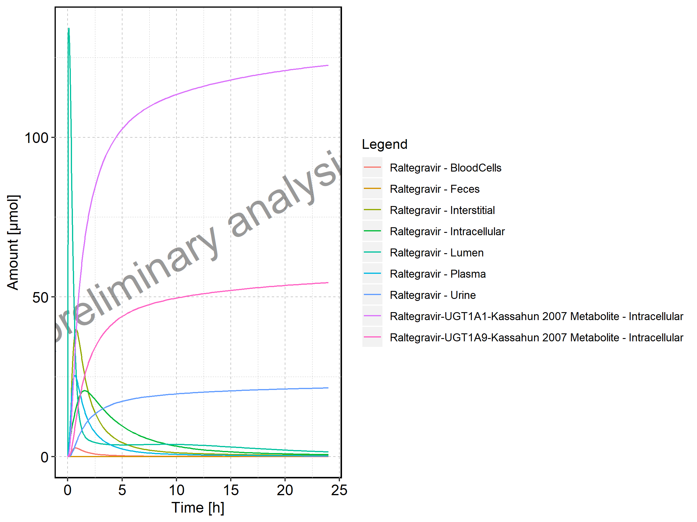

  - [1. PK parameters](#pk-parameters)
      - [1.1. PK parameters for Raltegravir 10 mg (lactose formulation)](#pk-parameters-for-raltegravir-10-mg-lactose-formulation)
      - [1.2. PK parameters for Raltegravir 25 mg (lactose formulation)](#pk-parameters-for-raltegravir-25-mg-lactose-formulation)
      - [1.3. PK parameters for Raltegravir 50 mg (lactose formulation)](#pk-parameters-for-raltegravir-50-mg-lactose-formulation)
      - [1.4. PK parameters for Raltegravir 100 mg (lactose formulation)](#pk-parameters-for-raltegravir-100-mg-lactose-formulation)
      - [1.5. PK parameters for Raltegravir 200 mg (lactose formulation)](#pk-parameters-for-raltegravir-200-mg-lactose-formulation)
      - [1.6. PK parameters for Raltegravir 400mg (lactose formulation)](#pk-parameters-for-raltegravir-400mg-lactose-formulation)
      - [1.7. PK parameters for Raltegravir 800 mg (lactose formulation)](#pk-parameters-for-raltegravir-800-mg-lactose-formulation)
      - [1.8. PK parameters for Raltegravir 1200 mg (lactose formulation)](#pk-parameters-for-raltegravir-1200-mg-lactose-formulation)
      - [1.9. PK parameters for Raltegravir 1600 mg (lactose formulation)](#pk-parameters-for-raltegravir-1600-mg-lactose-formulation)
      - [1.10. PK parameters for Raltegravir 100 mg filmcoated tablet md](#pk-parameters-for-raltegravir-100-mg-filmcoated-tablet-md)
      - [1.11. PK parameters for Raltegravir 200 mg filmcoated tablet md](#pk-parameters-for-raltegravir-200-mg-filmcoated-tablet-md)
      - [1.12. PK parameters for Filmcoated\_tablet\_400mg\_sd](#pk-parameters-for-filmcoated_tablet_400mg_sd)
      - [1.13. PK parameters for Raltegravir 400 mg filmcoated tablet md](#pk-parameters-for-raltegravir-400-mg-filmcoated-tablet-md)
      - [1.14. PK parameters for Raltegravir 400mg chewable fasted](#pk-parameters-for-raltegravir-400mg-chewable-fasted)
      - [1.15. PK parameters for Raltegravir 400mg chewable fed](#pk-parameters-for-raltegravir-400mg-chewable-fed)
      - [1.16. PK parameters for Raltegravir 400mg (granules in suspension)](#pk-parameters-for-raltegravir-400mg-granules-in-suspension)
  - [2. Absorption](#absorption)
      - [2.1. Absorption for Raltegravir 10 mg (lactose formulation)](#absorption-for-raltegravir-10-mg-lactose-formulation)
      - [2.2. Absorption for Raltegravir 25 mg (lactose formulation)](#absorption-for-raltegravir-25-mg-lactose-formulation)
      - [2.3. Absorption for Raltegravir 50 mg (lactose formulation)](#absorption-for-raltegravir-50-mg-lactose-formulation)
      - [2.4. Absorption for Raltegravir 100 mg (lactose formulation)](#absorption-for-raltegravir-100-mg-lactose-formulation)
      - [2.5. Absorption for Raltegravir 200 mg (lactose formulation)](#absorption-for-raltegravir-200-mg-lactose-formulation)
      - [2.6. Absorption for Raltegravir 400mg (lactose formulation)](#absorption-for-raltegravir-400mg-lactose-formulation)
      - [2.7. Absorption for Raltegravir 800 mg (lactose formulation)](#absorption-for-raltegravir-800-mg-lactose-formulation)
      - [2.8. Absorption for Raltegravir 1200 mg (lactose formulation)](#absorption-for-raltegravir-1200-mg-lactose-formulation)
      - [2.9. Absorption for Raltegravir 1600 mg (lactose formulation)](#absorption-for-raltegravir-1600-mg-lactose-formulation)
      - [2.10. Absorption for Raltegravir 100 mg filmcoated tablet md](#absorption-for-raltegravir-100-mg-filmcoated-tablet-md)
      - [2.11. Absorption for Raltegravir 200 mg filmcoated tablet md](#absorption-for-raltegravir-200-mg-filmcoated-tablet-md)
      - [2.12. Absorption for Filmcoated\_tablet\_400mg\_sd](#absorption-for-filmcoated_tablet_400mg_sd)
      - [2.13. Absorption for Raltegravir 400 mg filmcoated tablet md](#absorption-for-raltegravir-400-mg-filmcoated-tablet-md)
      - [2.14. Absorption for Raltegravir 400mg chewable fasted](#absorption-for-raltegravir-400mg-chewable-fasted)
      - [2.15. Absorption for Raltegravir 400mg chewable fed](#absorption-for-raltegravir-400mg-chewable-fed)
      - [2.16. Absorption for Raltegravir 400mg (granules in suspension)](#absorption-for-raltegravir-400mg-granules-in-suspension)
  - [3. Mass Balance](#mass-balance)
      - [3.1. Mass Balance for Raltegravir 10 mg (lactose formulation)](#mass-balance-for-raltegravir-10-mg-lactose-formulation)
      - [3.2. Mass Balance for Raltegravir 25 mg (lactose formulation)](#mass-balance-for-raltegravir-25-mg-lactose-formulation)
      - [3.3. Mass Balance for Raltegravir 50 mg (lactose formulation)](#mass-balance-for-raltegravir-50-mg-lactose-formulation)
      - [3.4. Mass Balance for Raltegravir 100 mg (lactose formulation)](#mass-balance-for-raltegravir-100-mg-lactose-formulation)
      - [3.5. Mass Balance for Raltegravir 200 mg (lactose formulation)](#mass-balance-for-raltegravir-200-mg-lactose-formulation)
      - [3.6. Mass Balance for Raltegravir 400mg (lactose formulation)](#mass-balance-for-raltegravir-400mg-lactose-formulation)
      - [3.7. Mass Balance for Raltegravir 800 mg (lactose formulation)](#mass-balance-for-raltegravir-800-mg-lactose-formulation)
      - [3.8. Mass Balance for Raltegravir 1200 mg (lactose formulation)](#mass-balance-for-raltegravir-1200-mg-lactose-formulation)
      - [3.9. Mass Balance for Raltegravir 1600 mg (lactose formulation)](#mass-balance-for-raltegravir-1600-mg-lactose-formulation)
      - [3.10. Mass Balance for Raltegravir 100 mg filmcoated tablet md](#mass-balance-for-raltegravir-100-mg-filmcoated-tablet-md)
      - [3.11. Mass Balance for Raltegravir 200 mg filmcoated tablet md](#mass-balance-for-raltegravir-200-mg-filmcoated-tablet-md)
      - [3.12. Mass Balance for Filmcoated\_tablet\_400mg\_sd](#mass-balance-for-filmcoated_tablet_400mg_sd)
      - [3.13. Mass Balance for Raltegravir 400 mg filmcoated tablet md](#mass-balance-for-raltegravir-400-mg-filmcoated-tablet-md)
      - [3.14. Mass Balance for Raltegravir 400mg chewable fasted](#mass-balance-for-raltegravir-400mg-chewable-fasted)
      - [3.15. Mass Balance for Raltegravir 400mg chewable fed](#mass-balance-for-raltegravir-400mg-chewable-fed)
      - [3.16. Mass Balance for Raltegravir 400mg (granules in suspension)](#mass-balance-for-raltegravir-400mg-granules-in-suspension)
  - [4. Time profiles and residual plots](#time-profiles-and-residual-plots)
      - [4.1. Time profiles and residual plots for Raltegravir 10 mg (lactose formulation)](#time-profiles-and-residual-plots-for-raltegravir-10-mg-lactose-formulation)
      - [4.2. Time profiles and residual plots for Raltegravir 25 mg (lactose formulation)](#time-profiles-and-residual-plots-for-raltegravir-25-mg-lactose-formulation)
      - [4.3. Time profiles and residual plots for Raltegravir 50 mg (lactose formulation)](#time-profiles-and-residual-plots-for-raltegravir-50-mg-lactose-formulation)
      - [4.4. Time profiles and residual plots for Raltegravir 100 mg (lactose formulation)](#time-profiles-and-residual-plots-for-raltegravir-100-mg-lactose-formulation)
      - [4.5. Time profiles and residual plots for Raltegravir 200 mg (lactose formulation)](#time-profiles-and-residual-plots-for-raltegravir-200-mg-lactose-formulation)
      - [4.6. Time profiles and residual plots for Raltegravir 400mg (lactose formulation)](#time-profiles-and-residual-plots-for-raltegravir-400mg-lactose-formulation)
      - [4.7. Time profiles and residual plots for Raltegravir 800 mg (lactose formulation)](#time-profiles-and-residual-plots-for-raltegravir-800-mg-lactose-formulation)
      - [4.8. Time profiles and residual plots for Raltegravir 1200 mg (lactose formulation)](#time-profiles-and-residual-plots-for-raltegravir-1200-mg-lactose-formulation)
      - [4.9. Time profiles and residual plots for Raltegravir 1600 mg (lactose formulation)](#time-profiles-and-residual-plots-for-raltegravir-1600-mg-lactose-formulation)
      - [4.10. Time profiles and residual plots for Raltegravir 100 mg filmcoated tablet md](#time-profiles-and-residual-plots-for-raltegravir-100-mg-filmcoated-tablet-md)
      - [4.11. Time profiles and residual plots for Raltegravir 200 mg filmcoated tablet md](#time-profiles-and-residual-plots-for-raltegravir-200-mg-filmcoated-tablet-md)
      - [4.12. Time profiles and residual plots for Filmcoated\_tablet\_400mg\_sd](#time-profiles-and-residual-plots-for-filmcoated_tablet_400mg_sd)
      - [4.13. Time profiles and residual plots for Raltegravir 400 mg filmcoated tablet md](#time-profiles-and-residual-plots-for-raltegravir-400-mg-filmcoated-tablet-md)
      - [4.14. Time profiles and residual plots for Raltegravir 400mg chewable fasted](#time-profiles-and-residual-plots-for-raltegravir-400mg-chewable-fasted)
      - [4.15. Time profiles and residual plots for Raltegravir 400mg chewable fed](#time-profiles-and-residual-plots-for-raltegravir-400mg-chewable-fed)
      - [4.16. Time profiles and residual plots for Raltegravir 400mg (granules in suspension)](#time-profiles-and-residual-plots-for-raltegravir-400mg-granules-in-suspension)
      - [4.17. Residuals across all simulations](#residuals-across-all-simulations)

# 1\. PK parameters

## 1.1. PK parameters for Raltegravir 10 mg (lactose formulation)

| Path        | Parameter      |        Value | Unit      |
| :---------- | :------------- | -----------: | :-------- |
| Raltegravir | C\_max         |  110.4938945 | µg/l      |
| Raltegravir | C\_max\_norm   |    0.8066055 | kg/l      |
| Raltegravir | t\_max         |    0.7500000 | h         |
| Raltegravir | C\_tEnd        |    1.9563139 | µg/l      |
| Raltegravir | AUC            |  241.6052506 | µg\*h/l   |
| Raltegravir | AUC\_norm      |    1.7637182 | kg\*h/l   |
| Raltegravir | AUC\_inf       |  255.1373571 | µg\*h/l   |
| Raltegravir | AUC\_inf\_norm |    1.8625028 | kg\*h/l   |
| Raltegravir | MRT            |    3.3293592 | h         |
| Raltegravir | Thalf          |    4.7946014 | h         |
| Raltegravir | CL             |    8.9485329 | ml/min/kg |
| Raltegravir | Vss            | 1787.5727415 | ml/kg     |
| Raltegravir | Vd             | 3713.8993740 | ml/kg     |

## 1.2. PK parameters for Raltegravir 25 mg (lactose formulation)

| Path        | Parameter      |       Value | Unit      |
| :---------- | :------------- | ----------: | :-------- |
| Raltegravir | C\_max         |  276.849301 | µg/l      |
| Raltegravir | C\_max\_norm   |    0.808400 | kg/l      |
| Raltegravir | t\_max         |    0.750000 | h         |
| Raltegravir | C\_tEnd        |    4.894139 | µg/l      |
| Raltegravir | AUC            |  605.060435 | µg\*h/l   |
| Raltegravir | AUC\_norm      |    1.766776 | kg\*h/l   |
| Raltegravir | AUC\_inf       |  638.895505 | µg\*h/l   |
| Raltegravir | AUC\_inf\_norm |    1.865575 | kg\*h/l   |
| Raltegravir | MRT            |    3.327076 | h         |
| Raltegravir | Thalf          |    4.791995 | h         |
| Raltegravir | CL             |    8.933796 | ml/min/kg |
| Raltegravir | Vss            | 1783.405542 | ml/kg     |
| Raltegravir | Vd             | 3705.768108 | ml/kg     |

## 1.3. PK parameters for Raltegravir 50 mg (lactose formulation)

| Path        | Parameter      |        Value | Unit      |
| :---------- | :------------- | -----------: | :-------- |
| Raltegravir | C\_max         |  556.5980647 | µg/l      |
| Raltegravir | C\_max\_norm   |    0.8126331 | kg/l      |
| Raltegravir | t\_max         |    0.7500000 | h         |
| Raltegravir | C\_tEnd        |    1.5273094 | µg/l      |
| Raltegravir | AUC            | 1296.6529555 | µg\*h/l   |
| Raltegravir | AUC\_norm      |    1.8931133 | kg\*h/l   |
| Raltegravir | AUC\_inf       | 1317.0860058 | µg\*h/l   |
| Raltegravir | AUC\_inf\_norm |    1.9229455 | kg\*h/l   |
| Raltegravir | MRT            |    4.1443451 | h         |
| Raltegravir | Thalf          |    9.2732239 | h         |
| Raltegravir | CL             |    8.6672585 | ml/min/kg |
| Raltegravir | Vss            | 2155.2066803 | ml/kg     |
| Raltegravir | Vd             | 6957.2610855 | ml/kg     |

## 1.4. PK parameters for Raltegravir 100 mg (lactose formulation)

| Path        | Parameter      |       Value | Unit      |
| :---------- | :------------- | ----------: | :-------- |
| Raltegravir | C\_max         | 1123.897267 | µg/l      |
| Raltegravir | C\_max\_norm   |    0.820445 | kg/l      |
| Raltegravir | t\_max         |    0.750000 | h         |
| Raltegravir | C\_tEnd        |    2.836519 | µg/l      |
| Raltegravir | AUC            | 2615.773112 | µg\*h/l   |
| Raltegravir | AUC\_norm      |    1.909514 | kg\*h/l   |
| Raltegravir | AUC\_inf       | 2654.063466 | µg\*h/l   |
| Raltegravir | AUC\_inf\_norm |    1.937466 | kg\*h/l   |
| Raltegravir | MRT            |    4.138122 | h         |
| Raltegravir | Thalf          |    9.356846 | h         |
| Raltegravir | CL             |    8.602300 | ml/min/kg |
| Raltegravir | Vss            | 2135.842085 | ml/kg     |
| Raltegravir | Vd             | 6967.385769 | ml/kg     |

## 1.5. PK parameters for Raltegravir 200 mg (lactose formulation)

| Path        | Parameter      |       Value | Unit      |
| :---------- | :------------- | ----------: | :-------- |
| Raltegravir | C\_max         | 2283.843895 | µg/l      |
| Raltegravir | C\_max\_norm   |    0.833603 | kg/l      |
| Raltegravir | t\_max         |    0.750000 | h         |
| Raltegravir | C\_tEnd        |    1.918062 | µg/l      |
| Raltegravir | AUC            | 5349.761122 | µg\*h/l   |
| Raltegravir | AUC\_norm      |    1.952663 | kg\*h/l   |
| Raltegravir | AUC\_inf       | 5376.252319 | µg\*h/l   |
| Raltegravir | AUC\_inf\_norm |    1.962332 | kg\*h/l   |
| Raltegravir | MRT            |    4.134027 | h         |
| Raltegravir | Thalf          |    9.573441 | h         |
| Raltegravir | CL             |    8.493296 | ml/min/kg |
| Raltegravir | Vss            | 2106.690645 | ml/kg     |
| Raltegravir | Vd             | 7038.337707 | ml/kg     |

## 1.6. PK parameters for Raltegravir 400mg (lactose formulation)

| Path        | Parameter      |        Value | Unit      |
| :---------- | :------------- | -----------: | :-------- |
| Raltegravir | C\_max         |  4673.726268 | µg/l      |
| Raltegravir | C\_max\_norm   |     0.852955 | kg/l      |
| Raltegravir | t\_max         |     0.750000 | h         |
| Raltegravir | C\_tEnd        |     3.837874 | µg/l      |
| Raltegravir | AUC            | 10899.606324 | µg\*h/l   |
| Raltegravir | AUC\_norm      |     1.989178 | kg\*h/l   |
| Raltegravir | AUC\_inf       | 10952.620364 | µg\*h/l   |
| Raltegravir | AUC\_inf\_norm |     1.998853 | kg\*h/l   |
| Raltegravir | MRT            |     4.109855 | h         |
| Raltegravir | Thalf          |     9.574743 | h         |
| Raltegravir | CL             |     8.338114 | ml/min/kg |
| Raltegravir | Vss            |  2056.106567 | ml/kg     |
| Raltegravir | Vd             |  6910.678864 | ml/kg     |

## 1.7. PK parameters for Raltegravir 800 mg (lactose formulation)

| Path        | Parameter      |        Value | Unit      |
| :---------- | :------------- | -----------: | :-------- |
| Raltegravir | C\_max         | 9.613040e+03 | µg/l      |
| Raltegravir | C\_max\_norm   | 8.771899e-01 | kg/l      |
| Raltegravir | t\_max         | 7.500000e-01 | h         |
| Raltegravir | C\_tEnd        | 6.643868e+00 | µg/l      |
| Raltegravir | AUC            | 2.234232e+04 | µg\*h/l   |
| Raltegravir | AUC\_norm      | 2.038736e+00 | kg\*h/l   |
| Raltegravir | AUC\_inf       | 2.243378e+04 | µg\*h/l   |
| Raltegravir | AUC\_inf\_norm | 2.047083e+00 | kg\*h/l   |
| Raltegravir | MRT            | 4.084571e+00 | h         |
| Raltegravir | Thalf          | 9.542753e+00 | h         |
| Raltegravir | CL             | 8.141668e+00 | ml/min/kg |
| Raltegravir | Vss            | 1.995313e+03 | ml/kg     |
| Raltegravir | Vd             | 6.725318e+03 | ml/kg     |

## 1.8. PK parameters for Raltegravir 1200 mg (lactose formulation)

| Path        | Parameter      |        Value | Unit      |
| :---------- | :------------- | -----------: | :-------- |
| Raltegravir | C\_max         | 1.468291e+04 | µg/l      |
| Raltegravir | C\_max\_norm   | 8.932101e-01 | kg/l      |
| Raltegravir | t\_max         | 7.500000e-01 | h         |
| Raltegravir | C\_tEnd        | 1.997039e+00 | µg/l      |
| Raltegravir | AUC            | 3.417676e+04 | µg\*h/l   |
| Raltegravir | AUC\_norm      | 2.079086e+00 | kg\*h/l   |
| Raltegravir | AUC\_inf       | 3.420447e+04 | µg\*h/l   |
| Raltegravir | AUC\_inf\_norm | 2.080772e+00 | kg\*h/l   |
| Raltegravir | MRT            | 4.095406e+00 | h         |
| Raltegravir | Thalf          | 9.617984e+00 | h         |
| Raltegravir | CL             | 8.009847e+00 | ml/min/kg |
| Raltegravir | Vss            | 1.968214e+03 | ml/kg     |
| Raltegravir | Vd             | 6.668591e+03 | ml/kg     |

## 1.9. PK parameters for Raltegravir 1600 mg (lactose formulation)

| Path        | Parameter      |        Value | Unit      |
| :---------- | :------------- | -----------: | :-------- |
| Raltegravir | C\_max         | 1.979954e+04 | µg/l      |
| Raltegravir | C\_max\_norm   | 9.033539e-01 | kg/l      |
| Raltegravir | t\_max         | 7.500000e-01 | h         |
| Raltegravir | C\_tEnd        | 2.665646e+00 | µg/l      |
| Raltegravir | AUC            | 4.607060e+04 | µg\*h/l   |
| Raltegravir | AUC\_norm      | 2.101971e+00 | kg\*h/l   |
| Raltegravir | AUC\_inf       | 4.610762e+04 | µg\*h/l   |
| Raltegravir | AUC\_inf\_norm | 2.103660e+00 | kg\*h/l   |
| Raltegravir | MRT            | 4.125340e+00 | h         |
| Raltegravir | Thalf          | 9.626328e+00 | h         |
| Raltegravir | CL             | 7.922700e+00 | ml/min/kg |
| Raltegravir | Vss            | 1.961030e+03 | ml/kg     |
| Raltegravir | Vd             | 6.601758e+03 | ml/kg     |

## 1.10. PK parameters for Raltegravir 100 mg filmcoated tablet md

| Path        | Parameter                         |        Value | Unit    |
| :---------- | :-------------------------------- | -----------: | :------ |
| Raltegravir | C\_max                            |  893.8029417 | µg/l    |
| Raltegravir | C\_max\_norm                      |    0.0326238 | kg/l    |
| Raltegravir | C\_max\_t1\_t2                    |  863.1595648 | µg/l    |
| Raltegravir | C\_max\_t1\_t2\_norm              |    0.6301065 | kg/l    |
| Raltegravir | C\_max\_tLast\_tEnd               |  892.6807501 | µg/l    |
| Raltegravir | C\_max\_tLast\_tEnd\_norm         |    0.6516570 | kg/l    |
| Raltegravir | t\_max                            |   84.7500000 | h       |
| Raltegravir | t\_max\_t1\_t2                    |    0.7500000 | h       |
| Raltegravir | t\_max\_tLast\_tEnd               |  228.7500000 | h       |
| Raltegravir | C\_trough\_t2                     |   19.6617510 | µg/l    |
| Raltegravir | C\_trough\_tLast                  |   31.9226996 | µg/l    |
| Raltegravir | AUC\_t1\_t2                       | 1978.7565232 | µg\*h/l |
| Raltegravir | AUC\_t1\_t2\_norm                 |    1.4444923 | kg\*h/l |
| Raltegravir | AUC\_tLast\_minus\_1\_tLast       | 2219.2012751 | µg\*h/l |
| Raltegravir | AUC\_tLast\_minus\_1\_tLast\_norm |    1.6200169 | kg\*h/l |
| Raltegravir | AUC\_inf\_t1                      | 2144.3461704 | µg\*h/l |
| Raltegravir | AUC\_inf\_t1\_norm                |    1.5653726 | kg\*h/l |
| Raltegravir | AUC\_inf\_tLast                   | 2536.5938269 | µg\*h/l |
| Raltegravir | AUC\_inf\_tLast\_norm             |    1.8517136 | kg\*h/l |
| Raltegravir | MRT                               |    3.9621429 | h       |
| Raltegravir | Thalf                             |    5.8376226 | h       |
| Raltegravir | Thalf\_tLast\_tEnd                |    6.9004822 | h       |

## 1.11. PK parameters for Raltegravir 200 mg filmcoated tablet md

| Path        | Parameter                         |        Value | Unit    |
| :---------- | :-------------------------------- | -----------: | :------ |
| Raltegravir | C\_max                            | 1810.3639857 | µg/l    |
| Raltegravir | C\_max\_norm                      |    0.0330391 | kg/l    |
| Raltegravir | C\_max\_t1\_t2                    | 1748.6577478 | µg/l    |
| Raltegravir | C\_max\_t1\_t2\_norm              |    0.6382601 | kg/l    |
| Raltegravir | C\_max\_tLast\_tEnd               | 1808.4366260 | µg/l    |
| Raltegravir | C\_max\_tLast\_tEnd\_norm         |    0.6600794 | kg/l    |
| Raltegravir | t\_max                            |  180.7500000 | h       |
| Raltegravir | t\_max\_t1\_t2                    |    0.7500000 | h       |
| Raltegravir | t\_max\_tLast\_tEnd               |  228.7500000 | h       |
| Raltegravir | C\_trough\_t2                     |   39.4742325 | µg/l    |
| Raltegravir | C\_trough\_tLast                  |   64.0288309 | µg/l    |
| Raltegravir | AUC\_t1\_t2                       | 3998.1178427 | µg\*h/l |
| Raltegravir | AUC\_t1\_t2\_norm                 |    1.4593130 | kg\*h/l |
| Raltegravir | AUC\_tLast\_minus\_1\_tLast       | 4483.4029557 | µg\*h/l |
| Raltegravir | AUC\_tLast\_minus\_1\_tLast\_norm |    1.6364421 | kg\*h/l |
| Raltegravir | AUC\_inf\_t1                      | 4329.1330307 | µg\*h/l |
| Raltegravir | AUC\_inf\_t1\_norm                |    1.5801335 | kg\*h/l |
| Raltegravir | AUC\_inf\_tLast                   | 5115.3598239 | µg\*h/l |
| Raltegravir | AUC\_inf\_tLast\_norm             |    1.8671063 | kg\*h/l |
| Raltegravir | MRT                               |    3.9411664 | h       |
| Raltegravir | Thalf                             |    5.8124568 | h       |
| Raltegravir | Thalf\_tLast\_tEnd                |    6.8742091 | h       |

## 1.12. PK parameters for Filmcoated\_tablet\_400mg\_sd

| Path        | Parameter      |        Value | Unit      |
| :---------- | :------------- | -----------: | :-------- |
| Raltegravir | C\_max         | 3568.5563894 | µg/l      |
| Raltegravir | C\_max\_norm   |    0.6512616 | kg/l      |
| Raltegravir | t\_max         |    0.7500000 | h         |
| Raltegravir | C\_tEnd        |   28.2685935 | µg/l      |
| Raltegravir | AUC            | 8703.6498337 | µg\*h/l   |
| Raltegravir | AUC\_norm      |    1.5884161 | kg\*h/l   |
| Raltegravir | AUC\_inf       | 9072.4244034 | µg\*h/l   |
| Raltegravir | AUC\_inf\_norm |    1.6557174 | kg\*h/l   |
| Raltegravir | MRT            |    4.8922185 | h         |
| Raltegravir | Thalf          |    9.0423584 | h         |
| Raltegravir | CL             |   10.0661302 | ml/min/kg |
| Raltegravir | Vss            | 2954.7424316 | ml/kg     |
| Raltegravir | Vd             | 7878.9811134 | ml/kg     |

## 1.13. PK parameters for Raltegravir 400 mg filmcoated tablet md

| Path        | Parameter                         |        Value | Unit    |
| :---------- | :-------------------------------- | -----------: | :------ |
| Raltegravir | C\_max                            | 3.694358e+03 | µg/l    |
| Raltegravir | C\_max\_norm                      | 3.371100e-02 | kg/l    |
| Raltegravir | C\_max\_t1\_t2                    | 3.569008e+03 | µg/l    |
| Raltegravir | C\_max\_t1\_t2\_norm              | 6.513440e-01 | kg/l    |
| Raltegravir | C\_max\_tLast\_tEnd               | 3.689981e+03 | µg/l    |
| Raltegravir | C\_max\_tLast\_tEnd\_norm         | 6.734216e-01 | kg/l    |
| Raltegravir | t\_max                            | 9.675000e+01 | h       |
| Raltegravir | t\_max\_t1\_t2                    | 7.500000e-01 | h       |
| Raltegravir | t\_max\_tLast\_tEnd               | 2.287500e+02 | h       |
| Raltegravir | C\_trough\_t2                     | 7.975313e+01 | µg/l    |
| Raltegravir | C\_trough\_tLast                  | 1.291934e+02 | µg/l    |
| Raltegravir | AUC\_t1\_t2                       | 8.128051e+03 | µg\*h/l |
| Raltegravir | AUC\_t1\_t2\_norm                 | 1.483369e+00 | kg\*h/l |
| Raltegravir | AUC\_tLast\_minus\_1\_tLast       | 9.098431e+03 | µg\*h/l |
| Raltegravir | AUC\_tLast\_minus\_1\_tLast\_norm | 1.660464e+00 | kg\*h/l |
| Raltegravir | AUC\_inf\_t1                      | 8.798719e+03 | µg\*h/l |
| Raltegravir | AUC\_inf\_t1\_norm                | 1.605766e+00 | kg\*h/l |
| Raltegravir | AUC\_inf\_tLast                   | 1.036587e+04 | µg\*h/l |
| Raltegravir | AUC\_inf\_tLast\_norm             | 1.891771e+00 | kg\*h/l |
| Raltegravir | MRT                               | 3.934582e+00 | h       |
| Raltegravir | Thalf                             | 5.828885e+00 | h       |
| Raltegravir | Thalf\_tLast\_tEnd                | 6.799025e+00 | h       |

## 1.14. PK parameters for Raltegravir 400mg chewable fasted

| Path        | Parameter      |        Value | Unit      |
| :---------- | :------------- | -----------: | :-------- |
| Raltegravir | C\_max         |  6330.518996 | µg/l      |
| Raltegravir | C\_max\_norm   |     1.155320 | kg/l      |
| Raltegravir | t\_max         |     0.750000 | h         |
| Raltegravir | C\_tEnd        |    35.836480 | µg/l      |
| Raltegravir | AUC            | 14694.827674 | µg\*h/l   |
| Raltegravir | AUC\_norm      |     2.681806 | kg\*h/l   |
| Raltegravir | AUC\_inf       | 15124.213097 | µg\*h/l   |
| Raltegravir | AUC\_inf\_norm |     2.760169 | kg\*h/l   |
| Raltegravir | MRT            |     4.186335 | h         |
| Raltegravir | Thalf          |     8.305142 | h         |
| Raltegravir | CL             |     6.038278 | ml/min/kg |
| Raltegravir | Vss            |  1516.695142 | ml/kg     |
| Raltegravir | Vd             |  4340.961456 | ml/kg     |

## 1.15. PK parameters for Raltegravir 400mg chewable fed

| Path        | Parameter      |        Value | Unit      |
| :---------- | :------------- | -----------: | :-------- |
| Raltegravir | C\_max         | 2.580439e+03 | µg/l      |
| Raltegravir | C\_max\_norm   | 4.709301e-01 | kg/l      |
| Raltegravir | t\_max         | 2.500000e+00 | h         |
| Raltegravir | C\_tEnd        | 3.592768e+01 | µg/l      |
| Raltegravir | AUC            | 1.411909e+04 | µg\*h/l   |
| Raltegravir | AUC\_norm      | 2.576734e+00 | kg\*h/l   |
| Raltegravir | AUC\_inf       | 1.460635e+04 | µg\*h/l   |
| Raltegravir | AUC\_inf\_norm | 2.665660e+00 | kg\*h/l   |
| Raltegravir | MRT            | 5.989332e+00 | h         |
| Raltegravir | Thalf          | 9.400702e+00 | h         |
| Raltegravir | CL             | 6.252361e+00 | ml/min/kg |
| Raltegravir | Vss            | 2.246848e+03 | ml/kg     |
| Raltegravir | Vd             | 5.087801e+03 | ml/kg     |

## 1.16. PK parameters for Raltegravir 400mg (granules in suspension)

| Path        | Parameter      |        Value | Unit      |
| :---------- | :------------- | -----------: | :-------- |
| Raltegravir | C\_max         |  8156.789686 | µg/l      |
| Raltegravir | C\_max\_norm   |     1.488614 | kg/l      |
| Raltegravir | t\_max         |     0.700000 | h         |
| Raltegravir | C\_tEnd        |    42.186887 | µg/l      |
| Raltegravir | AUC            | 18791.010143 | µg\*h/l   |
| Raltegravir | AUC\_norm      |     3.429359 | kg\*h/l   |
| Raltegravir | AUC\_inf       | 19278.707122 | µg\*h/l   |
| Raltegravir | AUC\_inf\_norm |     3.518364 | kg\*h/l   |
| Raltegravir | MRT            |     4.020312 | h         |
| Raltegravir | Thalf          |     8.013054 | h         |
| Raltegravir | CL             |     4.737050 | ml/min/kg |
| Raltegravir | Vss            |  1142.665029 | ml/kg     |
| Raltegravir | Vd             |  3285.730123 | ml/kg     |

# 2\. Absorption

## 2.1. Absorption for Raltegravir 10 mg (lactose formulation)

Figure 1: Absorption of Raltegravir

## 2.2. Absorption for Raltegravir 25 mg (lactose formulation)

Figure 2: Absorption of Raltegravir

## 2.3. Absorption for Raltegravir 50 mg (lactose formulation)

Figure 3: Absorption of Raltegravir

## 2.4. Absorption for Raltegravir 100 mg (lactose formulation)

Figure 4: Absorption of Raltegravir

## 2.5. Absorption for Raltegravir 200 mg (lactose formulation)

Figure 5: Absorption of Raltegravir

## 2.6. Absorption for Raltegravir 400mg (lactose formulation)

Figure 6: Absorption of Raltegravir

## 2.7. Absorption for Raltegravir 800 mg (lactose formulation)

Figure 7: Absorption of Raltegravir

## 2.8. Absorption for Raltegravir 1200 mg (lactose formulation)

Figure 8: Absorption of Raltegravir

## 2.9. Absorption for Raltegravir 1600 mg (lactose formulation)

Figure 9: Absorption of Raltegravir

## 2.10. Absorption for Raltegravir 100 mg filmcoated tablet md

Figure 10: Absorption of Raltegravir

## 2.11. Absorption for Raltegravir 200 mg filmcoated tablet md

Figure 11: Absorption of Raltegravir

## 2.12. Absorption for Filmcoated\_tablet\_400mg\_sd

Figure 12: Absorption of Raltegravir

## 2.13. Absorption for Raltegravir 400 mg filmcoated tablet md

Figure 13: Absorption of Raltegravir

## 2.14. Absorption for Raltegravir 400mg chewable fasted

Figure 14: Absorption of Raltegravir

## 2.15. Absorption for Raltegravir 400mg chewable fed

Figure 15: Absorption of Raltegravir

## 2.16. Absorption for Raltegravir 400mg (granules in suspension)

Figure 16: Absorption of Raltegravir

# 3\. Mass Balance

## 3.1. Mass Balance for Raltegravir 10 mg (lactose formulation)

Figure 17: Amount of drug vs time within the different compartments.

Figure 18: Cumulated amount of drug vs time within the different compartments

Figure 19: Amount of drug vs time within the different compartments normalized to applicated drugmass.

Figure 20: Cumulated amount of drug vs time within the different compartments normalized to applicated drugmass.

Figure 21: Fraction of drug within the different compartments at 12h.

## 3.2. Mass Balance for Raltegravir 25 mg (lactose formulation)

Figure 22: Amount of drug vs time within the different compartments.

Figure 23: Cumulated amount of drug vs time within the different compartments

Figure 24: Amount of drug vs time within the different compartments normalized to applicated drugmass.

Figure 25: Cumulated amount of drug vs time within the different compartments normalized to applicated drugmass.

Figure 26: Fraction of drug within the different compartments at 12h.

## 3.3. Mass Balance for Raltegravir 50 mg (lactose formulation)

Figure 27: Amount of drug vs time within the different compartments.

Figure 28: Cumulated amount of drug vs time within the different compartments

Figure 29: Amount of drug vs time within the different compartments normalized to applicated drugmass.

Figure 30: Cumulated amount of drug vs time within the different compartments normalized to applicated drugmass.

Figure 31: Fraction of drug within the different compartments at 32h.

## 3.4. Mass Balance for Raltegravir 100 mg (lactose formulation)

Figure 32: Amount of drug vs time within the different compartments.

Figure 33: Cumulated amount of drug vs time within the different compartments

Figure 34: Amount of drug vs time within the different compartments normalized to applicated drugmass.

Figure 35: Cumulated amount of drug vs time within the different compartments normalized to applicated drugmass.

Figure 36: Fraction of drug within the different compartments at 33h.

## 3.5. Mass Balance for Raltegravir 200 mg (lactose formulation)

Figure 37: Amount of drug vs time within the different compartments.

Figure 38: Cumulated amount of drug vs time within the different compartments

Figure 39: Amount of drug vs time within the different compartments normalized to applicated drugmass.

Figure 40: Cumulated amount of drug vs time within the different compartments normalized to applicated drugmass.

Figure 41: Fraction of drug within the different compartments at 48h.

## 3.6. Mass Balance for Raltegravir 400mg (lactose formulation)

Figure 42: Amount of drug vs time within the different compartments.

Figure 43: Cumulated amount of drug vs time within the different compartments

Figure 44: Amount of drug vs time within the different compartments normalized to applicated drugmass.

Figure 45: Cumulated amount of drug vs time within the different compartments normalized to applicated drugmass.

Figure 46: Fraction of drug within the different compartments at 48h.

## 3.7. Mass Balance for Raltegravir 800 mg (lactose formulation)

Figure 47: Amount of drug vs time within the different compartments.

Figure 48: Cumulated amount of drug vs time within the different compartments

Figure 49: Amount of drug vs time within the different compartments normalized to applicated drugmass.

Figure 50: Cumulated amount of drug vs time within the different compartments normalized to applicated drugmass.

Figure 51: Fraction of drug within the different compartments at 50h.

## 3.8. Mass Balance for Raltegravir 1200 mg (lactose formulation)

Figure 52: Amount of drug vs time within the different compartments.

Figure 53: Cumulated amount of drug vs time within the different compartments

Figure 54: Amount of drug vs time within the different compartments normalized to applicated drugmass.

Figure 55: Cumulated amount of drug vs time within the different compartments normalized to applicated drugmass.

Figure 56: Fraction of drug within the different compartments at 72h.

## 3.9. Mass Balance for Raltegravir 1600 mg (lactose formulation)

Figure 57: Amount of drug vs time within the different compartments.

Figure 58: Cumulated amount of drug vs time within the different compartments

Figure 59: Amount of drug vs time within the different compartments normalized to applicated drugmass.

Figure 60: Cumulated amount of drug vs time within the different compartments normalized to applicated drugmass.

Figure 61: Fraction of drug within the different compartments at 72h.

## 3.10. Mass Balance for Raltegravir 100 mg filmcoated tablet md

Figure 62: Amount of drug vs time within the different compartments.

Figure 63: Cumulated amount of drug vs time within the different compartments

Figure 64: Amount of drug vs time within the different compartments normalized to applicated drugmass.

Figure 65: Cumulated amount of drug vs time within the different compartments normalized to applicated drugmass.

Figure 66: Fraction of drug within the different compartments at 240h.

## 3.11. Mass Balance for Raltegravir 200 mg filmcoated tablet md

Figure 67: Amount of drug vs time within the different compartments.

Figure 68: Cumulated amount of drug vs time within the different compartments

Figure 69: Amount of drug vs time within the different compartments normalized to applicated drugmass.

Figure 70: Cumulated amount of drug vs time within the different compartments normalized to applicated drugmass.

Figure 71: Fraction of drug within the different compartments at 240h.

## 3.12. Mass Balance for Filmcoated\_tablet\_400mg\_sd

Figure 72: Amount of drug vs time within the different compartments.

Figure 73: Cumulated amount of drug vs time within the different compartments

Figure 74: Amount of drug vs time within the different compartments normalized to applicated drugmass.

Figure 75: Cumulated amount of drug vs time within the different compartments normalized to applicated drugmass.

Figure 76: Fraction of drug within the different compartments at 24h.

## 3.13. Mass Balance for Raltegravir 400 mg filmcoated tablet md

Figure 77: Amount of drug vs time within the different compartments.

Figure 78: Cumulated amount of drug vs time within the different compartments

Figure 79: Amount of drug vs time within the different compartments normalized to applicated drugmass.

Figure 80: Cumulated amount of drug vs time within the different compartments normalized to applicated drugmass.

Figure 81: Fraction of drug within the different compartments at 240h.

## 3.14. Mass Balance for Raltegravir 400mg chewable fasted

Figure 82: Amount of drug vs time within the different compartments.

Figure 83: Cumulated amount of drug vs time within the different compartments

Figure 84: Amount of drug vs time within the different compartments normalized to applicated drugmass.

Figure 85: Cumulated amount of drug vs time within the different compartments normalized to applicated drugmass.

Figure 86: Fraction of drug within the different compartments at 24h.

## 3.15. Mass Balance for Raltegravir 400mg chewable fed

Figure 87: Amount of drug vs time within the different compartments.

Figure 88: Cumulated amount of drug vs time within the different compartments

Figure 89: Amount of drug vs time within the different compartments normalized to applicated drugmass.

Figure 90: Cumulated amount of drug vs time within the different compartments normalized to applicated drugmass.

Figure 91: Fraction of drug within the different compartments at 24h.

## 3.16. Mass Balance for Raltegravir 400mg (granules in suspension)

Figure 92: Amount of drug vs time within the different compartments.

Figure 93: Cumulated amount of drug vs time within the different compartments

Figure 94: Amount of drug vs time within the different compartments normalized to applicated drugmass.

Figure 95: Cumulated amount of drug vs time within the different compartments normalized to applicated drugmass.

Figure 96: Fraction of drug within the different compartments at 24h.

# 4\. Time profiles and residual plots

## 4.1. Time profiles and residual plots for Raltegravir 10 mg (lactose formulation)

Figure 97: Time profiles of Raltegravir 10 mg (lactose formulation) for Raltegravir 10 mg (lactose formulation). Data source: C:/SW-Dev/2R/02\_TestPublic/02\_MeanModel\_Raltegravir\_inclSens/Data/Raltegravir\_PK.txt. Time profiles are plotted in a linear scale.

Figure 98: Time profiles of Raltegravir 10 mg (lactose formulation) for Raltegravir 10 mg (lactose formulation). Data source: C:/SW-Dev/2R/02\_TestPublic/02\_MeanModel\_Raltegravir\_inclSens/Data/Raltegravir\_PK.txt. Time profiles are plotted in a logarithmic scale.

Figure 99: Predicted vs observed of Raltegravir 10 mg (lactose formulation) for Raltegravir 10 mg (lactose formulation). Data source: C:/SW-Dev/2R/02\_TestPublic/02\_MeanModel\_Raltegravir\_inclSens/Data/Raltegravir\_PK.txt. Predictions and observations are plotted in a linear scale.

Figure 100: Predicted vs observed of Raltegravir 10 mg (lactose formulation) for Raltegravir 10 mg (lactose formulation). Data source: C:/SW-Dev/2R/02\_TestPublic/02\_MeanModel\_Raltegravir\_inclSens/Data/Raltegravir\_PK.txt. Predictions and observations are plotted in a logarithmic scale.

Figure 101: Logarithmic residuals vs predicted values of Raltegravir 10 mg (lactose formulation) for Raltegravir 10 mg (lactose formulation). Data source: C:/SW-Dev/2R/02\_TestPublic/02\_MeanModel\_Raltegravir\_inclSens/Data/Raltegravir\_PK.txt.

Figure 102: Logarithmic residuals vs time of Raltegravir 10 mg (lactose formulation) for Raltegravir 10 mg (lactose formulation). Data source: C:/SW-Dev/2R/02\_TestPublic/02\_MeanModel\_Raltegravir\_inclSens/Data/Raltegravir\_PK.txt.

Figure 103: Logarithmic residuals distribution of Raltegravir 10 mg (lactose formulation) for Raltegravir 10 mg (lactose formulation). Data source: C:/SW-Dev/2R/02\_TestPublic/02\_MeanModel\_Raltegravir\_inclSens/Data/Raltegravir\_PK.txt.

## 4.2. Time profiles and residual plots for Raltegravir 25 mg (lactose formulation)

Figure 104: Time profiles of Raltegravir 25 mg (lactose formulation) for Raltegravir 25 mg (lactose formulation). Data source: C:/SW-Dev/2R/02\_TestPublic/02\_MeanModel\_Raltegravir\_inclSens/Data/Raltegravir\_PK.txt. Time profiles are plotted in a linear scale.

Figure 105: Time profiles of Raltegravir 25 mg (lactose formulation) for Raltegravir 25 mg (lactose formulation). Data source: C:/SW-Dev/2R/02\_TestPublic/02\_MeanModel\_Raltegravir\_inclSens/Data/Raltegravir\_PK.txt. Time profiles are plotted in a logarithmic scale.

Figure 106: Predicted vs observed of Raltegravir 25 mg (lactose formulation) for Raltegravir 25 mg (lactose formulation). Data source: C:/SW-Dev/2R/02\_TestPublic/02\_MeanModel\_Raltegravir\_inclSens/Data/Raltegravir\_PK.txt. Predictions and observations are plotted in a linear scale.

Figure 107: Predicted vs observed of Raltegravir 25 mg (lactose formulation) for Raltegravir 25 mg (lactose formulation). Data source: C:/SW-Dev/2R/02\_TestPublic/02\_MeanModel\_Raltegravir\_inclSens/Data/Raltegravir\_PK.txt. Predictions and observations are plotted in a logarithmic scale.

Figure 108: Logarithmic residuals vs predicted values of Raltegravir 25 mg (lactose formulation) for Raltegravir 25 mg (lactose formulation). Data source: C:/SW-Dev/2R/02\_TestPublic/02\_MeanModel\_Raltegravir\_inclSens/Data/Raltegravir\_PK.txt.

Figure 109: Logarithmic residuals vs time of Raltegravir 25 mg (lactose formulation) for Raltegravir 25 mg (lactose formulation). Data source: C:/SW-Dev/2R/02\_TestPublic/02\_MeanModel\_Raltegravir\_inclSens/Data/Raltegravir\_PK.txt.

Figure 110: Logarithmic residuals distribution of Raltegravir 25 mg (lactose formulation) for Raltegravir 25 mg (lactose formulation). Data source: C:/SW-Dev/2R/02\_TestPublic/02\_MeanModel\_Raltegravir\_inclSens/Data/Raltegravir\_PK.txt.

## 4.3. Time profiles and residual plots for Raltegravir 50 mg (lactose formulation)

Figure 111: Time profiles of Raltegravir 50 mg (lactose formulation) for Raltegravir 50 mg (lactose formulation). Data source: C:/SW-Dev/2R/02\_TestPublic/02\_MeanModel\_Raltegravir\_inclSens/Data/Raltegravir\_PK.txt. Time profiles are plotted in a linear scale.

Figure 112: Time profiles of Raltegravir 50 mg (lactose formulation) for Raltegravir 50 mg (lactose formulation). Data source: C:/SW-Dev/2R/02\_TestPublic/02\_MeanModel\_Raltegravir\_inclSens/Data/Raltegravir\_PK.txt. Time profiles are plotted in a logarithmic scale.

Figure 113: Predicted vs observed of Raltegravir 50 mg (lactose formulation) for Raltegravir 50 mg (lactose formulation). Data source: C:/SW-Dev/2R/02\_TestPublic/02\_MeanModel\_Raltegravir\_inclSens/Data/Raltegravir\_PK.txt. Predictions and observations are plotted in a linear scale.

Figure 114: Predicted vs observed of Raltegravir 50 mg (lactose formulation) for Raltegravir 50 mg (lactose formulation). Data source: C:/SW-Dev/2R/02\_TestPublic/02\_MeanModel\_Raltegravir\_inclSens/Data/Raltegravir\_PK.txt. Predictions and observations are plotted in a logarithmic scale.

Figure 115: Logarithmic residuals vs predicted values of Raltegravir 50 mg (lactose formulation) for Raltegravir 50 mg (lactose formulation). Data source: C:/SW-Dev/2R/02\_TestPublic/02\_MeanModel\_Raltegravir\_inclSens/Data/Raltegravir\_PK.txt.

Figure 116: Logarithmic residuals vs time of Raltegravir 50 mg (lactose formulation) for Raltegravir 50 mg (lactose formulation). Data source: C:/SW-Dev/2R/02\_TestPublic/02\_MeanModel\_Raltegravir\_inclSens/Data/Raltegravir\_PK.txt.

Figure 117: Logarithmic residuals distribution of Raltegravir 50 mg (lactose formulation) for Raltegravir 50 mg (lactose formulation). Data source: C:/SW-Dev/2R/02\_TestPublic/02\_MeanModel\_Raltegravir\_inclSens/Data/Raltegravir\_PK.txt.

## 4.4. Time profiles and residual plots for Raltegravir 100 mg (lactose formulation)

Figure 118: Time profiles of Raltegravir 100 mg (lactose formulation) for Raltegravir 100 mg (lactose formulation). Data source: C:/SW-Dev/2R/02\_TestPublic/02\_MeanModel\_Raltegravir\_inclSens/Data/Raltegravir\_PK.txt. Time profiles are plotted in a linear scale.

Figure 119: Time profiles of Raltegravir 100 mg (lactose formulation) for Raltegravir 100 mg (lactose formulation). Data source: C:/SW-Dev/2R/02\_TestPublic/02\_MeanModel\_Raltegravir\_inclSens/Data/Raltegravir\_PK.txt. Time profiles are plotted in a logarithmic scale.

Figure 120: Predicted vs observed of Raltegravir 100 mg (lactose formulation) for Raltegravir 100 mg (lactose formulation). Data source: C:/SW-Dev/2R/02\_TestPublic/02\_MeanModel\_Raltegravir\_inclSens/Data/Raltegravir\_PK.txt. Predictions and observations are plotted in a linear scale.

Figure 121: Predicted vs observed of Raltegravir 100 mg (lactose formulation) for Raltegravir 100 mg (lactose formulation). Data source: C:/SW-Dev/2R/02\_TestPublic/02\_MeanModel\_Raltegravir\_inclSens/Data/Raltegravir\_PK.txt. Predictions and observations are plotted in a logarithmic scale.

Figure 122: Logarithmic residuals vs predicted values of Raltegravir 100 mg (lactose formulation) for Raltegravir 100 mg (lactose formulation). Data source: C:/SW-Dev/2R/02\_TestPublic/02\_MeanModel\_Raltegravir\_inclSens/Data/Raltegravir\_PK.txt.

Figure 123: Logarithmic residuals vs time of Raltegravir 100 mg (lactose formulation) for Raltegravir 100 mg (lactose formulation). Data source: C:/SW-Dev/2R/02\_TestPublic/02\_MeanModel\_Raltegravir\_inclSens/Data/Raltegravir\_PK.txt.

Figure 124: Logarithmic residuals distribution of Raltegravir 100 mg (lactose formulation) for Raltegravir 100 mg (lactose formulation). Data source: C:/SW-Dev/2R/02\_TestPublic/02\_MeanModel\_Raltegravir\_inclSens/Data/Raltegravir\_PK.txt.

## 4.5. Time profiles and residual plots for Raltegravir 200 mg (lactose formulation)

Figure 125: Time profiles of Raltegravir 200 mg (lactose formulation) for Raltegravir 200 mg (lactose formulation). Data source: C:/SW-Dev/2R/02\_TestPublic/02\_MeanModel\_Raltegravir\_inclSens/Data/Raltegravir\_PK.txt. Time profiles are plotted in a linear scale.

Figure 126: Time profiles of Raltegravir 200 mg (lactose formulation) for Raltegravir 200 mg (lactose formulation). Data source: C:/SW-Dev/2R/02\_TestPublic/02\_MeanModel\_Raltegravir\_inclSens/Data/Raltegravir\_PK.txt. Time profiles are plotted in a logarithmic scale.

Figure 127: Predicted vs observed of Raltegravir 200 mg (lactose formulation) for Raltegravir 200 mg (lactose formulation). Data source: C:/SW-Dev/2R/02\_TestPublic/02\_MeanModel\_Raltegravir\_inclSens/Data/Raltegravir\_PK.txt. Predictions and observations are plotted in a linear scale.

Figure 128: Predicted vs observed of Raltegravir 200 mg (lactose formulation) for Raltegravir 200 mg (lactose formulation). Data source: C:/SW-Dev/2R/02\_TestPublic/02\_MeanModel\_Raltegravir\_inclSens/Data/Raltegravir\_PK.txt. Predictions and observations are plotted in a logarithmic scale.

Figure 129: Logarithmic residuals vs predicted values of Raltegravir 200 mg (lactose formulation) for Raltegravir 200 mg (lactose formulation). Data source: C:/SW-Dev/2R/02\_TestPublic/02\_MeanModel\_Raltegravir\_inclSens/Data/Raltegravir\_PK.txt.

Figure 130: Logarithmic residuals vs time of Raltegravir 200 mg (lactose formulation) for Raltegravir 200 mg (lactose formulation). Data source: C:/SW-Dev/2R/02\_TestPublic/02\_MeanModel\_Raltegravir\_inclSens/Data/Raltegravir\_PK.txt.

Figure 131: Logarithmic residuals distribution of Raltegravir 200 mg (lactose formulation) for Raltegravir 200 mg (lactose formulation). Data source: C:/SW-Dev/2R/02\_TestPublic/02\_MeanModel\_Raltegravir\_inclSens/Data/Raltegravir\_PK.txt.

## 4.6. Time profiles and residual plots for Raltegravir 400mg (lactose formulation)

Figure 132: Time profiles of Raltegravir 400mg (lactose formulation) for Raltegravir 400mg (lactose formulation). Data source: C:/SW-Dev/2R/02\_TestPublic/02\_MeanModel\_Raltegravir\_inclSens/Data/Raltegravir\_PK.txt. Time profiles are plotted in a linear scale.

Figure 133: Time profiles of Raltegravir 400mg (lactose formulation) for Raltegravir 400mg (lactose formulation). Data source: C:/SW-Dev/2R/02\_TestPublic/02\_MeanModel\_Raltegravir\_inclSens/Data/Raltegravir\_PK.txt. Time profiles are plotted in a logarithmic scale.

Figure 134: Predicted vs observed of Raltegravir 400mg (lactose formulation) for Raltegravir 400mg (lactose formulation). Data source: C:/SW-Dev/2R/02\_TestPublic/02\_MeanModel\_Raltegravir\_inclSens/Data/Raltegravir\_PK.txt. Predictions and observations are plotted in a linear scale.

Figure 135: Predicted vs observed of Raltegravir 400mg (lactose formulation) for Raltegravir 400mg (lactose formulation). Data source: C:/SW-Dev/2R/02\_TestPublic/02\_MeanModel\_Raltegravir\_inclSens/Data/Raltegravir\_PK.txt. Predictions and observations are plotted in a logarithmic scale.

Figure 136: Logarithmic residuals vs predicted values of Raltegravir 400mg (lactose formulation) for Raltegravir 400mg (lactose formulation). Data source: C:/SW-Dev/2R/02\_TestPublic/02\_MeanModel\_Raltegravir\_inclSens/Data/Raltegravir\_PK.txt.

Figure 137: Logarithmic residuals vs time of Raltegravir 400mg (lactose formulation) for Raltegravir 400mg (lactose formulation). Data source: C:/SW-Dev/2R/02\_TestPublic/02\_MeanModel\_Raltegravir\_inclSens/Data/Raltegravir\_PK.txt.

Figure 138: Logarithmic residuals distribution of Raltegravir 400mg (lactose formulation) for Raltegravir 400mg (lactose formulation). Data source: C:/SW-Dev/2R/02\_TestPublic/02\_MeanModel\_Raltegravir\_inclSens/Data/Raltegravir\_PK.txt.

## 4.7. Time profiles and residual plots for Raltegravir 800 mg (lactose formulation)

Figure 139: Time profiles of Raltegravir 800 mg (lactose formulation) for Raltegravir 800 mg (lactose formulation). Data source: C:/SW-Dev/2R/02\_TestPublic/02\_MeanModel\_Raltegravir\_inclSens/Data/Raltegravir\_PK.txt. Time profiles are plotted in a linear scale.

Figure 140: Time profiles of Raltegravir 800 mg (lactose formulation) for Raltegravir 800 mg (lactose formulation). Data source: C:/SW-Dev/2R/02\_TestPublic/02\_MeanModel\_Raltegravir\_inclSens/Data/Raltegravir\_PK.txt. Time profiles are plotted in a logarithmic scale.

Figure 141: Predicted vs observed of Raltegravir 800 mg (lactose formulation) for Raltegravir 800 mg (lactose formulation). Data source: C:/SW-Dev/2R/02\_TestPublic/02\_MeanModel\_Raltegravir\_inclSens/Data/Raltegravir\_PK.txt. Predictions and observations are plotted in a linear scale.

Figure 142: Predicted vs observed of Raltegravir 800 mg (lactose formulation) for Raltegravir 800 mg (lactose formulation). Data source: C:/SW-Dev/2R/02\_TestPublic/02\_MeanModel\_Raltegravir\_inclSens/Data/Raltegravir\_PK.txt. Predictions and observations are plotted in a logarithmic scale.

Figure 143: Logarithmic residuals vs predicted values of Raltegravir 800 mg (lactose formulation) for Raltegravir 800 mg (lactose formulation). Data source: C:/SW-Dev/2R/02\_TestPublic/02\_MeanModel\_Raltegravir\_inclSens/Data/Raltegravir\_PK.txt.

Figure 144: Logarithmic residuals vs time of Raltegravir 800 mg (lactose formulation) for Raltegravir 800 mg (lactose formulation). Data source: C:/SW-Dev/2R/02\_TestPublic/02\_MeanModel\_Raltegravir\_inclSens/Data/Raltegravir\_PK.txt.

Figure 145: Logarithmic residuals distribution of Raltegravir 800 mg (lactose formulation) for Raltegravir 800 mg (lactose formulation). Data source: C:/SW-Dev/2R/02\_TestPublic/02\_MeanModel\_Raltegravir\_inclSens/Data/Raltegravir\_PK.txt.

## 4.8. Time profiles and residual plots for Raltegravir 1200 mg (lactose formulation)

Figure 146: Time profiles of Raltegravir 1200 mg (lactose formulation) for Raltegravir 1200 mg (lactose formulation). Data source: C:/SW-Dev/2R/02\_TestPublic/02\_MeanModel\_Raltegravir\_inclSens/Data/Raltegravir\_PK.txt. Time profiles are plotted in a linear scale.

Figure 147: Time profiles of Raltegravir 1200 mg (lactose formulation) for Raltegravir 1200 mg (lactose formulation). Data source: C:/SW-Dev/2R/02\_TestPublic/02\_MeanModel\_Raltegravir\_inclSens/Data/Raltegravir\_PK.txt. Time profiles are plotted in a logarithmic scale.

Figure 148: Predicted vs observed of Raltegravir 1200 mg (lactose formulation) for Raltegravir 1200 mg (lactose formulation). Data source: C:/SW-Dev/2R/02\_TestPublic/02\_MeanModel\_Raltegravir\_inclSens/Data/Raltegravir\_PK.txt. Predictions and observations are plotted in a linear scale.

Figure 149: Predicted vs observed of Raltegravir 1200 mg (lactose formulation) for Raltegravir 1200 mg (lactose formulation). Data source: C:/SW-Dev/2R/02\_TestPublic/02\_MeanModel\_Raltegravir\_inclSens/Data/Raltegravir\_PK.txt. Predictions and observations are plotted in a logarithmic scale.

Figure 150: Logarithmic residuals vs predicted values of Raltegravir 1200 mg (lactose formulation) for Raltegravir 1200 mg (lactose formulation). Data source: C:/SW-Dev/2R/02\_TestPublic/02\_MeanModel\_Raltegravir\_inclSens/Data/Raltegravir\_PK.txt.

Figure 151: Logarithmic residuals vs time of Raltegravir 1200 mg (lactose formulation) for Raltegravir 1200 mg (lactose formulation). Data source: C:/SW-Dev/2R/02\_TestPublic/02\_MeanModel\_Raltegravir\_inclSens/Data/Raltegravir\_PK.txt.

Figure 152: Logarithmic residuals distribution of Raltegravir 1200 mg (lactose formulation) for Raltegravir 1200 mg (lactose formulation). Data source: C:/SW-Dev/2R/02\_TestPublic/02\_MeanModel\_Raltegravir\_inclSens/Data/Raltegravir\_PK.txt.

## 4.9. Time profiles and residual plots for Raltegravir 1600 mg (lactose formulation)

Figure 153: Time profiles of Raltegravir 1600 mg (lactose formulation) for Raltegravir 1600 mg (lactose formulation). Data source: C:/SW-Dev/2R/02\_TestPublic/02\_MeanModel\_Raltegravir\_inclSens/Data/Raltegravir\_PK.txt. Time profiles are plotted in a linear scale.

Figure 154: Time profiles of Raltegravir 1600 mg (lactose formulation) for Raltegravir 1600 mg (lactose formulation). Data source: C:/SW-Dev/2R/02\_TestPublic/02\_MeanModel\_Raltegravir\_inclSens/Data/Raltegravir\_PK.txt. Time profiles are plotted in a logarithmic scale.

Figure 155: Predicted vs observed of Raltegravir 1600 mg (lactose formulation) for Raltegravir 1600 mg (lactose formulation). Data source: C:/SW-Dev/2R/02\_TestPublic/02\_MeanModel\_Raltegravir\_inclSens/Data/Raltegravir\_PK.txt. Predictions and observations are plotted in a linear scale.

Figure 156: Predicted vs observed of Raltegravir 1600 mg (lactose formulation) for Raltegravir 1600 mg (lactose formulation). Data source: C:/SW-Dev/2R/02\_TestPublic/02\_MeanModel\_Raltegravir\_inclSens/Data/Raltegravir\_PK.txt. Predictions and observations are plotted in a logarithmic scale.

Figure 157: Logarithmic residuals vs predicted values of Raltegravir 1600 mg (lactose formulation) for Raltegravir 1600 mg (lactose formulation). Data source: C:/SW-Dev/2R/02\_TestPublic/02\_MeanModel\_Raltegravir\_inclSens/Data/Raltegravir\_PK.txt.

Figure 158: Logarithmic residuals vs time of Raltegravir 1600 mg (lactose formulation) for Raltegravir 1600 mg (lactose formulation). Data source: C:/SW-Dev/2R/02\_TestPublic/02\_MeanModel\_Raltegravir\_inclSens/Data/Raltegravir\_PK.txt.

Figure 159: Logarithmic residuals distribution of Raltegravir 1600 mg (lactose formulation) for Raltegravir 1600 mg (lactose formulation). Data source: C:/SW-Dev/2R/02\_TestPublic/02\_MeanModel\_Raltegravir\_inclSens/Data/Raltegravir\_PK.txt.

## 4.10. Time profiles and residual plots for Raltegravir 100 mg filmcoated tablet md

Figure 160: Time profiles of Raltegravir 100 mg filmcoated tablet md for Raltegravir 100 mg filmcoated tablet md. Data source: C:/SW-Dev/2R/02\_TestPublic/02\_MeanModel\_Raltegravir\_inclSens/Data/Raltegravir\_PK.txt. Time profiles are plotted in a linear scale.

Figure 161: Time profiles of Raltegravir 100 mg filmcoated tablet md for Raltegravir 100 mg filmcoated tablet md. Data source: C:/SW-Dev/2R/02\_TestPublic/02\_MeanModel\_Raltegravir\_inclSens/Data/Raltegravir\_PK.txt. Time profiles are plotted in a logarithmic scale.

Figure 162: Predicted vs observed of Raltegravir 100 mg filmcoated tablet md for Raltegravir 100 mg filmcoated tablet md. Data source: C:/SW-Dev/2R/02\_TestPublic/02\_MeanModel\_Raltegravir\_inclSens/Data/Raltegravir\_PK.txt. Predictions and observations are plotted in a linear scale.

Figure 163: Predicted vs observed of Raltegravir 100 mg filmcoated tablet md for Raltegravir 100 mg filmcoated tablet md. Data source: C:/SW-Dev/2R/02\_TestPublic/02\_MeanModel\_Raltegravir\_inclSens/Data/Raltegravir\_PK.txt. Predictions and observations are plotted in a logarithmic scale.

Figure 164: Logarithmic residuals vs predicted values of Raltegravir 100 mg filmcoated tablet md for Raltegravir 100 mg filmcoated tablet md. Data source: C:/SW-Dev/2R/02\_TestPublic/02\_MeanModel\_Raltegravir\_inclSens/Data/Raltegravir\_PK.txt.

Figure 165: Logarithmic residuals vs time of Raltegravir 100 mg filmcoated tablet md for Raltegravir 100 mg filmcoated tablet md. Data source: C:/SW-Dev/2R/02\_TestPublic/02\_MeanModel\_Raltegravir\_inclSens/Data/Raltegravir\_PK.txt.

Figure 166: Logarithmic residuals distribution of Raltegravir 100 mg filmcoated tablet md for Raltegravir 100 mg filmcoated tablet md. Data source: C:/SW-Dev/2R/02\_TestPublic/02\_MeanModel\_Raltegravir\_inclSens/Data/Raltegravir\_PK.txt.

## 4.11. Time profiles and residual plots for Raltegravir 200 mg filmcoated tablet md

Figure 167: Time profiles of Raltegravir 200 mg filmcoated tablet md for Raltegravir 200 mg filmcoated tablet md. Data source: C:/SW-Dev/2R/02\_TestPublic/02\_MeanModel\_Raltegravir\_inclSens/Data/Raltegravir\_PK.txt. Time profiles are plotted in a linear scale.

Figure 168: Time profiles of Raltegravir 200 mg filmcoated tablet md for Raltegravir 200 mg filmcoated tablet md. Data source: C:/SW-Dev/2R/02\_TestPublic/02\_MeanModel\_Raltegravir\_inclSens/Data/Raltegravir\_PK.txt. Time profiles are plotted in a logarithmic scale.

Figure 169: Predicted vs observed of Raltegravir 200 mg filmcoated tablet md for Raltegravir 200 mg filmcoated tablet md. Data source: C:/SW-Dev/2R/02\_TestPublic/02\_MeanModel\_Raltegravir\_inclSens/Data/Raltegravir\_PK.txt. Predictions and observations are plotted in a linear scale.

Figure 170: Predicted vs observed of Raltegravir 200 mg filmcoated tablet md for Raltegravir 200 mg filmcoated tablet md. Data source: C:/SW-Dev/2R/02\_TestPublic/02\_MeanModel\_Raltegravir\_inclSens/Data/Raltegravir\_PK.txt. Predictions and observations are plotted in a logarithmic scale.

Figure 171: Logarithmic residuals vs predicted values of Raltegravir 200 mg filmcoated tablet md for Raltegravir 200 mg filmcoated tablet md. Data source: C:/SW-Dev/2R/02\_TestPublic/02\_MeanModel\_Raltegravir\_inclSens/Data/Raltegravir\_PK.txt.

Figure 172: Logarithmic residuals vs time of Raltegravir 200 mg filmcoated tablet md for Raltegravir 200 mg filmcoated tablet md. Data source: C:/SW-Dev/2R/02\_TestPublic/02\_MeanModel\_Raltegravir\_inclSens/Data/Raltegravir\_PK.txt.

Figure 173: Logarithmic residuals distribution of Raltegravir 200 mg filmcoated tablet md for Raltegravir 200 mg filmcoated tablet md. Data source: C:/SW-Dev/2R/02\_TestPublic/02\_MeanModel\_Raltegravir\_inclSens/Data/Raltegravir\_PK.txt.

## 4.12. Time profiles and residual plots for Filmcoated\_tablet\_400mg\_sd

Figure 174: Time profiles of Filmcoated\_tablet\_400mg\_sd for Raltegravir 400mg filmcoated tablet. Data source: C:/SW-Dev/2R/02\_TestPublic/02\_MeanModel\_Raltegravir\_inclSens/Data/Raltegravir\_PK.txt. Time profiles are plotted in a linear scale.

Figure 175: Time profiles of Filmcoated\_tablet\_400mg\_sd for Raltegravir 400mg filmcoated tablet. Data source: C:/SW-Dev/2R/02\_TestPublic/02\_MeanModel\_Raltegravir\_inclSens/Data/Raltegravir\_PK.txt. Time profiles are plotted in a logarithmic scale.

Figure 176: Predicted vs observed of Filmcoated\_tablet\_400mg\_sd for Raltegravir 400mg filmcoated tablet. Data source: C:/SW-Dev/2R/02\_TestPublic/02\_MeanModel\_Raltegravir\_inclSens/Data/Raltegravir\_PK.txt. Predictions and observations are plotted in a linear scale.

Figure 177: Predicted vs observed of Filmcoated\_tablet\_400mg\_sd for Raltegravir 400mg filmcoated tablet. Data source: C:/SW-Dev/2R/02\_TestPublic/02\_MeanModel\_Raltegravir\_inclSens/Data/Raltegravir\_PK.txt. Predictions and observations are plotted in a logarithmic scale.

Figure 178: Logarithmic residuals vs predicted values of Filmcoated\_tablet\_400mg\_sd for Raltegravir 400mg filmcoated tablet. Data source: C:/SW-Dev/2R/02\_TestPublic/02\_MeanModel\_Raltegravir\_inclSens/Data/Raltegravir\_PK.txt.

Figure 179: Logarithmic residuals vs time of Filmcoated\_tablet\_400mg\_sd for Raltegravir 400mg filmcoated tablet. Data source: C:/SW-Dev/2R/02\_TestPublic/02\_MeanModel\_Raltegravir\_inclSens/Data/Raltegravir\_PK.txt.

Figure 180: Logarithmic residuals distribution of Filmcoated\_tablet\_400mg\_sd for Raltegravir 400mg filmcoated tablet. Data source: C:/SW-Dev/2R/02\_TestPublic/02\_MeanModel\_Raltegravir\_inclSens/Data/Raltegravir\_PK.txt.

## 4.13. Time profiles and residual plots for Raltegravir 400 mg filmcoated tablet md

Figure 181: Time profiles of Raltegravir 400 mg filmcoated tablet md for Raltegravir 400 mg filmcoated tablet md. Data source: C:/SW-Dev/2R/02\_TestPublic/02\_MeanModel\_Raltegravir\_inclSens/Data/Raltegravir\_PK.txt. Time profiles are plotted in a linear scale.

Figure 182: Time profiles of Raltegravir 400 mg filmcoated tablet md for Raltegravir 400 mg filmcoated tablet md. Data source: C:/SW-Dev/2R/02\_TestPublic/02\_MeanModel\_Raltegravir\_inclSens/Data/Raltegravir\_PK.txt. Time profiles are plotted in a logarithmic scale.

Figure 183: Predicted vs observed of Raltegravir 400 mg filmcoated tablet md for Raltegravir 400 mg filmcoated tablet md. Data source: C:/SW-Dev/2R/02\_TestPublic/02\_MeanModel\_Raltegravir\_inclSens/Data/Raltegravir\_PK.txt. Predictions and observations are plotted in a linear scale.

Figure 184: Predicted vs observed of Raltegravir 400 mg filmcoated tablet md for Raltegravir 400 mg filmcoated tablet md. Data source: C:/SW-Dev/2R/02\_TestPublic/02\_MeanModel\_Raltegravir\_inclSens/Data/Raltegravir\_PK.txt. Predictions and observations are plotted in a logarithmic scale.

Figure 185: Logarithmic residuals vs predicted values of Raltegravir 400 mg filmcoated tablet md for Raltegravir 400 mg filmcoated tablet md. Data source: C:/SW-Dev/2R/02\_TestPublic/02\_MeanModel\_Raltegravir\_inclSens/Data/Raltegravir\_PK.txt.

Figure 186: Logarithmic residuals vs time of Raltegravir 400 mg filmcoated tablet md for Raltegravir 400 mg filmcoated tablet md. Data source: C:/SW-Dev/2R/02\_TestPublic/02\_MeanModel\_Raltegravir\_inclSens/Data/Raltegravir\_PK.txt.

Figure 187: Logarithmic residuals distribution of Raltegravir 400 mg filmcoated tablet md for Raltegravir 400 mg filmcoated tablet md. Data source: C:/SW-Dev/2R/02\_TestPublic/02\_MeanModel\_Raltegravir\_inclSens/Data/Raltegravir\_PK.txt.

## 4.14. Time profiles and residual plots for Raltegravir 400mg chewable fasted

Figure 188: Time profiles of Raltegravir 400mg chewable fasted for Raltegravir 400mg chewable fasted. Data source: C:/SW-Dev/2R/02\_TestPublic/02\_MeanModel\_Raltegravir\_inclSens/Data/Raltegravir\_PK.txt. Time profiles are plotted in a linear scale.

Figure 189: Time profiles of Raltegravir 400mg chewable fasted for Raltegravir 400mg chewable fasted. Data source: C:/SW-Dev/2R/02\_TestPublic/02\_MeanModel\_Raltegravir\_inclSens/Data/Raltegravir\_PK.txt. Time profiles are plotted in a logarithmic scale.

Figure 190: Predicted vs observed of Raltegravir 400mg chewable fasted for Raltegravir 400mg chewable fasted. Data source: C:/SW-Dev/2R/02\_TestPublic/02\_MeanModel\_Raltegravir\_inclSens/Data/Raltegravir\_PK.txt. Predictions and observations are plotted in a linear scale.

Figure 191: Predicted vs observed of Raltegravir 400mg chewable fasted for Raltegravir 400mg chewable fasted. Data source: C:/SW-Dev/2R/02\_TestPublic/02\_MeanModel\_Raltegravir\_inclSens/Data/Raltegravir\_PK.txt. Predictions and observations are plotted in a logarithmic scale.

Figure 192: Logarithmic residuals vs predicted values of Raltegravir 400mg chewable fasted for Raltegravir 400mg chewable fasted. Data source: C:/SW-Dev/2R/02\_TestPublic/02\_MeanModel\_Raltegravir\_inclSens/Data/Raltegravir\_PK.txt.

Figure 193: Logarithmic residuals vs time of Raltegravir 400mg chewable fasted for Raltegravir 400mg chewable fasted. Data source: C:/SW-Dev/2R/02\_TestPublic/02\_MeanModel\_Raltegravir\_inclSens/Data/Raltegravir\_PK.txt.

Figure 194: Logarithmic residuals distribution of Raltegravir 400mg chewable fasted for Raltegravir 400mg chewable fasted. Data source: C:/SW-Dev/2R/02\_TestPublic/02\_MeanModel\_Raltegravir\_inclSens/Data/Raltegravir\_PK.txt.

## 4.15. Time profiles and residual plots for Raltegravir 400mg chewable fed

Figure 195: Time profiles of Raltegravir 400mg chewable fed for Raltegravir 400mg chewable fed. Data source: C:/SW-Dev/2R/02\_TestPublic/02\_MeanModel\_Raltegravir\_inclSens/Data/Raltegravir\_PK.txt. Time profiles are plotted in a linear scale.

Figure 196: Time profiles of Raltegravir 400mg chewable fed for Raltegravir 400mg chewable fed. Data source: C:/SW-Dev/2R/02\_TestPublic/02\_MeanModel\_Raltegravir\_inclSens/Data/Raltegravir\_PK.txt. Time profiles are plotted in a logarithmic scale.

Figure 197: Predicted vs observed of Raltegravir 400mg chewable fed for Raltegravir 400mg chewable fed. Data source: C:/SW-Dev/2R/02\_TestPublic/02\_MeanModel\_Raltegravir\_inclSens/Data/Raltegravir\_PK.txt. Predictions and observations are plotted in a linear scale.

Figure 198: Predicted vs observed of Raltegravir 400mg chewable fed for Raltegravir 400mg chewable fed. Data source: C:/SW-Dev/2R/02\_TestPublic/02\_MeanModel\_Raltegravir\_inclSens/Data/Raltegravir\_PK.txt. Predictions and observations are plotted in a logarithmic scale.

Figure 199: Logarithmic residuals vs predicted values of Raltegravir 400mg chewable fed for Raltegravir 400mg chewable fed. Data source: C:/SW-Dev/2R/02\_TestPublic/02\_MeanModel\_Raltegravir\_inclSens/Data/Raltegravir\_PK.txt.

Figure 200: Logarithmic residuals vs time of Raltegravir 400mg chewable fed for Raltegravir 400mg chewable fed. Data source: C:/SW-Dev/2R/02\_TestPublic/02\_MeanModel\_Raltegravir\_inclSens/Data/Raltegravir\_PK.txt.

Figure 201: Logarithmic residuals distribution of Raltegravir 400mg chewable fed for Raltegravir 400mg chewable fed. Data source: C:/SW-Dev/2R/02\_TestPublic/02\_MeanModel\_Raltegravir\_inclSens/Data/Raltegravir\_PK.txt.

## 4.16. Time profiles and residual plots for Raltegravir 400mg (granules in suspension)

Figure 202: Time profiles of Raltegravir 400mg (granules in suspension) for Raltegravir 400mg (granules in suspension). Data source: C:/SW-Dev/2R/02\_TestPublic/02\_MeanModel\_Raltegravir\_inclSens/Data/Raltegravir\_PK.txt. Time profiles are plotted in a linear scale.

Figure 203: Time profiles of Raltegravir 400mg (granules in suspension) for Raltegravir 400mg (granules in suspension). Data source: C:/SW-Dev/2R/02\_TestPublic/02\_MeanModel\_Raltegravir\_inclSens/Data/Raltegravir\_PK.txt. Time profiles are plotted in a logarithmic scale.

Figure 204: Predicted vs observed of Raltegravir 400mg (granules in suspension) for Raltegravir 400mg (granules in suspension). Data source: C:/SW-Dev/2R/02\_TestPublic/02\_MeanModel\_Raltegravir\_inclSens/Data/Raltegravir\_PK.txt. Predictions and observations are plotted in a linear scale.

Figure 205: Predicted vs observed of Raltegravir 400mg (granules in suspension) for Raltegravir 400mg (granules in suspension). Data source: C:/SW-Dev/2R/02\_TestPublic/02\_MeanModel\_Raltegravir\_inclSens/Data/Raltegravir\_PK.txt. Predictions and observations are plotted in a logarithmic scale.

Figure 206: Logarithmic residuals vs predicted values of Raltegravir 400mg (granules in suspension) for Raltegravir 400mg (granules in suspension). Data source: C:/SW-Dev/2R/02\_TestPublic/02\_MeanModel\_Raltegravir\_inclSens/Data/Raltegravir\_PK.txt.

Figure 207: Logarithmic residuals vs time of Raltegravir 400mg (granules in suspension) for Raltegravir 400mg (granules in suspension). Data source: C:/SW-Dev/2R/02\_TestPublic/02\_MeanModel\_Raltegravir\_inclSens/Data/Raltegravir\_PK.txt.

Figure 208: Logarithmic residuals distribution of Raltegravir 400mg (granules in suspension) for Raltegravir 400mg (granules in suspension). Data source: C:/SW-Dev/2R/02\_TestPublic/02\_MeanModel\_Raltegravir\_inclSens/Data/Raltegravir\_PK.txt.

## 4.17. Residuals across all simulations

Figure 209: Distribution of residuals for Raltegravir 10 mg (lactose formulation), Raltegravir 25 mg (lactose formulation), Raltegravir 50 mg (lactose formulation), Raltegravir 100 mg (lactose formulation), Raltegravir 200 mg (lactose formulation), Raltegravir 400mg (lactose formulation), Raltegravir 800 mg (lactose formulation), Raltegravir 1200 mg (lactose formulation), Raltegravir 1600 mg (lactose formulation), Raltegravir 100 mg filmcoated tablet md, Raltegravir 200 mg filmcoated tablet md, Filmcoated\_tablet\_400mg\_sd, Raltegravir 400 mg filmcoated tablet md, Raltegravir 400mg chewable fasted, Raltegravir 400mg chewable fed, Raltegravir 400mg (granules in suspension)

