# 1. Sensitivity Analysis

\newpage
Figure 1: Sensitivity of C_max of Raltegravir for individuals at percentiles 0.05, 0.5, 0.95 in simulation sets 'Larson 2013 8y-18y 400mg FCT meal', 'Filmcoated_tablet_400mg_sd'.

.png)

\newpage
Figure 2: Sensitivity of t_max of Raltegravir for individuals at percentiles 0.05, 0.5, 0.95 in simulation sets 'Filmcoated_tablet_400mg_sd', 'Larson 2013 8y-18y 400mg FCT meal'.

.png)

\newpage
Figure 3: Sensitivity of C_tEnd of Raltegravir for individuals at percentiles 0.05, 0.5, 0.95 in simulation sets 'Filmcoated_tablet_400mg_sd', 'Larson 2013 8y-18y 400mg FCT meal'.

.png)

\newpage
Figure 4: Sensitivity of AUC of Raltegravir for individuals at percentiles 0.05, 0.5, 0.95 in simulation sets 'Larson 2013 8y-18y 400mg FCT meal', 'Filmcoated_tablet_400mg_sd'.

.png)

\newpage
Figure 5: Sensitivity of AUC_inf of Raltegravir for individuals at percentiles 0.05, 0.5, 0.95 in simulation sets 'Larson 2013 8y-18y 400mg FCT meal', 'Filmcoated_tablet_400mg_sd'.

.png)

\newpage
Figure 6: Sensitivity of MRT of Raltegravir for individuals at percentiles 0.05, 0.5, 0.95 in simulation sets 'Larson 2013 8y-18y 400mg FCT meal', 'Filmcoated_tablet_400mg_sd'.

.png)

\newpage
Figure 7: Sensitivity of Thalf of Raltegravir for individuals at percentiles 0.05, 0.5, 0.95 in simulation sets 'Filmcoated_tablet_400mg_sd', 'Larson 2013 8y-18y 400mg FCT meal'.

.png)

\newpage
Figure 8: Sensitivity of CL of Raltegravir for individuals at percentiles 0.05, 0.5, 0.95 in simulation sets 'Larson 2013 8y-18y 400mg FCT meal', 'Filmcoated_tablet_400mg_sd'.

.png)

\newpage
Figure 9: Sensitivity of Vss of Raltegravir for individuals at percentiles 0.05, 0.5, 0.95 in simulation sets 'Larson 2013 8y-18y 400mg FCT meal', 'Filmcoated_tablet_400mg_sd'.

.png)

\newpage
Figure 10: Sensitivity of Vd of Raltegravir for individuals at percentiles 0.05, 0.5, 0.95 in simulation sets 'Larson 2013 8y-18y 400mg FCT meal', 'Filmcoated_tablet_400mg_sd'.

.png)

# 2. PK parameters

\newpage
Figure 11: C_max of Raltegravir shown as box-whisker plot, which indicates the 5th, 25th, 50th, 75th, and 95th percentiles in linear scale.

-C_max.png)

|Population                        |   N| 5th percentile| 25th percentile| 50th percentile| 75th percentile| 95th percentile|     mean| standard deviation| geo mean| geo standard deviation|
|:---------------------------------|---:|--------------:|---------------:|---------------:|---------------:|---------------:|--------:|------------------:|--------:|----------------------:|
|Larson 2013 8y-18y 400mg FCT meal | 500|       1171.264|        1784.944|        2321.551|        2949.242|        4651.398| 2549.831|          1206.8863| 2326.870|               1.523041|
|Filmcoated_tablet_400mg_sd        | 100|       2437.788|        3236.539|        3954.538|        4657.555|        5304.384| 3940.921|           908.8898| 3833.698|               1.270937|

\newpage
Figure 12: C_max of Raltegravir shown as box-whisker plot, which indicates the 5th, 25th, 50th, 75th, and 95th percentiles in logarithmic scale.

-C_max-log.png)

\newpage
Figure 13: Age-dependence of C_max for Larson 2013 8y-18y 400mg FCT meal in comparison to Filmcoated_tablet_400mg_sd. Profiles are plotted in a linear scale.

\newpage
Figure 14: Age-dependence of C_max for Larson 2013 8y-18y 400mg FCT meal in comparison to Filmcoated_tablet_400mg_sd. Profiles are plotted in a logarithmic scale.

\newpage
Figure 15: Age-dependence of C_max for Larson 2013 8y-18y 400mg FCT meal. Profiles are plotted in a linear scale.

\newpage
Figure 16: Age-dependence of C_max for Larson 2013 8y-18y 400mg FCT meal. Profiles are plotted in a logarithmic scale.

\newpage
Figure 17: Age-dependence of C_max for Filmcoated_tablet_400mg_sd. Profiles are plotted in a linear scale.

\newpage
Figure 18: Age-dependence of C_max for Filmcoated_tablet_400mg_sd. Profiles are plotted in a logarithmic scale.

\newpage
Figure 19: Height-dependence of C_max for Larson 2013 8y-18y 400mg FCT meal in comparison to Filmcoated_tablet_400mg_sd. Profiles are plotted in a linear scale.

\newpage
Figure 20: Height-dependence of C_max for Larson 2013 8y-18y 400mg FCT meal in comparison to Filmcoated_tablet_400mg_sd. Profiles are plotted in a logarithmic scale.

\newpage
Figure 21: Height-dependence of C_max for Larson 2013 8y-18y 400mg FCT meal. Profiles are plotted in a linear scale.

\newpage
Figure 22: Height-dependence of C_max for Larson 2013 8y-18y 400mg FCT meal. Profiles are plotted in a logarithmic scale.

\newpage
Figure 23: Height-dependence of C_max for Filmcoated_tablet_400mg_sd. Profiles are plotted in a linear scale.

\newpage
Figure 24: Height-dependence of C_max for Filmcoated_tablet_400mg_sd. Profiles are plotted in a logarithmic scale.

\newpage
Figure 25: Weight-dependence of C_max for Larson 2013 8y-18y 400mg FCT meal in comparison to Filmcoated_tablet_400mg_sd. Profiles are plotted in a linear scale.

\newpage
Figure 26: Weight-dependence of C_max for Larson 2013 8y-18y 400mg FCT meal in comparison to Filmcoated_tablet_400mg_sd. Profiles are plotted in a logarithmic scale.

\newpage
Figure 27: Weight-dependence of C_max for Larson 2013 8y-18y 400mg FCT meal. Profiles are plotted in a linear scale.

\newpage
Figure 28: Weight-dependence of C_max for Larson 2013 8y-18y 400mg FCT meal. Profiles are plotted in a logarithmic scale.

\newpage
Figure 29: Weight-dependence of C_max for Filmcoated_tablet_400mg_sd. Profiles are plotted in a linear scale.

\newpage
Figure 30: Weight-dependence of C_max for Filmcoated_tablet_400mg_sd. Profiles are plotted in a logarithmic scale.

\newpage
Figure 31: BMI-dependence of C_max for Larson 2013 8y-18y 400mg FCT meal in comparison to Filmcoated_tablet_400mg_sd. Profiles are plotted in a linear scale.

\newpage
Figure 32: BMI-dependence of C_max for Larson 2013 8y-18y 400mg FCT meal in comparison to Filmcoated_tablet_400mg_sd. Profiles are plotted in a logarithmic scale.

\newpage
Figure 33: BMI-dependence of C_max for Larson 2013 8y-18y 400mg FCT meal. Profiles are plotted in a linear scale.

\newpage
Figure 34: BMI-dependence of C_max for Larson 2013 8y-18y 400mg FCT meal. Profiles are plotted in a logarithmic scale.

\newpage
Figure 35: BMI-dependence of C_max for Filmcoated_tablet_400mg_sd. Profiles are plotted in a linear scale.

\newpage
Figure 36: BMI-dependence of C_max for Filmcoated_tablet_400mg_sd. Profiles are plotted in a logarithmic scale.

\newpage
Figure 37: C_max_norm of Raltegravir shown as box-whisker plot, which indicates the 5th, 25th, 50th, 75th, and 95th percentiles in linear scale.

-C_max_norm.png)

|Population                        |   N| 5th percentile| 25th percentile| 50th percentile| 75th percentile| 95th percentile|      mean| standard deviation|  geo mean| geo standard deviation|
|:---------------------------------|---:|--------------:|---------------:|---------------:|---------------:|---------------:|---------:|------------------:|---------:|----------------------:|
|Larson 2013 8y-18y 400mg FCT meal | 500|      0.1639770|       0.2498922|       0.3250171|       0.4128938|       0.6511956| 0.3569764|          0.1689641| 0.3257618|               1.523041|
|Filmcoated_tablet_400mg_sd        | 100|      0.4448963|       0.5906684|       0.7217033|       0.8500038|       0.9680502| 0.7192180|          0.1658724| 0.6996500|               1.270937|

\newpage
Figure 38: C_max_norm of Raltegravir shown as box-whisker plot, which indicates the 5th, 25th, 50th, 75th, and 95th percentiles in logarithmic scale.

-C_max_norm-log.png)

\newpage
Figure 39: Age-dependence of C_max_norm for Larson 2013 8y-18y 400mg FCT meal in comparison to Filmcoated_tablet_400mg_sd. Profiles are plotted in a linear scale.

\newpage
Figure 40: Age-dependence of C_max_norm for Larson 2013 8y-18y 400mg FCT meal in comparison to Filmcoated_tablet_400mg_sd. Profiles are plotted in a logarithmic scale.

\newpage
Figure 41: Age-dependence of C_max_norm for Larson 2013 8y-18y 400mg FCT meal. Profiles are plotted in a linear scale.

\newpage
Figure 42: Age-dependence of C_max_norm for Larson 2013 8y-18y 400mg FCT meal. Profiles are plotted in a logarithmic scale.

\newpage
Figure 43: Age-dependence of C_max_norm for Filmcoated_tablet_400mg_sd. Profiles are plotted in a linear scale.

\newpage
Figure 44: Age-dependence of C_max_norm for Filmcoated_tablet_400mg_sd. Profiles are plotted in a logarithmic scale.

\newpage
Figure 45: Height-dependence of C_max_norm for Larson 2013 8y-18y 400mg FCT meal in comparison to Filmcoated_tablet_400mg_sd. Profiles are plotted in a linear scale.

\newpage
Figure 46: Height-dependence of C_max_norm for Larson 2013 8y-18y 400mg FCT meal in comparison to Filmcoated_tablet_400mg_sd. Profiles are plotted in a logarithmic scale.

\newpage
Figure 47: Height-dependence of C_max_norm for Larson 2013 8y-18y 400mg FCT meal. Profiles are plotted in a linear scale.

\newpage
Figure 48: Height-dependence of C_max_norm for Larson 2013 8y-18y 400mg FCT meal. Profiles are plotted in a logarithmic scale.

\newpage
Figure 49: Height-dependence of C_max_norm for Filmcoated_tablet_400mg_sd. Profiles are plotted in a linear scale.

\newpage
Figure 50: Height-dependence of C_max_norm for Filmcoated_tablet_400mg_sd. Profiles are plotted in a logarithmic scale.

\newpage
Figure 51: Weight-dependence of C_max_norm for Larson 2013 8y-18y 400mg FCT meal in comparison to Filmcoated_tablet_400mg_sd. Profiles are plotted in a linear scale.

\newpage
Figure 52: Weight-dependence of C_max_norm for Larson 2013 8y-18y 400mg FCT meal in comparison to Filmcoated_tablet_400mg_sd. Profiles are plotted in a logarithmic scale.

\newpage
Figure 53: Weight-dependence of C_max_norm for Larson 2013 8y-18y 400mg FCT meal. Profiles are plotted in a linear scale.

\newpage
Figure 54: Weight-dependence of C_max_norm for Larson 2013 8y-18y 400mg FCT meal. Profiles are plotted in a logarithmic scale.

\newpage
Figure 55: Weight-dependence of C_max_norm for Filmcoated_tablet_400mg_sd. Profiles are plotted in a linear scale.

\newpage
Figure 56: Weight-dependence of C_max_norm for Filmcoated_tablet_400mg_sd. Profiles are plotted in a logarithmic scale.

\newpage
Figure 57: BMI-dependence of C_max_norm for Larson 2013 8y-18y 400mg FCT meal in comparison to Filmcoated_tablet_400mg_sd. Profiles are plotted in a linear scale.

\newpage
Figure 58: BMI-dependence of C_max_norm for Larson 2013 8y-18y 400mg FCT meal in comparison to Filmcoated_tablet_400mg_sd. Profiles are plotted in a logarithmic scale.

\newpage
Figure 59: BMI-dependence of C_max_norm for Larson 2013 8y-18y 400mg FCT meal. Profiles are plotted in a linear scale.

\newpage
Figure 60: BMI-dependence of C_max_norm for Larson 2013 8y-18y 400mg FCT meal. Profiles are plotted in a logarithmic scale.

\newpage
Figure 61: BMI-dependence of C_max_norm for Filmcoated_tablet_400mg_sd. Profiles are plotted in a linear scale.

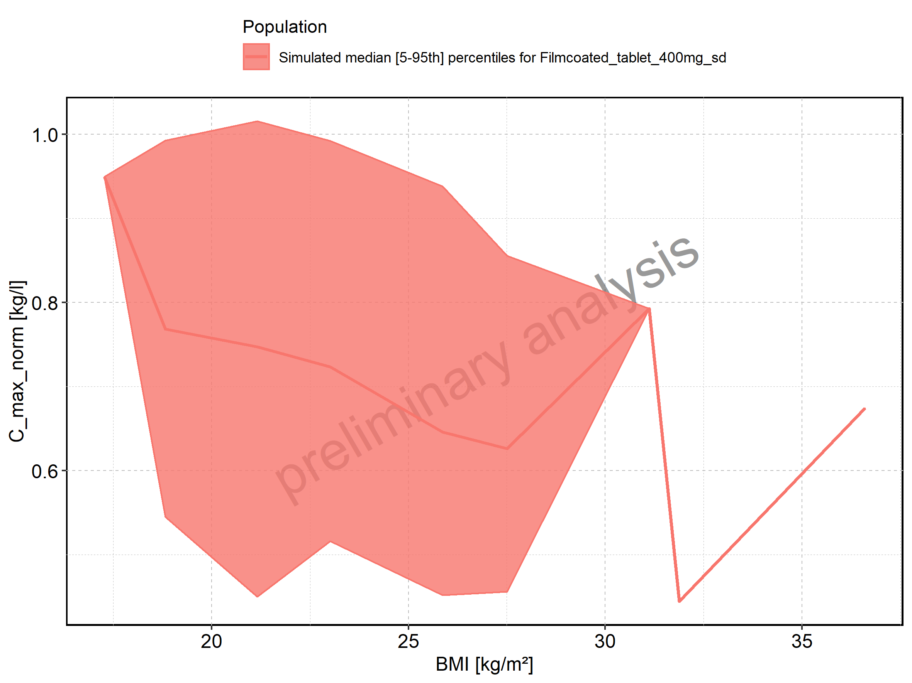

\newpage
Figure 62: BMI-dependence of C_max_norm for Filmcoated_tablet_400mg_sd. Profiles are plotted in a logarithmic scale.

\newpage
Figure 63: t_max of Raltegravir shown as box-whisker plot, which indicates the 5th, 25th, 50th, 75th, and 95th percentiles in linear scale.

-t_max.png)

|Population                        |   N| 5th percentile| 25th percentile| 50th percentile| 75th percentile| 95th percentile|   mean| standard deviation|  geo mean| geo standard deviation|
|:---------------------------------|---:|--------------:|---------------:|---------------:|---------------:|---------------:|------:|------------------:|---------:|----------------------:|
|Larson 2013 8y-18y 400mg FCT meal | 500|         0.9975|             2.0|             2.5|          3.0500|               4| 2.5419|          0.8782893| 2.3720858|               1.485027|
|Filmcoated_tablet_400mg_sd        | 100|         0.5000|             0.6|             0.7|          0.8125|               1| 0.7290|          0.1516209| 0.7135402|               1.232465|

\newpage
Figure 64: t_max of Raltegravir shown as box-whisker plot, which indicates the 5th, 25th, 50th, 75th, and 95th percentiles in logarithmic scale.

-t_max-log.png)

\newpage
Figure 65: Age-dependence of t_max for Larson 2013 8y-18y 400mg FCT meal in comparison to Filmcoated_tablet_400mg_sd. Profiles are plotted in a linear scale.

\newpage
Figure 66: Age-dependence of t_max for Larson 2013 8y-18y 400mg FCT meal in comparison to Filmcoated_tablet_400mg_sd. Profiles are plotted in a logarithmic scale.

\newpage
Figure 67: Age-dependence of t_max for Larson 2013 8y-18y 400mg FCT meal. Profiles are plotted in a linear scale.

\newpage
Figure 68: Age-dependence of t_max for Larson 2013 8y-18y 400mg FCT meal. Profiles are plotted in a logarithmic scale.

\newpage
Figure 69: Age-dependence of t_max for Filmcoated_tablet_400mg_sd. Profiles are plotted in a linear scale.

\newpage
Figure 70: Age-dependence of t_max for Filmcoated_tablet_400mg_sd. Profiles are plotted in a logarithmic scale.

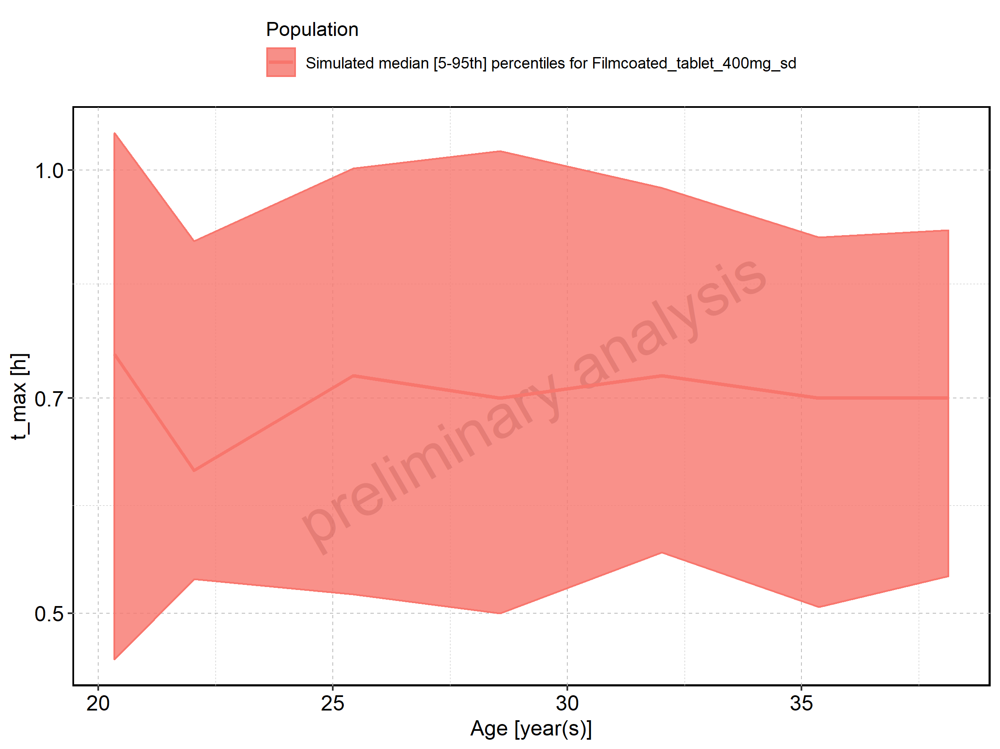

\newpage
Figure 71: Height-dependence of t_max for Larson 2013 8y-18y 400mg FCT meal in comparison to Filmcoated_tablet_400mg_sd. Profiles are plotted in a linear scale.

\newpage
Figure 72: Height-dependence of t_max for Larson 2013 8y-18y 400mg FCT meal in comparison to Filmcoated_tablet_400mg_sd. Profiles are plotted in a logarithmic scale.

\newpage
Figure 73: Height-dependence of t_max for Larson 2013 8y-18y 400mg FCT meal. Profiles are plotted in a linear scale.

\newpage
Figure 74: Height-dependence of t_max for Larson 2013 8y-18y 400mg FCT meal. Profiles are plotted in a logarithmic scale.

\newpage
Figure 75: Height-dependence of t_max for Filmcoated_tablet_400mg_sd. Profiles are plotted in a linear scale.

\newpage
Figure 76: Height-dependence of t_max for Filmcoated_tablet_400mg_sd. Profiles are plotted in a logarithmic scale.

\newpage
Figure 77: Weight-dependence of t_max for Larson 2013 8y-18y 400mg FCT meal in comparison to Filmcoated_tablet_400mg_sd. Profiles are plotted in a linear scale.

\newpage
Figure 78: Weight-dependence of t_max for Larson 2013 8y-18y 400mg FCT meal in comparison to Filmcoated_tablet_400mg_sd. Profiles are plotted in a logarithmic scale.

\newpage
Figure 79: Weight-dependence of t_max for Larson 2013 8y-18y 400mg FCT meal. Profiles are plotted in a linear scale.

\newpage
Figure 80: Weight-dependence of t_max for Larson 2013 8y-18y 400mg FCT meal. Profiles are plotted in a logarithmic scale.

\newpage
Figure 81: Weight-dependence of t_max for Filmcoated_tablet_400mg_sd. Profiles are plotted in a linear scale.

\newpage
Figure 82: Weight-dependence of t_max for Filmcoated_tablet_400mg_sd. Profiles are plotted in a logarithmic scale.

\newpage
Figure 83: BMI-dependence of t_max for Larson 2013 8y-18y 400mg FCT meal in comparison to Filmcoated_tablet_400mg_sd. Profiles are plotted in a linear scale.

\newpage
Figure 84: BMI-dependence of t_max for Larson 2013 8y-18y 400mg FCT meal in comparison to Filmcoated_tablet_400mg_sd. Profiles are plotted in a logarithmic scale.

\newpage
Figure 85: BMI-dependence of t_max for Larson 2013 8y-18y 400mg FCT meal. Profiles are plotted in a linear scale.

\newpage
Figure 86: BMI-dependence of t_max for Larson 2013 8y-18y 400mg FCT meal. Profiles are plotted in a logarithmic scale.

\newpage
Figure 87: BMI-dependence of t_max for Filmcoated_tablet_400mg_sd. Profiles are plotted in a linear scale.

\newpage
Figure 88: BMI-dependence of t_max for Filmcoated_tablet_400mg_sd. Profiles are plotted in a logarithmic scale.

\newpage
Figure 89: C_tEnd of Raltegravir shown as box-whisker plot, which indicates the 5th, 25th, 50th, 75th, and 95th percentiles in linear scale.

-C_tEnd.png)

|Population                        |   N| 5th percentile| 25th percentile| 50th percentile| 75th percentile| 95th percentile|      mean| standard deviation|  geo mean| geo standard deviation|
|:---------------------------------|---:|--------------:|---------------:|---------------:|---------------:|---------------:|---------:|------------------:|---------:|----------------------:|
|Larson 2013 8y-18y 400mg FCT meal | 500|       86.63046|       133.65437|       189.56204|       263.51260|       448.02293| 218.90336|          129.11620| 191.12211|               1.666367|
|Filmcoated_tablet_400mg_sd        | 100|       19.57484|        25.79622|        32.34815|        41.91365|        62.67601|  35.38577|           14.20645|  33.01047|               1.444113|

\newpage
Figure 90: C_tEnd of Raltegravir shown as box-whisker plot, which indicates the 5th, 25th, 50th, 75th, and 95th percentiles in logarithmic scale.

-C_tEnd-log.png)

\newpage
Figure 91: Age-dependence of C_tEnd for Larson 2013 8y-18y 400mg FCT meal in comparison to Filmcoated_tablet_400mg_sd. Profiles are plotted in a linear scale.

\newpage
Figure 92: Age-dependence of C_tEnd for Larson 2013 8y-18y 400mg FCT meal in comparison to Filmcoated_tablet_400mg_sd. Profiles are plotted in a logarithmic scale.

\newpage
Figure 93: Age-dependence of C_tEnd for Larson 2013 8y-18y 400mg FCT meal. Profiles are plotted in a linear scale.

\newpage
Figure 94: Age-dependence of C_tEnd for Larson 2013 8y-18y 400mg FCT meal. Profiles are plotted in a logarithmic scale.

\newpage
Figure 95: Age-dependence of C_tEnd for Filmcoated_tablet_400mg_sd. Profiles are plotted in a linear scale.

\newpage
Figure 96: Age-dependence of C_tEnd for Filmcoated_tablet_400mg_sd. Profiles are plotted in a logarithmic scale.

\newpage
Figure 97: Height-dependence of C_tEnd for Larson 2013 8y-18y 400mg FCT meal in comparison to Filmcoated_tablet_400mg_sd. Profiles are plotted in a linear scale.

\newpage
Figure 98: Height-dependence of C_tEnd for Larson 2013 8y-18y 400mg FCT meal in comparison to Filmcoated_tablet_400mg_sd. Profiles are plotted in a logarithmic scale.

\newpage
Figure 99: Height-dependence of C_tEnd for Larson 2013 8y-18y 400mg FCT meal. Profiles are plotted in a linear scale.

\newpage
Figure 100: Height-dependence of C_tEnd for Larson 2013 8y-18y 400mg FCT meal. Profiles are plotted in a logarithmic scale.

\newpage
Figure 101: Height-dependence of C_tEnd for Filmcoated_tablet_400mg_sd. Profiles are plotted in a linear scale.

\newpage
Figure 102: Height-dependence of C_tEnd for Filmcoated_tablet_400mg_sd. Profiles are plotted in a logarithmic scale.

\newpage
Figure 103: Weight-dependence of C_tEnd for Larson 2013 8y-18y 400mg FCT meal in comparison to Filmcoated_tablet_400mg_sd. Profiles are plotted in a linear scale.

\newpage
Figure 104: Weight-dependence of C_tEnd for Larson 2013 8y-18y 400mg FCT meal in comparison to Filmcoated_tablet_400mg_sd. Profiles are plotted in a logarithmic scale.

\newpage
Figure 105: Weight-dependence of C_tEnd for Larson 2013 8y-18y 400mg FCT meal. Profiles are plotted in a linear scale.

\newpage
Figure 106: Weight-dependence of C_tEnd for Larson 2013 8y-18y 400mg FCT meal. Profiles are plotted in a logarithmic scale.

\newpage
Figure 107: Weight-dependence of C_tEnd for Filmcoated_tablet_400mg_sd. Profiles are plotted in a linear scale.

\newpage
Figure 108: Weight-dependence of C_tEnd for Filmcoated_tablet_400mg_sd. Profiles are plotted in a logarithmic scale.

\newpage
Figure 109: BMI-dependence of C_tEnd for Larson 2013 8y-18y 400mg FCT meal in comparison to Filmcoated_tablet_400mg_sd. Profiles are plotted in a linear scale.

\newpage
Figure 110: BMI-dependence of C_tEnd for Larson 2013 8y-18y 400mg FCT meal in comparison to Filmcoated_tablet_400mg_sd. Profiles are plotted in a logarithmic scale.

\newpage
Figure 111: BMI-dependence of C_tEnd for Larson 2013 8y-18y 400mg FCT meal. Profiles are plotted in a linear scale.

\newpage
Figure 112: BMI-dependence of C_tEnd for Larson 2013 8y-18y 400mg FCT meal. Profiles are plotted in a logarithmic scale.

\newpage
Figure 113: BMI-dependence of C_tEnd for Filmcoated_tablet_400mg_sd. Profiles are plotted in a linear scale.

\newpage
Figure 114: BMI-dependence of C_tEnd for Filmcoated_tablet_400mg_sd. Profiles are plotted in a logarithmic scale.

\newpage
Figure 115: AUC of Raltegravir shown as box-whisker plot, which indicates the 5th, 25th, 50th, 75th, and 95th percentiles in linear scale.

-AUC_tEnd.png)

|Population                        |   N| 5th percentile| 25th percentile| 50th percentile| 75th percentile| 95th percentile|     mean| standard deviation|  geo mean| geo standard deviation|
|:---------------------------------|---:|--------------:|---------------:|---------------:|---------------:|---------------:|--------:|------------------:|---------:|----------------------:|
|Larson 2013 8y-18y 400mg FCT meal | 500|       7207.278|        9378.917|       11615.203|        14388.95|        19343.09| 12199.86|           3756.553| 11656.084|               1.353277|
|Filmcoated_tablet_400mg_sd        | 100|       6449.274|        8248.740|        9637.507|        11717.01|        14901.11| 10129.70|           2672.292|  9784.558|               1.305605|

\newpage
Figure 116: AUC of Raltegravir shown as box-whisker plot, which indicates the 5th, 25th, 50th, 75th, and 95th percentiles in logarithmic scale.

-AUC_tEnd-log.png)

\newpage
Figure 117: Age-dependence of AUC for Larson 2013 8y-18y 400mg FCT meal in comparison to Filmcoated_tablet_400mg_sd. Profiles are plotted in a linear scale.

\newpage
Figure 118: Age-dependence of AUC for Larson 2013 8y-18y 400mg FCT meal in comparison to Filmcoated_tablet_400mg_sd. Profiles are plotted in a logarithmic scale.

\newpage
Figure 119: Age-dependence of AUC for Larson 2013 8y-18y 400mg FCT meal. Profiles are plotted in a linear scale.

\newpage
Figure 120: Age-dependence of AUC for Larson 2013 8y-18y 400mg FCT meal. Profiles are plotted in a logarithmic scale.

\newpage
Figure 121: Age-dependence of AUC for Filmcoated_tablet_400mg_sd. Profiles are plotted in a linear scale.

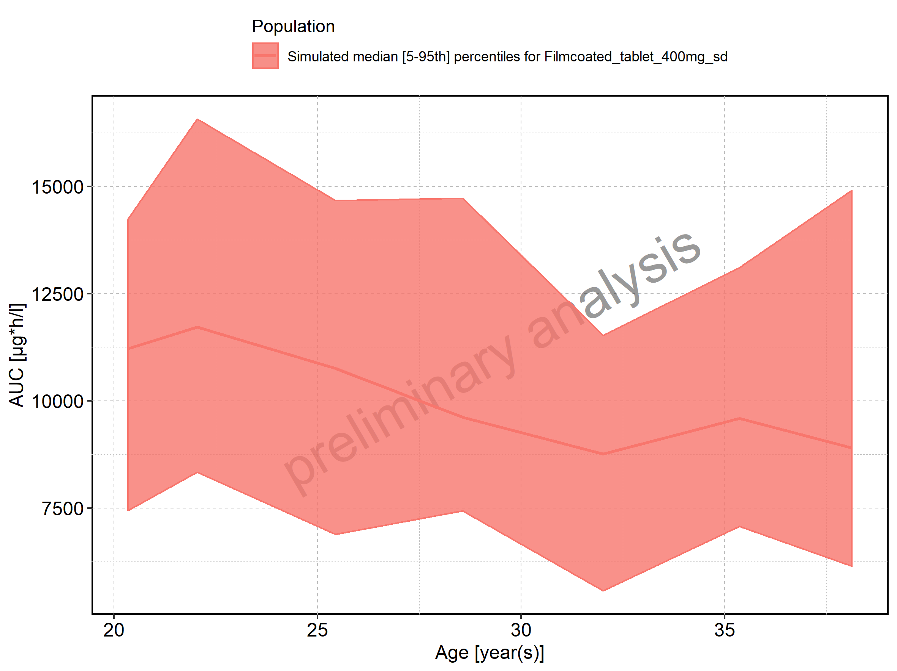

\newpage
Figure 122: Age-dependence of AUC for Filmcoated_tablet_400mg_sd. Profiles are plotted in a logarithmic scale.

\newpage
Figure 123: Height-dependence of AUC for Larson 2013 8y-18y 400mg FCT meal in comparison to Filmcoated_tablet_400mg_sd. Profiles are plotted in a linear scale.

\newpage
Figure 124: Height-dependence of AUC for Larson 2013 8y-18y 400mg FCT meal in comparison to Filmcoated_tablet_400mg_sd. Profiles are plotted in a logarithmic scale.

\newpage
Figure 125: Height-dependence of AUC for Larson 2013 8y-18y 400mg FCT meal. Profiles are plotted in a linear scale.

\newpage
Figure 126: Height-dependence of AUC for Larson 2013 8y-18y 400mg FCT meal. Profiles are plotted in a logarithmic scale.

\newpage
Figure 127: Height-dependence of AUC for Filmcoated_tablet_400mg_sd. Profiles are plotted in a linear scale.

\newpage
Figure 128: Height-dependence of AUC for Filmcoated_tablet_400mg_sd. Profiles are plotted in a logarithmic scale.

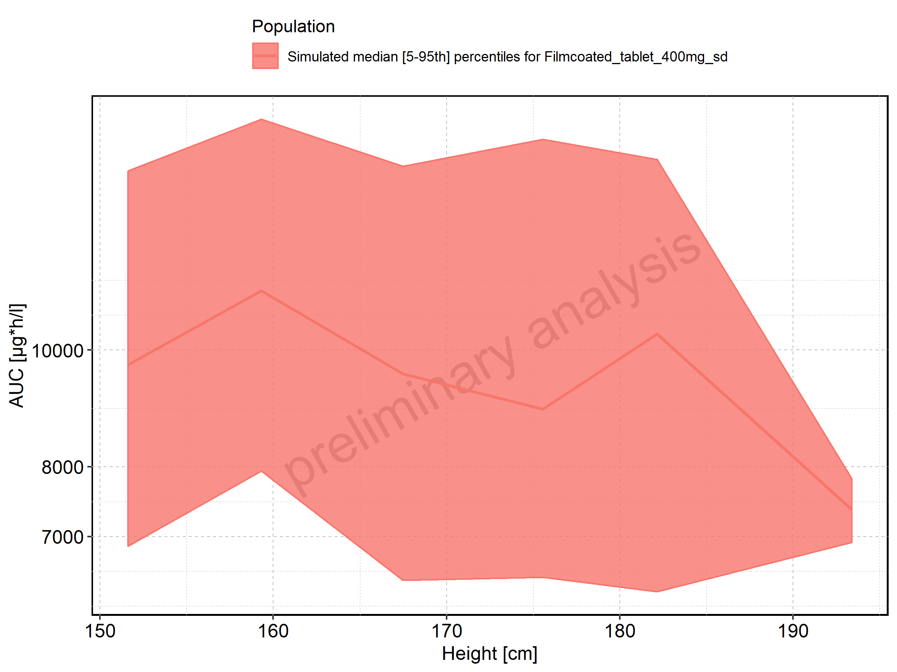

\newpage
Figure 129: Weight-dependence of AUC for Larson 2013 8y-18y 400mg FCT meal in comparison to Filmcoated_tablet_400mg_sd. Profiles are plotted in a linear scale.

\newpage
Figure 130: Weight-dependence of AUC for Larson 2013 8y-18y 400mg FCT meal in comparison to Filmcoated_tablet_400mg_sd. Profiles are plotted in a logarithmic scale.

\newpage
Figure 131: Weight-dependence of AUC for Larson 2013 8y-18y 400mg FCT meal. Profiles are plotted in a linear scale.

\newpage
Figure 132: Weight-dependence of AUC for Larson 2013 8y-18y 400mg FCT meal. Profiles are plotted in a logarithmic scale.

\newpage
Figure 133: Weight-dependence of AUC for Filmcoated_tablet_400mg_sd. Profiles are plotted in a linear scale.

\newpage
Figure 134: Weight-dependence of AUC for Filmcoated_tablet_400mg_sd. Profiles are plotted in a logarithmic scale.

\newpage
Figure 135: BMI-dependence of AUC for Larson 2013 8y-18y 400mg FCT meal in comparison to Filmcoated_tablet_400mg_sd. Profiles are plotted in a linear scale.

\newpage
Figure 136: BMI-dependence of AUC for Larson 2013 8y-18y 400mg FCT meal in comparison to Filmcoated_tablet_400mg_sd. Profiles are plotted in a logarithmic scale.

\newpage
Figure 137: BMI-dependence of AUC for Larson 2013 8y-18y 400mg FCT meal. Profiles are plotted in a linear scale.

\newpage
Figure 138: BMI-dependence of AUC for Larson 2013 8y-18y 400mg FCT meal. Profiles are plotted in a logarithmic scale.

\newpage
Figure 139: BMI-dependence of AUC for Filmcoated_tablet_400mg_sd. Profiles are plotted in a linear scale.

\newpage
Figure 140: BMI-dependence of AUC for Filmcoated_tablet_400mg_sd. Profiles are plotted in a logarithmic scale.

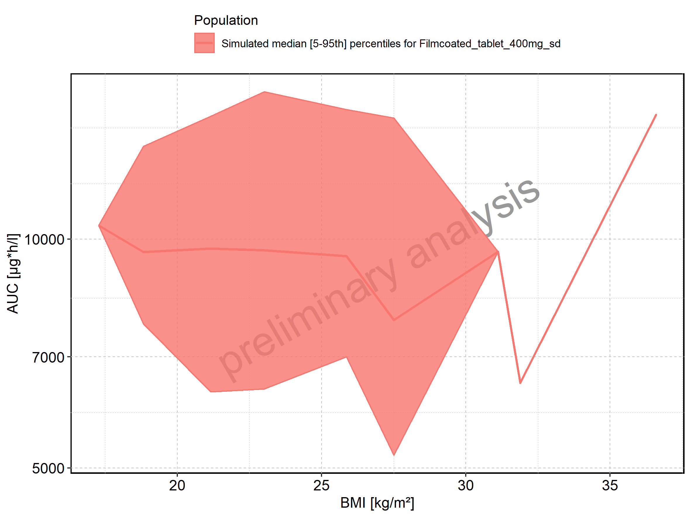

\newpage
Figure 141: AUC_norm of Raltegravir shown as box-whisker plot, which indicates the 5th, 25th, 50th, 75th, and 95th percentiles in linear scale.

-AUC_tEnd_norm.png)

|Population                        |   N| 5th percentile| 25th percentile| 50th percentile| 75th percentile| 95th percentile|     mean| standard deviation| geo mean| geo standard deviation|
|:---------------------------------|---:|--------------:|---------------:|---------------:|---------------:|---------------:|--------:|------------------:|--------:|----------------------:|
|Larson 2013 8y-18y 400mg FCT meal | 500|       1.009019|        1.313048|        1.626128|        2.014453|        2.708033| 1.707981|          0.5259174| 1.631852|               1.353277|
|Filmcoated_tablet_400mg_sd        | 100|       1.176993|        1.505395|        1.758845|        2.138354|        2.719452| 1.848670|          0.4876933| 1.785682|               1.305605|

\newpage
Figure 142: AUC_norm of Raltegravir shown as box-whisker plot, which indicates the 5th, 25th, 50th, 75th, and 95th percentiles in logarithmic scale.

-AUC_tEnd_norm-log.png)

\newpage
Figure 143: Age-dependence of AUC_norm for Larson 2013 8y-18y 400mg FCT meal in comparison to Filmcoated_tablet_400mg_sd. Profiles are plotted in a linear scale.

\newpage
Figure 144: Age-dependence of AUC_norm for Larson 2013 8y-18y 400mg FCT meal in comparison to Filmcoated_tablet_400mg_sd. Profiles are plotted in a logarithmic scale.

\newpage
Figure 145: Age-dependence of AUC_norm for Larson 2013 8y-18y 400mg FCT meal. Profiles are plotted in a linear scale.

\newpage
Figure 146: Age-dependence of AUC_norm for Larson 2013 8y-18y 400mg FCT meal. Profiles are plotted in a logarithmic scale.

\newpage
Figure 147: Age-dependence of AUC_norm for Filmcoated_tablet_400mg_sd. Profiles are plotted in a linear scale.

\newpage
Figure 148: Age-dependence of AUC_norm for Filmcoated_tablet_400mg_sd. Profiles are plotted in a logarithmic scale.

\newpage
Figure 149: Height-dependence of AUC_norm for Larson 2013 8y-18y 400mg FCT meal in comparison to Filmcoated_tablet_400mg_sd. Profiles are plotted in a linear scale.

\newpage
Figure 150: Height-dependence of AUC_norm for Larson 2013 8y-18y 400mg FCT meal in comparison to Filmcoated_tablet_400mg_sd. Profiles are plotted in a logarithmic scale.

\newpage
Figure 151: Height-dependence of AUC_norm for Larson 2013 8y-18y 400mg FCT meal. Profiles are plotted in a linear scale.

\newpage
Figure 152: Height-dependence of AUC_norm for Larson 2013 8y-18y 400mg FCT meal. Profiles are plotted in a logarithmic scale.

\newpage
Figure 153: Height-dependence of AUC_norm for Filmcoated_tablet_400mg_sd. Profiles are plotted in a linear scale.

\newpage
Figure 154: Height-dependence of AUC_norm for Filmcoated_tablet_400mg_sd. Profiles are plotted in a logarithmic scale.

\newpage
Figure 155: Weight-dependence of AUC_norm for Larson 2013 8y-18y 400mg FCT meal in comparison to Filmcoated_tablet_400mg_sd. Profiles are plotted in a linear scale.

\newpage
Figure 156: Weight-dependence of AUC_norm for Larson 2013 8y-18y 400mg FCT meal in comparison to Filmcoated_tablet_400mg_sd. Profiles are plotted in a logarithmic scale.

\newpage
Figure 157: Weight-dependence of AUC_norm for Larson 2013 8y-18y 400mg FCT meal. Profiles are plotted in a linear scale.

\newpage
Figure 158: Weight-dependence of AUC_norm for Larson 2013 8y-18y 400mg FCT meal. Profiles are plotted in a logarithmic scale.

\newpage
Figure 159: Weight-dependence of AUC_norm for Filmcoated_tablet_400mg_sd. Profiles are plotted in a linear scale.

\newpage
Figure 160: Weight-dependence of AUC_norm for Filmcoated_tablet_400mg_sd. Profiles are plotted in a logarithmic scale.

\newpage
Figure 161: BMI-dependence of AUC_norm for Larson 2013 8y-18y 400mg FCT meal in comparison to Filmcoated_tablet_400mg_sd. Profiles are plotted in a linear scale.

\newpage
Figure 162: BMI-dependence of AUC_norm for Larson 2013 8y-18y 400mg FCT meal in comparison to Filmcoated_tablet_400mg_sd. Profiles are plotted in a logarithmic scale.

\newpage
Figure 163: BMI-dependence of AUC_norm for Larson 2013 8y-18y 400mg FCT meal. Profiles are plotted in a linear scale.

\newpage
Figure 164: BMI-dependence of AUC_norm for Larson 2013 8y-18y 400mg FCT meal. Profiles are plotted in a logarithmic scale.

\newpage
Figure 165: BMI-dependence of AUC_norm for Filmcoated_tablet_400mg_sd. Profiles are plotted in a linear scale.

\newpage
Figure 166: BMI-dependence of AUC_norm for Filmcoated_tablet_400mg_sd. Profiles are plotted in a logarithmic scale.

\newpage
Figure 167: AUC_inf of Raltegravir shown as box-whisker plot, which indicates the 5th, 25th, 50th, 75th, and 95th percentiles in linear scale.

-AUC_inf.png)

|Population                        |   N| 5th percentile| 25th percentile| 50th percentile| 75th percentile| 95th percentile|     mean| standard deviation| geo mean| geo standard deviation|
|:---------------------------------|---:|--------------:|---------------:|---------------:|---------------:|---------------:|--------:|------------------:|--------:|----------------------:|
|Larson 2013 8y-18y 400mg FCT meal | 500|       8017.563|       10533.549|        12921.04|        15892.62|        21707.95| 13652.18|           4460.216|     0.00|                     NA|
|Filmcoated_tablet_400mg_sd        | 100|       6771.970|        8875.702|        10112.32|        12229.14|        15523.15| 10626.71|           2757.612| 10275.45|               1.300506|

\newpage
Figure 168: AUC_inf of Raltegravir shown as box-whisker plot, which indicates the 5th, 25th, 50th, 75th, and 95th percentiles in logarithmic scale.

-AUC_inf-log.png)

\newpage
Figure 169: Age-dependence of AUC_inf for Larson 2013 8y-18y 400mg FCT meal in comparison to Filmcoated_tablet_400mg_sd. Profiles are plotted in a linear scale.

\newpage
Figure 170: Age-dependence of AUC_inf for Larson 2013 8y-18y 400mg FCT meal in comparison to Filmcoated_tablet_400mg_sd. Profiles are plotted in a logarithmic scale.

\newpage
Figure 171: Age-dependence of AUC_inf for Larson 2013 8y-18y 400mg FCT meal. Profiles are plotted in a linear scale.

\newpage
Figure 172: Age-dependence of AUC_inf for Larson 2013 8y-18y 400mg FCT meal. Profiles are plotted in a logarithmic scale.

\newpage
Figure 173: Age-dependence of AUC_inf for Filmcoated_tablet_400mg_sd. Profiles are plotted in a linear scale.

\newpage
Figure 174: Age-dependence of AUC_inf for Filmcoated_tablet_400mg_sd. Profiles are plotted in a logarithmic scale.

\newpage
Figure 175: Height-dependence of AUC_inf for Larson 2013 8y-18y 400mg FCT meal in comparison to Filmcoated_tablet_400mg_sd. Profiles are plotted in a linear scale.

\newpage
Figure 176: Height-dependence of AUC_inf for Larson 2013 8y-18y 400mg FCT meal in comparison to Filmcoated_tablet_400mg_sd. Profiles are plotted in a logarithmic scale.

\newpage
Figure 177: Height-dependence of AUC_inf for Larson 2013 8y-18y 400mg FCT meal. Profiles are plotted in a linear scale.

\newpage
Figure 178: Height-dependence of AUC_inf for Larson 2013 8y-18y 400mg FCT meal. Profiles are plotted in a logarithmic scale.

\newpage
Figure 179: Height-dependence of AUC_inf for Filmcoated_tablet_400mg_sd. Profiles are plotted in a linear scale.

\newpage
Figure 180: Height-dependence of AUC_inf for Filmcoated_tablet_400mg_sd. Profiles are plotted in a logarithmic scale.

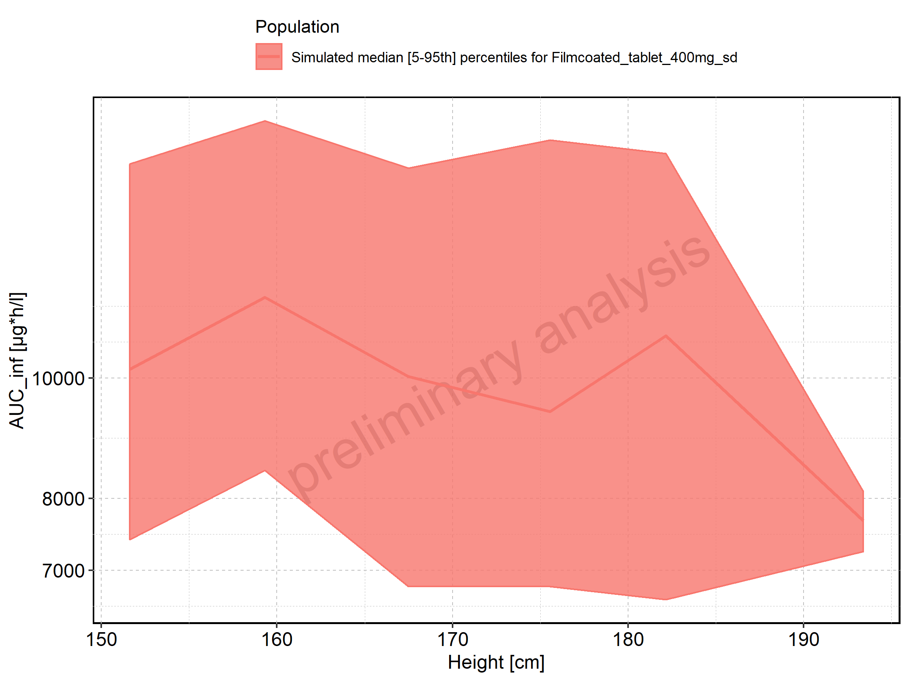

\newpage
Figure 181: Weight-dependence of AUC_inf for Larson 2013 8y-18y 400mg FCT meal in comparison to Filmcoated_tablet_400mg_sd. Profiles are plotted in a linear scale.

\newpage
Figure 182: Weight-dependence of AUC_inf for Larson 2013 8y-18y 400mg FCT meal in comparison to Filmcoated_tablet_400mg_sd. Profiles are plotted in a logarithmic scale.

\newpage
Figure 183: Weight-dependence of AUC_inf for Larson 2013 8y-18y 400mg FCT meal. Profiles are plotted in a linear scale.

\newpage
Figure 184: Weight-dependence of AUC_inf for Larson 2013 8y-18y 400mg FCT meal. Profiles are plotted in a logarithmic scale.

\newpage
Figure 185: Weight-dependence of AUC_inf for Filmcoated_tablet_400mg_sd. Profiles are plotted in a linear scale.

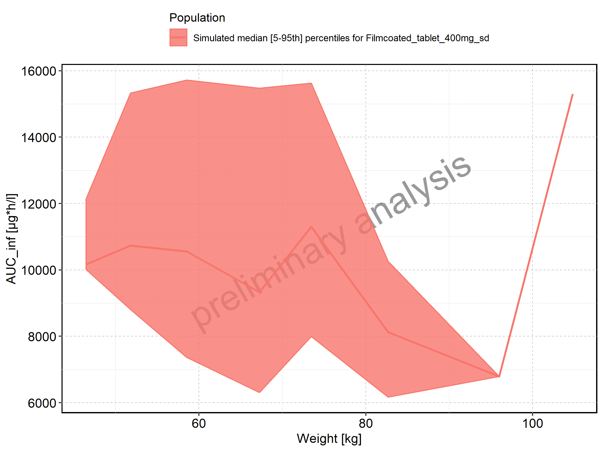

\newpage
Figure 186: Weight-dependence of AUC_inf for Filmcoated_tablet_400mg_sd. Profiles are plotted in a logarithmic scale.

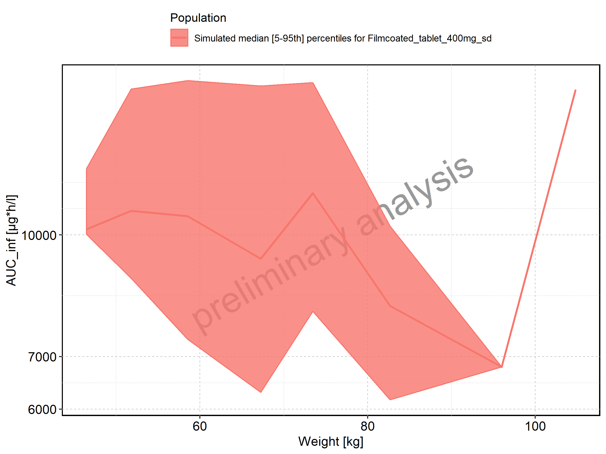

\newpage
Figure 187: BMI-dependence of AUC_inf for Larson 2013 8y-18y 400mg FCT meal in comparison to Filmcoated_tablet_400mg_sd. Profiles are plotted in a linear scale.

\newpage
Figure 188: BMI-dependence of AUC_inf for Larson 2013 8y-18y 400mg FCT meal in comparison to Filmcoated_tablet_400mg_sd. Profiles are plotted in a logarithmic scale.

\newpage
Figure 189: BMI-dependence of AUC_inf for Larson 2013 8y-18y 400mg FCT meal. Profiles are plotted in a linear scale.

\newpage
Figure 190: BMI-dependence of AUC_inf for Larson 2013 8y-18y 400mg FCT meal. Profiles are plotted in a logarithmic scale.

\newpage
Figure 191: BMI-dependence of AUC_inf for Filmcoated_tablet_400mg_sd. Profiles are plotted in a linear scale.

\newpage
Figure 192: BMI-dependence of AUC_inf for Filmcoated_tablet_400mg_sd. Profiles are plotted in a logarithmic scale.

\newpage
Figure 193: AUC_inf_norm of Raltegravir shown as box-whisker plot, which indicates the 5th, 25th, 50th, 75th, and 95th percentiles in linear scale.

-AUC_inf_norm.png)

|Population                        |   N| 5th percentile| 25th percentile| 50th percentile| 75th percentile| 95th percentile|     mean| standard deviation| geo mean| geo standard deviation|
|:---------------------------------|---:|--------------:|---------------:|---------------:|---------------:|---------------:|--------:|------------------:|--------:|----------------------:|
|Larson 2013 8y-18y 400mg FCT meal | 500|       1.122459|        1.474697|        1.808946|        2.224966|        3.039113| 1.911306|          0.6244302| 0.000000|                     NA|
|Filmcoated_tablet_400mg_sd        | 100|       1.235885|        1.619816|        1.845499|        2.231818|        2.832975| 1.939375|          0.5032642| 1.875269|               1.300506|

\newpage
Figure 194: AUC_inf_norm of Raltegravir shown as box-whisker plot, which indicates the 5th, 25th, 50th, 75th, and 95th percentiles in logarithmic scale.

-AUC_inf_norm-log.png)

\newpage
Figure 195: Age-dependence of AUC_inf_norm for Larson 2013 8y-18y 400mg FCT meal in comparison to Filmcoated_tablet_400mg_sd. Profiles are plotted in a linear scale.

\newpage
Figure 196: Age-dependence of AUC_inf_norm for Larson 2013 8y-18y 400mg FCT meal in comparison to Filmcoated_tablet_400mg_sd. Profiles are plotted in a logarithmic scale.

\newpage
Figure 197: Age-dependence of AUC_inf_norm for Larson 2013 8y-18y 400mg FCT meal. Profiles are plotted in a linear scale.

\newpage
Figure 198: Age-dependence of AUC_inf_norm for Larson 2013 8y-18y 400mg FCT meal. Profiles are plotted in a logarithmic scale.

\newpage
Figure 199: Age-dependence of AUC_inf_norm for Filmcoated_tablet_400mg_sd. Profiles are plotted in a linear scale.

\newpage
Figure 200: Age-dependence of AUC_inf_norm for Filmcoated_tablet_400mg_sd. Profiles are plotted in a logarithmic scale.

\newpage
Figure 201: Height-dependence of AUC_inf_norm for Larson 2013 8y-18y 400mg FCT meal in comparison to Filmcoated_tablet_400mg_sd. Profiles are plotted in a linear scale.

\newpage
Figure 202: Height-dependence of AUC_inf_norm for Larson 2013 8y-18y 400mg FCT meal in comparison to Filmcoated_tablet_400mg_sd. Profiles are plotted in a logarithmic scale.

\newpage
Figure 203: Height-dependence of AUC_inf_norm for Larson 2013 8y-18y 400mg FCT meal. Profiles are plotted in a linear scale.

\newpage
Figure 204: Height-dependence of AUC_inf_norm for Larson 2013 8y-18y 400mg FCT meal. Profiles are plotted in a logarithmic scale.

\newpage
Figure 205: Height-dependence of AUC_inf_norm for Filmcoated_tablet_400mg_sd. Profiles are plotted in a linear scale.

\newpage
Figure 206: Height-dependence of AUC_inf_norm for Filmcoated_tablet_400mg_sd. Profiles are plotted in a logarithmic scale.

\newpage
Figure 207: Weight-dependence of AUC_inf_norm for Larson 2013 8y-18y 400mg FCT meal in comparison to Filmcoated_tablet_400mg_sd. Profiles are plotted in a linear scale.

\newpage
Figure 208: Weight-dependence of AUC_inf_norm for Larson 2013 8y-18y 400mg FCT meal in comparison to Filmcoated_tablet_400mg_sd. Profiles are plotted in a logarithmic scale.

\newpage
Figure 209: Weight-dependence of AUC_inf_norm for Larson 2013 8y-18y 400mg FCT meal. Profiles are plotted in a linear scale.

\newpage
Figure 210: Weight-dependence of AUC_inf_norm for Larson 2013 8y-18y 400mg FCT meal. Profiles are plotted in a logarithmic scale.

\newpage
Figure 211: Weight-dependence of AUC_inf_norm for Filmcoated_tablet_400mg_sd. Profiles are plotted in a linear scale.

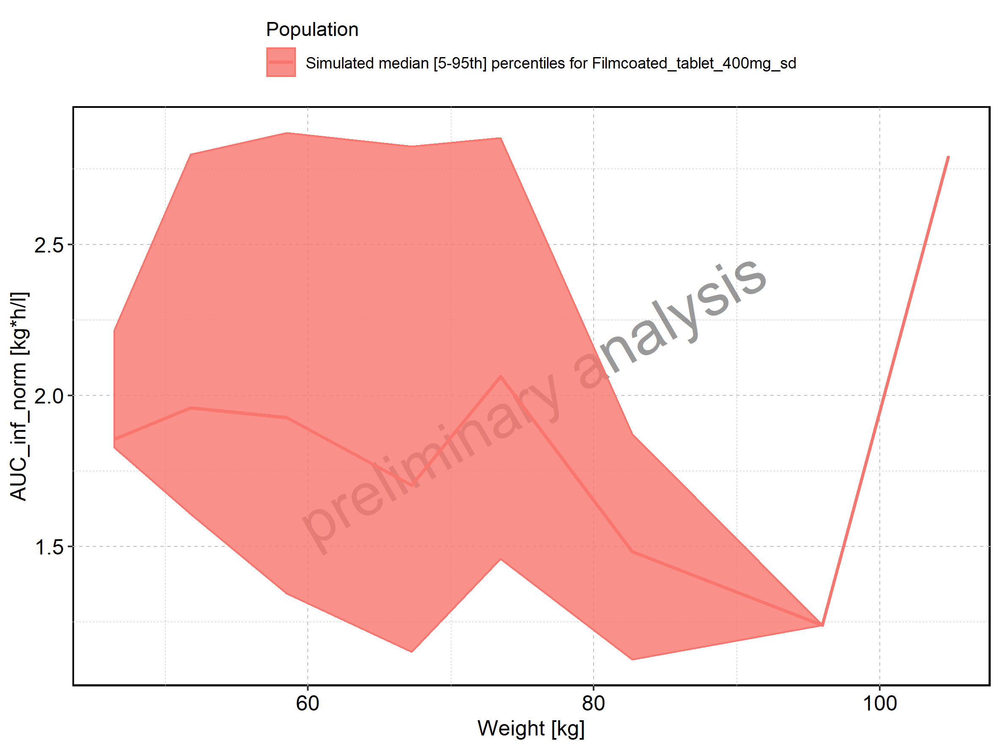

\newpage
Figure 212: Weight-dependence of AUC_inf_norm for Filmcoated_tablet_400mg_sd. Profiles are plotted in a logarithmic scale.

\newpage
Figure 213: BMI-dependence of AUC_inf_norm for Larson 2013 8y-18y 400mg FCT meal in comparison to Filmcoated_tablet_400mg_sd. Profiles are plotted in a linear scale.

\newpage
Figure 214: BMI-dependence of AUC_inf_norm for Larson 2013 8y-18y 400mg FCT meal in comparison to Filmcoated_tablet_400mg_sd. Profiles are plotted in a logarithmic scale.

\newpage
Figure 215: BMI-dependence of AUC_inf_norm for Larson 2013 8y-18y 400mg FCT meal. Profiles are plotted in a linear scale.

\newpage
Figure 216: BMI-dependence of AUC_inf_norm for Larson 2013 8y-18y 400mg FCT meal. Profiles are plotted in a logarithmic scale.

\newpage
Figure 217: BMI-dependence of AUC_inf_norm for Filmcoated_tablet_400mg_sd. Profiles are plotted in a linear scale.

\newpage
Figure 218: BMI-dependence of AUC_inf_norm for Filmcoated_tablet_400mg_sd. Profiles are plotted in a logarithmic scale.

\newpage
Figure 219: MRT of Raltegravir shown as box-whisker plot, which indicates the 5th, 25th, 50th, 75th, and 95th percentiles in linear scale.

-MRT.png)

|Population                        |   N| 5th percentile| 25th percentile| 50th percentile| 75th percentile| 95th percentile|     mean| standard deviation| geo mean| geo standard deviation|
|:---------------------------------|---:|--------------:|---------------:|---------------:|---------------:|---------------:|--------:|------------------:|--------:|----------------------:|
|Larson 2013 8y-18y 400mg FCT meal | 497|       3.883445|        4.609144|        5.323850|        6.221885|       10.309280| 6.263007|           5.564381| 5.638136|               1.436888|
|Filmcoated_tablet_400mg_sd        | 100|       4.431076|        4.803071|        5.199119|        5.682457|        6.697588| 5.438420|           1.539076| 5.318614|               1.206249|

\newpage
Figure 220: MRT of Raltegravir shown as box-whisker plot, which indicates the 5th, 25th, 50th, 75th, and 95th percentiles in logarithmic scale.

-MRT-log.png)

\newpage
Figure 221: Age-dependence of MRT for Larson 2013 8y-18y 400mg FCT meal in comparison to Filmcoated_tablet_400mg_sd. Profiles are plotted in a linear scale.

\newpage
Figure 222: Age-dependence of MRT for Larson 2013 8y-18y 400mg FCT meal in comparison to Filmcoated_tablet_400mg_sd. Profiles are plotted in a logarithmic scale.

\newpage
Figure 223: Age-dependence of MRT for Larson 2013 8y-18y 400mg FCT meal. Profiles are plotted in a linear scale.

\newpage
Figure 224: Age-dependence of MRT for Larson 2013 8y-18y 400mg FCT meal. Profiles are plotted in a logarithmic scale.

\newpage
Figure 225: Age-dependence of MRT for Filmcoated_tablet_400mg_sd. Profiles are plotted in a linear scale.

\newpage
Figure 226: Age-dependence of MRT for Filmcoated_tablet_400mg_sd. Profiles are plotted in a logarithmic scale.

\newpage
Figure 227: Height-dependence of MRT for Larson 2013 8y-18y 400mg FCT meal in comparison to Filmcoated_tablet_400mg_sd. Profiles are plotted in a linear scale.

\newpage
Figure 228: Height-dependence of MRT for Larson 2013 8y-18y 400mg FCT meal in comparison to Filmcoated_tablet_400mg_sd. Profiles are plotted in a logarithmic scale.

\newpage
Figure 229: Height-dependence of MRT for Larson 2013 8y-18y 400mg FCT meal. Profiles are plotted in a linear scale.

\newpage
Figure 230: Height-dependence of MRT for Larson 2013 8y-18y 400mg FCT meal. Profiles are plotted in a logarithmic scale.

\newpage
Figure 231: Height-dependence of MRT for Filmcoated_tablet_400mg_sd. Profiles are plotted in a linear scale.

\newpage
Figure 232: Height-dependence of MRT for Filmcoated_tablet_400mg_sd. Profiles are plotted in a logarithmic scale.

\newpage
Figure 233: Weight-dependence of MRT for Larson 2013 8y-18y 400mg FCT meal in comparison to Filmcoated_tablet_400mg_sd. Profiles are plotted in a linear scale.

\newpage
Figure 234: Weight-dependence of MRT for Larson 2013 8y-18y 400mg FCT meal in comparison to Filmcoated_tablet_400mg_sd. Profiles are plotted in a logarithmic scale.

\newpage
Figure 235: Weight-dependence of MRT for Larson 2013 8y-18y 400mg FCT meal. Profiles are plotted in a linear scale.

\newpage
Figure 236: Weight-dependence of MRT for Larson 2013 8y-18y 400mg FCT meal. Profiles are plotted in a logarithmic scale.

\newpage
Figure 237: Weight-dependence of MRT for Filmcoated_tablet_400mg_sd. Profiles are plotted in a linear scale.

\newpage
Figure 238: Weight-dependence of MRT for Filmcoated_tablet_400mg_sd. Profiles are plotted in a logarithmic scale.

\newpage
Figure 239: BMI-dependence of MRT for Larson 2013 8y-18y 400mg FCT meal in comparison to Filmcoated_tablet_400mg_sd. Profiles are plotted in a linear scale.

\newpage
Figure 240: BMI-dependence of MRT for Larson 2013 8y-18y 400mg FCT meal in comparison to Filmcoated_tablet_400mg_sd. Profiles are plotted in a logarithmic scale.

\newpage
Figure 241: BMI-dependence of MRT for Larson 2013 8y-18y 400mg FCT meal. Profiles are plotted in a linear scale.

\newpage
Figure 242: BMI-dependence of MRT for Larson 2013 8y-18y 400mg FCT meal. Profiles are plotted in a logarithmic scale.

\newpage
Figure 243: BMI-dependence of MRT for Filmcoated_tablet_400mg_sd. Profiles are plotted in a linear scale.

\newpage
Figure 244: BMI-dependence of MRT for Filmcoated_tablet_400mg_sd. Profiles are plotted in a logarithmic scale.

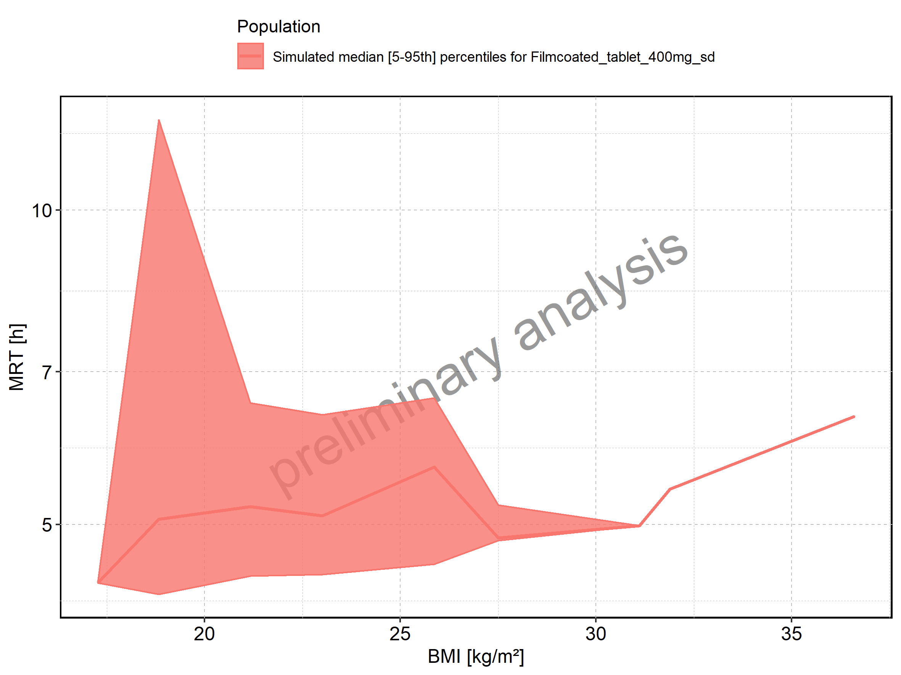

\newpage
Figure 245: Thalf of Raltegravir shown as box-whisker plot, which indicates the 5th, 25th, 50th, 75th, and 95th percentiles in linear scale.

-Thalf.png)

|Population                        |   N| 5th percentile| 25th percentile| 50th percentile| 75th percentile| 95th percentile|     mean| standard deviation| geo mean| geo standard deviation|
|:---------------------------------|---:|--------------:|---------------:|---------------:|---------------:|---------------:|--------:|------------------:|--------:|----------------------:|
|Larson 2013 8y-18y 400mg FCT meal | 500|       2.549721|        3.014632|        3.492033|        4.299532|        9.428484| 3.895486|           10.49435|       NA|                     NA|
|Filmcoated_tablet_400mg_sd        | 100|       5.739979|        8.084065|        9.195944|       11.176013|       16.813811| 9.987299|            3.18254| 9.545373|               1.348088|

\newpage
Figure 246: Thalf of Raltegravir shown as box-whisker plot, which indicates the 5th, 25th, 50th, 75th, and 95th percentiles in logarithmic scale.

-Thalf-log.png)

\newpage
Figure 247: Age-dependence of Thalf for Larson 2013 8y-18y 400mg FCT meal in comparison to Filmcoated_tablet_400mg_sd. Profiles are plotted in a linear scale.

\newpage
Figure 248: Age-dependence of Thalf for Larson 2013 8y-18y 400mg FCT meal in comparison to Filmcoated_tablet_400mg_sd. Profiles are plotted in a logarithmic scale.

\newpage
Figure 249: Age-dependence of Thalf for Larson 2013 8y-18y 400mg FCT meal. Profiles are plotted in a linear scale.

\newpage
Figure 250: Age-dependence of Thalf for Larson 2013 8y-18y 400mg FCT meal. Profiles are plotted in a logarithmic scale.

\newpage
Figure 251: Age-dependence of Thalf for Filmcoated_tablet_400mg_sd. Profiles are plotted in a linear scale.

\newpage
Figure 252: Age-dependence of Thalf for Filmcoated_tablet_400mg_sd. Profiles are plotted in a logarithmic scale.

\newpage
Figure 253: Height-dependence of Thalf for Larson 2013 8y-18y 400mg FCT meal in comparison to Filmcoated_tablet_400mg_sd. Profiles are plotted in a linear scale.

\newpage
Figure 254: Height-dependence of Thalf for Larson 2013 8y-18y 400mg FCT meal in comparison to Filmcoated_tablet_400mg_sd. Profiles are plotted in a logarithmic scale.

\newpage
Figure 255: Height-dependence of Thalf for Larson 2013 8y-18y 400mg FCT meal. Profiles are plotted in a linear scale.

\newpage
Figure 256: Height-dependence of Thalf for Larson 2013 8y-18y 400mg FCT meal. Profiles are plotted in a logarithmic scale.

\newpage
Figure 257: Height-dependence of Thalf for Filmcoated_tablet_400mg_sd. Profiles are plotted in a linear scale.

\newpage
Figure 258: Height-dependence of Thalf for Filmcoated_tablet_400mg_sd. Profiles are plotted in a logarithmic scale.

\newpage
Figure 259: Weight-dependence of Thalf for Larson 2013 8y-18y 400mg FCT meal in comparison to Filmcoated_tablet_400mg_sd. Profiles are plotted in a linear scale.

\newpage
Figure 260: Weight-dependence of Thalf for Larson 2013 8y-18y 400mg FCT meal in comparison to Filmcoated_tablet_400mg_sd. Profiles are plotted in a logarithmic scale.

\newpage
Figure 261: Weight-dependence of Thalf for Larson 2013 8y-18y 400mg FCT meal. Profiles are plotted in a linear scale.

\newpage
Figure 262: Weight-dependence of Thalf for Larson 2013 8y-18y 400mg FCT meal. Profiles are plotted in a logarithmic scale.

\newpage
Figure 263: Weight-dependence of Thalf for Filmcoated_tablet_400mg_sd. Profiles are plotted in a linear scale.

\newpage
Figure 264: Weight-dependence of Thalf for Filmcoated_tablet_400mg_sd. Profiles are plotted in a logarithmic scale.

\newpage
Figure 265: BMI-dependence of Thalf for Larson 2013 8y-18y 400mg FCT meal in comparison to Filmcoated_tablet_400mg_sd. Profiles are plotted in a linear scale.

\newpage
Figure 266: BMI-dependence of Thalf for Larson 2013 8y-18y 400mg FCT meal in comparison to Filmcoated_tablet_400mg_sd. Profiles are plotted in a logarithmic scale.

\newpage
Figure 267: BMI-dependence of Thalf for Larson 2013 8y-18y 400mg FCT meal. Profiles are plotted in a linear scale.

\newpage
Figure 268: BMI-dependence of Thalf for Larson 2013 8y-18y 400mg FCT meal. Profiles are plotted in a logarithmic scale.

\newpage
Figure 269: BMI-dependence of Thalf for Filmcoated_tablet_400mg_sd. Profiles are plotted in a linear scale.

\newpage
Figure 270: BMI-dependence of Thalf for Filmcoated_tablet_400mg_sd. Profiles are plotted in a logarithmic scale.

\newpage
Figure 271: CL of Raltegravir shown as box-whisker plot, which indicates the 5th, 25th, 50th, 75th, and 95th percentiles in linear scale.

-CL.png)

|Population                        |   N| 5th percentile| 25th percentile| 50th percentile| 75th percentile| 95th percentile|     mean| standard deviation| geo mean| geo standard deviation|
|:---------------------------------|---:|--------------:|---------------:|---------------:|---------------:|---------------:|--------:|------------------:|--------:|----------------------:|
|Larson 2013 8y-18y 400mg FCT meal | 497|       5.482107|        7.474607|        9.202990|        11.19313|        14.70885| 9.494905|           2.837542| 9.079491|               1.353166|
|Filmcoated_tablet_400mg_sd        | 100|       5.883098|        7.467935|        9.030982|        10.28982|        13.48808| 9.200767|           2.501942| 8.887614|               1.300506|

\newpage
Figure 272: CL of Raltegravir shown as box-whisker plot, which indicates the 5th, 25th, 50th, 75th, and 95th percentiles in logarithmic scale.

-CL-log.png)

\newpage
Figure 273: Age-dependence of CL for Larson 2013 8y-18y 400mg FCT meal in comparison to Filmcoated_tablet_400mg_sd. Profiles are plotted in a linear scale.

\newpage
Figure 274: Age-dependence of CL for Larson 2013 8y-18y 400mg FCT meal in comparison to Filmcoated_tablet_400mg_sd. Profiles are plotted in a logarithmic scale.

\newpage
Figure 275: Age-dependence of CL for Larson 2013 8y-18y 400mg FCT meal. Profiles are plotted in a linear scale.

\newpage
Figure 276: Age-dependence of CL for Larson 2013 8y-18y 400mg FCT meal. Profiles are plotted in a logarithmic scale.

\newpage
Figure 277: Age-dependence of CL for Filmcoated_tablet_400mg_sd. Profiles are plotted in a linear scale.

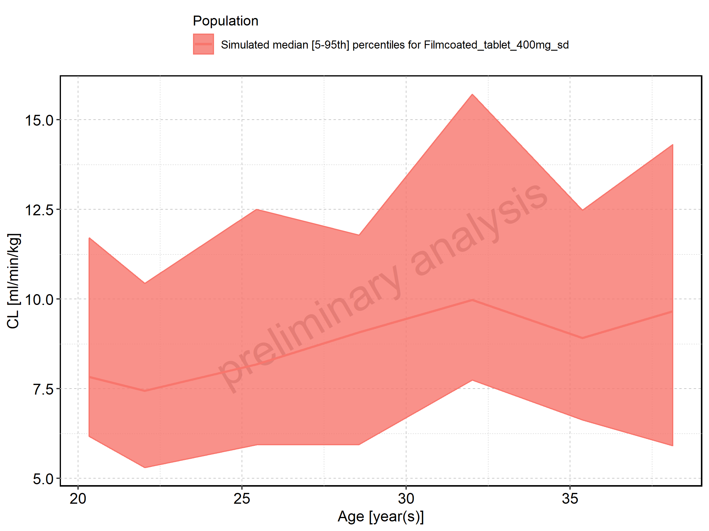

\newpage
Figure 278: Age-dependence of CL for Filmcoated_tablet_400mg_sd. Profiles are plotted in a logarithmic scale.

\newpage
Figure 279: Height-dependence of CL for Larson 2013 8y-18y 400mg FCT meal in comparison to Filmcoated_tablet_400mg_sd. Profiles are plotted in a linear scale.

\newpage
Figure 280: Height-dependence of CL for Larson 2013 8y-18y 400mg FCT meal in comparison to Filmcoated_tablet_400mg_sd. Profiles are plotted in a logarithmic scale.

\newpage
Figure 281: Height-dependence of CL for Larson 2013 8y-18y 400mg FCT meal. Profiles are plotted in a linear scale.

\newpage
Figure 282: Height-dependence of CL for Larson 2013 8y-18y 400mg FCT meal. Profiles are plotted in a logarithmic scale.

\newpage
Figure 283: Height-dependence of CL for Filmcoated_tablet_400mg_sd. Profiles are plotted in a linear scale.

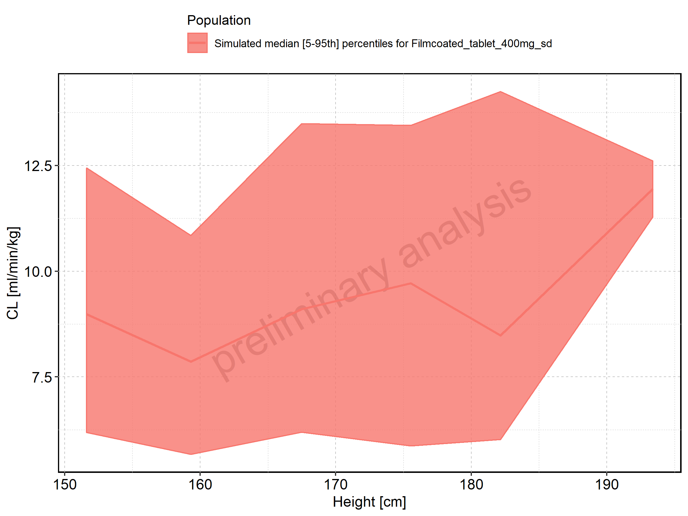

\newpage
Figure 284: Height-dependence of CL for Filmcoated_tablet_400mg_sd. Profiles are plotted in a logarithmic scale.

\newpage
Figure 285: Weight-dependence of CL for Larson 2013 8y-18y 400mg FCT meal in comparison to Filmcoated_tablet_400mg_sd. Profiles are plotted in a linear scale.

\newpage
Figure 286: Weight-dependence of CL for Larson 2013 8y-18y 400mg FCT meal in comparison to Filmcoated_tablet_400mg_sd. Profiles are plotted in a logarithmic scale.

\newpage
Figure 287: Weight-dependence of CL for Larson 2013 8y-18y 400mg FCT meal. Profiles are plotted in a linear scale.

\newpage
Figure 288: Weight-dependence of CL for Larson 2013 8y-18y 400mg FCT meal. Profiles are plotted in a logarithmic scale.

\newpage
Figure 289: Weight-dependence of CL for Filmcoated_tablet_400mg_sd. Profiles are plotted in a linear scale.

\newpage
Figure 290: Weight-dependence of CL for Filmcoated_tablet_400mg_sd. Profiles are plotted in a logarithmic scale.

\newpage
Figure 291: BMI-dependence of CL for Larson 2013 8y-18y 400mg FCT meal in comparison to Filmcoated_tablet_400mg_sd. Profiles are plotted in a linear scale.

\newpage
Figure 292: BMI-dependence of CL for Larson 2013 8y-18y 400mg FCT meal in comparison to Filmcoated_tablet_400mg_sd. Profiles are plotted in a logarithmic scale.

\newpage
Figure 293: BMI-dependence of CL for Larson 2013 8y-18y 400mg FCT meal. Profiles are plotted in a linear scale.

\newpage
Figure 294: BMI-dependence of CL for Larson 2013 8y-18y 400mg FCT meal. Profiles are plotted in a logarithmic scale.

\newpage
Figure 295: BMI-dependence of CL for Filmcoated_tablet_400mg_sd. Profiles are plotted in a linear scale.

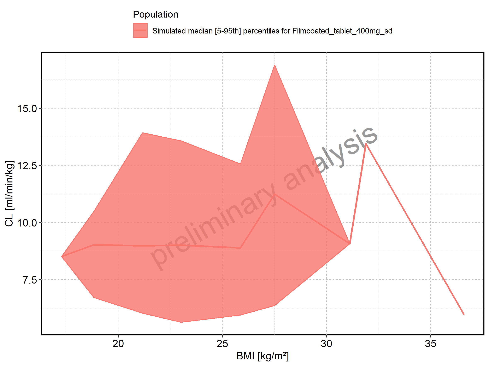

\newpage
Figure 296: BMI-dependence of CL for Filmcoated_tablet_400mg_sd. Profiles are plotted in a logarithmic scale.

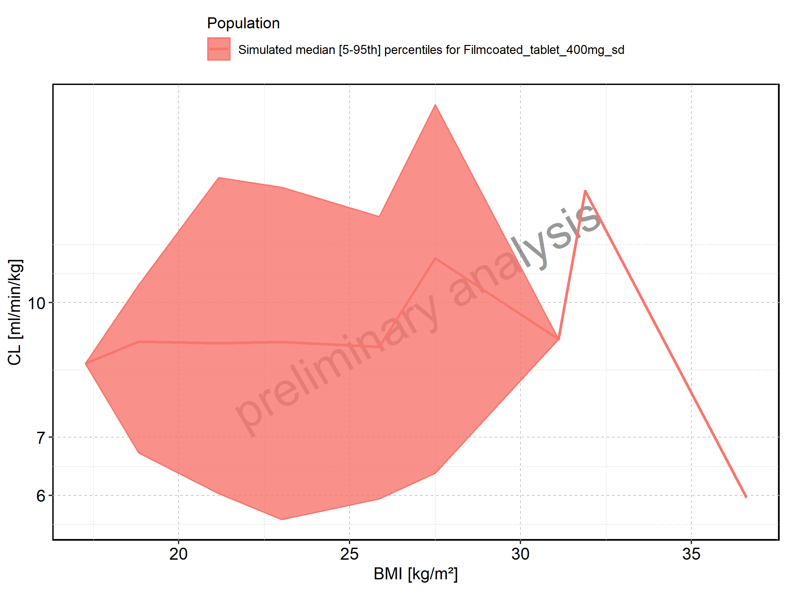

\newpage
Figure 297: Vss of Raltegravir shown as box-whisker plot, which indicates the 5th, 25th, 50th, 75th, and 95th percentiles in linear scale.

-Vss.png)

|Population                        |   N| 5th percentile| 25th percentile| 50th percentile| 75th percentile| 95th percentile|     mean| standard deviation| geo mean| geo standard deviation|
|:---------------------------------|---:|--------------:|---------------:|---------------:|---------------:|---------------:|--------:|------------------:|--------:|----------------------:|
|Larson 2013 8y-18y 400mg FCT meal | 497|       1581.086|        2341.616|        2968.180|        3917.840|        6249.022| 3396.631|           1880.065| 3071.484|               1.528280|
|Filmcoated_tablet_400mg_sd        | 100|       1880.267|        2263.552|        2695.832|        3418.902|        4890.574| 2993.695|           1138.953| 2836.187|               1.369004|

\newpage
Figure 298: Vss of Raltegravir shown as box-whisker plot, which indicates the 5th, 25th, 50th, 75th, and 95th percentiles in logarithmic scale.

-Vss-log.png)

\newpage
Figure 299: Age-dependence of Vss for Larson 2013 8y-18y 400mg FCT meal in comparison to Filmcoated_tablet_400mg_sd. Profiles are plotted in a linear scale.

\newpage
Figure 300: Age-dependence of Vss for Larson 2013 8y-18y 400mg FCT meal in comparison to Filmcoated_tablet_400mg_sd. Profiles are plotted in a logarithmic scale.

\newpage
Figure 301: Age-dependence of Vss for Larson 2013 8y-18y 400mg FCT meal. Profiles are plotted in a linear scale.

\newpage
Figure 302: Age-dependence of Vss for Larson 2013 8y-18y 400mg FCT meal. Profiles are plotted in a logarithmic scale.

\newpage
Figure 303: Age-dependence of Vss for Filmcoated_tablet_400mg_sd. Profiles are plotted in a linear scale.

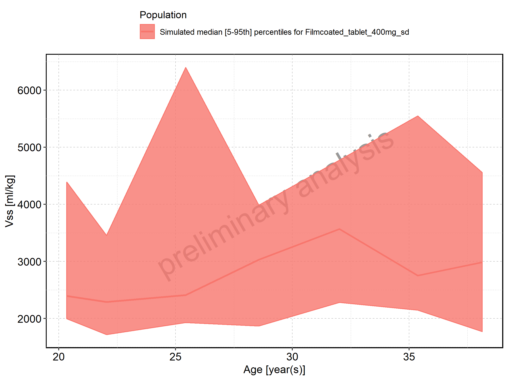

\newpage
Figure 304: Age-dependence of Vss for Filmcoated_tablet_400mg_sd. Profiles are plotted in a logarithmic scale.

\newpage
Figure 305: Height-dependence of Vss for Larson 2013 8y-18y 400mg FCT meal in comparison to Filmcoated_tablet_400mg_sd. Profiles are plotted in a linear scale.

\newpage
Figure 306: Height-dependence of Vss for Larson 2013 8y-18y 400mg FCT meal in comparison to Filmcoated_tablet_400mg_sd. Profiles are plotted in a logarithmic scale.

\newpage
Figure 307: Height-dependence of Vss for Larson 2013 8y-18y 400mg FCT meal. Profiles are plotted in a linear scale.

\newpage
Figure 308: Height-dependence of Vss for Larson 2013 8y-18y 400mg FCT meal. Profiles are plotted in a logarithmic scale.

\newpage
Figure 309: Height-dependence of Vss for Filmcoated_tablet_400mg_sd. Profiles are plotted in a linear scale.

\newpage
Figure 310: Height-dependence of Vss for Filmcoated_tablet_400mg_sd. Profiles are plotted in a logarithmic scale.

\newpage
Figure 311: Weight-dependence of Vss for Larson 2013 8y-18y 400mg FCT meal in comparison to Filmcoated_tablet_400mg_sd. Profiles are plotted in a linear scale.

\newpage
Figure 312: Weight-dependence of Vss for Larson 2013 8y-18y 400mg FCT meal in comparison to Filmcoated_tablet_400mg_sd. Profiles are plotted in a logarithmic scale.

\newpage
Figure 313: Weight-dependence of Vss for Larson 2013 8y-18y 400mg FCT meal. Profiles are plotted in a linear scale.

\newpage
Figure 314: Weight-dependence of Vss for Larson 2013 8y-18y 400mg FCT meal. Profiles are plotted in a logarithmic scale.

\newpage
Figure 315: Weight-dependence of Vss for Filmcoated_tablet_400mg_sd. Profiles are plotted in a linear scale.

\newpage
Figure 316: Weight-dependence of Vss for Filmcoated_tablet_400mg_sd. Profiles are plotted in a logarithmic scale.

\newpage
Figure 317: BMI-dependence of Vss for Larson 2013 8y-18y 400mg FCT meal in comparison to Filmcoated_tablet_400mg_sd. Profiles are plotted in a linear scale.

\newpage
Figure 318: BMI-dependence of Vss for Larson 2013 8y-18y 400mg FCT meal in comparison to Filmcoated_tablet_400mg_sd. Profiles are plotted in a logarithmic scale.

\newpage
Figure 319: BMI-dependence of Vss for Larson 2013 8y-18y 400mg FCT meal. Profiles are plotted in a linear scale.

\newpage
Figure 320: BMI-dependence of Vss for Larson 2013 8y-18y 400mg FCT meal. Profiles are plotted in a logarithmic scale.

\newpage
Figure 321: BMI-dependence of Vss for Filmcoated_tablet_400mg_sd. Profiles are plotted in a linear scale.

\newpage
Figure 322: BMI-dependence of Vss for Filmcoated_tablet_400mg_sd. Profiles are plotted in a logarithmic scale.

\newpage
Figure 323: Vd of Raltegravir shown as box-whisker plot, which indicates the 5th, 25th, 50th, 75th, and 95th percentiles in linear scale.

-Vd.png)

|Population                        |   N| 5th percentile| 25th percentile| 50th percentile| 75th percentile| 95th percentile|     mean| standard deviation| geo mean| geo standard deviation|
|:---------------------------------|---:|--------------:|---------------:|---------------:|---------------:|---------------:|--------:|------------------:|--------:|----------------------:|
|Larson 2013 8y-18y 400mg FCT meal | 497|       1564.173|        2133.960|        2893.518|        3971.826|        7809.583| 3610.039|           2601.900| 3089.071|               1.670646|
|Filmcoated_tablet_400mg_sd        | 100|       3961.869|        5531.167|        6823.958|        9325.515|       16886.072| 8090.422|           4000.153| 7343.514|               1.531150|

\newpage
Figure 324: Vd of Raltegravir shown as box-whisker plot, which indicates the 5th, 25th, 50th, 75th, and 95th percentiles in logarithmic scale.

-Vd-log.png)

\newpage
Figure 325: Age-dependence of Vd for Larson 2013 8y-18y 400mg FCT meal in comparison to Filmcoated_tablet_400mg_sd. Profiles are plotted in a linear scale.

\newpage
Figure 326: Age-dependence of Vd for Larson 2013 8y-18y 400mg FCT meal in comparison to Filmcoated_tablet_400mg_sd. Profiles are plotted in a logarithmic scale.

\newpage
Figure 327: Age-dependence of Vd for Larson 2013 8y-18y 400mg FCT meal. Profiles are plotted in a linear scale.

\newpage
Figure 328: Age-dependence of Vd for Larson 2013 8y-18y 400mg FCT meal. Profiles are plotted in a logarithmic scale.

\newpage
Figure 329: Age-dependence of Vd for Filmcoated_tablet_400mg_sd. Profiles are plotted in a linear scale.

\newpage
Figure 330: Age-dependence of Vd for Filmcoated_tablet_400mg_sd. Profiles are plotted in a logarithmic scale.

\newpage
Figure 331: Height-dependence of Vd for Larson 2013 8y-18y 400mg FCT meal in comparison to Filmcoated_tablet_400mg_sd. Profiles are plotted in a linear scale.

\newpage
Figure 332: Height-dependence of Vd for Larson 2013 8y-18y 400mg FCT meal in comparison to Filmcoated_tablet_400mg_sd. Profiles are plotted in a logarithmic scale.

\newpage
Figure 333: Height-dependence of Vd for Larson 2013 8y-18y 400mg FCT meal. Profiles are plotted in a linear scale.

\newpage
Figure 334: Height-dependence of Vd for Larson 2013 8y-18y 400mg FCT meal. Profiles are plotted in a logarithmic scale.

\newpage
Figure 335: Height-dependence of Vd for Filmcoated_tablet_400mg_sd. Profiles are plotted in a linear scale.

\newpage
Figure 336: Height-dependence of Vd for Filmcoated_tablet_400mg_sd. Profiles are plotted in a logarithmic scale.

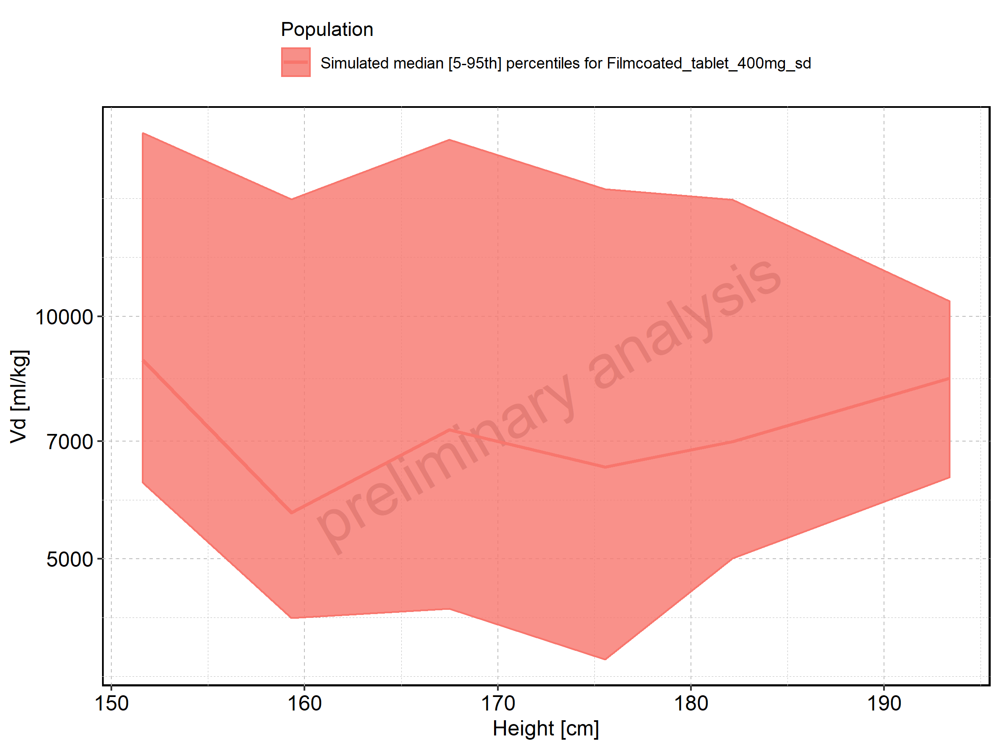

\newpage
Figure 337: Weight-dependence of Vd for Larson 2013 8y-18y 400mg FCT meal in comparison to Filmcoated_tablet_400mg_sd. Profiles are plotted in a linear scale.

\newpage
Figure 338: Weight-dependence of Vd for Larson 2013 8y-18y 400mg FCT meal in comparison to Filmcoated_tablet_400mg_sd. Profiles are plotted in a logarithmic scale.

\newpage
Figure 339: Weight-dependence of Vd for Larson 2013 8y-18y 400mg FCT meal. Profiles are plotted in a linear scale.

\newpage
Figure 340: Weight-dependence of Vd for Larson 2013 8y-18y 400mg FCT meal. Profiles are plotted in a logarithmic scale.

\newpage
Figure 341: Weight-dependence of Vd for Filmcoated_tablet_400mg_sd. Profiles are plotted in a linear scale.

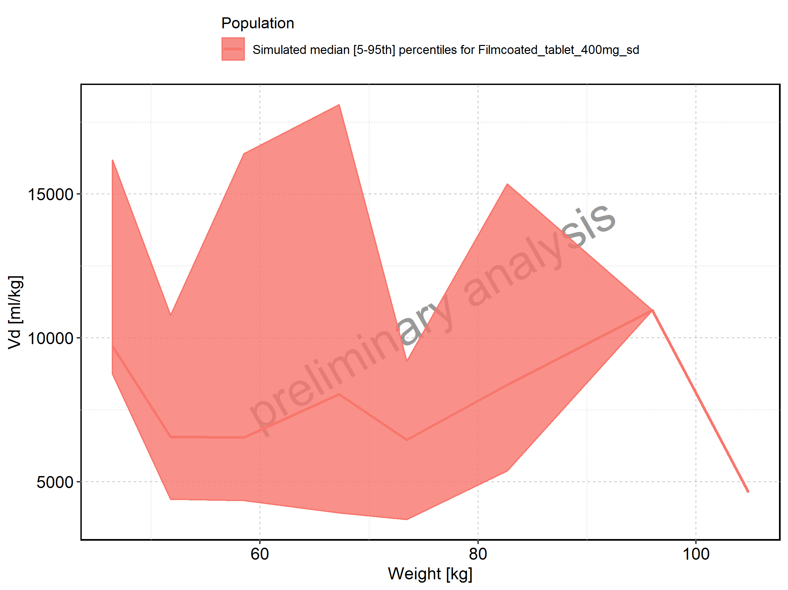

\newpage
Figure 342: Weight-dependence of Vd for Filmcoated_tablet_400mg_sd. Profiles are plotted in a logarithmic scale.

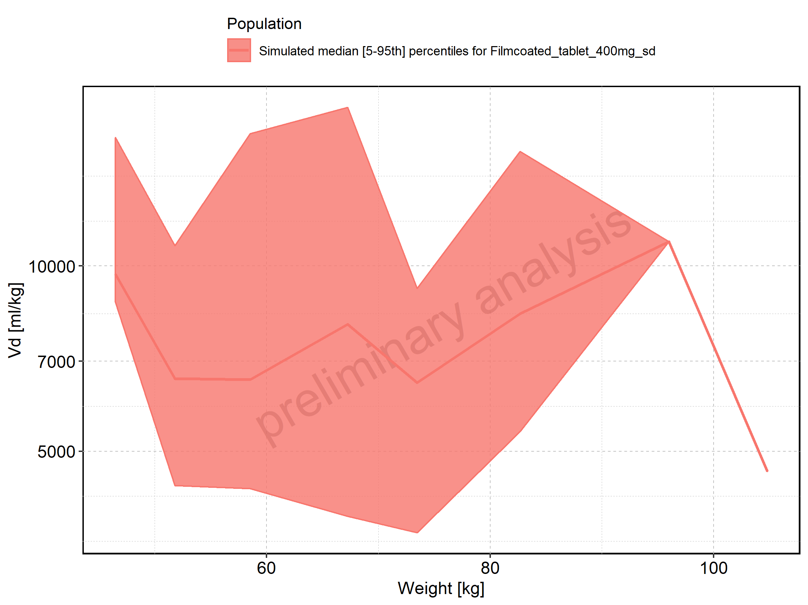

\newpage
Figure 343: BMI-dependence of Vd for Larson 2013 8y-18y 400mg FCT meal in comparison to Filmcoated_tablet_400mg_sd. Profiles are plotted in a linear scale.

\newpage
Figure 344: BMI-dependence of Vd for Larson 2013 8y-18y 400mg FCT meal in comparison to Filmcoated_tablet_400mg_sd. Profiles are plotted in a logarithmic scale.

\newpage
Figure 345: BMI-dependence of Vd for Larson 2013 8y-18y 400mg FCT meal. Profiles are plotted in a linear scale.

\newpage
Figure 346: BMI-dependence of Vd for Larson 2013 8y-18y 400mg FCT meal. Profiles are plotted in a logarithmic scale.

\newpage
Figure 347: BMI-dependence of Vd for Filmcoated_tablet_400mg_sd. Profiles are plotted in a linear scale.

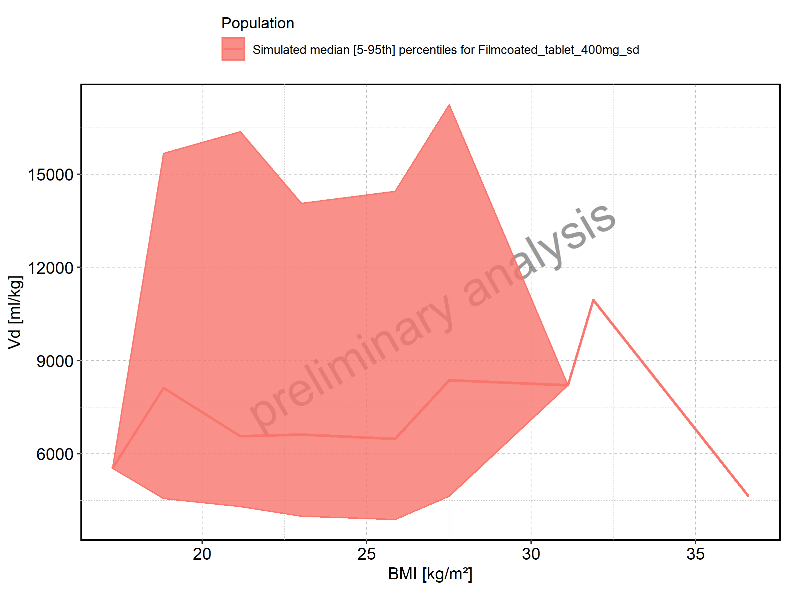

\newpage
Figure 348: BMI-dependence of Vd for Filmcoated_tablet_400mg_sd. Profiles are plotted in a logarithmic scale.

# 3. Time profiles and residual plots

## 3.1. Time profiles and residual plots for Larson 2013 8y-18y 400mg FCT meal

\newpage
Figure 349: Time profiles of Larson 2013 8y-18y 400mg FCT meal for Larson 2013 8-18y meal. Data source: Data/Raltegravir_PK.txt. Time profiles are plotted in a linear scale.

-totalRange.png)

\newpage
Figure 350: Time profiles of Larson 2013 8y-18y 400mg FCT meal for Larson 2013 8-18y meal. Data source: Data/Raltegravir_PK.txt. Time profiles are plotted in a logarithmic scale.

-totalRange.png)

\newpage
Figure 351: Predicted vs observed of Larson 2013 8y-18y 400mg FCT meal for Larson 2013 8-18y meal. Data source: Data/Raltegravir_PK.txt. Predictions and observations are plotted in a linear scale.

-totalRange.png)

\newpage
Figure 352: Predicted vs observed of Larson 2013 8y-18y 400mg FCT meal for Larson 2013 8-18y meal. Data source: Data/Raltegravir_PK.txt. Predictions and observations are plotted in a logarithmic scale.

-totalRange.png)

\newpage
Figure 353: Logarithmic residuals vs predicted values of Larson 2013 8y-18y 400mg FCT meal for Larson 2013 8-18y meal. Data source: Data/Raltegravir_PK.txt.

-totalRange.png)

\newpage
Figure 354: Logarithmic residuals vs time of Larson 2013 8y-18y 400mg FCT meal for Larson 2013 8-18y meal. Data source: Data/Raltegravir_PK.txt.

\newpage
Figure 355: Logarithmic residuals distribution of Larson 2013 8y-18y 400mg FCT meal for Larson 2013 8-18y meal. Data source: Data/Raltegravir_PK.txt.

\newpage
Figure 356: Logarithmic residuals of Larson 2013 8y-18y 400mg FCT meal for Larson 2013 8-18y meal as quantile-quantile plot. Data source: Data/Raltegravir_PK.txt.

## 3.2. Time profiles and residual plots for Filmcoated_tablet_400mg_sd

\newpage
Figure 357: Time profiles of Filmcoated_tablet_400mg_sd for Raltegravir 400mg filmcoated tablet. Data source: Data/Raltegravir_PK.txt. Time profiles are plotted in a linear scale.

-totalRange.png)

\newpage
Figure 358: Time profiles of Filmcoated_tablet_400mg_sd for Raltegravir 400mg filmcoated tablet. Data source: Data/Raltegravir_PK.txt. Time profiles are plotted in a logarithmic scale.

-totalRange.png)

\newpage
Figure 359: Predicted vs observed of Filmcoated_tablet_400mg_sd for Raltegravir 400mg filmcoated tablet. Data source: Data/Raltegravir_PK.txt. Predictions and observations are plotted in a linear scale.

-totalRange.png)

\newpage
Figure 360: Predicted vs observed of Filmcoated_tablet_400mg_sd for Raltegravir 400mg filmcoated tablet. Data source: Data/Raltegravir_PK.txt. Predictions and observations are plotted in a logarithmic scale.

-totalRange.png)

\newpage
Figure 361: Logarithmic residuals vs predicted values of Filmcoated_tablet_400mg_sd for Raltegravir 400mg filmcoated tablet. Data source: Data/Raltegravir_PK.txt.

-totalRange.png)

\newpage
Figure 362: Logarithmic residuals vs time of Filmcoated_tablet_400mg_sd for Raltegravir 400mg filmcoated tablet. Data source: Data/Raltegravir_PK.txt.

\newpage
Figure 363: Logarithmic residuals distribution of Filmcoated_tablet_400mg_sd for Raltegravir 400mg filmcoated tablet. Data source: Data/Raltegravir_PK.txt.

\newpage
Figure 364: Logarithmic residuals of Filmcoated_tablet_400mg_sd for Raltegravir 400mg filmcoated tablet as quantile-quantile plot. Data source: Data/Raltegravir_PK.txt.

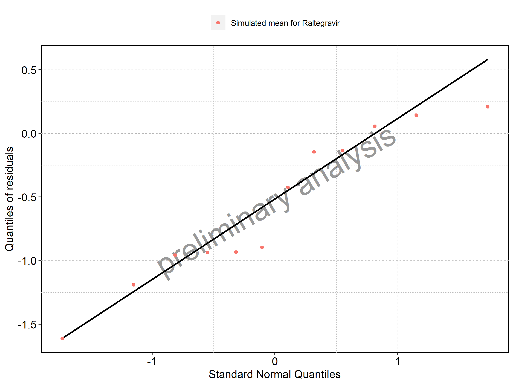

## 3.3. Residuals across all simulations

\newpage
Figure 365: Distribution of residuals for Larson 2013 8y-18y 400mg FCT meal, Filmcoated_tablet_400mg_sd

\newpage
Figure 366: Residuals for Larson 2013 8y-18y 400mg FCT meal, Filmcoated_tablet_400mg_sd as quantile-quantile plot.

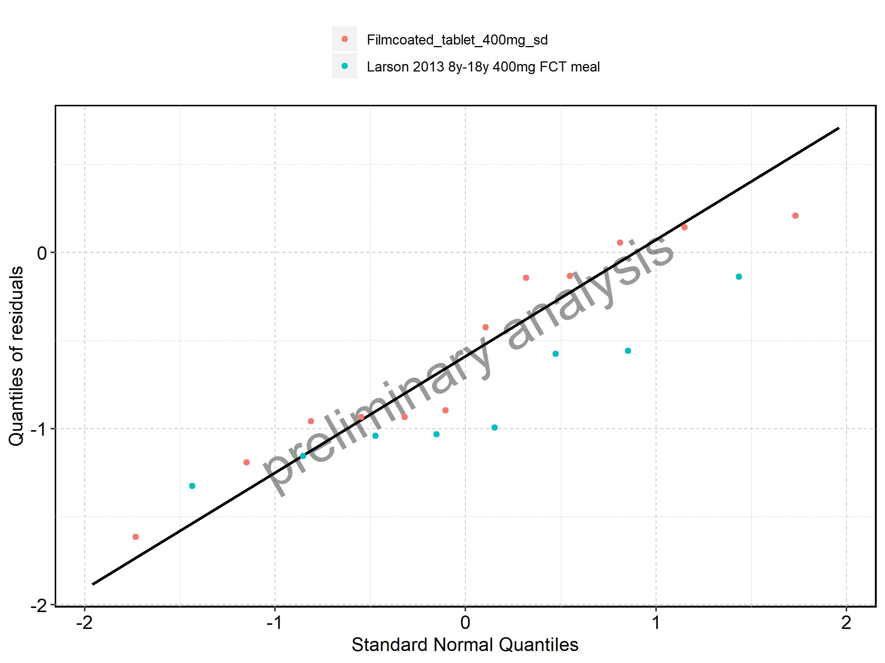

# 4. Demography

\newpage
Figure 367: Age-dependence of Height for Larson 2013 8y-18y 400mg FCT meal in comparison to Filmcoated_tablet_400mg_sd. Profiles are plotted in a linear scale.

\newpage
Figure 368: Age-dependence of Height for Larson 2013 8y-18y 400mg FCT meal in comparison to Filmcoated_tablet_400mg_sd. Profiles are plotted in a logarithmic scale.

\newpage
Figure 369: Age-dependence of Height for Larson 2013 8y-18y 400mg FCT meal. Profiles are plotted in a linear scale.

\newpage
Figure 370: Age-dependence of Height for Larson 2013 8y-18y 400mg FCT meal. Profiles are plotted in a logarithmic scale.

\newpage
Figure 371: Age-dependence of Height for Filmcoated_tablet_400mg_sd. Profiles are plotted in a linear scale.

\newpage
Figure 372: Age-dependence of Height for Filmcoated_tablet_400mg_sd. Profiles are plotted in a logarithmic scale.

\newpage
Figure 373: Age-dependence of Weight for Larson 2013 8y-18y 400mg FCT meal in comparison to Filmcoated_tablet_400mg_sd. Profiles are plotted in a linear scale.

\newpage
Figure 374: Age-dependence of Weight for Larson 2013 8y-18y 400mg FCT meal in comparison to Filmcoated_tablet_400mg_sd. Profiles are plotted in a logarithmic scale.

\newpage
Figure 375: Age-dependence of Weight for Larson 2013 8y-18y 400mg FCT meal. Profiles are plotted in a linear scale.

\newpage
Figure 376: Age-dependence of Weight for Larson 2013 8y-18y 400mg FCT meal. Profiles are plotted in a logarithmic scale.

\newpage
Figure 377: Age-dependence of Weight for Filmcoated_tablet_400mg_sd. Profiles are plotted in a linear scale.

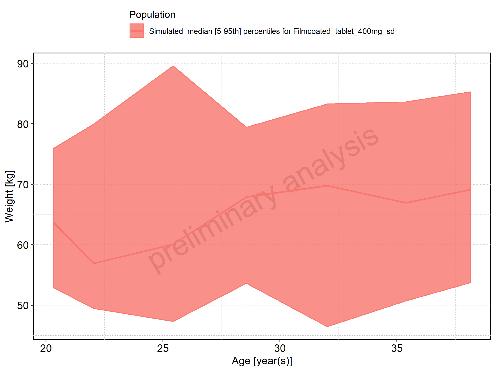

\newpage
Figure 378: Age-dependence of Weight for Filmcoated_tablet_400mg_sd. Profiles are plotted in a logarithmic scale.

\newpage
Figure 379: Age-dependence of BMI for Larson 2013 8y-18y 400mg FCT meal in comparison to Filmcoated_tablet_400mg_sd. Profiles are plotted in a linear scale.

\newpage
Figure 380: Age-dependence of BMI for Larson 2013 8y-18y 400mg FCT meal in comparison to Filmcoated_tablet_400mg_sd. Profiles are plotted in a logarithmic scale.

\newpage
Figure 381: Age-dependence of BMI for Larson 2013 8y-18y 400mg FCT meal. Profiles are plotted in a linear scale.

\newpage
Figure 382: Age-dependence of BMI for Larson 2013 8y-18y 400mg FCT meal. Profiles are plotted in a logarithmic scale.

\newpage
Figure 383: Age-dependence of BMI for Filmcoated_tablet_400mg_sd. Profiles are plotted in a linear scale.

\newpage
Figure 384: Age-dependence of BMI for Filmcoated_tablet_400mg_sd. Profiles are plotted in a logarithmic scale.

