  - [1. PK parameters](#pk-parameters)
  - [2. Time profiles and residual plots](#time-profiles-and-residual-plots)
      - [2.1. Time profiles and residual plots for Larson 2013 8y-18y 400mg FCT meal](#time-profiles-and-residual-plots-for-larson-2013-8y-18y-400mg-fct-meal)
      - [2.2. Time profiles and residual plots for Filmcoated\_tablet\_400mg\_sd](#time-profiles-and-residual-plots-for-filmcoated_tablet_400mg_sd)
      - [2.3. Residuals across all simulations](#residuals-across-all-simulations)
  - [3. Demography](#demography)

# 1\. PK parameters

Figure 1: C\_max of Raltegravir shown as box-whisker plot, which indicates the 5th, 25th, 50th, 75th, and 95th percentiles in linear scale.

| Population                        |   N | 5th percentile | 25th percentile | 50th percentile | 75th percentile | 95th percentile |     mean | standard deviation | geo mean | geo standard deviation |
| :-------------------------------- | --: | -------------: | --------------: | --------------: | --------------: | --------------: | -------: | -----------------: | -------: | ---------------------: |
| Larson 2013 8y-18y 400mg FCT meal | 500 |       1171.264 |        1784.944 |        2321.552 |        2949.242 |        4651.398 | 2549.832 |          1206.8866 | 2326.870 |               1.523041 |
| Filmcoated\_tablet\_400mg\_sd     | 100 |       2437.788 |        3236.536 |        3954.538 |        4657.555 |        5304.384 | 3940.920 |           908.8899 | 3833.698 |               1.270937 |

Figure 2: C\_max of Raltegravir shown as box-whisker plot, which indicates the 5th, 25th, 50th, 75th, and 95th percentiles in logarithmic scale.

Figure 3: Age-dependence of C\_max for Larson 2013 8y-18y 400mg FCT meal in comparison to Filmcoated\_tablet\_400mg\_sd. Profiles are plotted in a linear scale.

Figure 4: Age-dependence of C\_max for Larson 2013 8y-18y 400mg FCT meal in comparison to Filmcoated\_tablet\_400mg\_sd. Profiles are plotted in a logarithmic scale.

Figure 5: Age-dependence of C\_max for Larson 2013 8y-18y 400mg FCT meal. Profiles are plotted in a linear scale.

Figure 6: Age-dependence of C\_max for Larson 2013 8y-18y 400mg FCT meal. Profiles are plotted in a logarithmic scale.

Figure 7: Age-dependence of C\_max for Filmcoated\_tablet\_400mg\_sd. Profiles are plotted in a linear scale.

Figure 8: Age-dependence of C\_max for Filmcoated\_tablet\_400mg\_sd. Profiles are plotted in a logarithmic scale.

Figure 9: Height-dependence of C\_max for Larson 2013 8y-18y 400mg FCT meal in comparison to Filmcoated\_tablet\_400mg\_sd. Profiles are plotted in a linear scale.

Figure 10: Height-dependence of C\_max for Larson 2013 8y-18y 400mg FCT meal in comparison to Filmcoated\_tablet\_400mg\_sd. Profiles are plotted in a logarithmic scale.

Figure 11: Height-dependence of C\_max for Larson 2013 8y-18y 400mg FCT meal. Profiles are plotted in a linear scale.

Figure 12: Height-dependence of C\_max for Larson 2013 8y-18y 400mg FCT meal. Profiles are plotted in a logarithmic scale.

Figure 13: Height-dependence of C\_max for Filmcoated\_tablet\_400mg\_sd. Profiles are plotted in a linear scale.

Figure 14: Height-dependence of C\_max for Filmcoated\_tablet\_400mg\_sd. Profiles are plotted in a logarithmic scale.

Figure 15: Weight-dependence of C\_max for Larson 2013 8y-18y 400mg FCT meal in comparison to Filmcoated\_tablet\_400mg\_sd. Profiles are plotted in a linear scale.

Figure 16: Weight-dependence of C\_max for Larson 2013 8y-18y 400mg FCT meal in comparison to Filmcoated\_tablet\_400mg\_sd. Profiles are plotted in a logarithmic scale.

Figure 17: Weight-dependence of C\_max for Larson 2013 8y-18y 400mg FCT meal. Profiles are plotted in a linear scale.

Figure 18: Weight-dependence of C\_max for Larson 2013 8y-18y 400mg FCT meal. Profiles are plotted in a logarithmic scale.

Figure 19: Weight-dependence of C\_max for Filmcoated\_tablet\_400mg\_sd. Profiles are plotted in a linear scale.

Figure 20: Weight-dependence of C\_max for Filmcoated\_tablet\_400mg\_sd. Profiles are plotted in a logarithmic scale.

Figure 21: BMI-dependence of C\_max for Larson 2013 8y-18y 400mg FCT meal in comparison to Filmcoated\_tablet\_400mg\_sd. Profiles are plotted in a linear scale.

Figure 22: BMI-dependence of C\_max for Larson 2013 8y-18y 400mg FCT meal in comparison to Filmcoated\_tablet\_400mg\_sd. Profiles are plotted in a logarithmic scale.

Figure 23: BMI-dependence of C\_max for Larson 2013 8y-18y 400mg FCT meal. Profiles are plotted in a linear scale.

Figure 24: BMI-dependence of C\_max for Larson 2013 8y-18y 400mg FCT meal. Profiles are plotted in a logarithmic scale.

Figure 25: BMI-dependence of C\_max for Filmcoated\_tablet\_400mg\_sd. Profiles are plotted in a linear scale.

Figure 26: BMI-dependence of C\_max for Filmcoated\_tablet\_400mg\_sd. Profiles are plotted in a logarithmic scale.

Figure 27: Gender-dependence of C\_max for Larson 2013 8y-18y 400mg FCT meal in comparison to Filmcoated\_tablet\_400mg\_sd. Profiles are plotted in a linear scale.

Figure 28: Gender-dependence of C\_max for Larson 2013 8y-18y 400mg FCT meal in comparison to Filmcoated\_tablet\_400mg\_sd. Profiles are plotted in a logarithmic scale.

Figure 29: Gender-dependence of C\_max for Larson 2013 8y-18y 400mg FCT meal. Profiles are plotted in a linear scale.

Figure 30: Gender-dependence of C\_max for Larson 2013 8y-18y 400mg FCT meal. Profiles are plotted in a logarithmic scale.

Figure 31: Gender-dependence of C\_max for Filmcoated\_tablet\_400mg\_sd. Profiles are plotted in a linear scale.

Figure 32: Gender-dependence of C\_max for Filmcoated\_tablet\_400mg\_sd. Profiles are plotted in a logarithmic scale.

Figure 33: C\_max\_norm of Raltegravir shown as box-whisker plot, which indicates the 5th, 25th, 50th, 75th, and 95th percentiles in linear scale.

| Population                        |   N | 5th percentile | 25th percentile | 50th percentile | 75th percentile | 95th percentile |      mean | standard deviation |  geo mean | geo standard deviation |
| :-------------------------------- | --: | -------------: | --------------: | --------------: | --------------: | --------------: | --------: | -----------------: | --------: | ---------------------: |
| Larson 2013 8y-18y 400mg FCT meal | 500 |      0.1639770 |       0.2498922 |       0.3250172 |       0.4128938 |       0.6511956 | 0.3569764 |          0.1689641 | 0.3257618 |               1.523041 |
| Filmcoated\_tablet\_400mg\_sd     | 100 |      0.4448963 |       0.5906679 |       0.7217033 |       0.8500038 |       0.9680502 | 0.7192180 |          0.1658724 | 0.6996499 |               1.270937 |

Figure 34: C\_max\_norm of Raltegravir shown as box-whisker plot, which indicates the 5th, 25th, 50th, 75th, and 95th percentiles in logarithmic scale.

Figure 35: Age-dependence of C\_max\_norm for Larson 2013 8y-18y 400mg FCT meal in comparison to Filmcoated\_tablet\_400mg\_sd. Profiles are plotted in a linear scale.

Figure 36: Age-dependence of C\_max\_norm for Larson 2013 8y-18y 400mg FCT meal in comparison to Filmcoated\_tablet\_400mg\_sd. Profiles are plotted in a logarithmic scale.

Figure 37: Age-dependence of C\_max\_norm for Larson 2013 8y-18y 400mg FCT meal. Profiles are plotted in a linear scale.

Figure 38: Age-dependence of C\_max\_norm for Larson 2013 8y-18y 400mg FCT meal. Profiles are plotted in a logarithmic scale.

Figure 39: Age-dependence of C\_max\_norm for Filmcoated\_tablet\_400mg\_sd. Profiles are plotted in a linear scale.

Figure 40: Age-dependence of C\_max\_norm for Filmcoated\_tablet\_400mg\_sd. Profiles are plotted in a logarithmic scale.

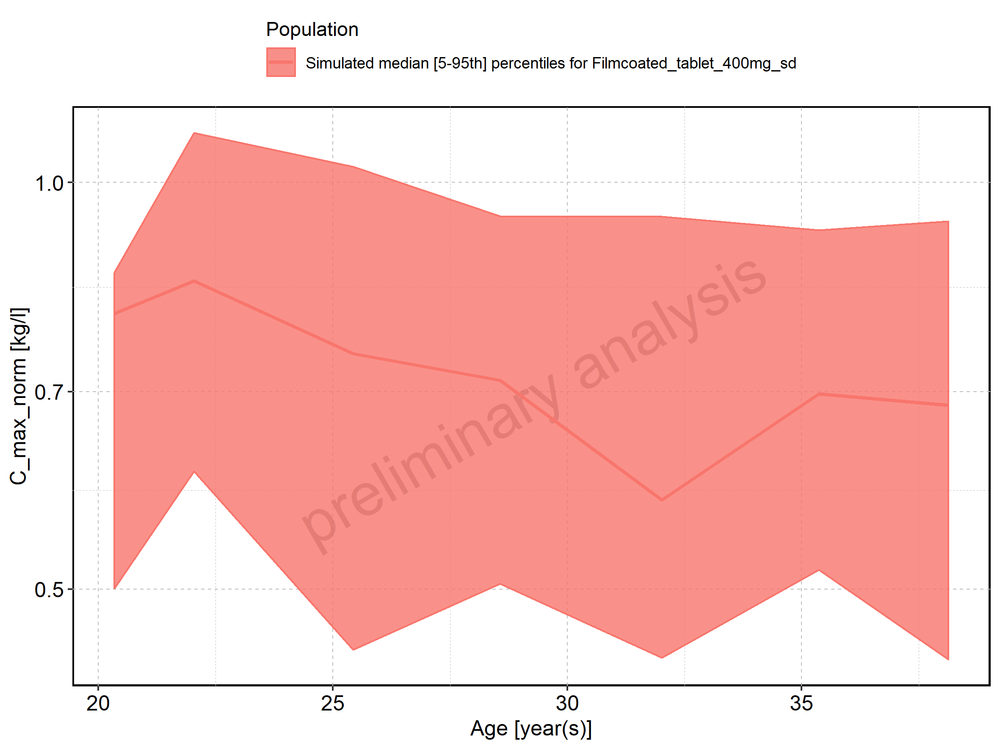

Figure 41: Height-dependence of C\_max\_norm for Larson 2013 8y-18y 400mg FCT meal in comparison to Filmcoated\_tablet\_400mg\_sd. Profiles are plotted in a linear scale.

Figure 42: Height-dependence of C\_max\_norm for Larson 2013 8y-18y 400mg FCT meal in comparison to Filmcoated\_tablet\_400mg\_sd. Profiles are plotted in a logarithmic scale.

Figure 43: Height-dependence of C\_max\_norm for Larson 2013 8y-18y 400mg FCT meal. Profiles are plotted in a linear scale.

Figure 44: Height-dependence of C\_max\_norm for Larson 2013 8y-18y 400mg FCT meal. Profiles are plotted in a logarithmic scale.

Figure 45: Height-dependence of C\_max\_norm for Filmcoated\_tablet\_400mg\_sd. Profiles are plotted in a linear scale.

Figure 46: Height-dependence of C\_max\_norm for Filmcoated\_tablet\_400mg\_sd. Profiles are plotted in a logarithmic scale.

Figure 47: Weight-dependence of C\_max\_norm for Larson 2013 8y-18y 400mg FCT meal in comparison to Filmcoated\_tablet\_400mg\_sd. Profiles are plotted in a linear scale.

Figure 48: Weight-dependence of C\_max\_norm for Larson 2013 8y-18y 400mg FCT meal in comparison to Filmcoated\_tablet\_400mg\_sd. Profiles are plotted in a logarithmic scale.

Figure 49: Weight-dependence of C\_max\_norm for Larson 2013 8y-18y 400mg FCT meal. Profiles are plotted in a linear scale.

Figure 50: Weight-dependence of C\_max\_norm for Larson 2013 8y-18y 400mg FCT meal. Profiles are plotted in a logarithmic scale.

Figure 51: Weight-dependence of C\_max\_norm for Filmcoated\_tablet\_400mg\_sd. Profiles are plotted in a linear scale.

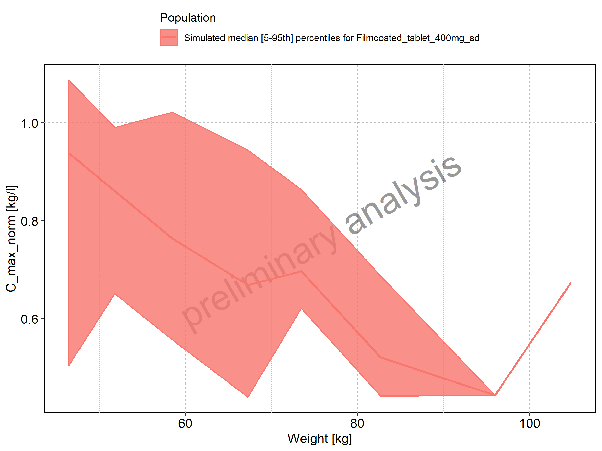

Figure 52: Weight-dependence of C\_max\_norm for Filmcoated\_tablet\_400mg\_sd. Profiles are plotted in a logarithmic scale.

Figure 53: BMI-dependence of C\_max\_norm for Larson 2013 8y-18y 400mg FCT meal in comparison to Filmcoated\_tablet\_400mg\_sd. Profiles are plotted in a linear scale.

Figure 54: BMI-dependence of C\_max\_norm for Larson 2013 8y-18y 400mg FCT meal in comparison to Filmcoated\_tablet\_400mg\_sd. Profiles are plotted in a logarithmic scale.

Figure 55: BMI-dependence of C\_max\_norm for Larson 2013 8y-18y 400mg FCT meal. Profiles are plotted in a linear scale.

Figure 56: BMI-dependence of C\_max\_norm for Larson 2013 8y-18y 400mg FCT meal. Profiles are plotted in a logarithmic scale.

Figure 57: BMI-dependence of C\_max\_norm for Filmcoated\_tablet\_400mg\_sd. Profiles are plotted in a linear scale.

Figure 58: BMI-dependence of C\_max\_norm for Filmcoated\_tablet\_400mg\_sd. Profiles are plotted in a logarithmic scale.

Figure 59: Gender-dependence of C\_max\_norm for Larson 2013 8y-18y 400mg FCT meal in comparison to Filmcoated\_tablet\_400mg\_sd. Profiles are plotted in a linear scale.

Figure 60: Gender-dependence of C\_max\_norm for Larson 2013 8y-18y 400mg FCT meal in comparison to Filmcoated\_tablet\_400mg\_sd. Profiles are plotted in a logarithmic scale.

Figure 61: Gender-dependence of C\_max\_norm for Larson 2013 8y-18y 400mg FCT meal. Profiles are plotted in a linear scale.

Figure 62: Gender-dependence of C\_max\_norm for Larson 2013 8y-18y 400mg FCT meal. Profiles are plotted in a logarithmic scale.

Figure 63: Gender-dependence of C\_max\_norm for Filmcoated\_tablet\_400mg\_sd. Profiles are plotted in a linear scale.

Figure 64: Gender-dependence of C\_max\_norm for Filmcoated\_tablet\_400mg\_sd. Profiles are plotted in a logarithmic scale.

Figure 65: t\_max of Raltegravir shown as box-whisker plot, which indicates the 5th, 25th, 50th, 75th, and 95th percentiles in linear scale.

| Population                        |   N | 5th percentile | 25th percentile | 50th percentile | 75th percentile | 95th percentile |   mean | standard deviation |  geo mean | geo standard deviation |
| :-------------------------------- | --: | -------------: | --------------: | --------------: | --------------: | --------------: | -----: | -----------------: | --------: | ---------------------: |
| Larson 2013 8y-18y 400mg FCT meal | 500 |         0.9975 |             2.0 |             2.5 |          3.0500 |               4 | 2.5419 |          0.8782893 | 2.3720858 |               1.485027 |
| Filmcoated\_tablet\_400mg\_sd     | 100 |         0.5000 |             0.6 |             0.7 |          0.8125 |               1 | 0.7290 |          0.1516209 | 0.7135402 |               1.232465 |

Figure 66: t\_max of Raltegravir shown as box-whisker plot, which indicates the 5th, 25th, 50th, 75th, and 95th percentiles in logarithmic scale.

Figure 67: Age-dependence of t\_max for Larson 2013 8y-18y 400mg FCT meal in comparison to Filmcoated\_tablet\_400mg\_sd. Profiles are plotted in a linear scale.

Figure 68: Age-dependence of t\_max for Larson 2013 8y-18y 400mg FCT meal in comparison to Filmcoated\_tablet\_400mg\_sd. Profiles are plotted in a logarithmic scale.

Figure 69: Age-dependence of t\_max for Larson 2013 8y-18y 400mg FCT meal. Profiles are plotted in a linear scale.

Figure 70: Age-dependence of t\_max for Larson 2013 8y-18y 400mg FCT meal. Profiles are plotted in a logarithmic scale.

Figure 71: Age-dependence of t\_max for Filmcoated\_tablet\_400mg\_sd. Profiles are plotted in a linear scale.

Figure 72: Age-dependence of t\_max for Filmcoated\_tablet\_400mg\_sd. Profiles are plotted in a logarithmic scale.

Figure 73: Height-dependence of t\_max for Larson 2013 8y-18y 400mg FCT meal in comparison to Filmcoated\_tablet\_400mg\_sd. Profiles are plotted in a linear scale.

Figure 74: Height-dependence of t\_max for Larson 2013 8y-18y 400mg FCT meal in comparison to Filmcoated\_tablet\_400mg\_sd. Profiles are plotted in a logarithmic scale.

Figure 75: Height-dependence of t\_max for Larson 2013 8y-18y 400mg FCT meal. Profiles are plotted in a linear scale.

Figure 76: Height-dependence of t\_max for Larson 2013 8y-18y 400mg FCT meal. Profiles are plotted in a logarithmic scale.

Figure 77: Height-dependence of t\_max for Filmcoated\_tablet\_400mg\_sd. Profiles are plotted in a linear scale.

Figure 78: Height-dependence of t\_max for Filmcoated\_tablet\_400mg\_sd. Profiles are plotted in a logarithmic scale.

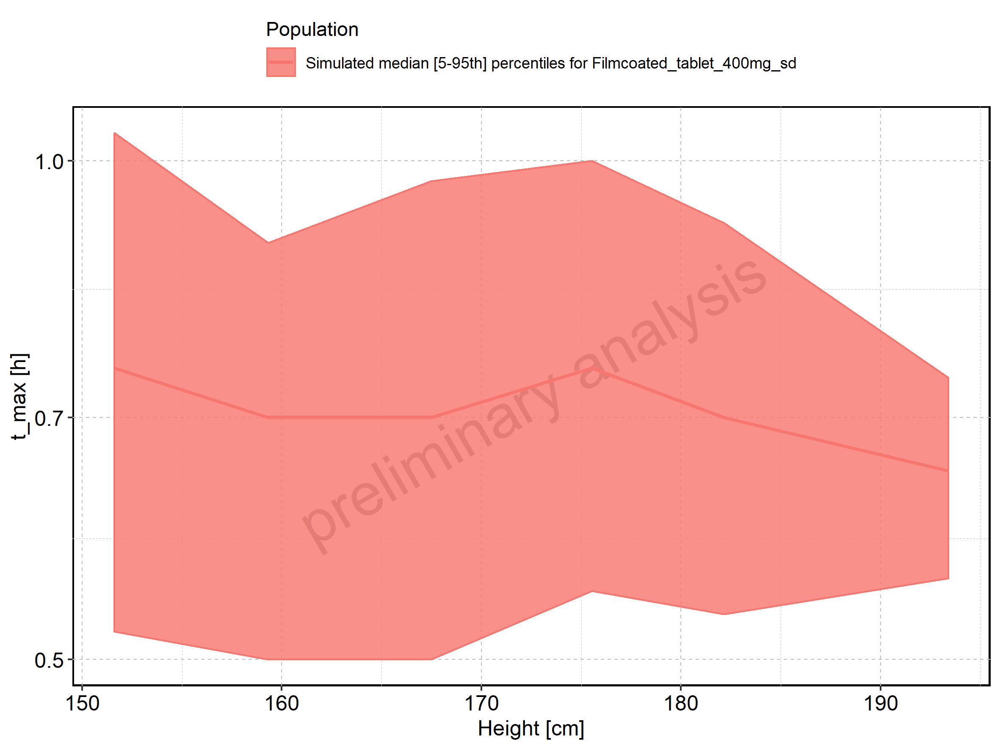

Figure 79: Weight-dependence of t\_max for Larson 2013 8y-18y 400mg FCT meal in comparison to Filmcoated\_tablet\_400mg\_sd. Profiles are plotted in a linear scale.

Figure 80: Weight-dependence of t\_max for Larson 2013 8y-18y 400mg FCT meal in comparison to Filmcoated\_tablet\_400mg\_sd. Profiles are plotted in a logarithmic scale.

Figure 81: Weight-dependence of t\_max for Larson 2013 8y-18y 400mg FCT meal. Profiles are plotted in a linear scale.

Figure 82: Weight-dependence of t\_max for Larson 2013 8y-18y 400mg FCT meal. Profiles are plotted in a logarithmic scale.

Figure 83: Weight-dependence of t\_max for Filmcoated\_tablet\_400mg\_sd. Profiles are plotted in a linear scale.

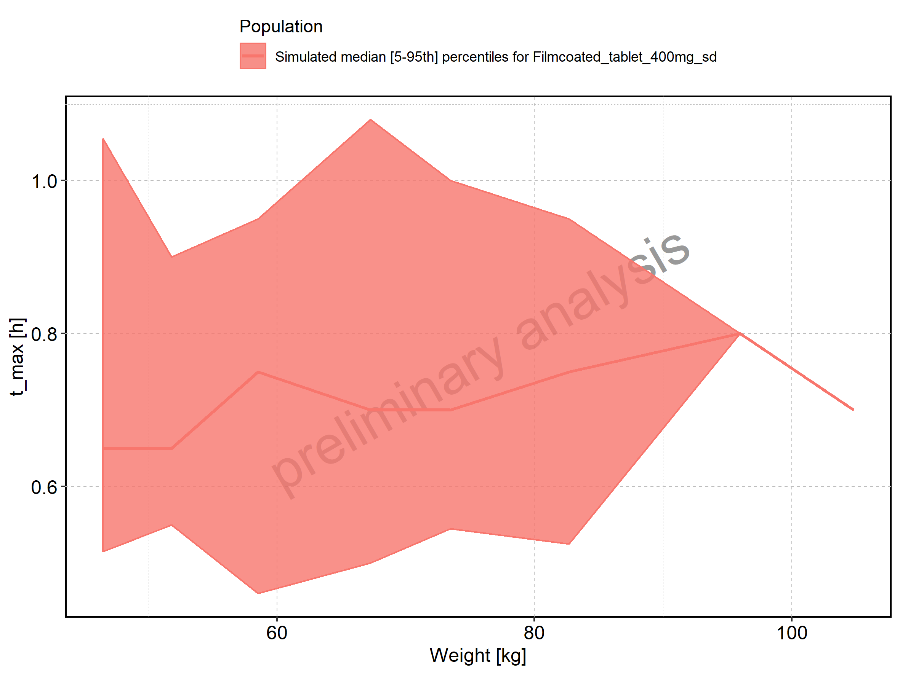

Figure 84: Weight-dependence of t\_max for Filmcoated\_tablet\_400mg\_sd. Profiles are plotted in a logarithmic scale.

Figure 85: BMI-dependence of t\_max for Larson 2013 8y-18y 400mg FCT meal in comparison to Filmcoated\_tablet\_400mg\_sd. Profiles are plotted in a linear scale.

Figure 86: BMI-dependence of t\_max for Larson 2013 8y-18y 400mg FCT meal in comparison to Filmcoated\_tablet\_400mg\_sd. Profiles are plotted in a logarithmic scale.

Figure 87: BMI-dependence of t\_max for Larson 2013 8y-18y 400mg FCT meal. Profiles are plotted in a linear scale.

Figure 88: BMI-dependence of t\_max for Larson 2013 8y-18y 400mg FCT meal. Profiles are plotted in a logarithmic scale.

Figure 89: BMI-dependence of t\_max for Filmcoated\_tablet\_400mg\_sd. Profiles are plotted in a linear scale.

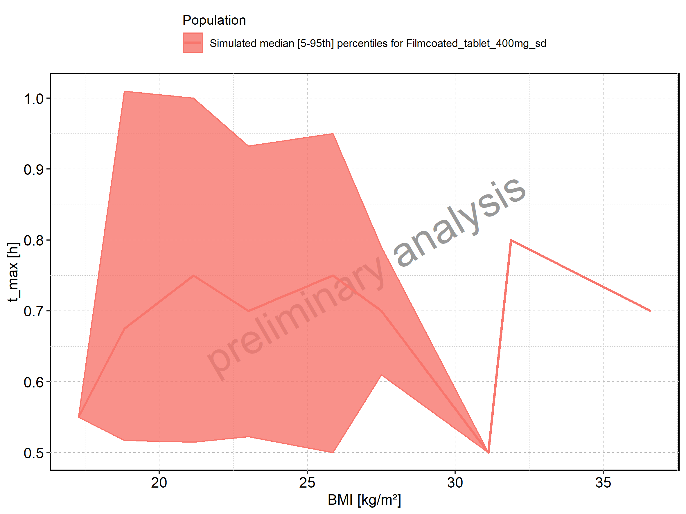

Figure 90: BMI-dependence of t\_max for Filmcoated\_tablet\_400mg\_sd. Profiles are plotted in a logarithmic scale.

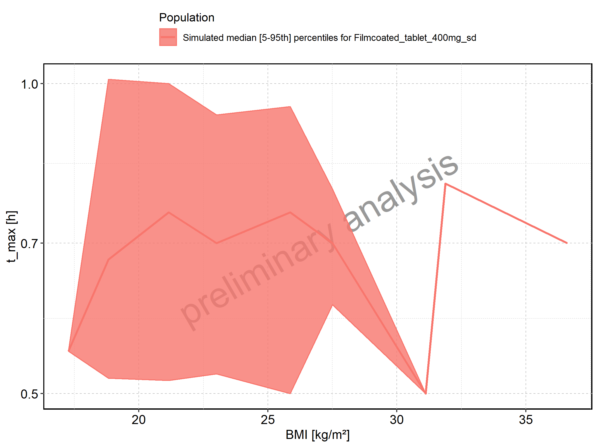

Figure 91: Gender-dependence of t\_max for Larson 2013 8y-18y 400mg FCT meal in comparison to Filmcoated\_tablet\_400mg\_sd. Profiles are plotted in a linear scale.

Figure 92: Gender-dependence of t\_max for Larson 2013 8y-18y 400mg FCT meal in comparison to Filmcoated\_tablet\_400mg\_sd. Profiles are plotted in a logarithmic scale.

Figure 93: Gender-dependence of t\_max for Larson 2013 8y-18y 400mg FCT meal. Profiles are plotted in a linear scale.

Figure 94: Gender-dependence of t\_max for Larson 2013 8y-18y 400mg FCT meal. Profiles are plotted in a logarithmic scale.

Figure 95: Gender-dependence of t\_max for Filmcoated\_tablet\_400mg\_sd. Profiles are plotted in a linear scale.

Figure 96: Gender-dependence of t\_max for Filmcoated\_tablet\_400mg\_sd. Profiles are plotted in a logarithmic scale.

Figure 97: C\_tEnd of Raltegravir shown as box-whisker plot, which indicates the 5th, 25th, 50th, 75th, and 95th percentiles in linear scale.

| Population                        |   N | 5th percentile | 25th percentile | 50th percentile | 75th percentile | 95th percentile |      mean | standard deviation |  geo mean | geo standard deviation |
| :-------------------------------- | --: | -------------: | --------------: | --------------: | --------------: | --------------: | --------: | -----------------: | --------: | ---------------------: |
| Larson 2013 8y-18y 400mg FCT meal | 500 |       86.63046 |       133.65437 |       189.56246 |       263.51473 |       448.02293 | 218.90325 |          129.11610 | 191.12204 |               1.666366 |
| Filmcoated\_tablet\_400mg\_sd     | 100 |       19.57484 |        25.79622 |        32.34815 |        41.91365 |        62.67601 |  35.38577 |           14.20645 |  33.01047 |               1.444113 |

Figure 98: C\_tEnd of Raltegravir shown as box-whisker plot, which indicates the 5th, 25th, 50th, 75th, and 95th percentiles in logarithmic scale.

Figure 99: Age-dependence of C\_tEnd for Larson 2013 8y-18y 400mg FCT meal in comparison to Filmcoated\_tablet\_400mg\_sd. Profiles are plotted in a linear scale.

Figure 100: Age-dependence of C\_tEnd for Larson 2013 8y-18y 400mg FCT meal in comparison to Filmcoated\_tablet\_400mg\_sd. Profiles are plotted in a logarithmic scale.

Figure 101: Age-dependence of C\_tEnd for Larson 2013 8y-18y 400mg FCT meal. Profiles are plotted in a linear scale.

Figure 102: Age-dependence of C\_tEnd for Larson 2013 8y-18y 400mg FCT meal. Profiles are plotted in a logarithmic scale.

Figure 103: Age-dependence of C\_tEnd for Filmcoated\_tablet\_400mg\_sd. Profiles are plotted in a linear scale.

Figure 104: Age-dependence of C\_tEnd for Filmcoated\_tablet\_400mg\_sd. Profiles are plotted in a logarithmic scale.

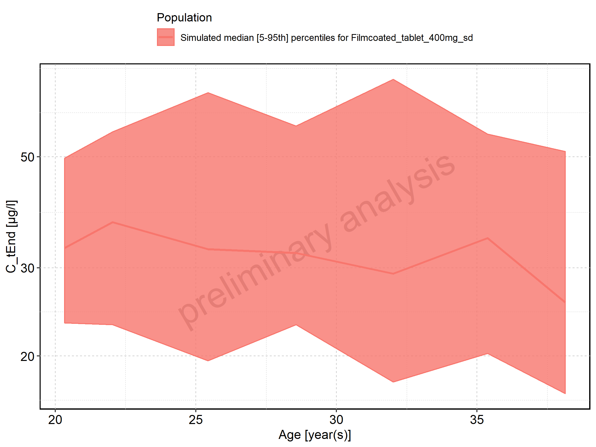

Figure 105: Height-dependence of C\_tEnd for Larson 2013 8y-18y 400mg FCT meal in comparison to Filmcoated\_tablet\_400mg\_sd. Profiles are plotted in a linear scale.

Figure 106: Height-dependence of C\_tEnd for Larson 2013 8y-18y 400mg FCT meal in comparison to Filmcoated\_tablet\_400mg\_sd. Profiles are plotted in a logarithmic scale.

Figure 107: Height-dependence of C\_tEnd for Larson 2013 8y-18y 400mg FCT meal. Profiles are plotted in a linear scale.

Figure 108: Height-dependence of C\_tEnd for Larson 2013 8y-18y 400mg FCT meal. Profiles are plotted in a logarithmic scale.

Figure 109: Height-dependence of C\_tEnd for Filmcoated\_tablet\_400mg\_sd. Profiles are plotted in a linear scale.

Figure 110: Height-dependence of C\_tEnd for Filmcoated\_tablet\_400mg\_sd. Profiles are plotted in a logarithmic scale.

Figure 111: Weight-dependence of C\_tEnd for Larson 2013 8y-18y 400mg FCT meal in comparison to Filmcoated\_tablet\_400mg\_sd. Profiles are plotted in a linear scale.

Figure 112: Weight-dependence of C\_tEnd for Larson 2013 8y-18y 400mg FCT meal in comparison to Filmcoated\_tablet\_400mg\_sd. Profiles are plotted in a logarithmic scale.

Figure 113: Weight-dependence of C\_tEnd for Larson 2013 8y-18y 400mg FCT meal. Profiles are plotted in a linear scale.

Figure 114: Weight-dependence of C\_tEnd for Larson 2013 8y-18y 400mg FCT meal. Profiles are plotted in a logarithmic scale.

Figure 115: Weight-dependence of C\_tEnd for Filmcoated\_tablet\_400mg\_sd. Profiles are plotted in a linear scale.

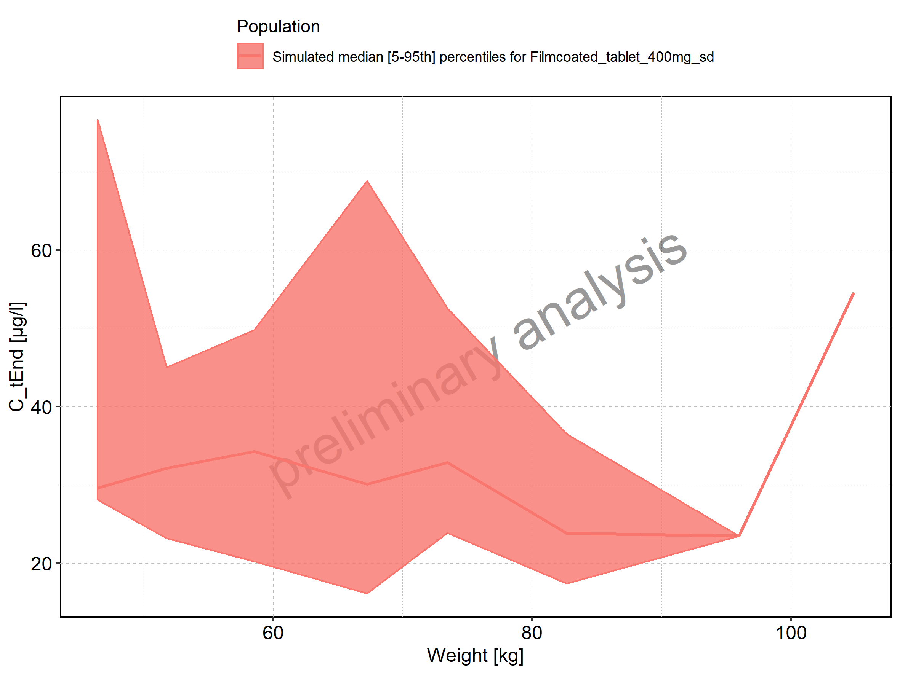

Figure 116: Weight-dependence of C\_tEnd for Filmcoated\_tablet\_400mg\_sd. Profiles are plotted in a logarithmic scale.

Figure 117: BMI-dependence of C\_tEnd for Larson 2013 8y-18y 400mg FCT meal in comparison to Filmcoated\_tablet\_400mg\_sd. Profiles are plotted in a linear scale.

Figure 118: BMI-dependence of C\_tEnd for Larson 2013 8y-18y 400mg FCT meal in comparison to Filmcoated\_tablet\_400mg\_sd. Profiles are plotted in a logarithmic scale.

Figure 119: BMI-dependence of C\_tEnd for Larson 2013 8y-18y 400mg FCT meal. Profiles are plotted in a linear scale.

Figure 120: BMI-dependence of C\_tEnd for Larson 2013 8y-18y 400mg FCT meal. Profiles are plotted in a logarithmic scale.

Figure 121: BMI-dependence of C\_tEnd for Filmcoated\_tablet\_400mg\_sd. Profiles are plotted in a linear scale.

Figure 122: BMI-dependence of C\_tEnd for Filmcoated\_tablet\_400mg\_sd. Profiles are plotted in a logarithmic scale.

Figure 123: Gender-dependence of C\_tEnd for Larson 2013 8y-18y 400mg FCT meal in comparison to Filmcoated\_tablet\_400mg\_sd. Profiles are plotted in a linear scale.

Figure 124: Gender-dependence of C\_tEnd for Larson 2013 8y-18y 400mg FCT meal in comparison to Filmcoated\_tablet\_400mg\_sd. Profiles are plotted in a logarithmic scale.

Figure 125: Gender-dependence of C\_tEnd for Larson 2013 8y-18y 400mg FCT meal. Profiles are plotted in a linear scale.

Figure 126: Gender-dependence of C\_tEnd for Larson 2013 8y-18y 400mg FCT meal. Profiles are plotted in a logarithmic scale.

Figure 127: Gender-dependence of C\_tEnd for Filmcoated\_tablet\_400mg\_sd. Profiles are plotted in a linear scale.

Figure 128: Gender-dependence of C\_tEnd for Filmcoated\_tablet\_400mg\_sd. Profiles are plotted in a logarithmic scale.

Figure 129: AUC of Raltegravir shown as box-whisker plot, which indicates the 5th, 25th, 50th, 75th, and 95th percentiles in linear scale.

| Population                        |   N | 5th percentile | 25th percentile | 50th percentile | 75th percentile | 95th percentile |     mean | standard deviation |  geo mean | geo standard deviation |
| :-------------------------------- | --: | -------------: | --------------: | --------------: | --------------: | --------------: | -------: | -----------------: | --------: | ---------------------: |
| Larson 2013 8y-18y 400mg FCT meal | 500 |       7207.278 |        9378.917 |       11615.205 |        14388.95 |        19343.09 | 12199.87 |           3756.553 | 11656.084 |               1.353277 |
| Filmcoated\_tablet\_400mg\_sd     | 100 |       6449.274 |        8248.730 |        9637.507 |        11717.01 |        14901.11 | 10129.70 |           2672.292 |  9784.557 |               1.305605 |

Figure 130: AUC of Raltegravir shown as box-whisker plot, which indicates the 5th, 25th, 50th, 75th, and 95th percentiles in logarithmic scale.

Figure 131: Age-dependence of AUC for Larson 2013 8y-18y 400mg FCT meal in comparison to Filmcoated\_tablet\_400mg\_sd. Profiles are plotted in a linear scale.

Figure 132: Age-dependence of AUC for Larson 2013 8y-18y 400mg FCT meal in comparison to Filmcoated\_tablet\_400mg\_sd. Profiles are plotted in a logarithmic scale.

Figure 133: Age-dependence of AUC for Larson 2013 8y-18y 400mg FCT meal. Profiles are plotted in a linear scale.

Figure 134: Age-dependence of AUC for Larson 2013 8y-18y 400mg FCT meal. Profiles are plotted in a logarithmic scale.

Figure 135: Age-dependence of AUC for Filmcoated\_tablet\_400mg\_sd. Profiles are plotted in a linear scale.

Figure 136: Age-dependence of AUC for Filmcoated\_tablet\_400mg\_sd. Profiles are plotted in a logarithmic scale.

Figure 137: Height-dependence of AUC for Larson 2013 8y-18y 400mg FCT meal in comparison to Filmcoated\_tablet\_400mg\_sd. Profiles are plotted in a linear scale.

Figure 138: Height-dependence of AUC for Larson 2013 8y-18y 400mg FCT meal in comparison to Filmcoated\_tablet\_400mg\_sd. Profiles are plotted in a logarithmic scale.

Figure 139: Height-dependence of AUC for Larson 2013 8y-18y 400mg FCT meal. Profiles are plotted in a linear scale.

Figure 140: Height-dependence of AUC for Larson 2013 8y-18y 400mg FCT meal. Profiles are plotted in a logarithmic scale.

Figure 141: Height-dependence of AUC for Filmcoated\_tablet\_400mg\_sd. Profiles are plotted in a linear scale.

Figure 142: Height-dependence of AUC for Filmcoated\_tablet\_400mg\_sd. Profiles are plotted in a logarithmic scale.

Figure 143: Weight-dependence of AUC for Larson 2013 8y-18y 400mg FCT meal in comparison to Filmcoated\_tablet\_400mg\_sd. Profiles are plotted in a linear scale.

Figure 144: Weight-dependence of AUC for Larson 2013 8y-18y 400mg FCT meal in comparison to Filmcoated\_tablet\_400mg\_sd. Profiles are plotted in a logarithmic scale.

Figure 145: Weight-dependence of AUC for Larson 2013 8y-18y 400mg FCT meal. Profiles are plotted in a linear scale.

Figure 146: Weight-dependence of AUC for Larson 2013 8y-18y 400mg FCT meal. Profiles are plotted in a logarithmic scale.

Figure 147: Weight-dependence of AUC for Filmcoated\_tablet\_400mg\_sd. Profiles are plotted in a linear scale.

Figure 148: Weight-dependence of AUC for Filmcoated\_tablet\_400mg\_sd. Profiles are plotted in a logarithmic scale.

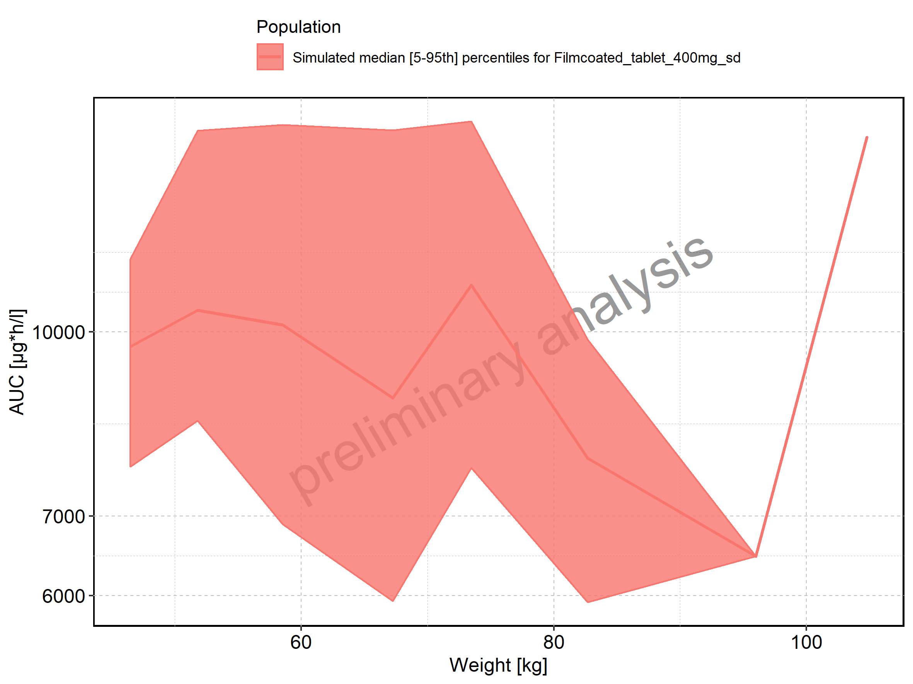

Figure 149: BMI-dependence of AUC for Larson 2013 8y-18y 400mg FCT meal in comparison to Filmcoated\_tablet\_400mg\_sd. Profiles are plotted in a linear scale.

Figure 150: BMI-dependence of AUC for Larson 2013 8y-18y 400mg FCT meal in comparison to Filmcoated\_tablet\_400mg\_sd. Profiles are plotted in a logarithmic scale.

Figure 151: BMI-dependence of AUC for Larson 2013 8y-18y 400mg FCT meal. Profiles are plotted in a linear scale.

Figure 152: BMI-dependence of AUC for Larson 2013 8y-18y 400mg FCT meal. Profiles are plotted in a logarithmic scale.

Figure 153: BMI-dependence of AUC for Filmcoated\_tablet\_400mg\_sd. Profiles are plotted in a linear scale.

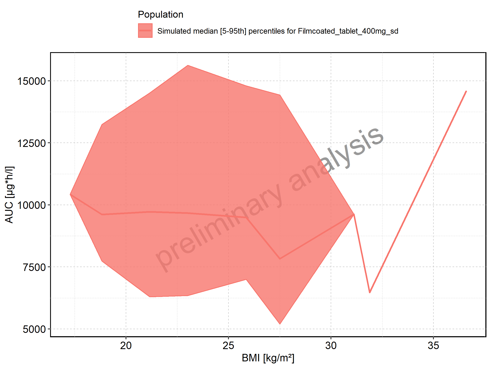

Figure 154: BMI-dependence of AUC for Filmcoated\_tablet\_400mg\_sd. Profiles are plotted in a logarithmic scale.

Figure 155: Gender-dependence of AUC for Larson 2013 8y-18y 400mg FCT meal in comparison to Filmcoated\_tablet\_400mg\_sd. Profiles are plotted in a linear scale.

Figure 156: Gender-dependence of AUC for Larson 2013 8y-18y 400mg FCT meal in comparison to Filmcoated\_tablet\_400mg\_sd. Profiles are plotted in a logarithmic scale.

Figure 157: Gender-dependence of AUC for Larson 2013 8y-18y 400mg FCT meal. Profiles are plotted in a linear scale.

Figure 158: Gender-dependence of AUC for Larson 2013 8y-18y 400mg FCT meal. Profiles are plotted in a logarithmic scale.

Figure 159: Gender-dependence of AUC for Filmcoated\_tablet\_400mg\_sd. Profiles are plotted in a linear scale.

Figure 160: Gender-dependence of AUC for Filmcoated\_tablet\_400mg\_sd. Profiles are plotted in a logarithmic scale.

Figure 161: AUC\_norm of Raltegravir shown as box-whisker plot, which indicates the 5th, 25th, 50th, 75th, and 95th percentiles in linear scale.

| Population                        |   N | 5th percentile | 25th percentile | 50th percentile | 75th percentile | 95th percentile |     mean | standard deviation | geo mean | geo standard deviation |
| :-------------------------------- | --: | -------------: | --------------: | --------------: | --------------: | --------------: | -------: | -----------------: | -------: | ---------------------: |
| Larson 2013 8y-18y 400mg FCT meal | 500 |       1.009019 |        1.313048 |        1.626129 |        2.014454 |        2.708033 | 1.707981 |          0.5259173 | 1.631852 |               1.353277 |
| Filmcoated\_tablet\_400mg\_sd     | 100 |       1.176992 |        1.505393 |        1.758845 |        2.138354 |        2.719452 | 1.848670 |          0.4876934 | 1.785682 |               1.305605 |

Figure 162: AUC\_norm of Raltegravir shown as box-whisker plot, which indicates the 5th, 25th, 50th, 75th, and 95th percentiles in logarithmic scale.

Figure 163: Age-dependence of AUC\_norm for Larson 2013 8y-18y 400mg FCT meal in comparison to Filmcoated\_tablet\_400mg\_sd. Profiles are plotted in a linear scale.

Figure 164: Age-dependence of AUC\_norm for Larson 2013 8y-18y 400mg FCT meal in comparison to Filmcoated\_tablet\_400mg\_sd. Profiles are plotted in a logarithmic scale.

Figure 165: Age-dependence of AUC\_norm for Larson 2013 8y-18y 400mg FCT meal. Profiles are plotted in a linear scale.

Figure 166: Age-dependence of AUC\_norm for Larson 2013 8y-18y 400mg FCT meal. Profiles are plotted in a logarithmic scale.

Figure 167: Age-dependence of AUC\_norm for Filmcoated\_tablet\_400mg\_sd. Profiles are plotted in a linear scale.

Figure 168: Age-dependence of AUC\_norm for Filmcoated\_tablet\_400mg\_sd. Profiles are plotted in a logarithmic scale.

Figure 169: Height-dependence of AUC\_norm for Larson 2013 8y-18y 400mg FCT meal in comparison to Filmcoated\_tablet\_400mg\_sd. Profiles are plotted in a linear scale.

Figure 170: Height-dependence of AUC\_norm for Larson 2013 8y-18y 400mg FCT meal in comparison to Filmcoated\_tablet\_400mg\_sd. Profiles are plotted in a logarithmic scale.

Figure 171: Height-dependence of AUC\_norm for Larson 2013 8y-18y 400mg FCT meal. Profiles are plotted in a linear scale.

Figure 172: Height-dependence of AUC\_norm for Larson 2013 8y-18y 400mg FCT meal. Profiles are plotted in a logarithmic scale.

Figure 173: Height-dependence of AUC\_norm for Filmcoated\_tablet\_400mg\_sd. Profiles are plotted in a linear scale.

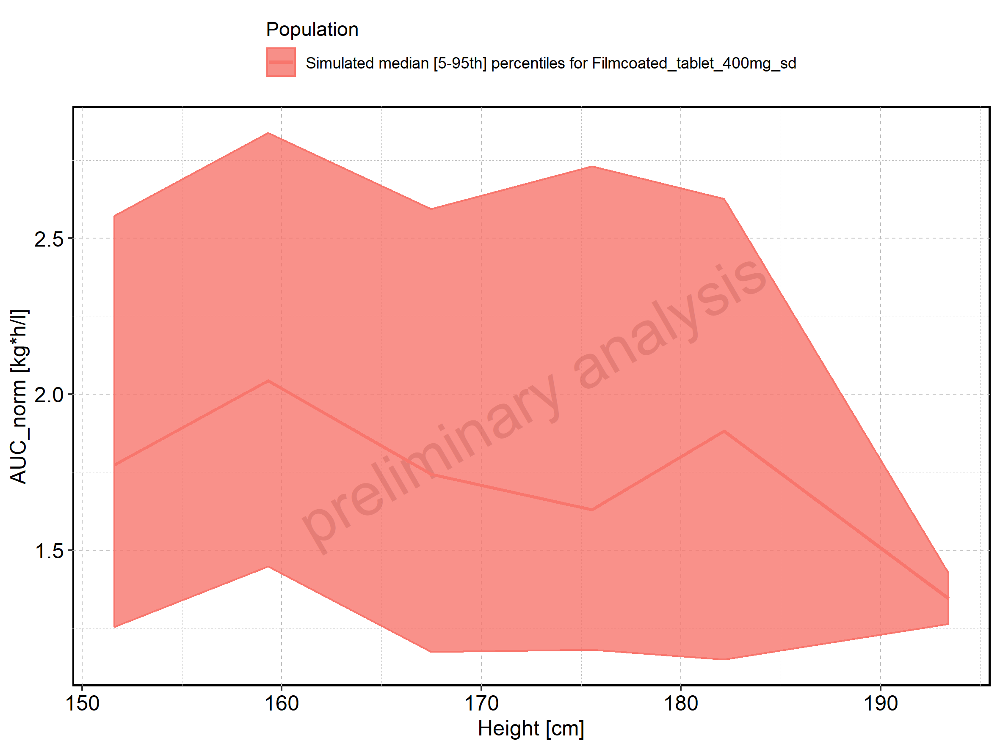

Figure 174: Height-dependence of AUC\_norm for Filmcoated\_tablet\_400mg\_sd. Profiles are plotted in a logarithmic scale.

Figure 175: Weight-dependence of AUC\_norm for Larson 2013 8y-18y 400mg FCT meal in comparison to Filmcoated\_tablet\_400mg\_sd. Profiles are plotted in a linear scale.

Figure 176: Weight-dependence of AUC\_norm for Larson 2013 8y-18y 400mg FCT meal in comparison to Filmcoated\_tablet\_400mg\_sd. Profiles are plotted in a logarithmic scale.

Figure 177: Weight-dependence of AUC\_norm for Larson 2013 8y-18y 400mg FCT meal. Profiles are plotted in a linear scale.

Figure 178: Weight-dependence of AUC\_norm for Larson 2013 8y-18y 400mg FCT meal. Profiles are plotted in a logarithmic scale.

Figure 179: Weight-dependence of AUC\_norm for Filmcoated\_tablet\_400mg\_sd. Profiles are plotted in a linear scale.

Figure 180: Weight-dependence of AUC\_norm for Filmcoated\_tablet\_400mg\_sd. Profiles are plotted in a logarithmic scale.

Figure 181: BMI-dependence of AUC\_norm for Larson 2013 8y-18y 400mg FCT meal in comparison to Filmcoated\_tablet\_400mg\_sd. Profiles are plotted in a linear scale.

Figure 182: BMI-dependence of AUC\_norm for Larson 2013 8y-18y 400mg FCT meal in comparison to Filmcoated\_tablet\_400mg\_sd. Profiles are plotted in a logarithmic scale.

Figure 183: BMI-dependence of AUC\_norm for Larson 2013 8y-18y 400mg FCT meal. Profiles are plotted in a linear scale.

Figure 184: BMI-dependence of AUC\_norm for Larson 2013 8y-18y 400mg FCT meal. Profiles are plotted in a logarithmic scale.

Figure 185: BMI-dependence of AUC\_norm for Filmcoated\_tablet\_400mg\_sd. Profiles are plotted in a linear scale.

Figure 186: BMI-dependence of AUC\_norm for Filmcoated\_tablet\_400mg\_sd. Profiles are plotted in a logarithmic scale.

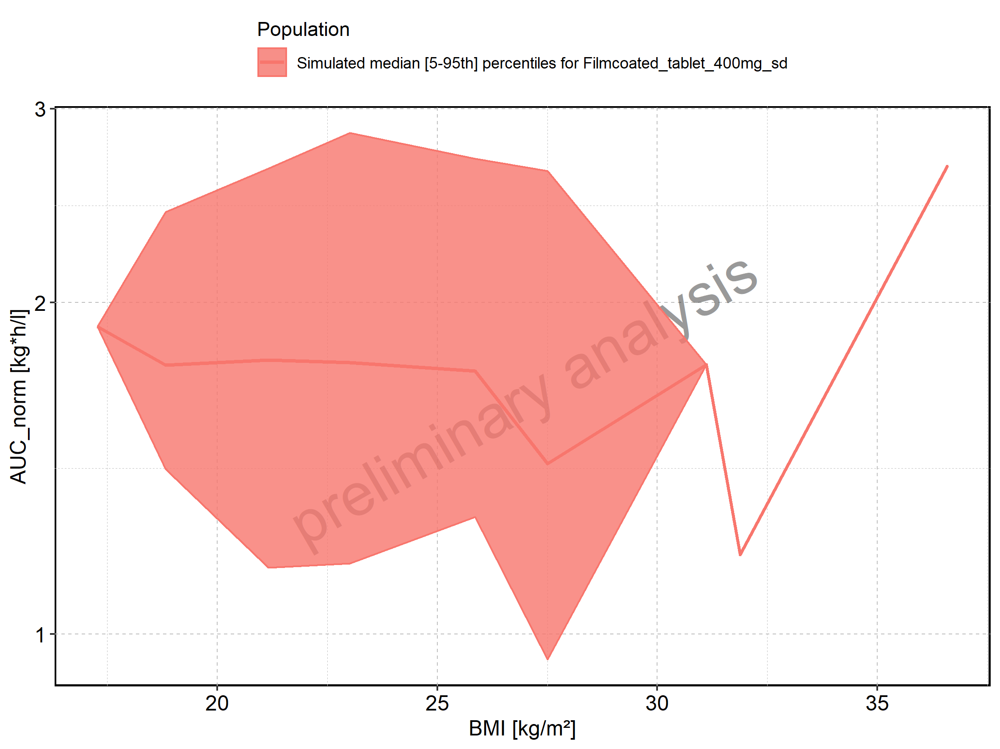

Figure 187: Gender-dependence of AUC\_norm for Larson 2013 8y-18y 400mg FCT meal in comparison to Filmcoated\_tablet\_400mg\_sd. Profiles are plotted in a linear scale.

Figure 188: Gender-dependence of AUC\_norm for Larson 2013 8y-18y 400mg FCT meal in comparison to Filmcoated\_tablet\_400mg\_sd. Profiles are plotted in a logarithmic scale.

Figure 189: Gender-dependence of AUC\_norm for Larson 2013 8y-18y 400mg FCT meal. Profiles are plotted in a linear scale.

Figure 190: Gender-dependence of AUC\_norm for Larson 2013 8y-18y 400mg FCT meal. Profiles are plotted in a logarithmic scale.

Figure 191: Gender-dependence of AUC\_norm for Filmcoated\_tablet\_400mg\_sd. Profiles are plotted in a linear scale.

Figure 192: Gender-dependence of AUC\_norm for Filmcoated\_tablet\_400mg\_sd. Profiles are plotted in a logarithmic scale.

Figure 193: AUC\_inf of Raltegravir shown as box-whisker plot, which indicates the 5th, 25th, 50th, 75th, and 95th percentiles in linear scale.

| Population                        |   N | 5th percentile | 25th percentile | 50th percentile | 75th percentile | 95th percentile |     mean | standard deviation | geo mean | geo standard deviation |
| :-------------------------------- | --: | -------------: | --------------: | --------------: | --------------: | --------------: | -------: | -----------------: | -------: | ---------------------: |
| Larson 2013 8y-18y 400mg FCT meal | 500 |       8017.562 |       10533.549 |        12921.05 |        15892.62 |        21707.95 | 13652.18 |           4460.211 |     0.00 |                     NA |
| Filmcoated\_tablet\_400mg\_sd     | 100 |       6771.970 |        8875.698 |        10112.32 |        12229.14 |        15523.15 | 10626.71 |           2757.612 | 10275.45 |               1.300506 |

Figure 194: AUC\_inf of Raltegravir shown as box-whisker plot, which indicates the 5th, 25th, 50th, 75th, and 95th percentiles in logarithmic scale.

Figure 195: Age-dependence of AUC\_inf for Larson 2013 8y-18y 400mg FCT meal in comparison to Filmcoated\_tablet\_400mg\_sd. Profiles are plotted in a linear scale.

Figure 196: Age-dependence of AUC\_inf for Larson 2013 8y-18y 400mg FCT meal in comparison to Filmcoated\_tablet\_400mg\_sd. Profiles are plotted in a logarithmic scale.

Figure 197: Age-dependence of AUC\_inf for Larson 2013 8y-18y 400mg FCT meal. Profiles are plotted in a linear scale.

Figure 198: Age-dependence of AUC\_inf for Larson 2013 8y-18y 400mg FCT meal. Profiles are plotted in a logarithmic scale.

Figure 199: Age-dependence of AUC\_inf for Filmcoated\_tablet\_400mg\_sd. Profiles are plotted in a linear scale.

Figure 200: Age-dependence of AUC\_inf for Filmcoated\_tablet\_400mg\_sd. Profiles are plotted in a logarithmic scale.

Figure 201: Height-dependence of AUC\_inf for Larson 2013 8y-18y 400mg FCT meal in comparison to Filmcoated\_tablet\_400mg\_sd. Profiles are plotted in a linear scale.

Figure 202: Height-dependence of AUC\_inf for Larson 2013 8y-18y 400mg FCT meal in comparison to Filmcoated\_tablet\_400mg\_sd. Profiles are plotted in a logarithmic scale.

Figure 203: Height-dependence of AUC\_inf for Larson 2013 8y-18y 400mg FCT meal. Profiles are plotted in a linear scale.

Figure 204: Height-dependence of AUC\_inf for Larson 2013 8y-18y 400mg FCT meal. Profiles are plotted in a logarithmic scale.

Figure 205: Height-dependence of AUC\_inf for Filmcoated\_tablet\_400mg\_sd. Profiles are plotted in a linear scale.

Figure 206: Height-dependence of AUC\_inf for Filmcoated\_tablet\_400mg\_sd. Profiles are plotted in a logarithmic scale.

Figure 207: Weight-dependence of AUC\_inf for Larson 2013 8y-18y 400mg FCT meal in comparison to Filmcoated\_tablet\_400mg\_sd. Profiles are plotted in a linear scale.

Figure 208: Weight-dependence of AUC\_inf for Larson 2013 8y-18y 400mg FCT meal in comparison to Filmcoated\_tablet\_400mg\_sd. Profiles are plotted in a logarithmic scale.

Figure 209: Weight-dependence of AUC\_inf for Larson 2013 8y-18y 400mg FCT meal. Profiles are plotted in a linear scale.

Figure 210: Weight-dependence of AUC\_inf for Larson 2013 8y-18y 400mg FCT meal. Profiles are plotted in a logarithmic scale.

Figure 211: Weight-dependence of AUC\_inf for Filmcoated\_tablet\_400mg\_sd. Profiles are plotted in a linear scale.

Figure 212: Weight-dependence of AUC\_inf for Filmcoated\_tablet\_400mg\_sd. Profiles are plotted in a logarithmic scale.

Figure 213: BMI-dependence of AUC\_inf for Larson 2013 8y-18y 400mg FCT meal in comparison to Filmcoated\_tablet\_400mg\_sd. Profiles are plotted in a linear scale.

Figure 214: BMI-dependence of AUC\_inf for Larson 2013 8y-18y 400mg FCT meal in comparison to Filmcoated\_tablet\_400mg\_sd. Profiles are plotted in a logarithmic scale.

Figure 215: BMI-dependence of AUC\_inf for Larson 2013 8y-18y 400mg FCT meal. Profiles are plotted in a linear scale.

Figure 216: BMI-dependence of AUC\_inf for Larson 2013 8y-18y 400mg FCT meal. Profiles are plotted in a logarithmic scale.

Figure 217: BMI-dependence of AUC\_inf for Filmcoated\_tablet\_400mg\_sd. Profiles are plotted in a linear scale.

Figure 218: BMI-dependence of AUC\_inf for Filmcoated\_tablet\_400mg\_sd. Profiles are plotted in a logarithmic scale.

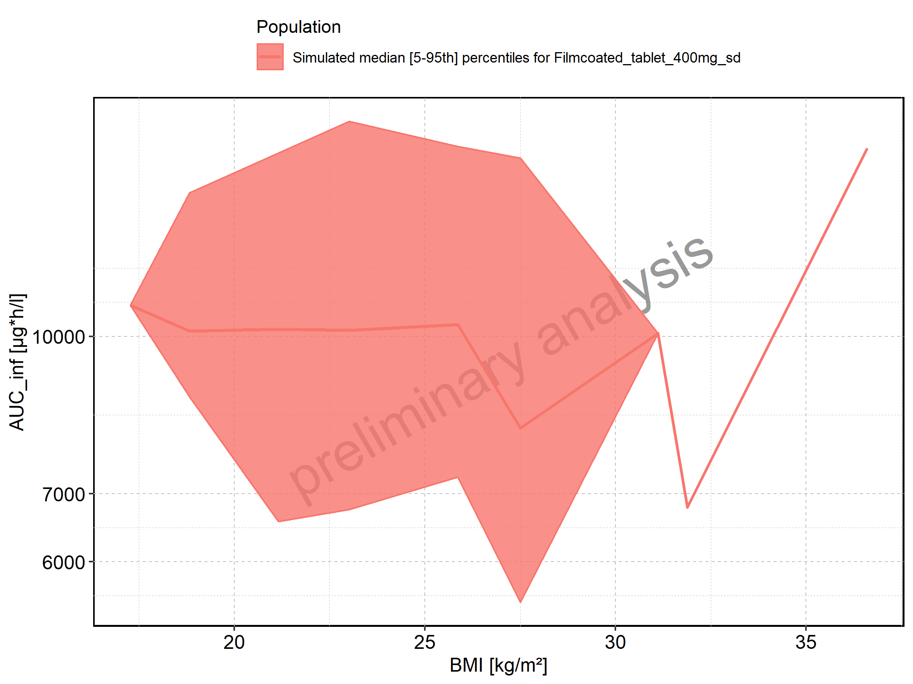

Figure 219: Gender-dependence of AUC\_inf for Larson 2013 8y-18y 400mg FCT meal in comparison to Filmcoated\_tablet\_400mg\_sd. Profiles are plotted in a linear scale.

Figure 220: Gender-dependence of AUC\_inf for Larson 2013 8y-18y 400mg FCT meal in comparison to Filmcoated\_tablet\_400mg\_sd. Profiles are plotted in a logarithmic scale.

Figure 221: Gender-dependence of AUC\_inf for Larson 2013 8y-18y 400mg FCT meal. Profiles are plotted in a linear scale.

Figure 222: Gender-dependence of AUC\_inf for Larson 2013 8y-18y 400mg FCT meal. Profiles are plotted in a logarithmic scale.

Figure 223: Gender-dependence of AUC\_inf for Filmcoated\_tablet\_400mg\_sd. Profiles are plotted in a linear scale.

Figure 224: Gender-dependence of AUC\_inf for Filmcoated\_tablet\_400mg\_sd. Profiles are plotted in a logarithmic scale.

Figure 225: AUC\_inf\_norm of Raltegravir shown as box-whisker plot, which indicates the 5th, 25th, 50th, 75th, and 95th percentiles in linear scale.

| Population                        |   N | 5th percentile | 25th percentile | 50th percentile | 75th percentile | 95th percentile |     mean | standard deviation | geo mean | geo standard deviation |
| :-------------------------------- | --: | -------------: | --------------: | --------------: | --------------: | --------------: | -------: | -----------------: | -------: | ---------------------: |
| Larson 2013 8y-18y 400mg FCT meal | 500 |       1.122459 |        1.474697 |        1.808947 |        2.224967 |        3.039113 | 1.911305 |          0.6244296 | 0.000000 |                     NA |
| Filmcoated\_tablet\_400mg\_sd     | 100 |       1.235885 |        1.619815 |        1.845499 |        2.231818 |        2.832975 | 1.939375 |          0.5032643 | 1.875269 |               1.300506 |

Figure 226: AUC\_inf\_norm of Raltegravir shown as box-whisker plot, which indicates the 5th, 25th, 50th, 75th, and 95th percentiles in logarithmic scale.

Figure 227: Age-dependence of AUC\_inf\_norm for Larson 2013 8y-18y 400mg FCT meal in comparison to Filmcoated\_tablet\_400mg\_sd. Profiles are plotted in a linear scale.

Figure 228: Age-dependence of AUC\_inf\_norm for Larson 2013 8y-18y 400mg FCT meal in comparison to Filmcoated\_tablet\_400mg\_sd. Profiles are plotted in a logarithmic scale.

Figure 229: Age-dependence of AUC\_inf\_norm for Larson 2013 8y-18y 400mg FCT meal. Profiles are plotted in a linear scale.

Figure 230: Age-dependence of AUC\_inf\_norm for Larson 2013 8y-18y 400mg FCT meal. Profiles are plotted in a logarithmic scale.

Figure 231: Age-dependence of AUC\_inf\_norm for Filmcoated\_tablet\_400mg\_sd. Profiles are plotted in a linear scale.

Figure 232: Age-dependence of AUC\_inf\_norm for Filmcoated\_tablet\_400mg\_sd. Profiles are plotted in a logarithmic scale.

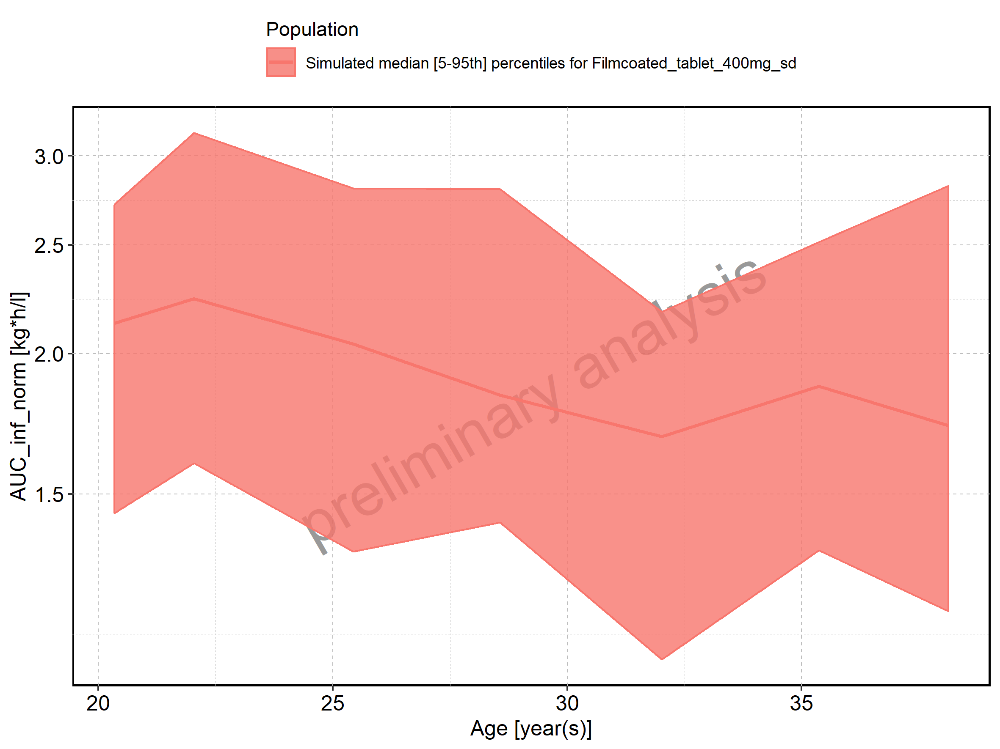

Figure 233: Height-dependence of AUC\_inf\_norm for Larson 2013 8y-18y 400mg FCT meal in comparison to Filmcoated\_tablet\_400mg\_sd. Profiles are plotted in a linear scale.

Figure 234: Height-dependence of AUC\_inf\_norm for Larson 2013 8y-18y 400mg FCT meal in comparison to Filmcoated\_tablet\_400mg\_sd. Profiles are plotted in a logarithmic scale.

Figure 235: Height-dependence of AUC\_inf\_norm for Larson 2013 8y-18y 400mg FCT meal. Profiles are plotted in a linear scale.

Figure 236: Height-dependence of AUC\_inf\_norm for Larson 2013 8y-18y 400mg FCT meal. Profiles are plotted in a logarithmic scale.

Figure 237: Height-dependence of AUC\_inf\_norm for Filmcoated\_tablet\_400mg\_sd. Profiles are plotted in a linear scale.

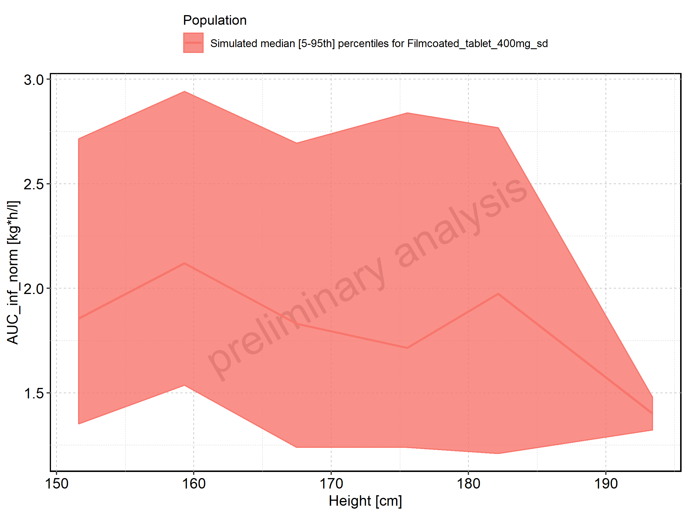

Figure 238: Height-dependence of AUC\_inf\_norm for Filmcoated\_tablet\_400mg\_sd. Profiles are plotted in a logarithmic scale.

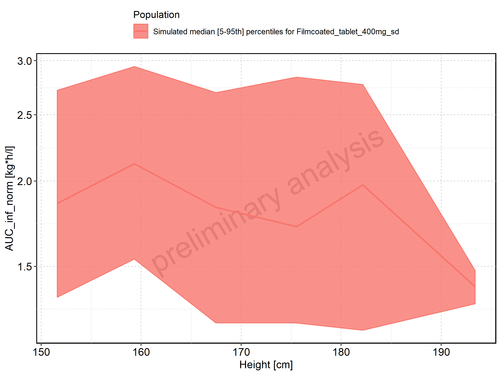

Figure 239: Weight-dependence of AUC\_inf\_norm for Larson 2013 8y-18y 400mg FCT meal in comparison to Filmcoated\_tablet\_400mg\_sd. Profiles are plotted in a linear scale.

Figure 240: Weight-dependence of AUC\_inf\_norm for Larson 2013 8y-18y 400mg FCT meal in comparison to Filmcoated\_tablet\_400mg\_sd. Profiles are plotted in a logarithmic scale.

Figure 241: Weight-dependence of AUC\_inf\_norm for Larson 2013 8y-18y 400mg FCT meal. Profiles are plotted in a linear scale.

Figure 242: Weight-dependence of AUC\_inf\_norm for Larson 2013 8y-18y 400mg FCT meal. Profiles are plotted in a logarithmic scale.

Figure 243: Weight-dependence of AUC\_inf\_norm for Filmcoated\_tablet\_400mg\_sd. Profiles are plotted in a linear scale.

Figure 244: Weight-dependence of AUC\_inf\_norm for Filmcoated\_tablet\_400mg\_sd. Profiles are plotted in a logarithmic scale.

Figure 245: BMI-dependence of AUC\_inf\_norm for Larson 2013 8y-18y 400mg FCT meal in comparison to Filmcoated\_tablet\_400mg\_sd. Profiles are plotted in a linear scale.

Figure 246: BMI-dependence of AUC\_inf\_norm for Larson 2013 8y-18y 400mg FCT meal in comparison to Filmcoated\_tablet\_400mg\_sd. Profiles are plotted in a logarithmic scale.

Figure 247: BMI-dependence of AUC\_inf\_norm for Larson 2013 8y-18y 400mg FCT meal. Profiles are plotted in a linear scale.

Figure 248: BMI-dependence of AUC\_inf\_norm for Larson 2013 8y-18y 400mg FCT meal. Profiles are plotted in a logarithmic scale.

Figure 249: BMI-dependence of AUC\_inf\_norm for Filmcoated\_tablet\_400mg\_sd. Profiles are plotted in a linear scale.

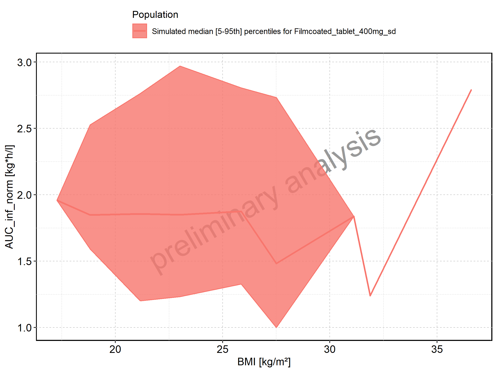

Figure 250: BMI-dependence of AUC\_inf\_norm for Filmcoated\_tablet\_400mg\_sd. Profiles are plotted in a logarithmic scale.

Figure 251: Gender-dependence of AUC\_inf\_norm for Larson 2013 8y-18y 400mg FCT meal in comparison to Filmcoated\_tablet\_400mg\_sd. Profiles are plotted in a linear scale.

Figure 252: Gender-dependence of AUC\_inf\_norm for Larson 2013 8y-18y 400mg FCT meal in comparison to Filmcoated\_tablet\_400mg\_sd. Profiles are plotted in a logarithmic scale.

Figure 253: Gender-dependence of AUC\_inf\_norm for Larson 2013 8y-18y 400mg FCT meal. Profiles are plotted in a linear scale.

Figure 254: Gender-dependence of AUC\_inf\_norm for Larson 2013 8y-18y 400mg FCT meal. Profiles are plotted in a logarithmic scale.

Figure 255: Gender-dependence of AUC\_inf\_norm for Filmcoated\_tablet\_400mg\_sd. Profiles are plotted in a linear scale.

Figure 256: Gender-dependence of AUC\_inf\_norm for Filmcoated\_tablet\_400mg\_sd. Profiles are plotted in a logarithmic scale.

Figure 257: MRT of Raltegravir shown as box-whisker plot, which indicates the 5th, 25th, 50th, 75th, and 95th percentiles in linear scale.

| Population                        |   N | 5th percentile | 25th percentile | 50th percentile | 75th percentile | 95th percentile |    mean | standard deviation | geo mean | geo standard deviation |
| :-------------------------------- | --: | -------------: | --------------: | --------------: | --------------: | --------------: | ------: | -----------------: | -------: | ---------------------: |
| Larson 2013 8y-18y 400mg FCT meal | 497 |       3.883445 |        4.609144 |        5.323850 |        6.221885 |       10.309078 | 6.26299 |           5.564334 | 5.638130 |               1.436885 |
| Filmcoated\_tablet\_400mg\_sd     | 100 |       4.431077 |        4.803066 |        5.199119 |        5.682457 |        6.697588 | 5.43842 |           1.539075 | 5.318614 |               1.206249 |

Figure 258: MRT of Raltegravir shown as box-whisker plot, which indicates the 5th, 25th, 50th, 75th, and 95th percentiles in logarithmic scale.

Figure 259: Age-dependence of MRT for Larson 2013 8y-18y 400mg FCT meal in comparison to Filmcoated\_tablet\_400mg\_sd. Profiles are plotted in a linear scale.

Figure 260: Age-dependence of MRT for Larson 2013 8y-18y 400mg FCT meal in comparison to Filmcoated\_tablet\_400mg\_sd. Profiles are plotted in a logarithmic scale.

Figure 261: Age-dependence of MRT for Larson 2013 8y-18y 400mg FCT meal. Profiles are plotted in a linear scale.

Figure 262: Age-dependence of MRT for Larson 2013 8y-18y 400mg FCT meal. Profiles are plotted in a logarithmic scale.

Figure 263: Age-dependence of MRT for Filmcoated\_tablet\_400mg\_sd. Profiles are plotted in a linear scale.

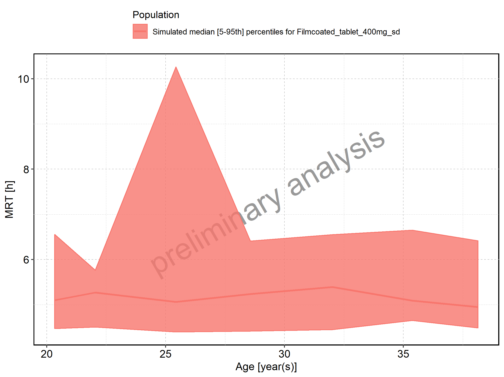

Figure 264: Age-dependence of MRT for Filmcoated\_tablet\_400mg\_sd. Profiles are plotted in a logarithmic scale.

Figure 265: Height-dependence of MRT for Larson 2013 8y-18y 400mg FCT meal in comparison to Filmcoated\_tablet\_400mg\_sd. Profiles are plotted in a linear scale.

Figure 266: Height-dependence of MRT for Larson 2013 8y-18y 400mg FCT meal in comparison to Filmcoated\_tablet\_400mg\_sd. Profiles are plotted in a logarithmic scale.

Figure 267: Height-dependence of MRT for Larson 2013 8y-18y 400mg FCT meal. Profiles are plotted in a linear scale.

Figure 268: Height-dependence of MRT for Larson 2013 8y-18y 400mg FCT meal. Profiles are plotted in a logarithmic scale.

Figure 269: Height-dependence of MRT for Filmcoated\_tablet\_400mg\_sd. Profiles are plotted in a linear scale.

Figure 270: Height-dependence of MRT for Filmcoated\_tablet\_400mg\_sd. Profiles are plotted in a logarithmic scale.

Figure 271: Weight-dependence of MRT for Larson 2013 8y-18y 400mg FCT meal in comparison to Filmcoated\_tablet\_400mg\_sd. Profiles are plotted in a linear scale.

Figure 272: Weight-dependence of MRT for Larson 2013 8y-18y 400mg FCT meal in comparison to Filmcoated\_tablet\_400mg\_sd. Profiles are plotted in a logarithmic scale.

Figure 273: Weight-dependence of MRT for Larson 2013 8y-18y 400mg FCT meal. Profiles are plotted in a linear scale.

Figure 274: Weight-dependence of MRT for Larson 2013 8y-18y 400mg FCT meal. Profiles are plotted in a logarithmic scale.

Figure 275: Weight-dependence of MRT for Filmcoated\_tablet\_400mg\_sd. Profiles are plotted in a linear scale.

Figure 276: Weight-dependence of MRT for Filmcoated\_tablet\_400mg\_sd. Profiles are plotted in a logarithmic scale.

Figure 277: BMI-dependence of MRT for Larson 2013 8y-18y 400mg FCT meal in comparison to Filmcoated\_tablet\_400mg\_sd. Profiles are plotted in a linear scale.

Figure 278: BMI-dependence of MRT for Larson 2013 8y-18y 400mg FCT meal in comparison to Filmcoated\_tablet\_400mg\_sd. Profiles are plotted in a logarithmic scale.

Figure 279: BMI-dependence of MRT for Larson 2013 8y-18y 400mg FCT meal. Profiles are plotted in a linear scale.

Figure 280: BMI-dependence of MRT for Larson 2013 8y-18y 400mg FCT meal. Profiles are plotted in a logarithmic scale.

Figure 281: BMI-dependence of MRT for Filmcoated\_tablet\_400mg\_sd. Profiles are plotted in a linear scale.

Figure 282: BMI-dependence of MRT for Filmcoated\_tablet\_400mg\_sd. Profiles are plotted in a logarithmic scale.

Figure 283: Gender-dependence of MRT for Larson 2013 8y-18y 400mg FCT meal in comparison to Filmcoated\_tablet\_400mg\_sd. Profiles are plotted in a linear scale.

Figure 284: Gender-dependence of MRT for Larson 2013 8y-18y 400mg FCT meal in comparison to Filmcoated\_tablet\_400mg\_sd. Profiles are plotted in a logarithmic scale.

Figure 285: Gender-dependence of MRT for Larson 2013 8y-18y 400mg FCT meal. Profiles are plotted in a linear scale.

Figure 286: Gender-dependence of MRT for Larson 2013 8y-18y 400mg FCT meal. Profiles are plotted in a logarithmic scale.

Figure 287: Gender-dependence of MRT for Filmcoated\_tablet\_400mg\_sd. Profiles are plotted in a linear scale.

Figure 288: Gender-dependence of MRT for Filmcoated\_tablet\_400mg\_sd. Profiles are plotted in a logarithmic scale.

Figure 289: Thalf of Raltegravir shown as box-whisker plot, which indicates the 5th, 25th, 50th, 75th, and 95th percentiles in linear scale.

| Population                        |   N | 5th percentile | 25th percentile | 50th percentile | 75th percentile | 95th percentile |     mean | standard deviation | geo mean | geo standard deviation |
| :-------------------------------- | --: | -------------: | --------------: | --------------: | --------------: | --------------: | -------: | -----------------: | -------: | ---------------------: |
| Larson 2013 8y-18y 400mg FCT meal | 500 |       2.549721 |        3.014642 |        3.492027 |        4.299532 |        9.428484 | 3.895567 |          10.493434 |       NA |                     NA |
| Filmcoated\_tablet\_400mg\_sd     | 100 |       5.739979 |        8.084065 |        9.195944 |       11.176013 |       16.813811 | 9.987298 |           3.182538 | 9.545373 |               1.348088 |

Figure 290: Thalf of Raltegravir shown as box-whisker plot, which indicates the 5th, 25th, 50th, 75th, and 95th percentiles in logarithmic scale.

Figure 291: Age-dependence of Thalf for Larson 2013 8y-18y 400mg FCT meal in comparison to Filmcoated\_tablet\_400mg\_sd. Profiles are plotted in a linear scale.

Figure 292: Age-dependence of Thalf for Larson 2013 8y-18y 400mg FCT meal in comparison to Filmcoated\_tablet\_400mg\_sd. Profiles are plotted in a logarithmic scale.

Figure 293: Age-dependence of Thalf for Larson 2013 8y-18y 400mg FCT meal. Profiles are plotted in a linear scale.

Figure 294: Age-dependence of Thalf for Larson 2013 8y-18y 400mg FCT meal. Profiles are plotted in a logarithmic scale.

Figure 295: Age-dependence of Thalf for Filmcoated\_tablet\_400mg\_sd. Profiles are plotted in a linear scale.

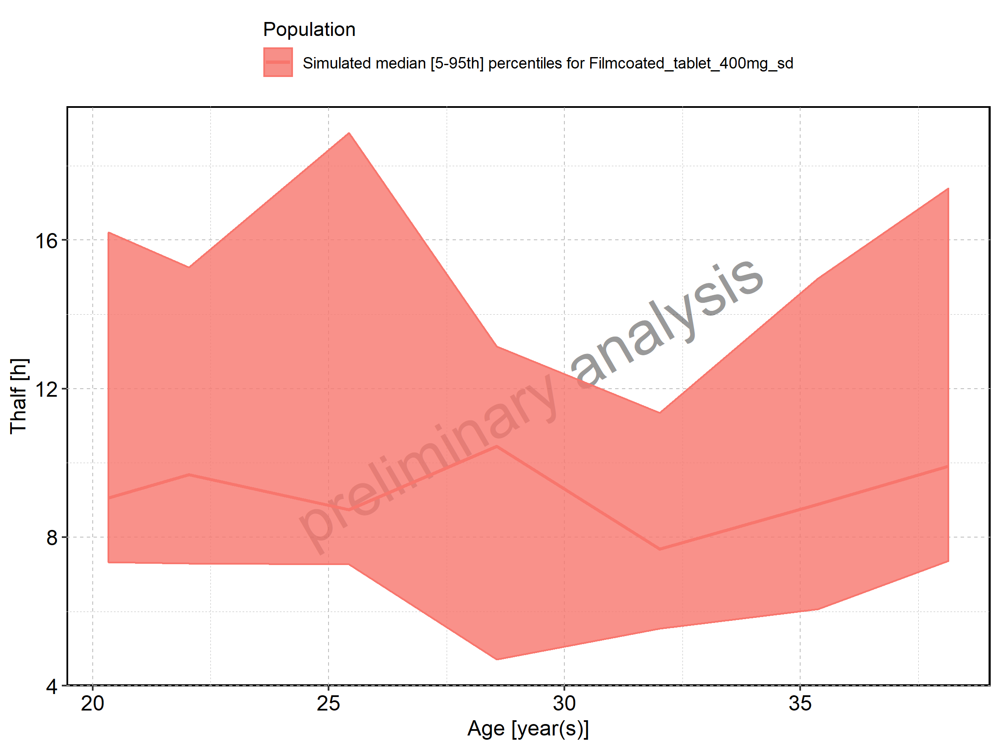

Figure 296: Age-dependence of Thalf for Filmcoated\_tablet\_400mg\_sd. Profiles are plotted in a logarithmic scale.

Figure 297: Height-dependence of Thalf for Larson 2013 8y-18y 400mg FCT meal in comparison to Filmcoated\_tablet\_400mg\_sd. Profiles are plotted in a linear scale.

Figure 298: Height-dependence of Thalf for Larson 2013 8y-18y 400mg FCT meal in comparison to Filmcoated\_tablet\_400mg\_sd. Profiles are plotted in a logarithmic scale.

Figure 299: Height-dependence of Thalf for Larson 2013 8y-18y 400mg FCT meal. Profiles are plotted in a linear scale.

Figure 300: Height-dependence of Thalf for Larson 2013 8y-18y 400mg FCT meal. Profiles are plotted in a logarithmic scale.

Figure 301: Height-dependence of Thalf for Filmcoated\_tablet\_400mg\_sd. Profiles are plotted in a linear scale.

Figure 302: Height-dependence of Thalf for Filmcoated\_tablet\_400mg\_sd. Profiles are plotted in a logarithmic scale.

Figure 303: Weight-dependence of Thalf for Larson 2013 8y-18y 400mg FCT meal in comparison to Filmcoated\_tablet\_400mg\_sd. Profiles are plotted in a linear scale.

Figure 304: Weight-dependence of Thalf for Larson 2013 8y-18y 400mg FCT meal in comparison to Filmcoated\_tablet\_400mg\_sd. Profiles are plotted in a logarithmic scale.

Figure 305: Weight-dependence of Thalf for Larson 2013 8y-18y 400mg FCT meal. Profiles are plotted in a linear scale.

Figure 306: Weight-dependence of Thalf for Larson 2013 8y-18y 400mg FCT meal. Profiles are plotted in a logarithmic scale.

Figure 307: Weight-dependence of Thalf for Filmcoated\_tablet\_400mg\_sd. Profiles are plotted in a linear scale.

Figure 308: Weight-dependence of Thalf for Filmcoated\_tablet\_400mg\_sd. Profiles are plotted in a logarithmic scale.

Figure 309: BMI-dependence of Thalf for Larson 2013 8y-18y 400mg FCT meal in comparison to Filmcoated\_tablet\_400mg\_sd. Profiles are plotted in a linear scale.

Figure 310: BMI-dependence of Thalf for Larson 2013 8y-18y 400mg FCT meal in comparison to Filmcoated\_tablet\_400mg\_sd. Profiles are plotted in a logarithmic scale.

Figure 311: BMI-dependence of Thalf for Larson 2013 8y-18y 400mg FCT meal. Profiles are plotted in a linear scale.

Figure 312: BMI-dependence of Thalf for Larson 2013 8y-18y 400mg FCT meal. Profiles are plotted in a logarithmic scale.

Figure 313: BMI-dependence of Thalf for Filmcoated\_tablet\_400mg\_sd. Profiles are plotted in a linear scale.

Figure 314: BMI-dependence of Thalf for Filmcoated\_tablet\_400mg\_sd. Profiles are plotted in a logarithmic scale.

Figure 315: Gender-dependence of Thalf for Larson 2013 8y-18y 400mg FCT meal in comparison to Filmcoated\_tablet\_400mg\_sd. Profiles are plotted in a linear scale.

Figure 316: Gender-dependence of Thalf for Larson 2013 8y-18y 400mg FCT meal in comparison to Filmcoated\_tablet\_400mg\_sd. Profiles are plotted in a logarithmic scale.

Figure 317: Gender-dependence of Thalf for Larson 2013 8y-18y 400mg FCT meal. Profiles are plotted in a linear scale.

Figure 318: Gender-dependence of Thalf for Larson 2013 8y-18y 400mg FCT meal. Profiles are plotted in a logarithmic scale.

Figure 319: Gender-dependence of Thalf for Filmcoated\_tablet\_400mg\_sd. Profiles are plotted in a linear scale.

Figure 320: Gender-dependence of Thalf for Filmcoated\_tablet\_400mg\_sd. Profiles are plotted in a logarithmic scale.

Figure 321: Vss of Raltegravir shown as box-whisker plot, which indicates the 5th, 25th, 50th, 75th, and 95th percentiles in linear scale.

| Population                        |   N | 5th percentile | 25th percentile | 50th percentile | 75th percentile | 95th percentile |     mean | standard deviation | geo mean | geo standard deviation |
| :-------------------------------- | --: | -------------: | --------------: | --------------: | --------------: | --------------: | -------: | -----------------: | -------: | ---------------------: |
| Larson 2013 8y-18y 400mg FCT meal | 497 |       1581.086 |        2341.617 |        2968.180 |        3917.840 |        6249.022 | 3396.626 |           1880.053 | 3071.482 |               1.528279 |
| Filmcoated\_tablet\_400mg\_sd     | 100 |       1880.267 |        2263.552 |        2695.832 |        3418.902 |        4890.574 | 2993.695 |           1138.953 | 2836.187 |               1.369004 |

Figure 322: Vss of Raltegravir shown as box-whisker plot, which indicates the 5th, 25th, 50th, 75th, and 95th percentiles in logarithmic scale.

Figure 323: Age-dependence of Vss for Larson 2013 8y-18y 400mg FCT meal in comparison to Filmcoated\_tablet\_400mg\_sd. Profiles are plotted in a linear scale.

Figure 324: Age-dependence of Vss for Larson 2013 8y-18y 400mg FCT meal in comparison to Filmcoated\_tablet\_400mg\_sd. Profiles are plotted in a logarithmic scale.

Figure 325: Age-dependence of Vss for Larson 2013 8y-18y 400mg FCT meal. Profiles are plotted in a linear scale.

Figure 326: Age-dependence of Vss for Larson 2013 8y-18y 400mg FCT meal. Profiles are plotted in a logarithmic scale.

Figure 327: Age-dependence of Vss for Filmcoated\_tablet\_400mg\_sd. Profiles are plotted in a linear scale.

Figure 328: Age-dependence of Vss for Filmcoated\_tablet\_400mg\_sd. Profiles are plotted in a logarithmic scale.

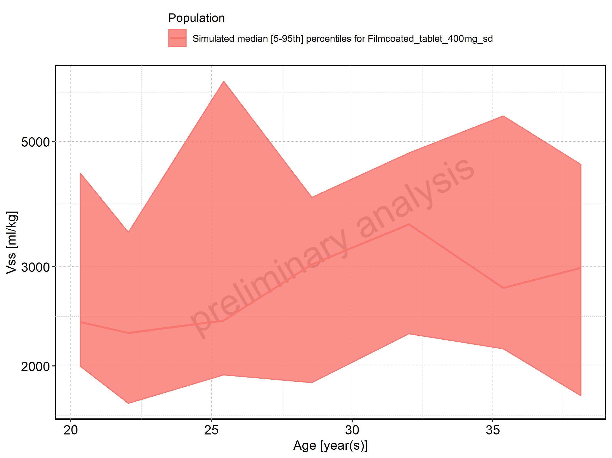

Figure 329: Height-dependence of Vss for Larson 2013 8y-18y 400mg FCT meal in comparison to Filmcoated\_tablet\_400mg\_sd. Profiles are plotted in a linear scale.

Figure 330: Height-dependence of Vss for Larson 2013 8y-18y 400mg FCT meal in comparison to Filmcoated\_tablet\_400mg\_sd. Profiles are plotted in a logarithmic scale.

Figure 331: Height-dependence of Vss for Larson 2013 8y-18y 400mg FCT meal. Profiles are plotted in a linear scale.

Figure 332: Height-dependence of Vss for Larson 2013 8y-18y 400mg FCT meal. Profiles are plotted in a logarithmic scale.

Figure 333: Height-dependence of Vss for Filmcoated\_tablet\_400mg\_sd. Profiles are plotted in a linear scale.

Figure 334: Height-dependence of Vss for Filmcoated\_tablet\_400mg\_sd. Profiles are plotted in a logarithmic scale.

Figure 335: Weight-dependence of Vss for Larson 2013 8y-18y 400mg FCT meal in comparison to Filmcoated\_tablet\_400mg\_sd. Profiles are plotted in a linear scale.

Figure 336: Weight-dependence of Vss for Larson 2013 8y-18y 400mg FCT meal in comparison to Filmcoated\_tablet\_400mg\_sd. Profiles are plotted in a logarithmic scale.

Figure 337: Weight-dependence of Vss for Larson 2013 8y-18y 400mg FCT meal. Profiles are plotted in a linear scale.

Figure 338: Weight-dependence of Vss for Larson 2013 8y-18y 400mg FCT meal. Profiles are plotted in a logarithmic scale.

Figure 339: Weight-dependence of Vss for Filmcoated\_tablet\_400mg\_sd. Profiles are plotted in a linear scale.

Figure 340: Weight-dependence of Vss for Filmcoated\_tablet\_400mg\_sd. Profiles are plotted in a logarithmic scale.

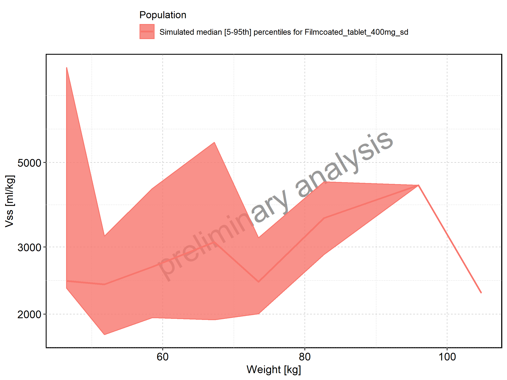

Figure 341: BMI-dependence of Vss for Larson 2013 8y-18y 400mg FCT meal in comparison to Filmcoated\_tablet\_400mg\_sd. Profiles are plotted in a linear scale.

Figure 342: BMI-dependence of Vss for Larson 2013 8y-18y 400mg FCT meal in comparison to Filmcoated\_tablet\_400mg\_sd. Profiles are plotted in a logarithmic scale.

Figure 343: BMI-dependence of Vss for Larson 2013 8y-18y 400mg FCT meal. Profiles are plotted in a linear scale.

Figure 344: BMI-dependence of Vss for Larson 2013 8y-18y 400mg FCT meal. Profiles are plotted in a logarithmic scale.

Figure 345: BMI-dependence of Vss for Filmcoated\_tablet\_400mg\_sd. Profiles are plotted in a linear scale.

Figure 346: BMI-dependence of Vss for Filmcoated\_tablet\_400mg\_sd. Profiles are plotted in a logarithmic scale.

Figure 347: Gender-dependence of Vss for Larson 2013 8y-18y 400mg FCT meal in comparison to Filmcoated\_tablet\_400mg\_sd. Profiles are plotted in a linear scale.

Figure 348: Gender-dependence of Vss for Larson 2013 8y-18y 400mg FCT meal in comparison to Filmcoated\_tablet\_400mg\_sd. Profiles are plotted in a logarithmic scale.

Figure 349: Gender-dependence of Vss for Larson 2013 8y-18y 400mg FCT meal. Profiles are plotted in a linear scale.

Figure 350: Gender-dependence of Vss for Larson 2013 8y-18y 400mg FCT meal. Profiles are plotted in a logarithmic scale.

Figure 351: Gender-dependence of Vss for Filmcoated\_tablet\_400mg\_sd. Profiles are plotted in a linear scale.

Figure 352: Gender-dependence of Vss for Filmcoated\_tablet\_400mg\_sd. Profiles are plotted in a logarithmic scale.

# 2\. Time profiles and residual plots

## 2.1. Time profiles and residual plots for Larson 2013 8y-18y 400mg FCT meal

Figure 353: Time profiles of Larson 2013 8y-18y 400mg FCT meal for Larson 2013 8-18y meal. Data source: /mnt/c/SW-Dev/2R/02\_TestPublic/03\_Population\_Pediatric\_Raltegavir/Data/Raltegravir\_PK.txt. Time profiles are plotted in a linear scale.

Figure 354: Time profiles of Larson 2013 8y-18y 400mg FCT meal for Larson 2013 8-18y meal. Data source: /mnt/c/SW-Dev/2R/02\_TestPublic/03\_Population\_Pediatric\_Raltegavir/Data/Raltegravir\_PK.txt. Time profiles are plotted in a logarithmic scale.

Figure 355: Predicted vs observed of Larson 2013 8y-18y 400mg FCT meal for Larson 2013 8-18y meal. Data source: /mnt/c/SW-Dev/2R/02\_TestPublic/03\_Population\_Pediatric\_Raltegavir/Data/Raltegravir\_PK.txt. Predictions and observations are plotted in a linear scale.

Figure 356: Predicted vs observed of Larson 2013 8y-18y 400mg FCT meal for Larson 2013 8-18y meal. Data source: /mnt/c/SW-Dev/2R/02\_TestPublic/03\_Population\_Pediatric\_Raltegavir/Data/Raltegravir\_PK.txt. Predictions and observations are plotted in a logarithmic scale.

Figure 357: Logarithmic residuals vs predicted values of Larson 2013 8y-18y 400mg FCT meal for Larson 2013 8-18y meal. Data source: /mnt/c/SW-Dev/2R/02\_TestPublic/03\_Population\_Pediatric\_Raltegavir/Data/Raltegravir\_PK.txt.

Figure 358: Logarithmic residuals vs time of Larson 2013 8y-18y 400mg FCT meal for Larson 2013 8-18y meal. Data source: /mnt/c/SW-Dev/2R/02\_TestPublic/03\_Population\_Pediatric\_Raltegavir/Data/Raltegravir\_PK.txt.

Figure 359: Logarithmic residuals distribution of Larson 2013 8y-18y 400mg FCT meal for Larson 2013 8-18y meal. Data source: /mnt/c/SW-Dev/2R/02\_TestPublic/03\_Population\_Pediatric\_Raltegavir/Data/Raltegravir\_PK.txt.

Figure 360: Logarithmic residuals of Larson 2013 8y-18y 400mg FCT meal for Larson 2013 8-18y meal. Data source: /mnt/c/SW-Dev/2R/02\_TestPublic/03\_Population\_Pediatric\_Raltegavir/Data/Raltegravir\_PK.txt as quantile-quantile plot.

## 2.2. Time profiles and residual plots for Filmcoated\_tablet\_400mg\_sd

Figure 361: Time profiles of Filmcoated\_tablet\_400mg\_sd for Raltegravir 400mg filmcoated tablet. Data source: /mnt/c/SW-Dev/2R/02\_TestPublic/03\_Population\_Pediatric\_Raltegavir/Data/Raltegravir\_PK.txt. Time profiles are plotted in a linear scale.

Figure 362: Time profiles of Filmcoated\_tablet\_400mg\_sd for Raltegravir 400mg filmcoated tablet. Data source: /mnt/c/SW-Dev/2R/02\_TestPublic/03\_Population\_Pediatric\_Raltegavir/Data/Raltegravir\_PK.txt. Time profiles are plotted in a logarithmic scale.

Figure 363: Predicted vs observed of Filmcoated\_tablet\_400mg\_sd for Raltegravir 400mg filmcoated tablet. Data source: /mnt/c/SW-Dev/2R/02\_TestPublic/03\_Population\_Pediatric\_Raltegavir/Data/Raltegravir\_PK.txt. Predictions and observations are plotted in a linear scale.

Figure 364: Predicted vs observed of Filmcoated\_tablet\_400mg\_sd for Raltegravir 400mg filmcoated tablet. Data source: /mnt/c/SW-Dev/2R/02\_TestPublic/03\_Population\_Pediatric\_Raltegavir/Data/Raltegravir\_PK.txt. Predictions and observations are plotted in a logarithmic scale.

Figure 365: Logarithmic residuals vs predicted values of Filmcoated\_tablet\_400mg\_sd for Raltegravir 400mg filmcoated tablet. Data source: /mnt/c/SW-Dev/2R/02\_TestPublic/03\_Population\_Pediatric\_Raltegavir/Data/Raltegravir\_PK.txt.

Figure 366: Logarithmic residuals vs time of Filmcoated\_tablet\_400mg\_sd for Raltegravir 400mg filmcoated tablet. Data source: /mnt/c/SW-Dev/2R/02\_TestPublic/03\_Population\_Pediatric\_Raltegavir/Data/Raltegravir\_PK.txt.

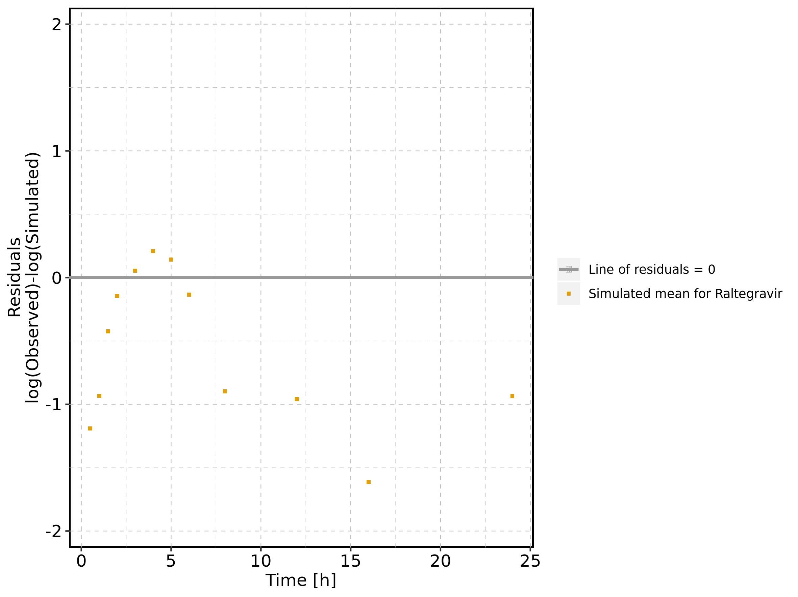

Figure 367: Logarithmic residuals distribution of Filmcoated\_tablet\_400mg\_sd for Raltegravir 400mg filmcoated tablet. Data source: /mnt/c/SW-Dev/2R/02\_TestPublic/03\_Population\_Pediatric\_Raltegavir/Data/Raltegravir\_PK.txt.

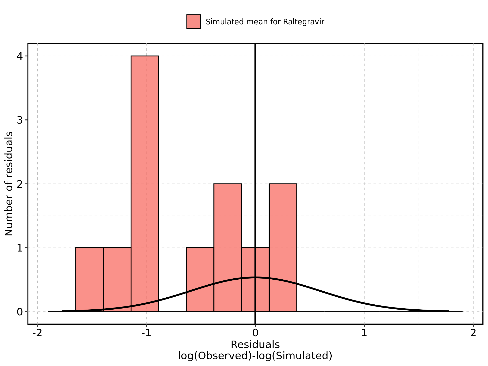

Figure 368: Logarithmic residuals of Filmcoated\_tablet\_400mg\_sd for Raltegravir 400mg filmcoated tablet. Data source: /mnt/c/SW-Dev/2R/02\_TestPublic/03\_Population\_Pediatric\_Raltegavir/Data/Raltegravir\_PK.txt as quantile-quantile plot.

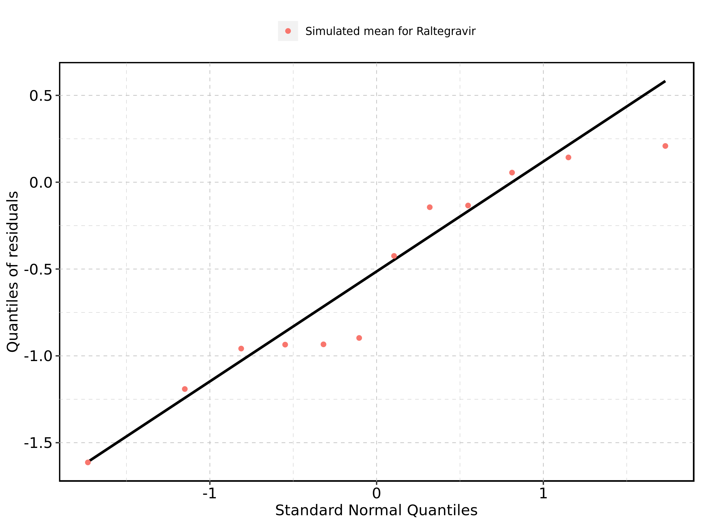

## 2.3. Residuals across all simulations

Figure 369: Distribution of residuals for Larson 2013 8y-18y 400mg FCT meal, Filmcoated\_tablet\_400mg\_sd

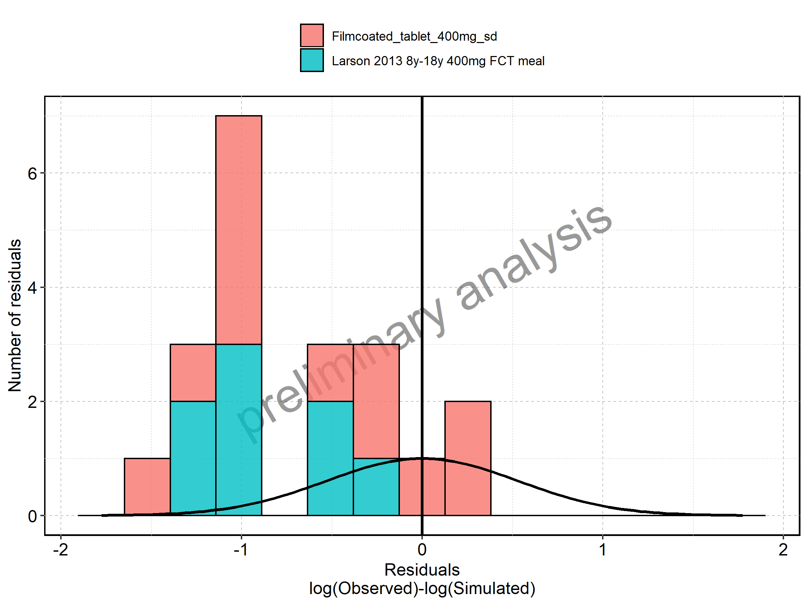

Figure 370: Residuals for Larson 2013 8y-18y 400mg FCT meal, Filmcoated\_tablet\_400mg\_sd as quantile-quantile plot.

# 3\. Demography

Figure 371: Age-dependence of Height for Larson 2013 8y-18y 400mg FCT meal in comparison to Filmcoated\_tablet\_400mg\_sd. Profiles are plotted in a linear scale.

Figure 372: Age-dependence of Height for Larson 2013 8y-18y 400mg FCT meal in comparison to Filmcoated\_tablet\_400mg\_sd. Profiles are plotted in a logarithmic scale.

Figure 373: Age-dependence of Height for Larson 2013 8y-18y 400mg FCT meal. Profiles are plotted in a linear scale.

Figure 374: Age-dependence of Height for Larson 2013 8y-18y 400mg FCT meal. Profiles are plotted in a logarithmic scale.

Figure 375: Age-dependence of Height for Filmcoated\_tablet\_400mg\_sd. Profiles are plotted in a linear scale.

Figure 376: Age-dependence of Height for Filmcoated\_tablet\_400mg\_sd. Profiles are plotted in a logarithmic scale.

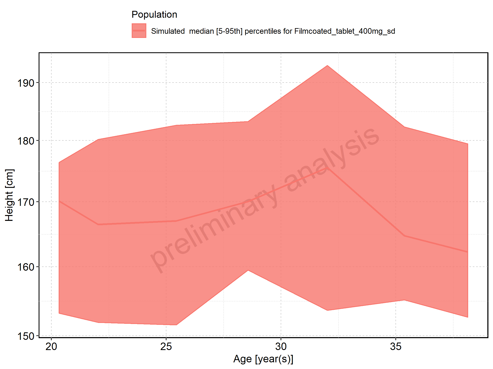

Figure 377: Age-dependence of Weight for Larson 2013 8y-18y 400mg FCT meal in comparison to Filmcoated\_tablet\_400mg\_sd. Profiles are plotted in a linear scale.

Figure 378: Age-dependence of Weight for Larson 2013 8y-18y 400mg FCT meal in comparison to Filmcoated\_tablet\_400mg\_sd. Profiles are plotted in a logarithmic scale.

Figure 379: Age-dependence of Weight for Larson 2013 8y-18y 400mg FCT meal. Profiles are plotted in a linear scale.

Figure 380: Age-dependence of Weight for Larson 2013 8y-18y 400mg FCT meal. Profiles are plotted in a logarithmic scale.

Figure 381: Age-dependence of Weight for Filmcoated\_tablet\_400mg\_sd. Profiles are plotted in a linear scale.

Figure 382: Age-dependence of Weight for Filmcoated\_tablet\_400mg\_sd. Profiles are plotted in a logarithmic scale.

Figure 383: Age-dependence of BMI for Larson 2013 8y-18y 400mg FCT meal in comparison to Filmcoated\_tablet\_400mg\_sd. Profiles are plotted in a linear scale.

Figure 384: Age-dependence of BMI for Larson 2013 8y-18y 400mg FCT meal in comparison to Filmcoated\_tablet\_400mg\_sd. Profiles are plotted in a logarithmic scale.

Figure 385: Age-dependence of BMI for Larson 2013 8y-18y 400mg FCT meal. Profiles are plotted in a linear scale.

Figure 386: Age-dependence of BMI for Larson 2013 8y-18y 400mg FCT meal. Profiles are plotted in a logarithmic scale.

Figure 387: Age-dependence of BMI for Filmcoated\_tablet\_400mg\_sd. Profiles are plotted in a linear scale.

Figure 388: Age-dependence of BMI for Filmcoated\_tablet\_400mg\_sd. Profiles are plotted in a logarithmic scale.

Figure 389: Age-dependence of Gender for Larson 2013 8y-18y 400mg FCT meal in comparison to Filmcoated\_tablet\_400mg\_sd. Profiles are plotted in a linear scale.

Figure 390: Age-dependence of Gender for Larson 2013 8y-18y 400mg FCT meal in comparison to Filmcoated\_tablet\_400mg\_sd. Profiles are plotted in a logarithmic scale.

Figure 391: Age-dependence of Gender for Larson 2013 8y-18y 400mg FCT meal. Profiles are plotted in a linear scale.

Figure 392: Age-dependence of Gender for Larson 2013 8y-18y 400mg FCT meal. Profiles are plotted in a logarithmic scale.

Figure 393: Age-dependence of Gender for Filmcoated\_tablet\_400mg\_sd. Profiles are plotted in a linear scale.

Figure 394: Age-dependence of Gender for Filmcoated\_tablet\_400mg\_sd. Profiles are plotted in a logarithmic scale.

