 - [1. PK parameters](#1.-pk-parameters)
 - [2. Time profiles and residual plots](#2.-time-profiles-and-residual-plots)
   - [2.1. Time profiles and residual plots for Larson 2013 8y-18y 400mg FCT meal](#2.1.-time-profiles-and-residual-plots-for-larson-2013-8y-18y-400mg-fct-meal)
   - [2.2. Time profiles and residual plots for Filmcoated_tablet_400mg_sd](#2.2.-time-profiles-and-residual-plots-for-filmcoated_tablet_400mg_sd)
   - [2.3. Residuals across all simulations](#2.3.-residuals-across-all-simulations)
 - [3. Demography](#3.-demography)

# 1. PK parameters

Figure 1: C_max of Raltegravir shown as box-whisker plot, which indicates the 5th, 25th, 50th, 75th, and 95th percentiles in linear scale.

-C_max.png)

|Population                        |   N| 5th percentile| 25th percentile| 50th percentile| 75th percentile| 95th percentile|     mean| standard deviation| geo mean| geo standard deviation|
|:---------------------------------|---:|--------------:|---------------:|---------------:|---------------:|---------------:|--------:|------------------:|--------:|----------------------:|
|Larson 2013 8y-18y 400mg FCT meal | 500|       1171.264|        1784.944|        2321.552|        2949.242|        4651.398| 2549.832|          1206.8866| 2326.870|               1.523041|
|Filmcoated_tablet_400mg_sd        | 100|       2437.788|        3236.536|        3954.538|        4657.555|        5304.384| 3940.920|           908.8899| 3833.698|               1.270937|

Figure 2: C_max of Raltegravir shown as box-whisker plot, which indicates the 5th, 25th, 50th, 75th, and 95th percentiles in logarithmic scale.

-C_max-log.png)

Figure 3: Age-dependence of C_max for Larson 2013 8y-18y 400mg FCT meal in comparison to Filmcoated_tablet_400mg_sd. Profiles are plotted in a linear scale.

Figure 4: Age-dependence of C_max for Larson 2013 8y-18y 400mg FCT meal in comparison to Filmcoated_tablet_400mg_sd. Profiles are plotted in a logarithmic scale.

Figure 5: Age-dependence of C_max for Larson 2013 8y-18y 400mg FCT meal. Profiles are plotted in a linear scale.

Figure 6: Age-dependence of C_max for Larson 2013 8y-18y 400mg FCT meal. Profiles are plotted in a logarithmic scale.

Figure 7: Age-dependence of C_max for Filmcoated_tablet_400mg_sd. Profiles are plotted in a linear scale.

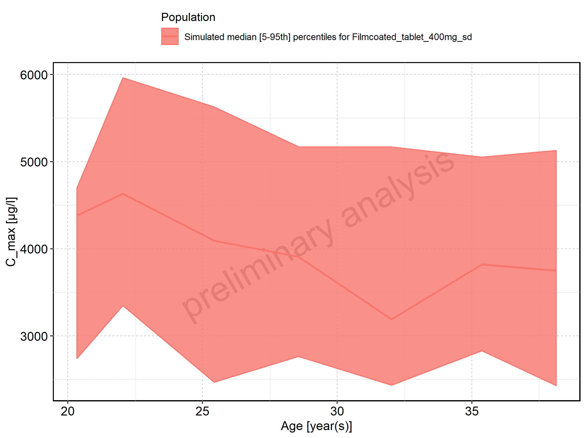

Figure 8: Age-dependence of C_max for Filmcoated_tablet_400mg_sd. Profiles are plotted in a logarithmic scale.

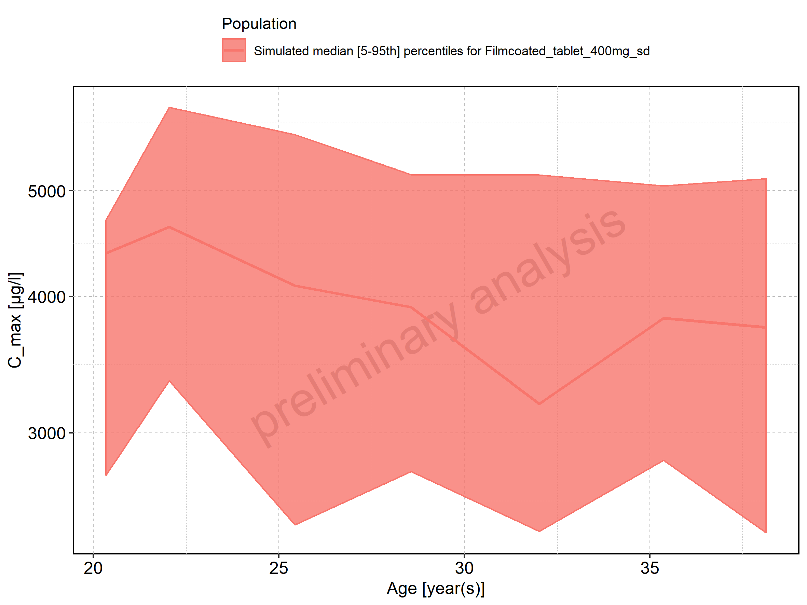

Figure 9: Height-dependence of C_max for Larson 2013 8y-18y 400mg FCT meal in comparison to Filmcoated_tablet_400mg_sd. Profiles are plotted in a linear scale.

Figure 10: Height-dependence of C_max for Larson 2013 8y-18y 400mg FCT meal in comparison to Filmcoated_tablet_400mg_sd. Profiles are plotted in a logarithmic scale.

Figure 11: Height-dependence of C_max for Larson 2013 8y-18y 400mg FCT meal. Profiles are plotted in a linear scale.

Figure 12: Height-dependence of C_max for Larson 2013 8y-18y 400mg FCT meal. Profiles are plotted in a logarithmic scale.

Figure 13: Height-dependence of C_max for Filmcoated_tablet_400mg_sd. Profiles are plotted in a linear scale.

Figure 14: Height-dependence of C_max for Filmcoated_tablet_400mg_sd. Profiles are plotted in a logarithmic scale.

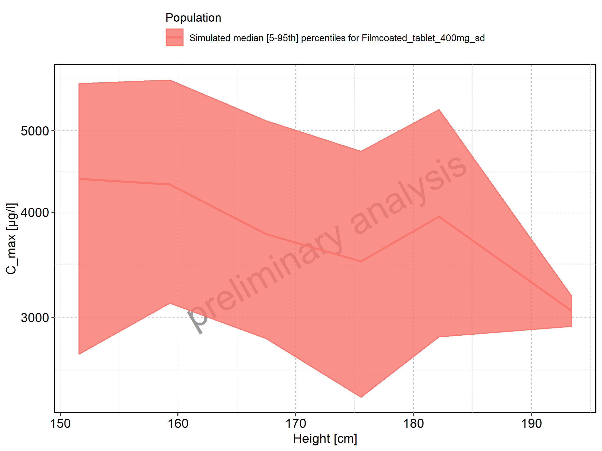

Figure 15: Weight-dependence of C_max for Larson 2013 8y-18y 400mg FCT meal in comparison to Filmcoated_tablet_400mg_sd. Profiles are plotted in a linear scale.

Figure 16: Weight-dependence of C_max for Larson 2013 8y-18y 400mg FCT meal in comparison to Filmcoated_tablet_400mg_sd. Profiles are plotted in a logarithmic scale.

Figure 17: Weight-dependence of C_max for Larson 2013 8y-18y 400mg FCT meal. Profiles are plotted in a linear scale.

Figure 18: Weight-dependence of C_max for Larson 2013 8y-18y 400mg FCT meal. Profiles are plotted in a logarithmic scale.

Figure 19: Weight-dependence of C_max for Filmcoated_tablet_400mg_sd. Profiles are plotted in a linear scale.

Figure 20: Weight-dependence of C_max for Filmcoated_tablet_400mg_sd. Profiles are plotted in a logarithmic scale.

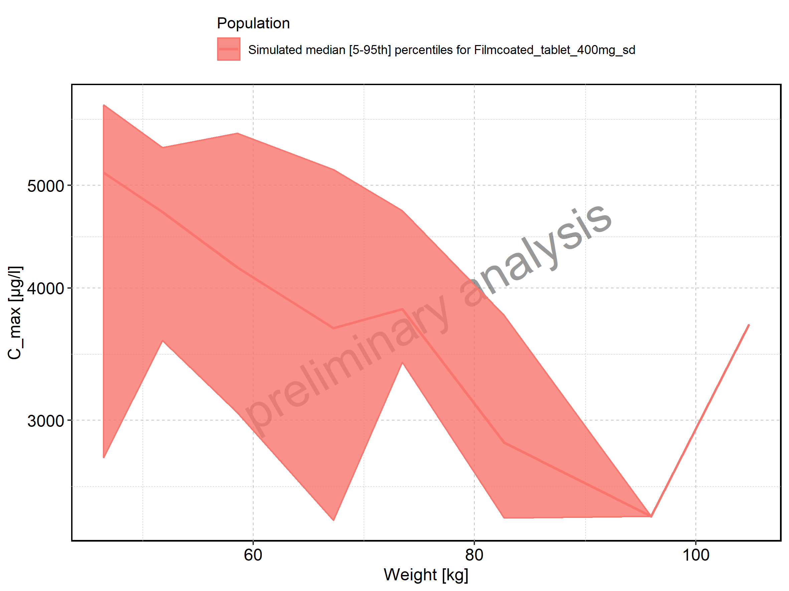

Figure 21: BMI-dependence of C_max for Larson 2013 8y-18y 400mg FCT meal in comparison to Filmcoated_tablet_400mg_sd. Profiles are plotted in a linear scale.

Figure 22: BMI-dependence of C_max for Larson 2013 8y-18y 400mg FCT meal in comparison to Filmcoated_tablet_400mg_sd. Profiles are plotted in a logarithmic scale.

Figure 23: BMI-dependence of C_max for Larson 2013 8y-18y 400mg FCT meal. Profiles are plotted in a linear scale.

Figure 24: BMI-dependence of C_max for Larson 2013 8y-18y 400mg FCT meal. Profiles are plotted in a logarithmic scale.

Figure 25: BMI-dependence of C_max for Filmcoated_tablet_400mg_sd. Profiles are plotted in a linear scale.

Figure 26: BMI-dependence of C_max for Filmcoated_tablet_400mg_sd. Profiles are plotted in a logarithmic scale.

Figure 27: Gender-dependence of C_max for Larson 2013 8y-18y 400mg FCT meal in comparison to Filmcoated_tablet_400mg_sd. Profiles are plotted in a linear scale.

Figure 28: Gender-dependence of C_max for Larson 2013 8y-18y 400mg FCT meal in comparison to Filmcoated_tablet_400mg_sd. Profiles are plotted in a logarithmic scale.

Figure 29: Gender-dependence of C_max for Larson 2013 8y-18y 400mg FCT meal. Profiles are plotted in a linear scale.

Figure 30: Gender-dependence of C_max for Larson 2013 8y-18y 400mg FCT meal. Profiles are plotted in a logarithmic scale.

Figure 31: Gender-dependence of C_max for Filmcoated_tablet_400mg_sd. Profiles are plotted in a linear scale.

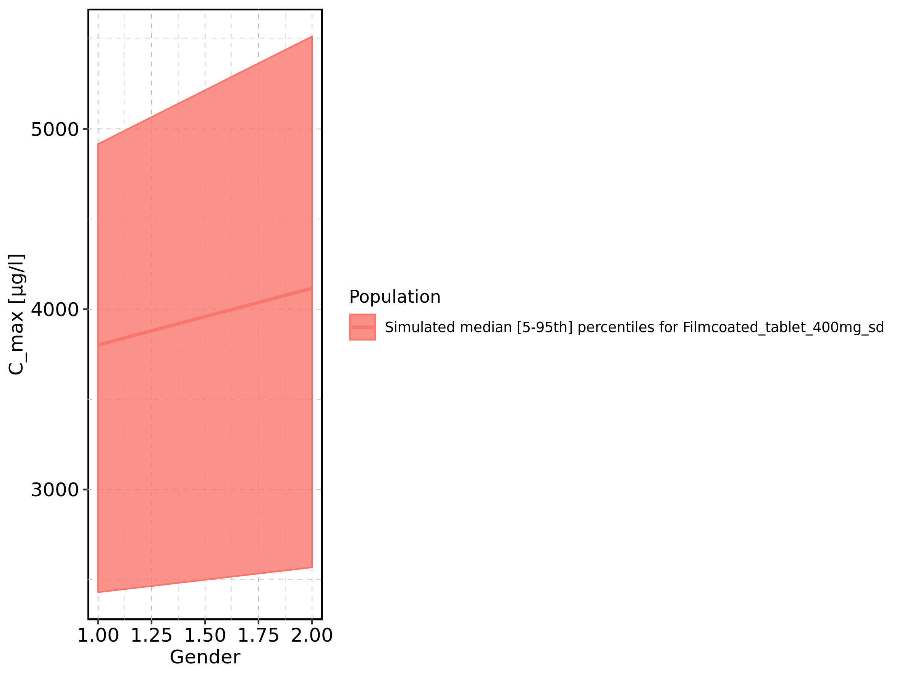

Figure 32: Gender-dependence of C_max for Filmcoated_tablet_400mg_sd. Profiles are plotted in a logarithmic scale.

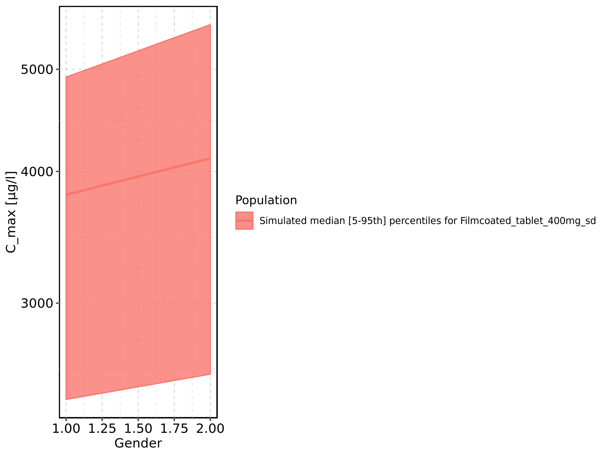

Figure 33: C_max_norm of Raltegravir shown as box-whisker plot, which indicates the 5th, 25th, 50th, 75th, and 95th percentiles in linear scale.

-C_max_norm.png)

|Population                        |   N| 5th percentile| 25th percentile| 50th percentile| 75th percentile| 95th percentile|      mean| standard deviation|  geo mean| geo standard deviation|
|:---------------------------------|---:|--------------:|---------------:|---------------:|---------------:|---------------:|---------:|------------------:|---------:|----------------------:|
|Larson 2013 8y-18y 400mg FCT meal | 500|      0.1639770|       0.2498922|       0.3250172|       0.4128938|       0.6511956| 0.3569764|          0.1689641| 0.3257618|               1.523041|
|Filmcoated_tablet_400mg_sd        | 100|      0.4448963|       0.5906679|       0.7217033|       0.8500038|       0.9680502| 0.7192180|          0.1658724| 0.6996499|               1.270937|

Figure 34: C_max_norm of Raltegravir shown as box-whisker plot, which indicates the 5th, 25th, 50th, 75th, and 95th percentiles in logarithmic scale.

-C_max_norm-log.png)

Figure 35: Age-dependence of C_max_norm for Larson 2013 8y-18y 400mg FCT meal in comparison to Filmcoated_tablet_400mg_sd. Profiles are plotted in a linear scale.

Figure 36: Age-dependence of C_max_norm for Larson 2013 8y-18y 400mg FCT meal in comparison to Filmcoated_tablet_400mg_sd. Profiles are plotted in a logarithmic scale.

Figure 37: Age-dependence of C_max_norm for Larson 2013 8y-18y 400mg FCT meal. Profiles are plotted in a linear scale.

Figure 38: Age-dependence of C_max_norm for Larson 2013 8y-18y 400mg FCT meal. Profiles are plotted in a logarithmic scale.

Figure 39: Age-dependence of C_max_norm for Filmcoated_tablet_400mg_sd. Profiles are plotted in a linear scale.

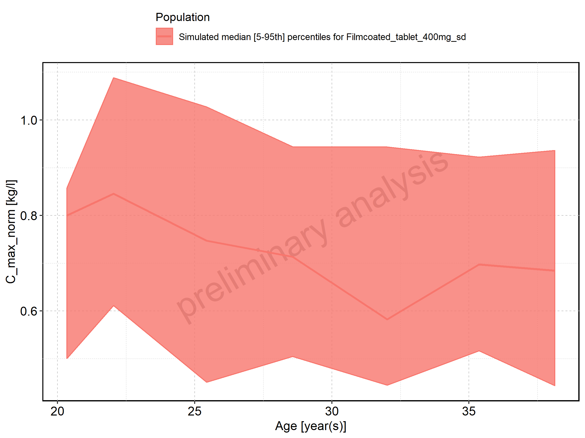

Figure 40: Age-dependence of C_max_norm for Filmcoated_tablet_400mg_sd. Profiles are plotted in a logarithmic scale.

Figure 41: Height-dependence of C_max_norm for Larson 2013 8y-18y 400mg FCT meal in comparison to Filmcoated_tablet_400mg_sd. Profiles are plotted in a linear scale.

Figure 42: Height-dependence of C_max_norm for Larson 2013 8y-18y 400mg FCT meal in comparison to Filmcoated_tablet_400mg_sd. Profiles are plotted in a logarithmic scale.

Figure 43: Height-dependence of C_max_norm for Larson 2013 8y-18y 400mg FCT meal. Profiles are plotted in a linear scale.

Figure 44: Height-dependence of C_max_norm for Larson 2013 8y-18y 400mg FCT meal. Profiles are plotted in a logarithmic scale.

Figure 45: Height-dependence of C_max_norm for Filmcoated_tablet_400mg_sd. Profiles are plotted in a linear scale.

Figure 46: Height-dependence of C_max_norm for Filmcoated_tablet_400mg_sd. Profiles are plotted in a logarithmic scale.

Figure 47: Weight-dependence of C_max_norm for Larson 2013 8y-18y 400mg FCT meal in comparison to Filmcoated_tablet_400mg_sd. Profiles are plotted in a linear scale.

Figure 48: Weight-dependence of C_max_norm for Larson 2013 8y-18y 400mg FCT meal in comparison to Filmcoated_tablet_400mg_sd. Profiles are plotted in a logarithmic scale.

Figure 49: Weight-dependence of C_max_norm for Larson 2013 8y-18y 400mg FCT meal. Profiles are plotted in a linear scale.

Figure 50: Weight-dependence of C_max_norm for Larson 2013 8y-18y 400mg FCT meal. Profiles are plotted in a logarithmic scale.

Figure 51: Weight-dependence of C_max_norm for Filmcoated_tablet_400mg_sd. Profiles are plotted in a linear scale.

Figure 52: Weight-dependence of C_max_norm for Filmcoated_tablet_400mg_sd. Profiles are plotted in a logarithmic scale.

Figure 53: BMI-dependence of C_max_norm for Larson 2013 8y-18y 400mg FCT meal in comparison to Filmcoated_tablet_400mg_sd. Profiles are plotted in a linear scale.

Figure 54: BMI-dependence of C_max_norm for Larson 2013 8y-18y 400mg FCT meal in comparison to Filmcoated_tablet_400mg_sd. Profiles are plotted in a logarithmic scale.

Figure 55: BMI-dependence of C_max_norm for Larson 2013 8y-18y 400mg FCT meal. Profiles are plotted in a linear scale.

Figure 56: BMI-dependence of C_max_norm for Larson 2013 8y-18y 400mg FCT meal. Profiles are plotted in a logarithmic scale.

Figure 57: BMI-dependence of C_max_norm for Filmcoated_tablet_400mg_sd. Profiles are plotted in a linear scale.

Figure 58: BMI-dependence of C_max_norm for Filmcoated_tablet_400mg_sd. Profiles are plotted in a logarithmic scale.

Figure 59: Gender-dependence of C_max_norm for Larson 2013 8y-18y 400mg FCT meal in comparison to Filmcoated_tablet_400mg_sd. Profiles are plotted in a linear scale.

Figure 60: Gender-dependence of C_max_norm for Larson 2013 8y-18y 400mg FCT meal in comparison to Filmcoated_tablet_400mg_sd. Profiles are plotted in a logarithmic scale.

Figure 61: Gender-dependence of C_max_norm for Larson 2013 8y-18y 400mg FCT meal. Profiles are plotted in a linear scale.

Figure 62: Gender-dependence of C_max_norm for Larson 2013 8y-18y 400mg FCT meal. Profiles are plotted in a logarithmic scale.

Figure 63: Gender-dependence of C_max_norm for Filmcoated_tablet_400mg_sd. Profiles are plotted in a linear scale.

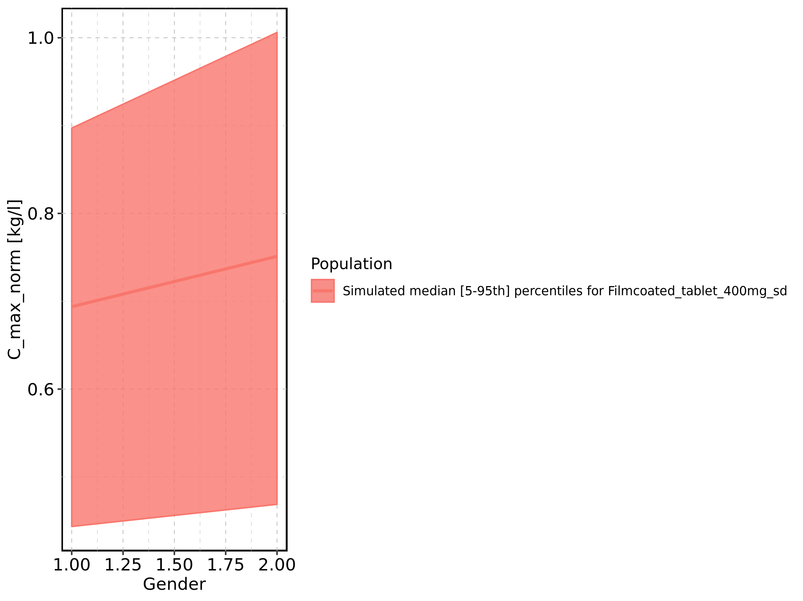

Figure 64: Gender-dependence of C_max_norm for Filmcoated_tablet_400mg_sd. Profiles are plotted in a logarithmic scale.

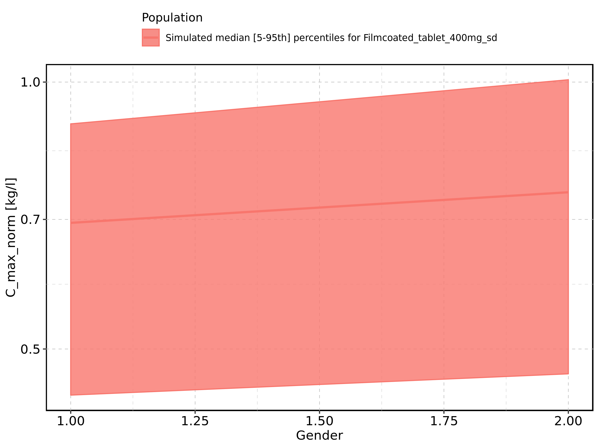

Figure 65: t_max of Raltegravir shown as box-whisker plot, which indicates the 5th, 25th, 50th, 75th, and 95th percentiles in linear scale.

-t_max.png)

|Population                        |   N| 5th percentile| 25th percentile| 50th percentile| 75th percentile| 95th percentile|   mean| standard deviation|  geo mean| geo standard deviation|
|:---------------------------------|---:|--------------:|---------------:|---------------:|---------------:|---------------:|------:|------------------:|---------:|----------------------:|
|Larson 2013 8y-18y 400mg FCT meal | 500|         0.9975|             2.0|             2.5|          3.0500|               4| 2.5419|          0.8782893| 2.3720858|               1.485027|
|Filmcoated_tablet_400mg_sd        | 100|         0.5000|             0.6|             0.7|          0.8125|               1| 0.7290|          0.1516209| 0.7135402|               1.232465|

Figure 66: t_max of Raltegravir shown as box-whisker plot, which indicates the 5th, 25th, 50th, 75th, and 95th percentiles in logarithmic scale.

-t_max-log.png)

Figure 67: Age-dependence of t_max for Larson 2013 8y-18y 400mg FCT meal in comparison to Filmcoated_tablet_400mg_sd. Profiles are plotted in a linear scale.

Figure 68: Age-dependence of t_max for Larson 2013 8y-18y 400mg FCT meal in comparison to Filmcoated_tablet_400mg_sd. Profiles are plotted in a logarithmic scale.

Figure 69: Age-dependence of t_max for Larson 2013 8y-18y 400mg FCT meal. Profiles are plotted in a linear scale.

Figure 70: Age-dependence of t_max for Larson 2013 8y-18y 400mg FCT meal. Profiles are plotted in a logarithmic scale.

Figure 71: Age-dependence of t_max for Filmcoated_tablet_400mg_sd. Profiles are plotted in a linear scale.

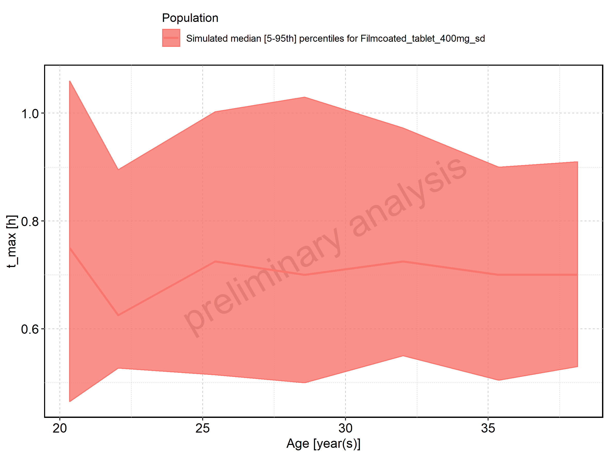

Figure 72: Age-dependence of t_max for Filmcoated_tablet_400mg_sd. Profiles are plotted in a logarithmic scale.

Figure 73: Height-dependence of t_max for Larson 2013 8y-18y 400mg FCT meal in comparison to Filmcoated_tablet_400mg_sd. Profiles are plotted in a linear scale.

Figure 74: Height-dependence of t_max for Larson 2013 8y-18y 400mg FCT meal in comparison to Filmcoated_tablet_400mg_sd. Profiles are plotted in a logarithmic scale.

Figure 75: Height-dependence of t_max for Larson 2013 8y-18y 400mg FCT meal. Profiles are plotted in a linear scale.

Figure 76: Height-dependence of t_max for Larson 2013 8y-18y 400mg FCT meal. Profiles are plotted in a logarithmic scale.

Figure 77: Height-dependence of t_max for Filmcoated_tablet_400mg_sd. Profiles are plotted in a linear scale.

Figure 78: Height-dependence of t_max for Filmcoated_tablet_400mg_sd. Profiles are plotted in a logarithmic scale.

Figure 79: Weight-dependence of t_max for Larson 2013 8y-18y 400mg FCT meal in comparison to Filmcoated_tablet_400mg_sd. Profiles are plotted in a linear scale.

Figure 80: Weight-dependence of t_max for Larson 2013 8y-18y 400mg FCT meal in comparison to Filmcoated_tablet_400mg_sd. Profiles are plotted in a logarithmic scale.

Figure 81: Weight-dependence of t_max for Larson 2013 8y-18y 400mg FCT meal. Profiles are plotted in a linear scale.

Figure 82: Weight-dependence of t_max for Larson 2013 8y-18y 400mg FCT meal. Profiles are plotted in a logarithmic scale.

Figure 83: Weight-dependence of t_max for Filmcoated_tablet_400mg_sd. Profiles are plotted in a linear scale.

Figure 84: Weight-dependence of t_max for Filmcoated_tablet_400mg_sd. Profiles are plotted in a logarithmic scale.

Figure 85: BMI-dependence of t_max for Larson 2013 8y-18y 400mg FCT meal in comparison to Filmcoated_tablet_400mg_sd. Profiles are plotted in a linear scale.

Figure 86: BMI-dependence of t_max for Larson 2013 8y-18y 400mg FCT meal in comparison to Filmcoated_tablet_400mg_sd. Profiles are plotted in a logarithmic scale.

Figure 87: BMI-dependence of t_max for Larson 2013 8y-18y 400mg FCT meal. Profiles are plotted in a linear scale.

Figure 88: BMI-dependence of t_max for Larson 2013 8y-18y 400mg FCT meal. Profiles are plotted in a logarithmic scale.

Figure 89: BMI-dependence of t_max for Filmcoated_tablet_400mg_sd. Profiles are plotted in a linear scale.

Figure 90: BMI-dependence of t_max for Filmcoated_tablet_400mg_sd. Profiles are plotted in a logarithmic scale.

Figure 91: Gender-dependence of t_max for Larson 2013 8y-18y 400mg FCT meal in comparison to Filmcoated_tablet_400mg_sd. Profiles are plotted in a linear scale.

Figure 92: Gender-dependence of t_max for Larson 2013 8y-18y 400mg FCT meal in comparison to Filmcoated_tablet_400mg_sd. Profiles are plotted in a logarithmic scale.

Figure 93: Gender-dependence of t_max for Larson 2013 8y-18y 400mg FCT meal. Profiles are plotted in a linear scale.

Figure 94: Gender-dependence of t_max for Larson 2013 8y-18y 400mg FCT meal. Profiles are plotted in a logarithmic scale.

Figure 95: Gender-dependence of t_max for Filmcoated_tablet_400mg_sd. Profiles are plotted in a linear scale.

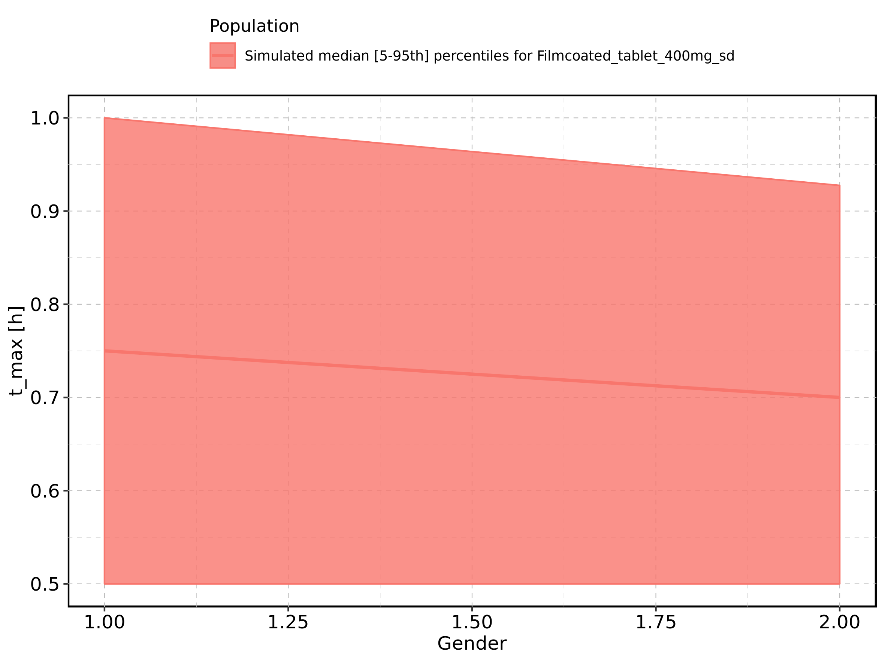

Figure 96: Gender-dependence of t_max for Filmcoated_tablet_400mg_sd. Profiles are plotted in a logarithmic scale.

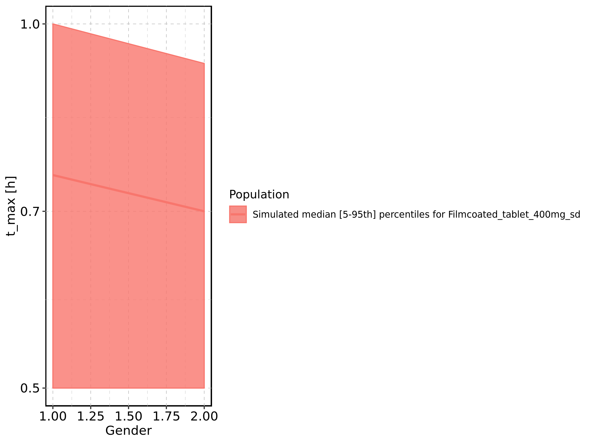

Figure 97: C_tEnd of Raltegravir shown as box-whisker plot, which indicates the 5th, 25th, 50th, 75th, and 95th percentiles in linear scale.

-C_tEnd.png)

|Population                        |   N| 5th percentile| 25th percentile| 50th percentile| 75th percentile| 95th percentile|      mean| standard deviation|  geo mean| geo standard deviation|
|:---------------------------------|---:|--------------:|---------------:|---------------:|---------------:|---------------:|---------:|------------------:|---------:|----------------------:|
|Larson 2013 8y-18y 400mg FCT meal | 500|       86.63046|       133.65437|       189.56246|       263.51473|       448.02293| 218.90325|          129.11610| 191.12204|               1.666366|
|Filmcoated_tablet_400mg_sd        | 100|       19.57484|        25.79622|        32.34815|        41.91365|        62.67601|  35.38577|           14.20645|  33.01047|               1.444113|

Figure 98: C_tEnd of Raltegravir shown as box-whisker plot, which indicates the 5th, 25th, 50th, 75th, and 95th percentiles in logarithmic scale.

-C_tEnd-log.png)

Figure 99: Age-dependence of C_tEnd for Larson 2013 8y-18y 400mg FCT meal in comparison to Filmcoated_tablet_400mg_sd. Profiles are plotted in a linear scale.

Figure 100: Age-dependence of C_tEnd for Larson 2013 8y-18y 400mg FCT meal in comparison to Filmcoated_tablet_400mg_sd. Profiles are plotted in a logarithmic scale.

Figure 101: Age-dependence of C_tEnd for Larson 2013 8y-18y 400mg FCT meal. Profiles are plotted in a linear scale.

Figure 102: Age-dependence of C_tEnd for Larson 2013 8y-18y 400mg FCT meal. Profiles are plotted in a logarithmic scale.

Figure 103: Age-dependence of C_tEnd for Filmcoated_tablet_400mg_sd. Profiles are plotted in a linear scale.

Figure 104: Age-dependence of C_tEnd for Filmcoated_tablet_400mg_sd. Profiles are plotted in a logarithmic scale.

Figure 105: Height-dependence of C_tEnd for Larson 2013 8y-18y 400mg FCT meal in comparison to Filmcoated_tablet_400mg_sd. Profiles are plotted in a linear scale.

Figure 106: Height-dependence of C_tEnd for Larson 2013 8y-18y 400mg FCT meal in comparison to Filmcoated_tablet_400mg_sd. Profiles are plotted in a logarithmic scale.

Figure 107: Height-dependence of C_tEnd for Larson 2013 8y-18y 400mg FCT meal. Profiles are plotted in a linear scale.

Figure 108: Height-dependence of C_tEnd for Larson 2013 8y-18y 400mg FCT meal. Profiles are plotted in a logarithmic scale.

Figure 109: Height-dependence of C_tEnd for Filmcoated_tablet_400mg_sd. Profiles are plotted in a linear scale.

Figure 110: Height-dependence of C_tEnd for Filmcoated_tablet_400mg_sd. Profiles are plotted in a logarithmic scale.

Figure 111: Weight-dependence of C_tEnd for Larson 2013 8y-18y 400mg FCT meal in comparison to Filmcoated_tablet_400mg_sd. Profiles are plotted in a linear scale.

Figure 112: Weight-dependence of C_tEnd for Larson 2013 8y-18y 400mg FCT meal in comparison to Filmcoated_tablet_400mg_sd. Profiles are plotted in a logarithmic scale.

Figure 113: Weight-dependence of C_tEnd for Larson 2013 8y-18y 400mg FCT meal. Profiles are plotted in a linear scale.

Figure 114: Weight-dependence of C_tEnd for Larson 2013 8y-18y 400mg FCT meal. Profiles are plotted in a logarithmic scale.

Figure 115: Weight-dependence of C_tEnd for Filmcoated_tablet_400mg_sd. Profiles are plotted in a linear scale.

Figure 116: Weight-dependence of C_tEnd for Filmcoated_tablet_400mg_sd. Profiles are plotted in a logarithmic scale.

Figure 117: BMI-dependence of C_tEnd for Larson 2013 8y-18y 400mg FCT meal in comparison to Filmcoated_tablet_400mg_sd. Profiles are plotted in a linear scale.

Figure 118: BMI-dependence of C_tEnd for Larson 2013 8y-18y 400mg FCT meal in comparison to Filmcoated_tablet_400mg_sd. Profiles are plotted in a logarithmic scale.

Figure 119: BMI-dependence of C_tEnd for Larson 2013 8y-18y 400mg FCT meal. Profiles are plotted in a linear scale.

Figure 120: BMI-dependence of C_tEnd for Larson 2013 8y-18y 400mg FCT meal. Profiles are plotted in a logarithmic scale.

Figure 121: BMI-dependence of C_tEnd for Filmcoated_tablet_400mg_sd. Profiles are plotted in a linear scale.

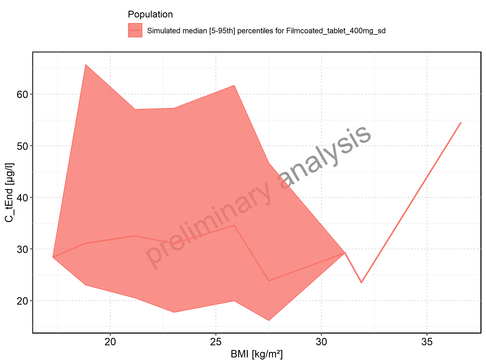

Figure 122: BMI-dependence of C_tEnd for Filmcoated_tablet_400mg_sd. Profiles are plotted in a logarithmic scale.

Figure 123: Gender-dependence of C_tEnd for Larson 2013 8y-18y 400mg FCT meal in comparison to Filmcoated_tablet_400mg_sd. Profiles are plotted in a linear scale.

Figure 124: Gender-dependence of C_tEnd for Larson 2013 8y-18y 400mg FCT meal in comparison to Filmcoated_tablet_400mg_sd. Profiles are plotted in a logarithmic scale.

Figure 125: Gender-dependence of C_tEnd for Larson 2013 8y-18y 400mg FCT meal. Profiles are plotted in a linear scale.

Figure 126: Gender-dependence of C_tEnd for Larson 2013 8y-18y 400mg FCT meal. Profiles are plotted in a logarithmic scale.

Figure 127: Gender-dependence of C_tEnd for Filmcoated_tablet_400mg_sd. Profiles are plotted in a linear scale.

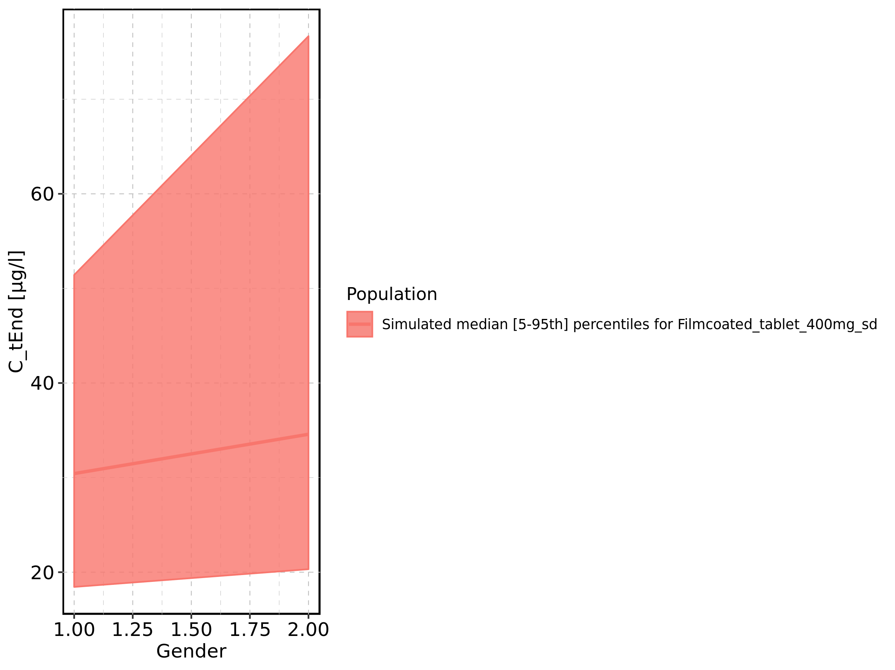

Figure 128: Gender-dependence of C_tEnd for Filmcoated_tablet_400mg_sd. Profiles are plotted in a logarithmic scale.

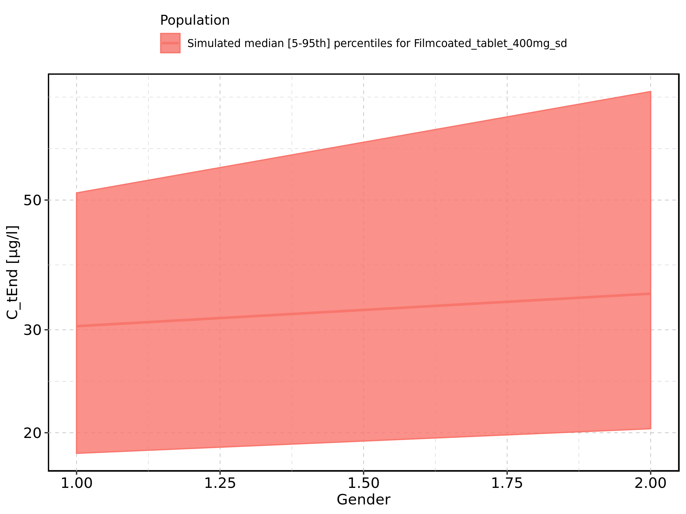

Figure 129: AUC of Raltegravir shown as box-whisker plot, which indicates the 5th, 25th, 50th, 75th, and 95th percentiles in linear scale.

-AUC_tEnd.png)

|Population                        |   N| 5th percentile| 25th percentile| 50th percentile| 75th percentile| 95th percentile|     mean| standard deviation|  geo mean| geo standard deviation|
|:---------------------------------|---:|--------------:|---------------:|---------------:|---------------:|---------------:|--------:|------------------:|---------:|----------------------:|
|Larson 2013 8y-18y 400mg FCT meal | 500|       7207.278|        9378.917|       11615.205|        14388.95|        19343.09| 12199.87|           3756.553| 11656.084|               1.353277|
|Filmcoated_tablet_400mg_sd        | 100|       6449.274|        8248.730|        9637.507|        11717.01|        14901.11| 10129.70|           2672.292|  9784.557|               1.305605|

Figure 130: AUC of Raltegravir shown as box-whisker plot, which indicates the 5th, 25th, 50th, 75th, and 95th percentiles in logarithmic scale.

-AUC_tEnd-log.png)

Figure 131: Age-dependence of AUC for Larson 2013 8y-18y 400mg FCT meal in comparison to Filmcoated_tablet_400mg_sd. Profiles are plotted in a linear scale.

Figure 132: Age-dependence of AUC for Larson 2013 8y-18y 400mg FCT meal in comparison to Filmcoated_tablet_400mg_sd. Profiles are plotted in a logarithmic scale.

Figure 133: Age-dependence of AUC for Larson 2013 8y-18y 400mg FCT meal. Profiles are plotted in a linear scale.

Figure 134: Age-dependence of AUC for Larson 2013 8y-18y 400mg FCT meal. Profiles are plotted in a logarithmic scale.

Figure 135: Age-dependence of AUC for Filmcoated_tablet_400mg_sd. Profiles are plotted in a linear scale.

Figure 136: Age-dependence of AUC for Filmcoated_tablet_400mg_sd. Profiles are plotted in a logarithmic scale.

Figure 137: Height-dependence of AUC for Larson 2013 8y-18y 400mg FCT meal in comparison to Filmcoated_tablet_400mg_sd. Profiles are plotted in a linear scale.

Figure 138: Height-dependence of AUC for Larson 2013 8y-18y 400mg FCT meal in comparison to Filmcoated_tablet_400mg_sd. Profiles are plotted in a logarithmic scale.

Figure 139: Height-dependence of AUC for Larson 2013 8y-18y 400mg FCT meal. Profiles are plotted in a linear scale.

Figure 140: Height-dependence of AUC for Larson 2013 8y-18y 400mg FCT meal. Profiles are plotted in a logarithmic scale.

Figure 141: Height-dependence of AUC for Filmcoated_tablet_400mg_sd. Profiles are plotted in a linear scale.

Figure 142: Height-dependence of AUC for Filmcoated_tablet_400mg_sd. Profiles are plotted in a logarithmic scale.

Figure 143: Weight-dependence of AUC for Larson 2013 8y-18y 400mg FCT meal in comparison to Filmcoated_tablet_400mg_sd. Profiles are plotted in a linear scale.

Figure 144: Weight-dependence of AUC for Larson 2013 8y-18y 400mg FCT meal in comparison to Filmcoated_tablet_400mg_sd. Profiles are plotted in a logarithmic scale.

Figure 145: Weight-dependence of AUC for Larson 2013 8y-18y 400mg FCT meal. Profiles are plotted in a linear scale.

Figure 146: Weight-dependence of AUC for Larson 2013 8y-18y 400mg FCT meal. Profiles are plotted in a logarithmic scale.

Figure 147: Weight-dependence of AUC for Filmcoated_tablet_400mg_sd. Profiles are plotted in a linear scale.

Figure 148: Weight-dependence of AUC for Filmcoated_tablet_400mg_sd. Profiles are plotted in a logarithmic scale.

Figure 149: BMI-dependence of AUC for Larson 2013 8y-18y 400mg FCT meal in comparison to Filmcoated_tablet_400mg_sd. Profiles are plotted in a linear scale.

Figure 150: BMI-dependence of AUC for Larson 2013 8y-18y 400mg FCT meal in comparison to Filmcoated_tablet_400mg_sd. Profiles are plotted in a logarithmic scale.

Figure 151: BMI-dependence of AUC for Larson 2013 8y-18y 400mg FCT meal. Profiles are plotted in a linear scale.

Figure 152: BMI-dependence of AUC for Larson 2013 8y-18y 400mg FCT meal. Profiles are plotted in a logarithmic scale.

Figure 153: BMI-dependence of AUC for Filmcoated_tablet_400mg_sd. Profiles are plotted in a linear scale.

Figure 154: BMI-dependence of AUC for Filmcoated_tablet_400mg_sd. Profiles are plotted in a logarithmic scale.

Figure 155: Gender-dependence of AUC for Larson 2013 8y-18y 400mg FCT meal in comparison to Filmcoated_tablet_400mg_sd. Profiles are plotted in a linear scale.

Figure 156: Gender-dependence of AUC for Larson 2013 8y-18y 400mg FCT meal in comparison to Filmcoated_tablet_400mg_sd. Profiles are plotted in a logarithmic scale.

Figure 157: Gender-dependence of AUC for Larson 2013 8y-18y 400mg FCT meal. Profiles are plotted in a linear scale.

Figure 158: Gender-dependence of AUC for Larson 2013 8y-18y 400mg FCT meal. Profiles are plotted in a logarithmic scale.

Figure 159: Gender-dependence of AUC for Filmcoated_tablet_400mg_sd. Profiles are plotted in a linear scale.

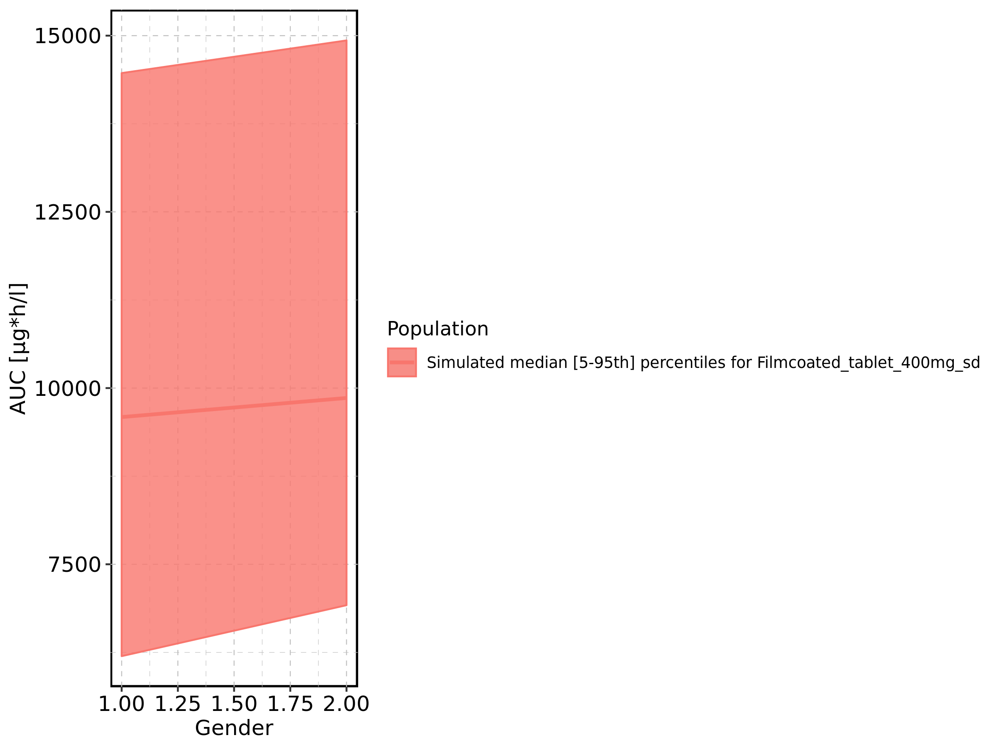

Figure 160: Gender-dependence of AUC for Filmcoated_tablet_400mg_sd. Profiles are plotted in a logarithmic scale.

Figure 161: AUC_norm of Raltegravir shown as box-whisker plot, which indicates the 5th, 25th, 50th, 75th, and 95th percentiles in linear scale.

-AUC_tEnd_norm.png)

|Population                        |   N| 5th percentile| 25th percentile| 50th percentile| 75th percentile| 95th percentile|     mean| standard deviation| geo mean| geo standard deviation|
|:---------------------------------|---:|--------------:|---------------:|---------------:|---------------:|---------------:|--------:|------------------:|--------:|----------------------:|
|Larson 2013 8y-18y 400mg FCT meal | 500|       1.009019|        1.313048|        1.626129|        2.014454|        2.708033| 1.707981|          0.5259173| 1.631852|               1.353277|
|Filmcoated_tablet_400mg_sd        | 100|       1.176992|        1.505393|        1.758845|        2.138354|        2.719452| 1.848670|          0.4876934| 1.785682|               1.305605|

Figure 162: AUC_norm of Raltegravir shown as box-whisker plot, which indicates the 5th, 25th, 50th, 75th, and 95th percentiles in logarithmic scale.

-AUC_tEnd_norm-log.png)

Figure 163: Age-dependence of AUC_norm for Larson 2013 8y-18y 400mg FCT meal in comparison to Filmcoated_tablet_400mg_sd. Profiles are plotted in a linear scale.

Figure 164: Age-dependence of AUC_norm for Larson 2013 8y-18y 400mg FCT meal in comparison to Filmcoated_tablet_400mg_sd. Profiles are plotted in a logarithmic scale.

Figure 165: Age-dependence of AUC_norm for Larson 2013 8y-18y 400mg FCT meal. Profiles are plotted in a linear scale.

Figure 166: Age-dependence of AUC_norm for Larson 2013 8y-18y 400mg FCT meal. Profiles are plotted in a logarithmic scale.

Figure 167: Age-dependence of AUC_norm for Filmcoated_tablet_400mg_sd. Profiles are plotted in a linear scale.

Figure 168: Age-dependence of AUC_norm for Filmcoated_tablet_400mg_sd. Profiles are plotted in a logarithmic scale.

Figure 169: Height-dependence of AUC_norm for Larson 2013 8y-18y 400mg FCT meal in comparison to Filmcoated_tablet_400mg_sd. Profiles are plotted in a linear scale.

Figure 170: Height-dependence of AUC_norm for Larson 2013 8y-18y 400mg FCT meal in comparison to Filmcoated_tablet_400mg_sd. Profiles are plotted in a logarithmic scale.

Figure 171: Height-dependence of AUC_norm for Larson 2013 8y-18y 400mg FCT meal. Profiles are plotted in a linear scale.

Figure 172: Height-dependence of AUC_norm for Larson 2013 8y-18y 400mg FCT meal. Profiles are plotted in a logarithmic scale.

Figure 173: Height-dependence of AUC_norm for Filmcoated_tablet_400mg_sd. Profiles are plotted in a linear scale.

Figure 174: Height-dependence of AUC_norm for Filmcoated_tablet_400mg_sd. Profiles are plotted in a logarithmic scale.

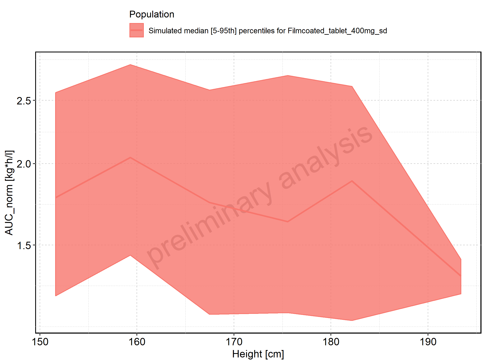

Figure 175: Weight-dependence of AUC_norm for Larson 2013 8y-18y 400mg FCT meal in comparison to Filmcoated_tablet_400mg_sd. Profiles are plotted in a linear scale.

Figure 176: Weight-dependence of AUC_norm for Larson 2013 8y-18y 400mg FCT meal in comparison to Filmcoated_tablet_400mg_sd. Profiles are plotted in a logarithmic scale.

Figure 177: Weight-dependence of AUC_norm for Larson 2013 8y-18y 400mg FCT meal. Profiles are plotted in a linear scale.

Figure 178: Weight-dependence of AUC_norm for Larson 2013 8y-18y 400mg FCT meal. Profiles are plotted in a logarithmic scale.

Figure 179: Weight-dependence of AUC_norm for Filmcoated_tablet_400mg_sd. Profiles are plotted in a linear scale.

Figure 180: Weight-dependence of AUC_norm for Filmcoated_tablet_400mg_sd. Profiles are plotted in a logarithmic scale.

Figure 181: BMI-dependence of AUC_norm for Larson 2013 8y-18y 400mg FCT meal in comparison to Filmcoated_tablet_400mg_sd. Profiles are plotted in a linear scale.

Figure 182: BMI-dependence of AUC_norm for Larson 2013 8y-18y 400mg FCT meal in comparison to Filmcoated_tablet_400mg_sd. Profiles are plotted in a logarithmic scale.

Figure 183: BMI-dependence of AUC_norm for Larson 2013 8y-18y 400mg FCT meal. Profiles are plotted in a linear scale.

Figure 184: BMI-dependence of AUC_norm for Larson 2013 8y-18y 400mg FCT meal. Profiles are plotted in a logarithmic scale.

Figure 185: BMI-dependence of AUC_norm for Filmcoated_tablet_400mg_sd. Profiles are plotted in a linear scale.

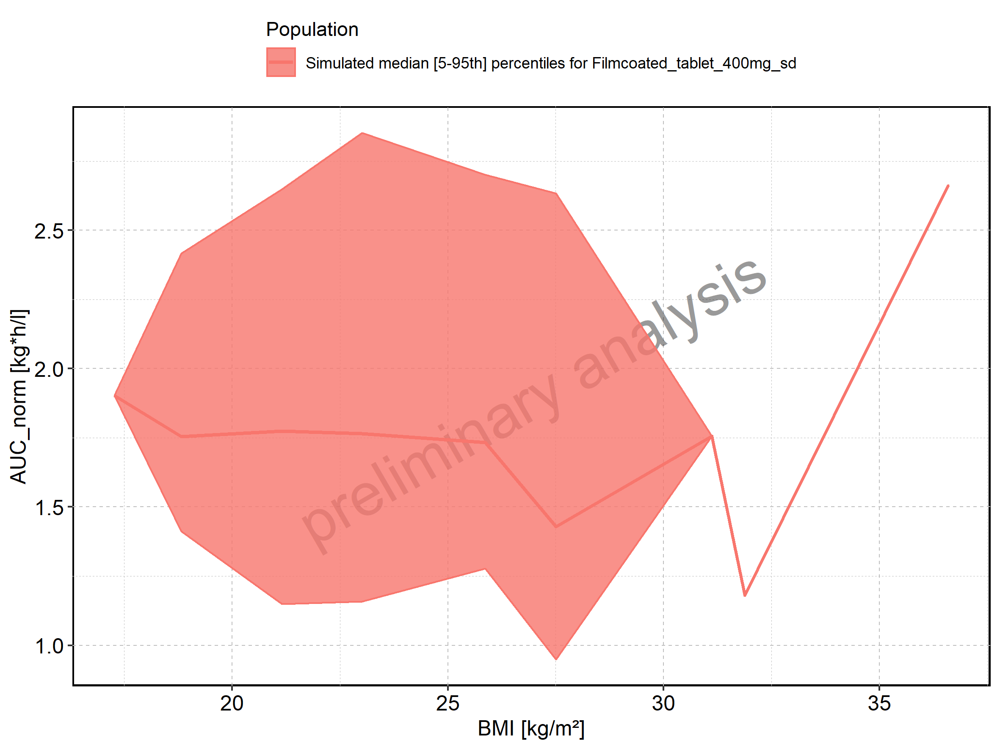

Figure 186: BMI-dependence of AUC_norm for Filmcoated_tablet_400mg_sd. Profiles are plotted in a logarithmic scale.

Figure 187: Gender-dependence of AUC_norm for Larson 2013 8y-18y 400mg FCT meal in comparison to Filmcoated_tablet_400mg_sd. Profiles are plotted in a linear scale.

Figure 188: Gender-dependence of AUC_norm for Larson 2013 8y-18y 400mg FCT meal in comparison to Filmcoated_tablet_400mg_sd. Profiles are plotted in a logarithmic scale.

Figure 189: Gender-dependence of AUC_norm for Larson 2013 8y-18y 400mg FCT meal. Profiles are plotted in a linear scale.

Figure 190: Gender-dependence of AUC_norm for Larson 2013 8y-18y 400mg FCT meal. Profiles are plotted in a logarithmic scale.

Figure 191: Gender-dependence of AUC_norm for Filmcoated_tablet_400mg_sd. Profiles are plotted in a linear scale.

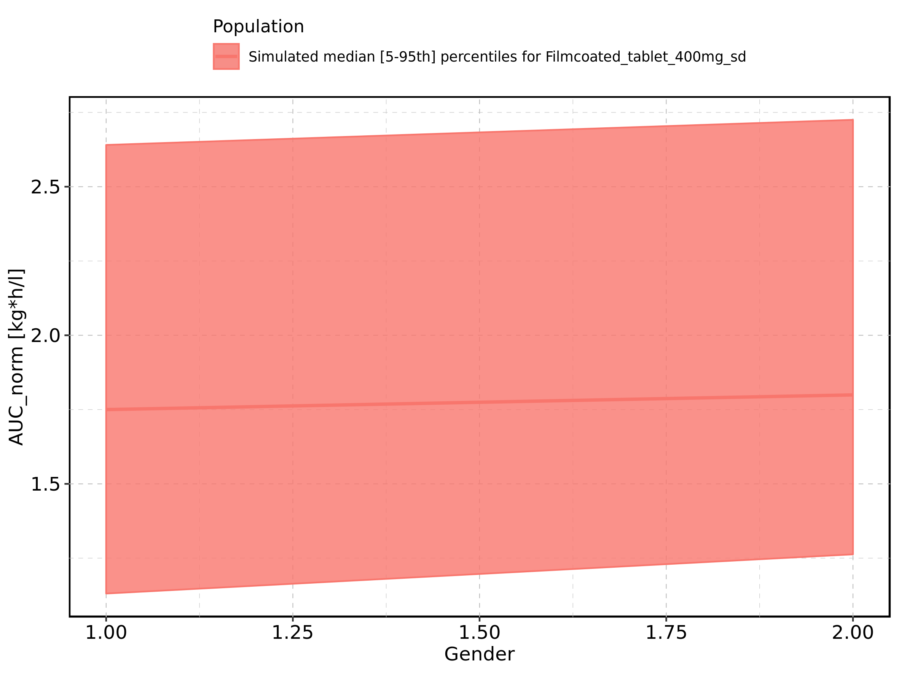

Figure 192: Gender-dependence of AUC_norm for Filmcoated_tablet_400mg_sd. Profiles are plotted in a logarithmic scale.

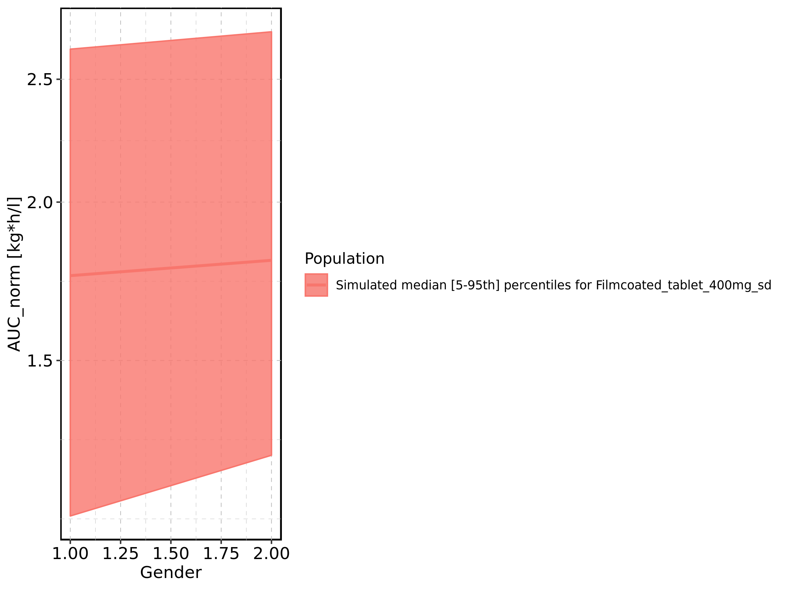

Figure 193: AUC_inf of Raltegravir shown as box-whisker plot, which indicates the 5th, 25th, 50th, 75th, and 95th percentiles in linear scale.

-AUC_inf.png)

|Population                        |   N| 5th percentile| 25th percentile| 50th percentile| 75th percentile| 95th percentile|     mean| standard deviation| geo mean| geo standard deviation|
|:---------------------------------|---:|--------------:|---------------:|---------------:|---------------:|---------------:|--------:|------------------:|--------:|----------------------:|
|Larson 2013 8y-18y 400mg FCT meal | 500|       8017.562|       10533.549|        12921.05|        15892.62|        21707.95| 13652.18|           4460.211|     0.00|                     NA|
|Filmcoated_tablet_400mg_sd        | 100|       6771.970|        8875.698|        10112.32|        12229.14|        15523.15| 10626.71|           2757.612| 10275.45|               1.300506|

Figure 194: AUC_inf of Raltegravir shown as box-whisker plot, which indicates the 5th, 25th, 50th, 75th, and 95th percentiles in logarithmic scale.

-AUC_inf-log.png)

Figure 195: Age-dependence of AUC_inf for Larson 2013 8y-18y 400mg FCT meal in comparison to Filmcoated_tablet_400mg_sd. Profiles are plotted in a linear scale.

Figure 196: Age-dependence of AUC_inf for Larson 2013 8y-18y 400mg FCT meal in comparison to Filmcoated_tablet_400mg_sd. Profiles are plotted in a logarithmic scale.

Figure 197: Age-dependence of AUC_inf for Larson 2013 8y-18y 400mg FCT meal. Profiles are plotted in a linear scale.

Figure 198: Age-dependence of AUC_inf for Larson 2013 8y-18y 400mg FCT meal. Profiles are plotted in a logarithmic scale.

Figure 199: Age-dependence of AUC_inf for Filmcoated_tablet_400mg_sd. Profiles are plotted in a linear scale.

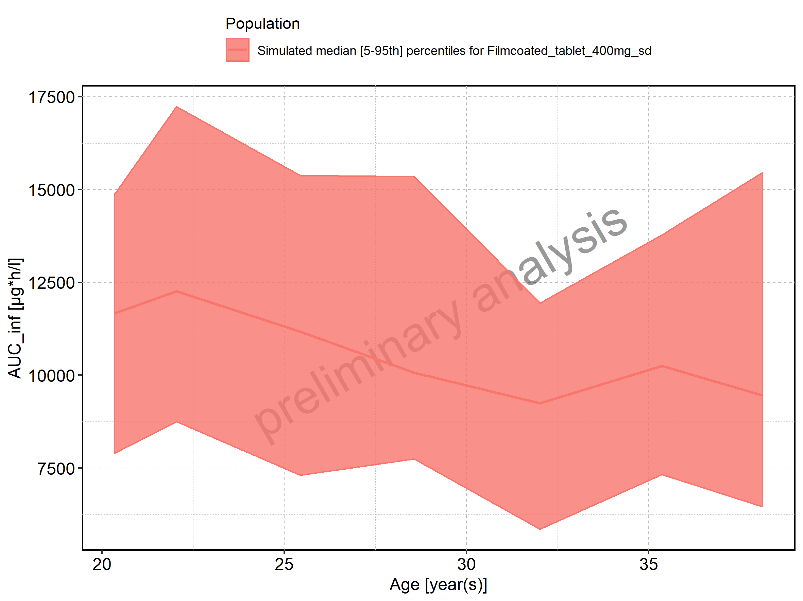

Figure 200: Age-dependence of AUC_inf for Filmcoated_tablet_400mg_sd. Profiles are plotted in a logarithmic scale.

Figure 201: Height-dependence of AUC_inf for Larson 2013 8y-18y 400mg FCT meal in comparison to Filmcoated_tablet_400mg_sd. Profiles are plotted in a linear scale.

Figure 202: Height-dependence of AUC_inf for Larson 2013 8y-18y 400mg FCT meal in comparison to Filmcoated_tablet_400mg_sd. Profiles are plotted in a logarithmic scale.

Figure 203: Height-dependence of AUC_inf for Larson 2013 8y-18y 400mg FCT meal. Profiles are plotted in a linear scale.

Figure 204: Height-dependence of AUC_inf for Larson 2013 8y-18y 400mg FCT meal. Profiles are plotted in a logarithmic scale.

Figure 205: Height-dependence of AUC_inf for Filmcoated_tablet_400mg_sd. Profiles are plotted in a linear scale.

Figure 206: Height-dependence of AUC_inf for Filmcoated_tablet_400mg_sd. Profiles are plotted in a logarithmic scale.

Figure 207: Weight-dependence of AUC_inf for Larson 2013 8y-18y 400mg FCT meal in comparison to Filmcoated_tablet_400mg_sd. Profiles are plotted in a linear scale.

Figure 208: Weight-dependence of AUC_inf for Larson 2013 8y-18y 400mg FCT meal in comparison to Filmcoated_tablet_400mg_sd. Profiles are plotted in a logarithmic scale.

Figure 209: Weight-dependence of AUC_inf for Larson 2013 8y-18y 400mg FCT meal. Profiles are plotted in a linear scale.

Figure 210: Weight-dependence of AUC_inf for Larson 2013 8y-18y 400mg FCT meal. Profiles are plotted in a logarithmic scale.

Figure 211: Weight-dependence of AUC_inf for Filmcoated_tablet_400mg_sd. Profiles are plotted in a linear scale.

Figure 212: Weight-dependence of AUC_inf for Filmcoated_tablet_400mg_sd. Profiles are plotted in a logarithmic scale.

Figure 213: BMI-dependence of AUC_inf for Larson 2013 8y-18y 400mg FCT meal in comparison to Filmcoated_tablet_400mg_sd. Profiles are plotted in a linear scale.

Figure 214: BMI-dependence of AUC_inf for Larson 2013 8y-18y 400mg FCT meal in comparison to Filmcoated_tablet_400mg_sd. Profiles are plotted in a logarithmic scale.

Figure 215: BMI-dependence of AUC_inf for Larson 2013 8y-18y 400mg FCT meal. Profiles are plotted in a linear scale.

Figure 216: BMI-dependence of AUC_inf for Larson 2013 8y-18y 400mg FCT meal. Profiles are plotted in a logarithmic scale.

Figure 217: BMI-dependence of AUC_inf for Filmcoated_tablet_400mg_sd. Profiles are plotted in a linear scale.

Figure 218: BMI-dependence of AUC_inf for Filmcoated_tablet_400mg_sd. Profiles are plotted in a logarithmic scale.

Figure 219: Gender-dependence of AUC_inf for Larson 2013 8y-18y 400mg FCT meal in comparison to Filmcoated_tablet_400mg_sd. Profiles are plotted in a linear scale.

Figure 220: Gender-dependence of AUC_inf for Larson 2013 8y-18y 400mg FCT meal in comparison to Filmcoated_tablet_400mg_sd. Profiles are plotted in a logarithmic scale.

Figure 221: Gender-dependence of AUC_inf for Larson 2013 8y-18y 400mg FCT meal. Profiles are plotted in a linear scale.

Figure 222: Gender-dependence of AUC_inf for Larson 2013 8y-18y 400mg FCT meal. Profiles are plotted in a logarithmic scale.

Figure 223: Gender-dependence of AUC_inf for Filmcoated_tablet_400mg_sd. Profiles are plotted in a linear scale.

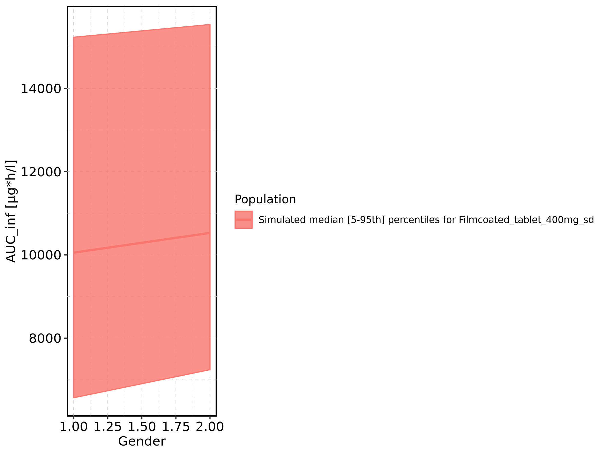

Figure 224: Gender-dependence of AUC_inf for Filmcoated_tablet_400mg_sd. Profiles are plotted in a logarithmic scale.

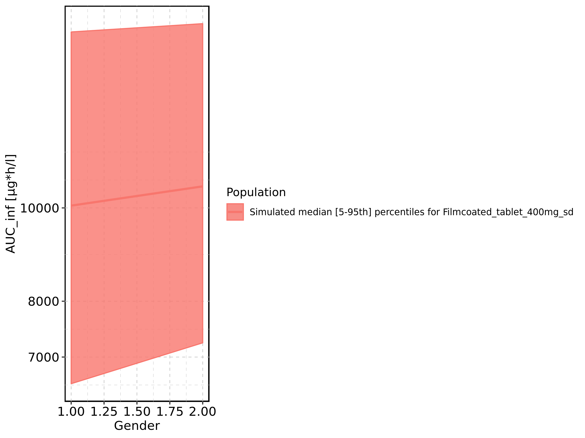

Figure 225: AUC_inf_norm of Raltegravir shown as box-whisker plot, which indicates the 5th, 25th, 50th, 75th, and 95th percentiles in linear scale.

-AUC_inf_norm.png)

|Population                        |   N| 5th percentile| 25th percentile| 50th percentile| 75th percentile| 95th percentile|     mean| standard deviation| geo mean| geo standard deviation|
|:---------------------------------|---:|--------------:|---------------:|---------------:|---------------:|---------------:|--------:|------------------:|--------:|----------------------:|
|Larson 2013 8y-18y 400mg FCT meal | 500|       1.122459|        1.474697|        1.808947|        2.224967|        3.039113| 1.911305|          0.6244296| 0.000000|                     NA|
|Filmcoated_tablet_400mg_sd        | 100|       1.235885|        1.619815|        1.845499|        2.231818|        2.832975| 1.939375|          0.5032643| 1.875269|               1.300506|

Figure 226: AUC_inf_norm of Raltegravir shown as box-whisker plot, which indicates the 5th, 25th, 50th, 75th, and 95th percentiles in logarithmic scale.

-AUC_inf_norm-log.png)

Figure 227: Age-dependence of AUC_inf_norm for Larson 2013 8y-18y 400mg FCT meal in comparison to Filmcoated_tablet_400mg_sd. Profiles are plotted in a linear scale.

Figure 228: Age-dependence of AUC_inf_norm for Larson 2013 8y-18y 400mg FCT meal in comparison to Filmcoated_tablet_400mg_sd. Profiles are plotted in a logarithmic scale.

Figure 229: Age-dependence of AUC_inf_norm for Larson 2013 8y-18y 400mg FCT meal. Profiles are plotted in a linear scale.

Figure 230: Age-dependence of AUC_inf_norm for Larson 2013 8y-18y 400mg FCT meal. Profiles are plotted in a logarithmic scale.

Figure 231: Age-dependence of AUC_inf_norm for Filmcoated_tablet_400mg_sd. Profiles are plotted in a linear scale.

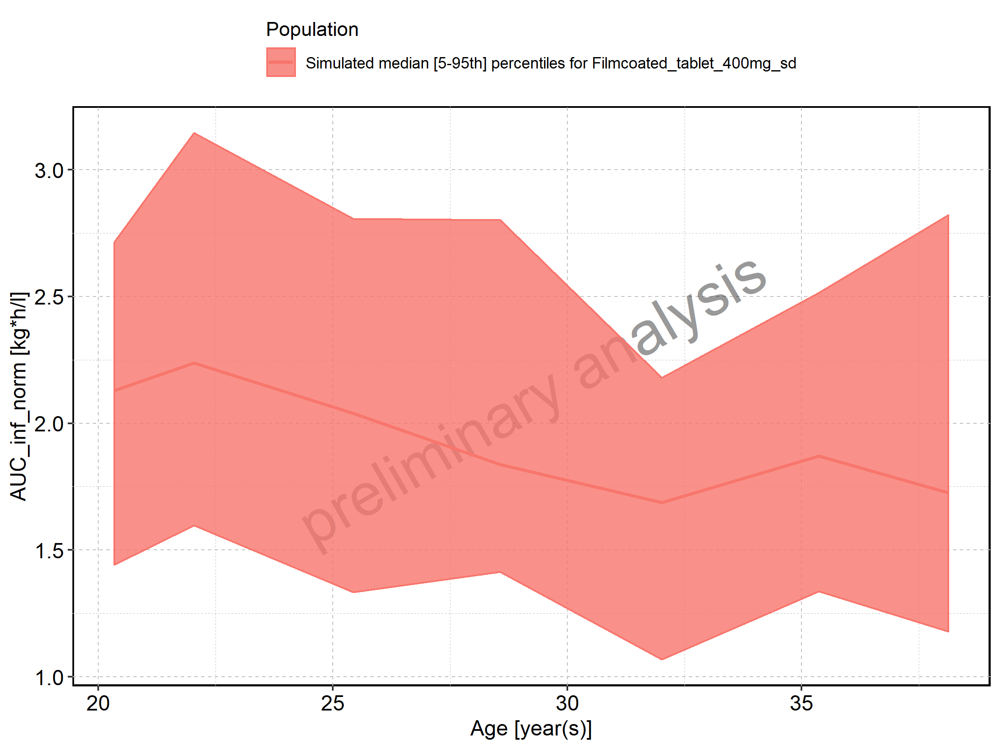

Figure 232: Age-dependence of AUC_inf_norm for Filmcoated_tablet_400mg_sd. Profiles are plotted in a logarithmic scale.

Figure 233: Height-dependence of AUC_inf_norm for Larson 2013 8y-18y 400mg FCT meal in comparison to Filmcoated_tablet_400mg_sd. Profiles are plotted in a linear scale.

Figure 234: Height-dependence of AUC_inf_norm for Larson 2013 8y-18y 400mg FCT meal in comparison to Filmcoated_tablet_400mg_sd. Profiles are plotted in a logarithmic scale.

Figure 235: Height-dependence of AUC_inf_norm for Larson 2013 8y-18y 400mg FCT meal. Profiles are plotted in a linear scale.

Figure 236: Height-dependence of AUC_inf_norm for Larson 2013 8y-18y 400mg FCT meal. Profiles are plotted in a logarithmic scale.

Figure 237: Height-dependence of AUC_inf_norm for Filmcoated_tablet_400mg_sd. Profiles are plotted in a linear scale.

Figure 238: Height-dependence of AUC_inf_norm for Filmcoated_tablet_400mg_sd. Profiles are plotted in a logarithmic scale.

Figure 239: Weight-dependence of AUC_inf_norm for Larson 2013 8y-18y 400mg FCT meal in comparison to Filmcoated_tablet_400mg_sd. Profiles are plotted in a linear scale.

Figure 240: Weight-dependence of AUC_inf_norm for Larson 2013 8y-18y 400mg FCT meal in comparison to Filmcoated_tablet_400mg_sd. Profiles are plotted in a logarithmic scale.

Figure 241: Weight-dependence of AUC_inf_norm for Larson 2013 8y-18y 400mg FCT meal. Profiles are plotted in a linear scale.

Figure 242: Weight-dependence of AUC_inf_norm for Larson 2013 8y-18y 400mg FCT meal. Profiles are plotted in a logarithmic scale.

Figure 243: Weight-dependence of AUC_inf_norm for Filmcoated_tablet_400mg_sd. Profiles are plotted in a linear scale.

Figure 244: Weight-dependence of AUC_inf_norm for Filmcoated_tablet_400mg_sd. Profiles are plotted in a logarithmic scale.

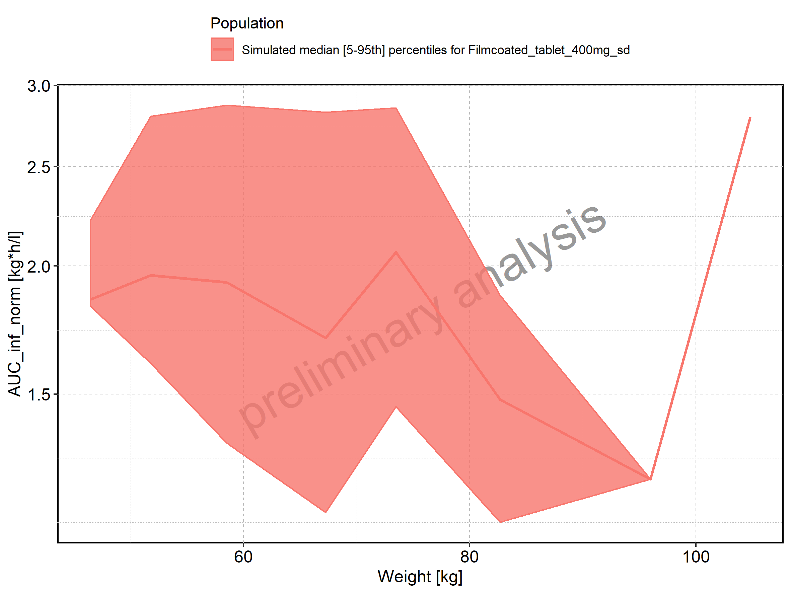

Figure 245: BMI-dependence of AUC_inf_norm for Larson 2013 8y-18y 400mg FCT meal in comparison to Filmcoated_tablet_400mg_sd. Profiles are plotted in a linear scale.

Figure 246: BMI-dependence of AUC_inf_norm for Larson 2013 8y-18y 400mg FCT meal in comparison to Filmcoated_tablet_400mg_sd. Profiles are plotted in a logarithmic scale.

Figure 247: BMI-dependence of AUC_inf_norm for Larson 2013 8y-18y 400mg FCT meal. Profiles are plotted in a linear scale.

Figure 248: BMI-dependence of AUC_inf_norm for Larson 2013 8y-18y 400mg FCT meal. Profiles are plotted in a logarithmic scale.

Figure 249: BMI-dependence of AUC_inf_norm for Filmcoated_tablet_400mg_sd. Profiles are plotted in a linear scale.

Figure 250: BMI-dependence of AUC_inf_norm for Filmcoated_tablet_400mg_sd. Profiles are plotted in a logarithmic scale.

Figure 251: Gender-dependence of AUC_inf_norm for Larson 2013 8y-18y 400mg FCT meal in comparison to Filmcoated_tablet_400mg_sd. Profiles are plotted in a linear scale.

Figure 252: Gender-dependence of AUC_inf_norm for Larson 2013 8y-18y 400mg FCT meal in comparison to Filmcoated_tablet_400mg_sd. Profiles are plotted in a logarithmic scale.

Figure 253: Gender-dependence of AUC_inf_norm for Larson 2013 8y-18y 400mg FCT meal. Profiles are plotted in a linear scale.

Figure 254: Gender-dependence of AUC_inf_norm for Larson 2013 8y-18y 400mg FCT meal. Profiles are plotted in a logarithmic scale.

Figure 255: Gender-dependence of AUC_inf_norm for Filmcoated_tablet_400mg_sd. Profiles are plotted in a linear scale.

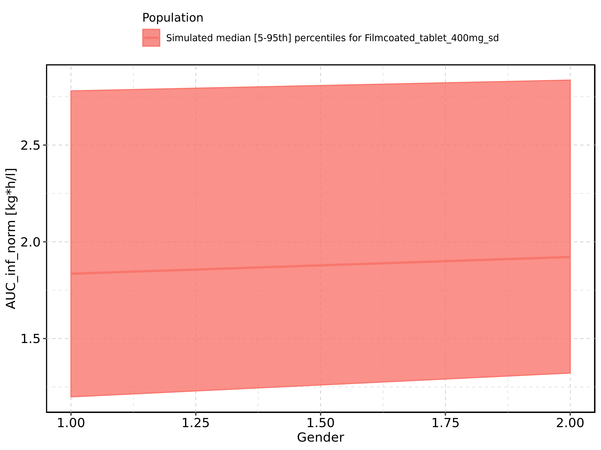

Figure 256: Gender-dependence of AUC_inf_norm for Filmcoated_tablet_400mg_sd. Profiles are plotted in a logarithmic scale.

Figure 257: MRT of Raltegravir shown as box-whisker plot, which indicates the 5th, 25th, 50th, 75th, and 95th percentiles in linear scale.

-MRT.png)

|Population                        |   N| 5th percentile| 25th percentile| 50th percentile| 75th percentile| 95th percentile|    mean| standard deviation| geo mean| geo standard deviation|
|:---------------------------------|---:|--------------:|---------------:|---------------:|---------------:|---------------:|-------:|------------------:|--------:|----------------------:|
|Larson 2013 8y-18y 400mg FCT meal | 497|       3.883445|        4.609144|        5.323850|        6.221885|       10.309078| 6.26299|           5.564334| 5.638130|               1.436885|
|Filmcoated_tablet_400mg_sd        | 100|       4.431077|        4.803066|        5.199119|        5.682457|        6.697588| 5.43842|           1.539075| 5.318614|               1.206249|

Figure 258: MRT of Raltegravir shown as box-whisker plot, which indicates the 5th, 25th, 50th, 75th, and 95th percentiles in logarithmic scale.

-MRT-log.png)

Figure 259: Age-dependence of MRT for Larson 2013 8y-18y 400mg FCT meal in comparison to Filmcoated_tablet_400mg_sd. Profiles are plotted in a linear scale.

Figure 260: Age-dependence of MRT for Larson 2013 8y-18y 400mg FCT meal in comparison to Filmcoated_tablet_400mg_sd. Profiles are plotted in a logarithmic scale.

Figure 261: Age-dependence of MRT for Larson 2013 8y-18y 400mg FCT meal. Profiles are plotted in a linear scale.

Figure 262: Age-dependence of MRT for Larson 2013 8y-18y 400mg FCT meal. Profiles are plotted in a logarithmic scale.

Figure 263: Age-dependence of MRT for Filmcoated_tablet_400mg_sd. Profiles are plotted in a linear scale.

Figure 264: Age-dependence of MRT for Filmcoated_tablet_400mg_sd. Profiles are plotted in a logarithmic scale.

Figure 265: Height-dependence of MRT for Larson 2013 8y-18y 400mg FCT meal in comparison to Filmcoated_tablet_400mg_sd. Profiles are plotted in a linear scale.

Figure 266: Height-dependence of MRT for Larson 2013 8y-18y 400mg FCT meal in comparison to Filmcoated_tablet_400mg_sd. Profiles are plotted in a logarithmic scale.

Figure 267: Height-dependence of MRT for Larson 2013 8y-18y 400mg FCT meal. Profiles are plotted in a linear scale.

Figure 268: Height-dependence of MRT for Larson 2013 8y-18y 400mg FCT meal. Profiles are plotted in a logarithmic scale.

Figure 269: Height-dependence of MRT for Filmcoated_tablet_400mg_sd. Profiles are plotted in a linear scale.

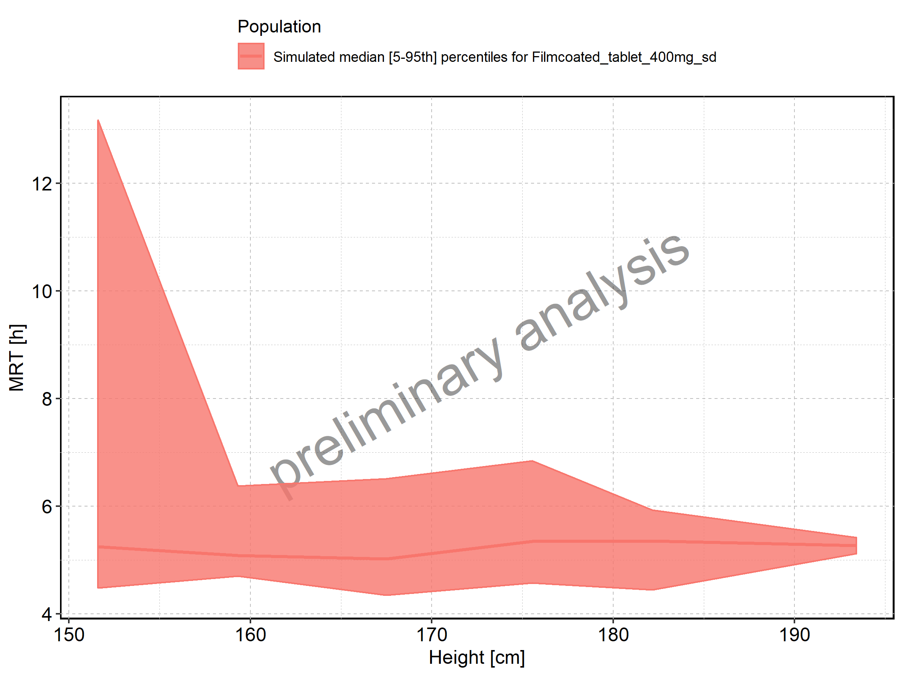

Figure 270: Height-dependence of MRT for Filmcoated_tablet_400mg_sd. Profiles are plotted in a logarithmic scale.

Figure 271: Weight-dependence of MRT for Larson 2013 8y-18y 400mg FCT meal in comparison to Filmcoated_tablet_400mg_sd. Profiles are plotted in a linear scale.

Figure 272: Weight-dependence of MRT for Larson 2013 8y-18y 400mg FCT meal in comparison to Filmcoated_tablet_400mg_sd. Profiles are plotted in a logarithmic scale.

Figure 273: Weight-dependence of MRT for Larson 2013 8y-18y 400mg FCT meal. Profiles are plotted in a linear scale.

Figure 274: Weight-dependence of MRT for Larson 2013 8y-18y 400mg FCT meal. Profiles are plotted in a logarithmic scale.

Figure 275: Weight-dependence of MRT for Filmcoated_tablet_400mg_sd. Profiles are plotted in a linear scale.

Figure 276: Weight-dependence of MRT for Filmcoated_tablet_400mg_sd. Profiles are plotted in a logarithmic scale.

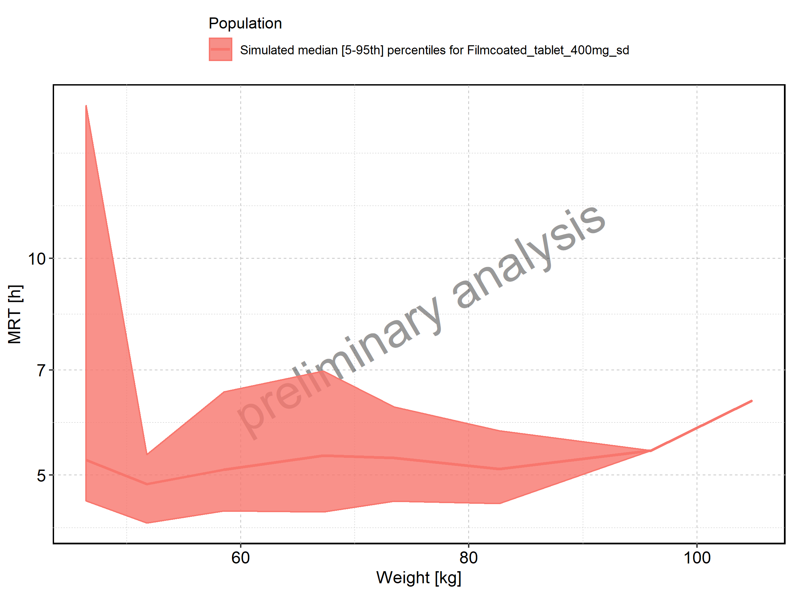

Figure 277: BMI-dependence of MRT for Larson 2013 8y-18y 400mg FCT meal in comparison to Filmcoated_tablet_400mg_sd. Profiles are plotted in a linear scale.

Figure 278: BMI-dependence of MRT for Larson 2013 8y-18y 400mg FCT meal in comparison to Filmcoated_tablet_400mg_sd. Profiles are plotted in a logarithmic scale.

Figure 279: BMI-dependence of MRT for Larson 2013 8y-18y 400mg FCT meal. Profiles are plotted in a linear scale.

Figure 280: BMI-dependence of MRT for Larson 2013 8y-18y 400mg FCT meal. Profiles are plotted in a logarithmic scale.

Figure 281: BMI-dependence of MRT for Filmcoated_tablet_400mg_sd. Profiles are plotted in a linear scale.

Figure 282: BMI-dependence of MRT for Filmcoated_tablet_400mg_sd. Profiles are plotted in a logarithmic scale.

Figure 283: Gender-dependence of MRT for Larson 2013 8y-18y 400mg FCT meal in comparison to Filmcoated_tablet_400mg_sd. Profiles are plotted in a linear scale.

Figure 284: Gender-dependence of MRT for Larson 2013 8y-18y 400mg FCT meal in comparison to Filmcoated_tablet_400mg_sd. Profiles are plotted in a logarithmic scale.

Figure 285: Gender-dependence of MRT for Larson 2013 8y-18y 400mg FCT meal. Profiles are plotted in a linear scale.

Figure 286: Gender-dependence of MRT for Larson 2013 8y-18y 400mg FCT meal. Profiles are plotted in a logarithmic scale.

Figure 287: Gender-dependence of MRT for Filmcoated_tablet_400mg_sd. Profiles are plotted in a linear scale.

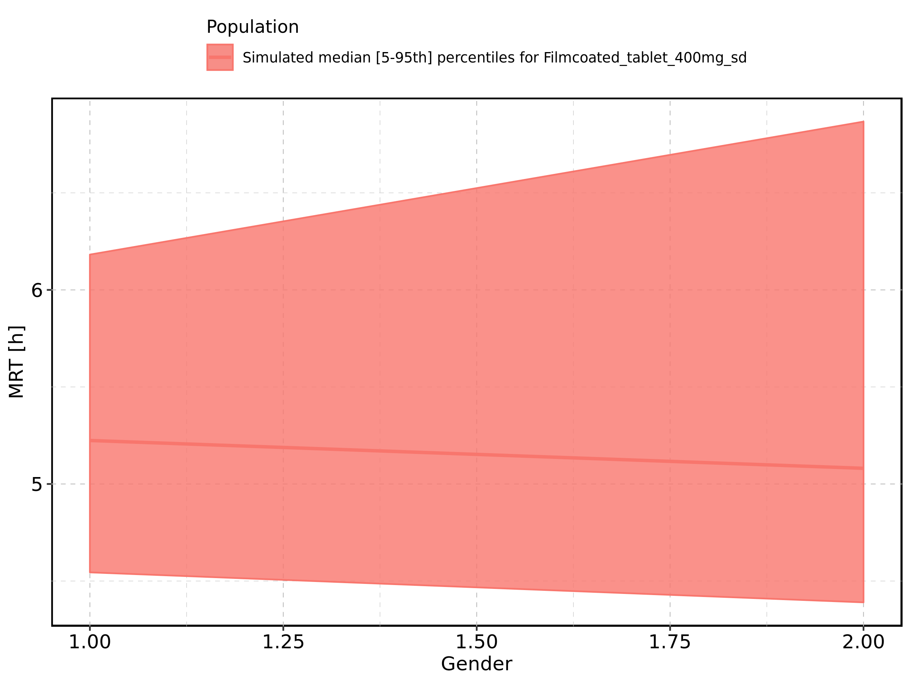

Figure 288: Gender-dependence of MRT for Filmcoated_tablet_400mg_sd. Profiles are plotted in a logarithmic scale.

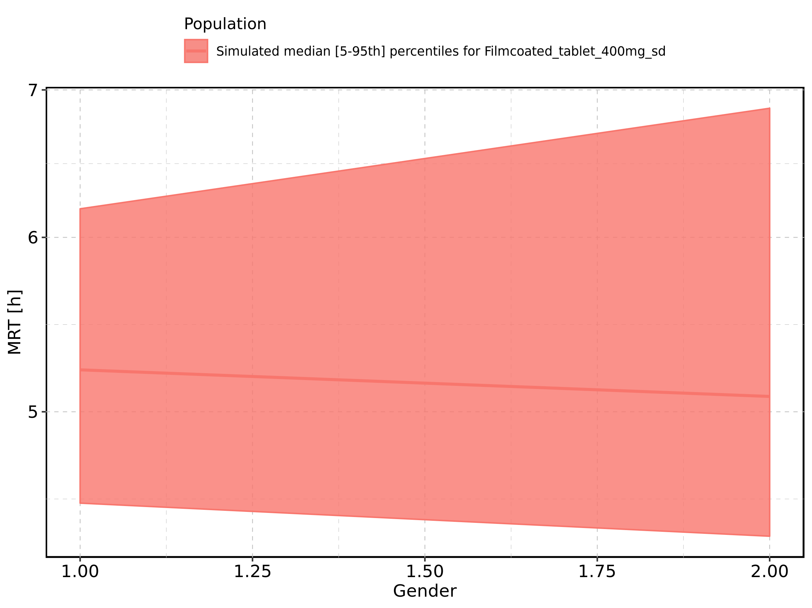

Figure 289: Thalf of Raltegravir shown as box-whisker plot, which indicates the 5th, 25th, 50th, 75th, and 95th percentiles in linear scale.

-Thalf.png)

|Population                        |   N| 5th percentile| 25th percentile| 50th percentile| 75th percentile| 95th percentile|     mean| standard deviation| geo mean| geo standard deviation|
|:---------------------------------|---:|--------------:|---------------:|---------------:|---------------:|---------------:|--------:|------------------:|--------:|----------------------:|
|Larson 2013 8y-18y 400mg FCT meal | 500|       2.549721|        3.014642|        3.492027|        4.299532|        9.428484| 3.895567|          10.493434|       NA|                     NA|
|Filmcoated_tablet_400mg_sd        | 100|       5.739979|        8.084065|        9.195944|       11.176013|       16.813811| 9.987298|           3.182538| 9.545373|               1.348088|

Figure 290: Thalf of Raltegravir shown as box-whisker plot, which indicates the 5th, 25th, 50th, 75th, and 95th percentiles in logarithmic scale.

-Thalf-log.png)

Figure 291: Age-dependence of Thalf for Larson 2013 8y-18y 400mg FCT meal in comparison to Filmcoated_tablet_400mg_sd. Profiles are plotted in a linear scale.

Figure 292: Age-dependence of Thalf for Larson 2013 8y-18y 400mg FCT meal in comparison to Filmcoated_tablet_400mg_sd. Profiles are plotted in a logarithmic scale.

Figure 293: Age-dependence of Thalf for Larson 2013 8y-18y 400mg FCT meal. Profiles are plotted in a linear scale.

Figure 294: Age-dependence of Thalf for Larson 2013 8y-18y 400mg FCT meal. Profiles are plotted in a logarithmic scale.

Figure 295: Age-dependence of Thalf for Filmcoated_tablet_400mg_sd. Profiles are plotted in a linear scale.

Figure 296: Age-dependence of Thalf for Filmcoated_tablet_400mg_sd. Profiles are plotted in a logarithmic scale.

Figure 297: Height-dependence of Thalf for Larson 2013 8y-18y 400mg FCT meal in comparison to Filmcoated_tablet_400mg_sd. Profiles are plotted in a linear scale.

Figure 298: Height-dependence of Thalf for Larson 2013 8y-18y 400mg FCT meal in comparison to Filmcoated_tablet_400mg_sd. Profiles are plotted in a logarithmic scale.

Figure 299: Height-dependence of Thalf for Larson 2013 8y-18y 400mg FCT meal. Profiles are plotted in a linear scale.

Figure 300: Height-dependence of Thalf for Larson 2013 8y-18y 400mg FCT meal. Profiles are plotted in a logarithmic scale.

Figure 301: Height-dependence of Thalf for Filmcoated_tablet_400mg_sd. Profiles are plotted in a linear scale.

Figure 302: Height-dependence of Thalf for Filmcoated_tablet_400mg_sd. Profiles are plotted in a logarithmic scale.

Figure 303: Weight-dependence of Thalf for Larson 2013 8y-18y 400mg FCT meal in comparison to Filmcoated_tablet_400mg_sd. Profiles are plotted in a linear scale.

Figure 304: Weight-dependence of Thalf for Larson 2013 8y-18y 400mg FCT meal in comparison to Filmcoated_tablet_400mg_sd. Profiles are plotted in a logarithmic scale.

Figure 305: Weight-dependence of Thalf for Larson 2013 8y-18y 400mg FCT meal. Profiles are plotted in a linear scale.

Figure 306: Weight-dependence of Thalf for Larson 2013 8y-18y 400mg FCT meal. Profiles are plotted in a logarithmic scale.

Figure 307: Weight-dependence of Thalf for Filmcoated_tablet_400mg_sd. Profiles are plotted in a linear scale.

Figure 308: Weight-dependence of Thalf for Filmcoated_tablet_400mg_sd. Profiles are plotted in a logarithmic scale.

Figure 309: BMI-dependence of Thalf for Larson 2013 8y-18y 400mg FCT meal in comparison to Filmcoated_tablet_400mg_sd. Profiles are plotted in a linear scale.

Figure 310: BMI-dependence of Thalf for Larson 2013 8y-18y 400mg FCT meal in comparison to Filmcoated_tablet_400mg_sd. Profiles are plotted in a logarithmic scale.

Figure 311: BMI-dependence of Thalf for Larson 2013 8y-18y 400mg FCT meal. Profiles are plotted in a linear scale.

Figure 312: BMI-dependence of Thalf for Larson 2013 8y-18y 400mg FCT meal. Profiles are plotted in a logarithmic scale.

Figure 313: BMI-dependence of Thalf for Filmcoated_tablet_400mg_sd. Profiles are plotted in a linear scale.

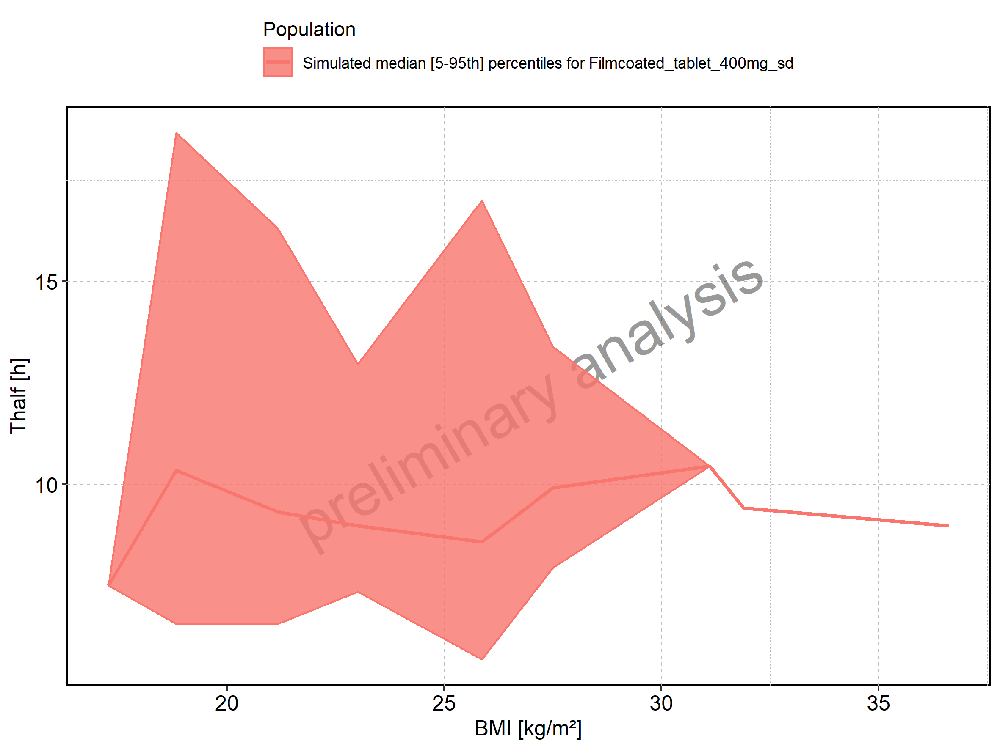

Figure 314: BMI-dependence of Thalf for Filmcoated_tablet_400mg_sd. Profiles are plotted in a logarithmic scale.

Figure 315: Gender-dependence of Thalf for Larson 2013 8y-18y 400mg FCT meal in comparison to Filmcoated_tablet_400mg_sd. Profiles are plotted in a linear scale.

Figure 316: Gender-dependence of Thalf for Larson 2013 8y-18y 400mg FCT meal in comparison to Filmcoated_tablet_400mg_sd. Profiles are plotted in a logarithmic scale.

Figure 317: Gender-dependence of Thalf for Larson 2013 8y-18y 400mg FCT meal. Profiles are plotted in a linear scale.

Figure 318: Gender-dependence of Thalf for Larson 2013 8y-18y 400mg FCT meal. Profiles are plotted in a logarithmic scale.

Figure 319: Gender-dependence of Thalf for Filmcoated_tablet_400mg_sd. Profiles are plotted in a linear scale.

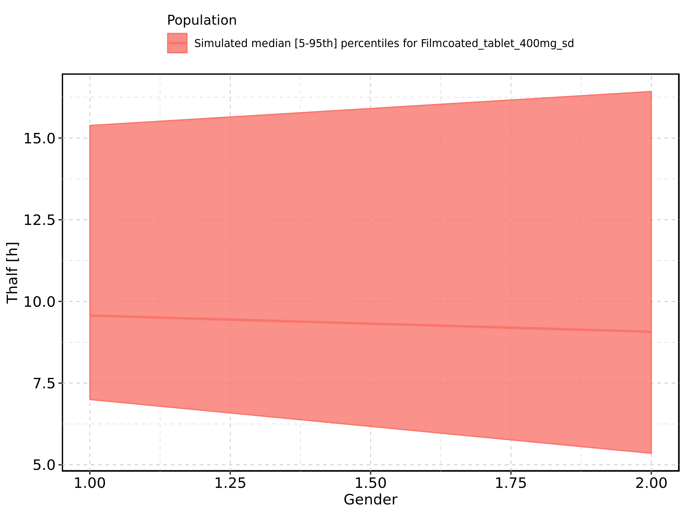

Figure 320: Gender-dependence of Thalf for Filmcoated_tablet_400mg_sd. Profiles are plotted in a logarithmic scale.

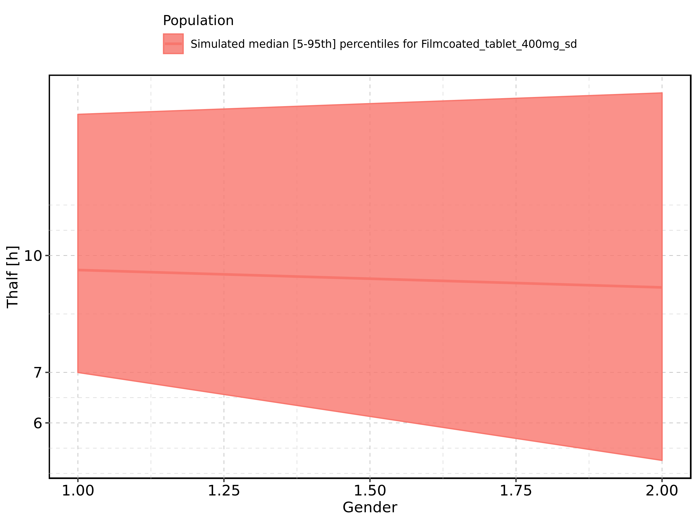

Figure 321: CL of Raltegravir shown as box-whisker plot, which indicates the 5th, 25th, 50th, 75th, and 95th percentiles in linear scale.

-CL.png)

|Population                        |   N| 5th percentile| 25th percentile| 50th percentile| 75th percentile| 95th percentile|     mean| standard deviation| geo mean| geo standard deviation|
|:---------------------------------|---:|--------------:|---------------:|---------------:|---------------:|---------------:|--------:|------------------:|--------:|----------------------:|
|Larson 2013 8y-18y 400mg FCT meal | 497|       5.482107|        7.474598|        9.202990|        11.19313|        14.70885| 9.494908|           2.837539| 9.079494|               1.353166|
|Filmcoated_tablet_400mg_sd        | 100|       5.883098|        7.467935|        9.030982|        10.28982|        13.48808| 9.200767|           2.501942| 8.887615|               1.300506|

Figure 322: CL of Raltegravir shown as box-whisker plot, which indicates the 5th, 25th, 50th, 75th, and 95th percentiles in logarithmic scale.

-CL-log.png)

Figure 323: Age-dependence of CL for Larson 2013 8y-18y 400mg FCT meal in comparison to Filmcoated_tablet_400mg_sd. Profiles are plotted in a linear scale.

Figure 324: Age-dependence of CL for Larson 2013 8y-18y 400mg FCT meal in comparison to Filmcoated_tablet_400mg_sd. Profiles are plotted in a logarithmic scale.

Figure 325: Age-dependence of CL for Larson 2013 8y-18y 400mg FCT meal. Profiles are plotted in a linear scale.

Figure 326: Age-dependence of CL for Larson 2013 8y-18y 400mg FCT meal. Profiles are plotted in a logarithmic scale.

Figure 327: Age-dependence of CL for Filmcoated_tablet_400mg_sd. Profiles are plotted in a linear scale.

Figure 328: Age-dependence of CL for Filmcoated_tablet_400mg_sd. Profiles are plotted in a logarithmic scale.

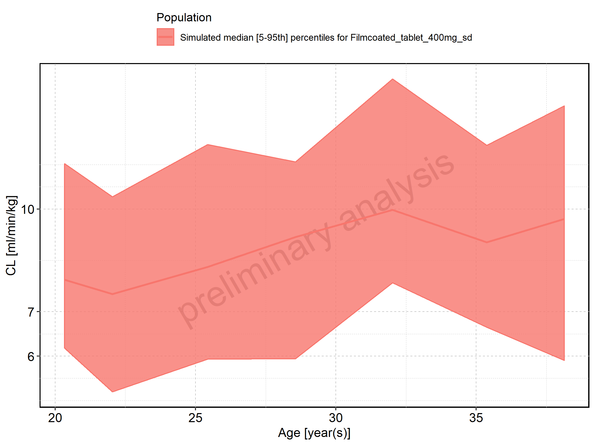

Figure 329: Height-dependence of CL for Larson 2013 8y-18y 400mg FCT meal in comparison to Filmcoated_tablet_400mg_sd. Profiles are plotted in a linear scale.

Figure 330: Height-dependence of CL for Larson 2013 8y-18y 400mg FCT meal in comparison to Filmcoated_tablet_400mg_sd. Profiles are plotted in a logarithmic scale.

Figure 331: Height-dependence of CL for Larson 2013 8y-18y 400mg FCT meal. Profiles are plotted in a linear scale.

Figure 332: Height-dependence of CL for Larson 2013 8y-18y 400mg FCT meal. Profiles are plotted in a logarithmic scale.

Figure 333: Height-dependence of CL for Filmcoated_tablet_400mg_sd. Profiles are plotted in a linear scale.

Figure 334: Height-dependence of CL for Filmcoated_tablet_400mg_sd. Profiles are plotted in a logarithmic scale.

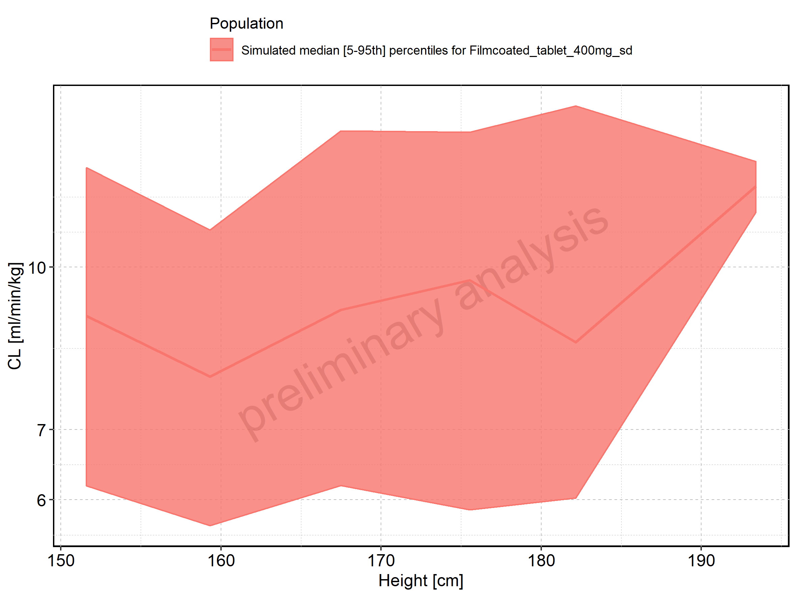

Figure 335: Weight-dependence of CL for Larson 2013 8y-18y 400mg FCT meal in comparison to Filmcoated_tablet_400mg_sd. Profiles are plotted in a linear scale.

Figure 336: Weight-dependence of CL for Larson 2013 8y-18y 400mg FCT meal in comparison to Filmcoated_tablet_400mg_sd. Profiles are plotted in a logarithmic scale.

Figure 337: Weight-dependence of CL for Larson 2013 8y-18y 400mg FCT meal. Profiles are plotted in a linear scale.

Figure 338: Weight-dependence of CL for Larson 2013 8y-18y 400mg FCT meal. Profiles are plotted in a logarithmic scale.

Figure 339: Weight-dependence of CL for Filmcoated_tablet_400mg_sd. Profiles are plotted in a linear scale.

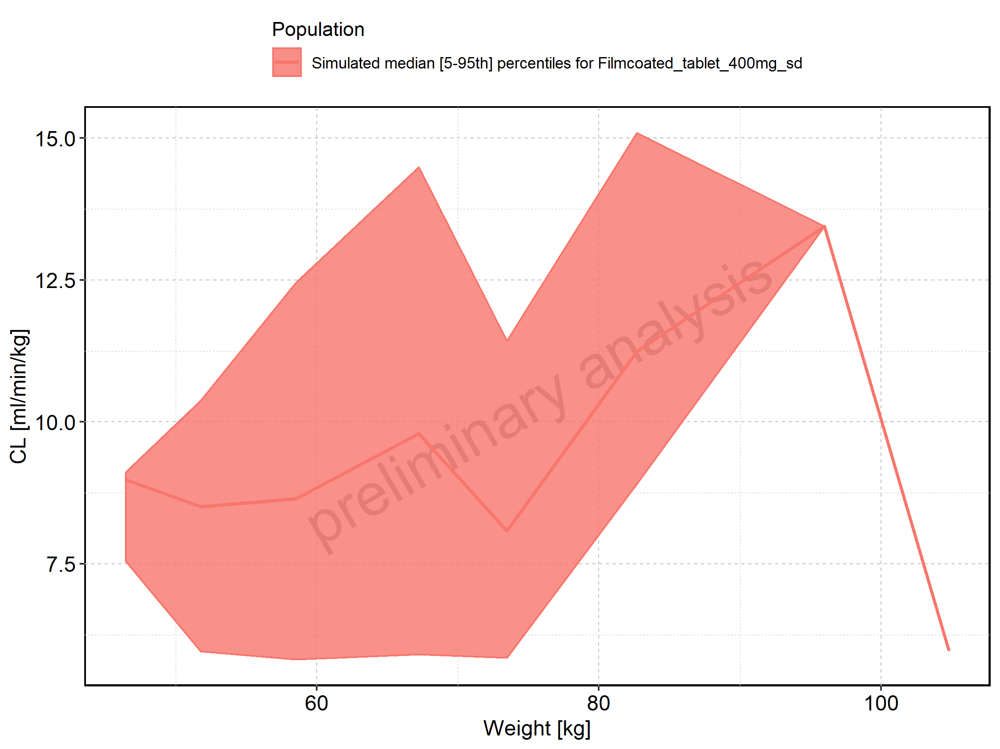

Figure 340: Weight-dependence of CL for Filmcoated_tablet_400mg_sd. Profiles are plotted in a logarithmic scale.

Figure 341: BMI-dependence of CL for Larson 2013 8y-18y 400mg FCT meal in comparison to Filmcoated_tablet_400mg_sd. Profiles are plotted in a linear scale.

Figure 342: BMI-dependence of CL for Larson 2013 8y-18y 400mg FCT meal in comparison to Filmcoated_tablet_400mg_sd. Profiles are plotted in a logarithmic scale.

Figure 343: BMI-dependence of CL for Larson 2013 8y-18y 400mg FCT meal. Profiles are plotted in a linear scale.

Figure 344: BMI-dependence of CL for Larson 2013 8y-18y 400mg FCT meal. Profiles are plotted in a logarithmic scale.

Figure 345: BMI-dependence of CL for Filmcoated_tablet_400mg_sd. Profiles are plotted in a linear scale.

Figure 346: BMI-dependence of CL for Filmcoated_tablet_400mg_sd. Profiles are plotted in a logarithmic scale.

Figure 347: Gender-dependence of CL for Larson 2013 8y-18y 400mg FCT meal in comparison to Filmcoated_tablet_400mg_sd. Profiles are plotted in a linear scale.

Figure 348: Gender-dependence of CL for Larson 2013 8y-18y 400mg FCT meal in comparison to Filmcoated_tablet_400mg_sd. Profiles are plotted in a logarithmic scale.

Figure 349: Gender-dependence of CL for Larson 2013 8y-18y 400mg FCT meal. Profiles are plotted in a linear scale.

Figure 350: Gender-dependence of CL for Larson 2013 8y-18y 400mg FCT meal. Profiles are plotted in a logarithmic scale.

Figure 351: Gender-dependence of CL for Filmcoated_tablet_400mg_sd. Profiles are plotted in a linear scale.

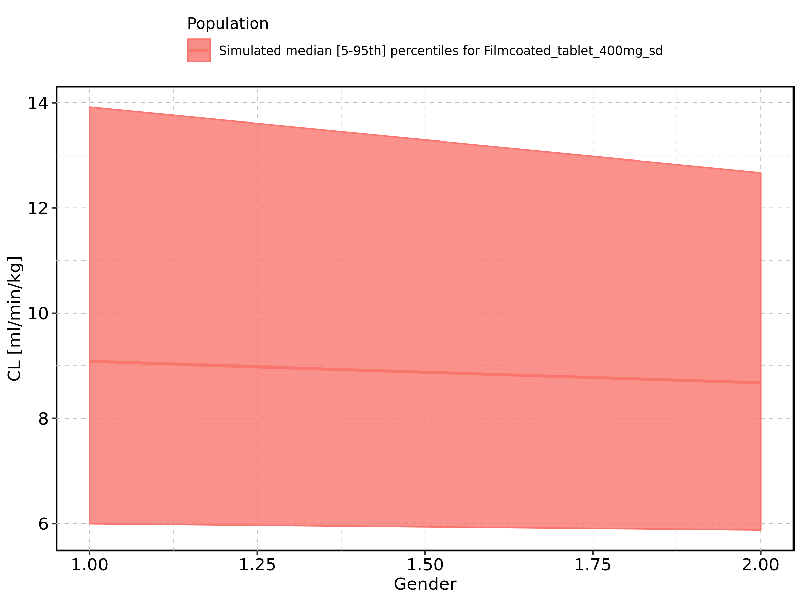

Figure 352: Gender-dependence of CL for Filmcoated_tablet_400mg_sd. Profiles are plotted in a logarithmic scale.

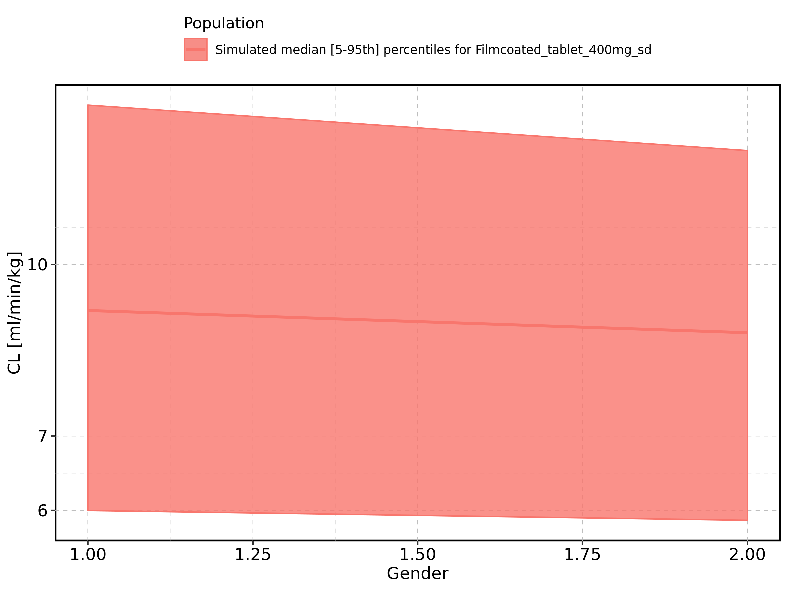

Figure 353: Vss of Raltegravir shown as box-whisker plot, which indicates the 5th, 25th, 50th, 75th, and 95th percentiles in linear scale.

-Vss.png)

|Population                        |   N| 5th percentile| 25th percentile| 50th percentile| 75th percentile| 95th percentile|     mean| standard deviation| geo mean| geo standard deviation|
|:---------------------------------|---:|--------------:|---------------:|---------------:|---------------:|---------------:|--------:|------------------:|--------:|----------------------:|
|Larson 2013 8y-18y 400mg FCT meal | 497|       1581.086|        2341.617|        2968.180|        3917.840|        6249.022| 3396.626|           1880.053| 3071.482|               1.528279|
|Filmcoated_tablet_400mg_sd        | 100|       1880.267|        2263.552|        2695.832|        3418.902|        4890.574| 2993.695|           1138.953| 2836.187|               1.369004|

Figure 354: Vss of Raltegravir shown as box-whisker plot, which indicates the 5th, 25th, 50th, 75th, and 95th percentiles in logarithmic scale.

-Vss-log.png)

Figure 355: Age-dependence of Vss for Larson 2013 8y-18y 400mg FCT meal in comparison to Filmcoated_tablet_400mg_sd. Profiles are plotted in a linear scale.

Figure 356: Age-dependence of Vss for Larson 2013 8y-18y 400mg FCT meal in comparison to Filmcoated_tablet_400mg_sd. Profiles are plotted in a logarithmic scale.

Figure 357: Age-dependence of Vss for Larson 2013 8y-18y 400mg FCT meal. Profiles are plotted in a linear scale.

Figure 358: Age-dependence of Vss for Larson 2013 8y-18y 400mg FCT meal. Profiles are plotted in a logarithmic scale.

Figure 359: Age-dependence of Vss for Filmcoated_tablet_400mg_sd. Profiles are plotted in a linear scale.

Figure 360: Age-dependence of Vss for Filmcoated_tablet_400mg_sd. Profiles are plotted in a logarithmic scale.

Figure 361: Height-dependence of Vss for Larson 2013 8y-18y 400mg FCT meal in comparison to Filmcoated_tablet_400mg_sd. Profiles are plotted in a linear scale.

Figure 362: Height-dependence of Vss for Larson 2013 8y-18y 400mg FCT meal in comparison to Filmcoated_tablet_400mg_sd. Profiles are plotted in a logarithmic scale.

Figure 363: Height-dependence of Vss for Larson 2013 8y-18y 400mg FCT meal. Profiles are plotted in a linear scale.

Figure 364: Height-dependence of Vss for Larson 2013 8y-18y 400mg FCT meal. Profiles are plotted in a logarithmic scale.

Figure 365: Height-dependence of Vss for Filmcoated_tablet_400mg_sd. Profiles are plotted in a linear scale.

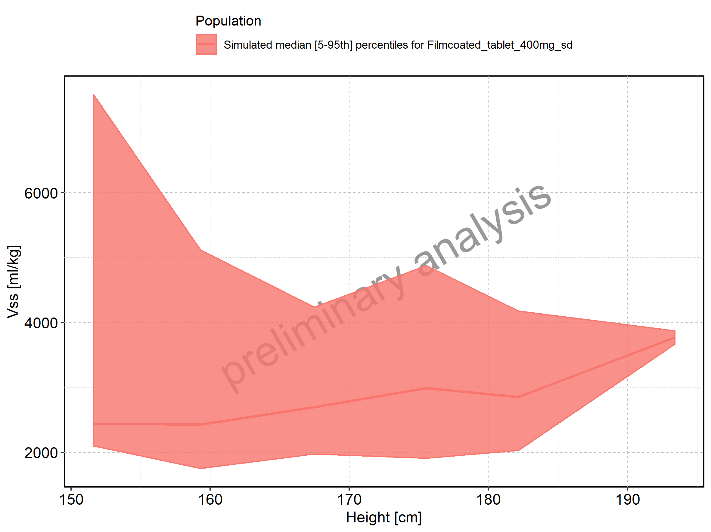

Figure 366: Height-dependence of Vss for Filmcoated_tablet_400mg_sd. Profiles are plotted in a logarithmic scale.

Figure 367: Weight-dependence of Vss for Larson 2013 8y-18y 400mg FCT meal in comparison to Filmcoated_tablet_400mg_sd. Profiles are plotted in a linear scale.

Figure 368: Weight-dependence of Vss for Larson 2013 8y-18y 400mg FCT meal in comparison to Filmcoated_tablet_400mg_sd. Profiles are plotted in a logarithmic scale.

Figure 369: Weight-dependence of Vss for Larson 2013 8y-18y 400mg FCT meal. Profiles are plotted in a linear scale.

Figure 370: Weight-dependence of Vss for Larson 2013 8y-18y 400mg FCT meal. Profiles are plotted in a logarithmic scale.

Figure 371: Weight-dependence of Vss for Filmcoated_tablet_400mg_sd. Profiles are plotted in a linear scale.

Figure 372: Weight-dependence of Vss for Filmcoated_tablet_400mg_sd. Profiles are plotted in a logarithmic scale.

Figure 373: BMI-dependence of Vss for Larson 2013 8y-18y 400mg FCT meal in comparison to Filmcoated_tablet_400mg_sd. Profiles are plotted in a linear scale.

Figure 374: BMI-dependence of Vss for Larson 2013 8y-18y 400mg FCT meal in comparison to Filmcoated_tablet_400mg_sd. Profiles are plotted in a logarithmic scale.

Figure 375: BMI-dependence of Vss for Larson 2013 8y-18y 400mg FCT meal. Profiles are plotted in a linear scale.

Figure 376: BMI-dependence of Vss for Larson 2013 8y-18y 400mg FCT meal. Profiles are plotted in a logarithmic scale.

Figure 377: BMI-dependence of Vss for Filmcoated_tablet_400mg_sd. Profiles are plotted in a linear scale.

Figure 378: BMI-dependence of Vss for Filmcoated_tablet_400mg_sd. Profiles are plotted in a logarithmic scale.

Figure 379: Gender-dependence of Vss for Larson 2013 8y-18y 400mg FCT meal in comparison to Filmcoated_tablet_400mg_sd. Profiles are plotted in a linear scale.

Figure 380: Gender-dependence of Vss for Larson 2013 8y-18y 400mg FCT meal in comparison to Filmcoated_tablet_400mg_sd. Profiles are plotted in a logarithmic scale.

Figure 381: Gender-dependence of Vss for Larson 2013 8y-18y 400mg FCT meal. Profiles are plotted in a linear scale.

Figure 382: Gender-dependence of Vss for Larson 2013 8y-18y 400mg FCT meal. Profiles are plotted in a logarithmic scale.

Figure 383: Gender-dependence of Vss for Filmcoated_tablet_400mg_sd. Profiles are plotted in a linear scale.

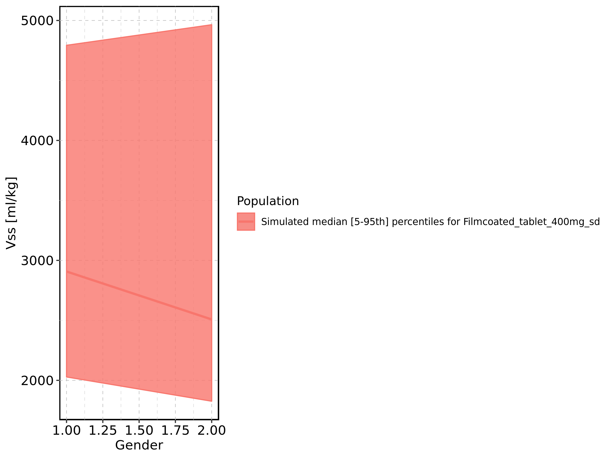

Figure 384: Gender-dependence of Vss for Filmcoated_tablet_400mg_sd. Profiles are plotted in a logarithmic scale.

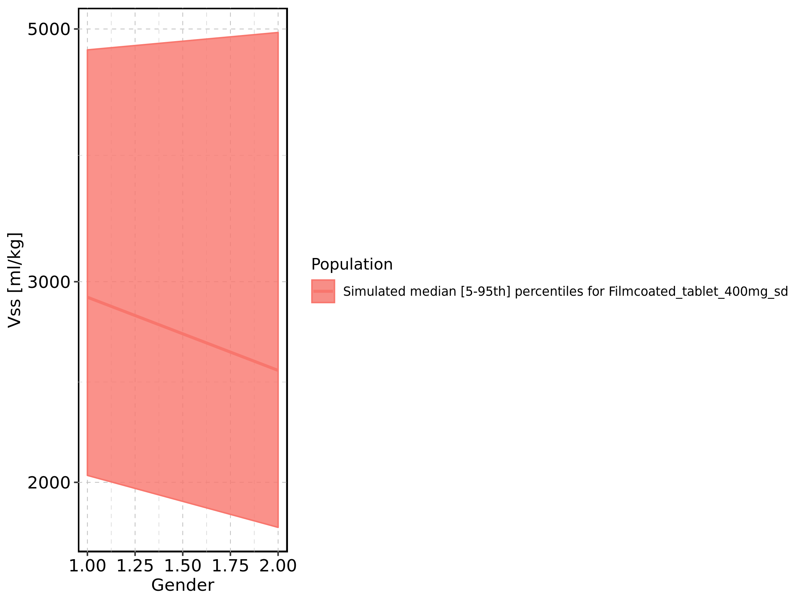

Figure 385: Vd of Raltegravir shown as box-whisker plot, which indicates the 5th, 25th, 50th, 75th, and 95th percentiles in linear scale.

-Vd.png)

|Population                        |   N| 5th percentile| 25th percentile| 50th percentile| 75th percentile| 95th percentile|     mean| standard deviation| geo mean| geo standard deviation|
|:---------------------------------|---:|--------------:|---------------:|---------------:|---------------:|---------------:|--------:|------------------:|--------:|----------------------:|
|Larson 2013 8y-18y 400mg FCT meal | 497|       1564.173|        2133.960|        2893.517|        3971.826|        7809.583| 3610.032|           2601.888| 3089.065|               1.670647|
|Filmcoated_tablet_400mg_sd        | 100|       3961.869|        5531.187|        6823.958|        9325.517|       16886.073| 8090.423|           4000.154| 7343.514|               1.531150|

Figure 386: Vd of Raltegravir shown as box-whisker plot, which indicates the 5th, 25th, 50th, 75th, and 95th percentiles in logarithmic scale.

-Vd-log.png)

Figure 387: Age-dependence of Vd for Larson 2013 8y-18y 400mg FCT meal in comparison to Filmcoated_tablet_400mg_sd. Profiles are plotted in a linear scale.

Figure 388: Age-dependence of Vd for Larson 2013 8y-18y 400mg FCT meal in comparison to Filmcoated_tablet_400mg_sd. Profiles are plotted in a logarithmic scale.

Figure 389: Age-dependence of Vd for Larson 2013 8y-18y 400mg FCT meal. Profiles are plotted in a linear scale.

Figure 390: Age-dependence of Vd for Larson 2013 8y-18y 400mg FCT meal. Profiles are plotted in a logarithmic scale.

Figure 391: Age-dependence of Vd for Filmcoated_tablet_400mg_sd. Profiles are plotted in a linear scale.

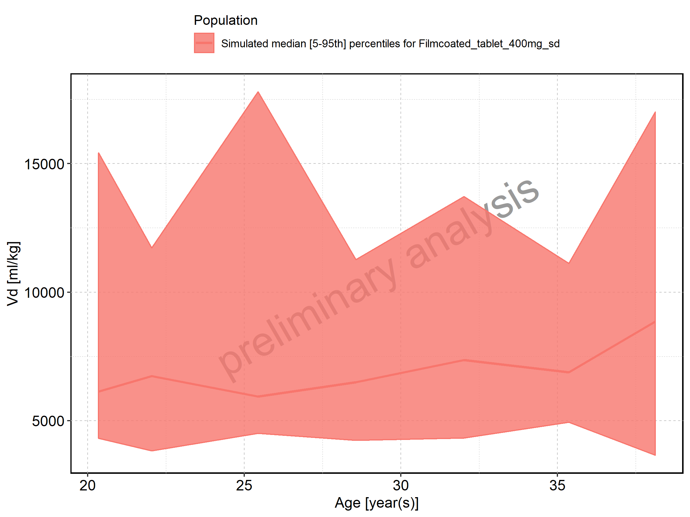

Figure 392: Age-dependence of Vd for Filmcoated_tablet_400mg_sd. Profiles are plotted in a logarithmic scale.

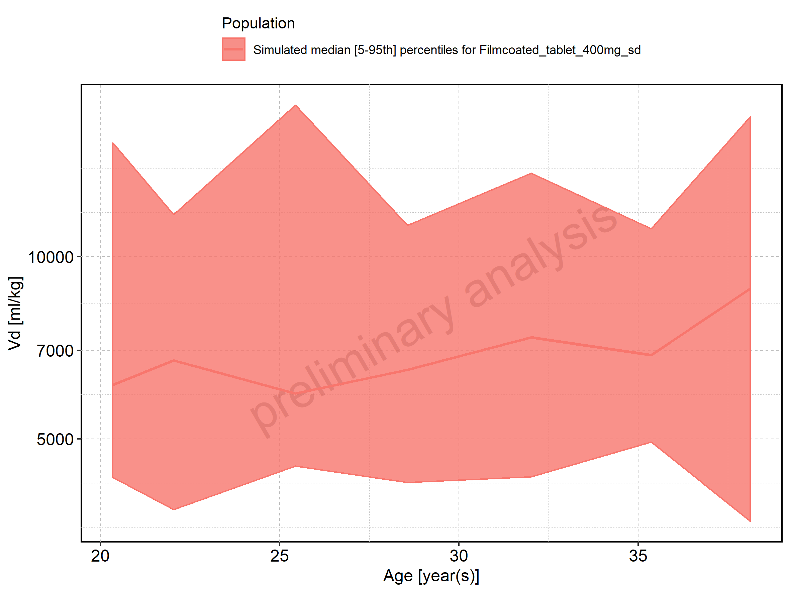

Figure 393: Height-dependence of Vd for Larson 2013 8y-18y 400mg FCT meal in comparison to Filmcoated_tablet_400mg_sd. Profiles are plotted in a linear scale.

Figure 394: Height-dependence of Vd for Larson 2013 8y-18y 400mg FCT meal in comparison to Filmcoated_tablet_400mg_sd. Profiles are plotted in a logarithmic scale.

Figure 395: Height-dependence of Vd for Larson 2013 8y-18y 400mg FCT meal. Profiles are plotted in a linear scale.

Figure 396: Height-dependence of Vd for Larson 2013 8y-18y 400mg FCT meal. Profiles are plotted in a logarithmic scale.

Figure 397: Height-dependence of Vd for Filmcoated_tablet_400mg_sd. Profiles are plotted in a linear scale.

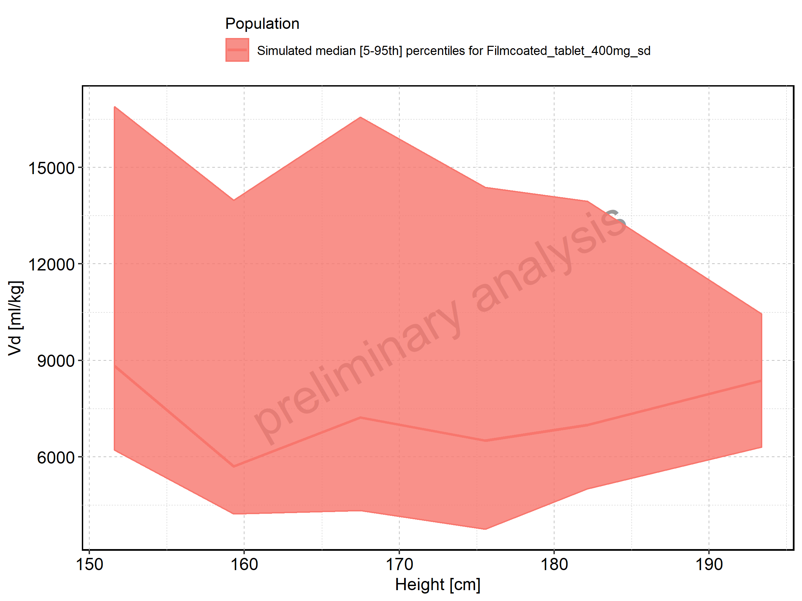

Figure 398: Height-dependence of Vd for Filmcoated_tablet_400mg_sd. Profiles are plotted in a logarithmic scale.

Figure 399: Weight-dependence of Vd for Larson 2013 8y-18y 400mg FCT meal in comparison to Filmcoated_tablet_400mg_sd. Profiles are plotted in a linear scale.

Figure 400: Weight-dependence of Vd for Larson 2013 8y-18y 400mg FCT meal in comparison to Filmcoated_tablet_400mg_sd. Profiles are plotted in a logarithmic scale.

Figure 401: Weight-dependence of Vd for Larson 2013 8y-18y 400mg FCT meal. Profiles are plotted in a linear scale.

Figure 402: Weight-dependence of Vd for Larson 2013 8y-18y 400mg FCT meal. Profiles are plotted in a logarithmic scale.

Figure 403: Weight-dependence of Vd for Filmcoated_tablet_400mg_sd. Profiles are plotted in a linear scale.

Figure 404: Weight-dependence of Vd for Filmcoated_tablet_400mg_sd. Profiles are plotted in a logarithmic scale.

Figure 405: BMI-dependence of Vd for Larson 2013 8y-18y 400mg FCT meal in comparison to Filmcoated_tablet_400mg_sd. Profiles are plotted in a linear scale.

Figure 406: BMI-dependence of Vd for Larson 2013 8y-18y 400mg FCT meal in comparison to Filmcoated_tablet_400mg_sd. Profiles are plotted in a logarithmic scale.

Figure 407: BMI-dependence of Vd for Larson 2013 8y-18y 400mg FCT meal. Profiles are plotted in a linear scale.

Figure 408: BMI-dependence of Vd for Larson 2013 8y-18y 400mg FCT meal. Profiles are plotted in a logarithmic scale.

Figure 409: BMI-dependence of Vd for Filmcoated_tablet_400mg_sd. Profiles are plotted in a linear scale.

Figure 410: BMI-dependence of Vd for Filmcoated_tablet_400mg_sd. Profiles are plotted in a logarithmic scale.

Figure 411: Gender-dependence of Vd for Larson 2013 8y-18y 400mg FCT meal in comparison to Filmcoated_tablet_400mg_sd. Profiles are plotted in a linear scale.

Figure 412: Gender-dependence of Vd for Larson 2013 8y-18y 400mg FCT meal in comparison to Filmcoated_tablet_400mg_sd. Profiles are plotted in a logarithmic scale.

Figure 413: Gender-dependence of Vd for Larson 2013 8y-18y 400mg FCT meal. Profiles are plotted in a linear scale.

Figure 414: Gender-dependence of Vd for Larson 2013 8y-18y 400mg FCT meal. Profiles are plotted in a logarithmic scale.

Figure 415: Gender-dependence of Vd for Filmcoated_tablet_400mg_sd. Profiles are plotted in a linear scale.

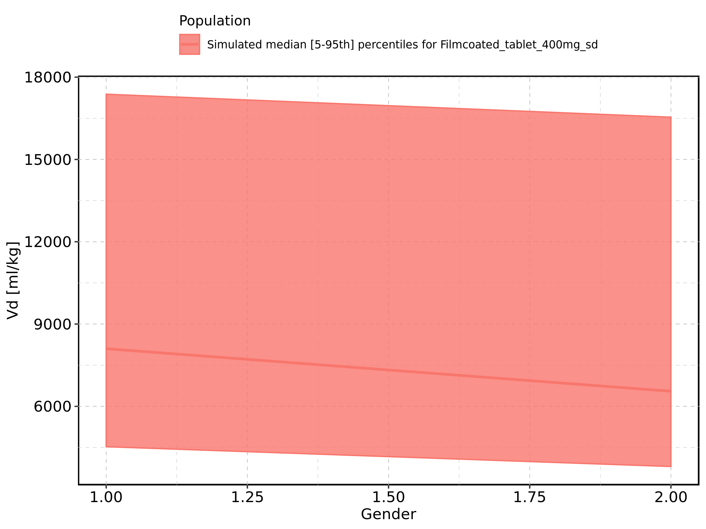

Figure 416: Gender-dependence of Vd for Filmcoated_tablet_400mg_sd. Profiles are plotted in a logarithmic scale.

# 2. Time profiles and residual plots

## 2.1. Time profiles and residual plots for Larson 2013 8y-18y 400mg FCT meal

Figure 417: Predicted vs observed of Larson 2013 8y-18y 400mg FCT meal for Larson 2013 8-18y meal. Data source: Data/Raltegravir_PK.txt. Predictions and observations are plotted in a linear scale.

-totalRange.png)

Figure 418: Predicted vs observed of Larson 2013 8y-18y 400mg FCT meal for Larson 2013 8-18y meal. Data source: Data/Raltegravir_PK.txt. Predictions and observations are plotted in a logarithmic scale.

-totalRange.png)

Figure 419: Logarithmic residuals vs predicted values of Larson 2013 8y-18y 400mg FCT meal for Larson 2013 8-18y meal. Data source: Data/Raltegravir_PK.txt.

-totalRange.png)

Figure 420: Logarithmic residuals vs time of Larson 2013 8y-18y 400mg FCT meal for Larson 2013 8-18y meal. Data source: Data/Raltegravir_PK.txt.

Figure 421: Logarithmic residuals distribution of Larson 2013 8y-18y 400mg FCT meal for Larson 2013 8-18y meal. Data source: Data/Raltegravir_PK.txt.

Figure 422: Logarithmic residuals of Larson 2013 8y-18y 400mg FCT meal for Larson 2013 8-18y meal as quantile-quantile plot. Data source: Data/Raltegravir_PK.txt.

## 2.2. Time profiles and residual plots for Filmcoated_tablet_400mg_sd

Figure 423: Predicted vs observed of Filmcoated_tablet_400mg_sd for Raltegravir 400mg filmcoated tablet. Data source: Data/Raltegravir_PK.txt. Predictions and observations are plotted in a linear scale.

-totalRange.png)

Figure 424: Predicted vs observed of Filmcoated_tablet_400mg_sd for Raltegravir 400mg filmcoated tablet. Data source: Data/Raltegravir_PK.txt. Predictions and observations are plotted in a logarithmic scale.

-totalRange.png)

Figure 425: Logarithmic residuals vs predicted values of Filmcoated_tablet_400mg_sd for Raltegravir 400mg filmcoated tablet. Data source: Data/Raltegravir_PK.txt.

-totalRange.png)

Figure 426: Logarithmic residuals vs time of Filmcoated_tablet_400mg_sd for Raltegravir 400mg filmcoated tablet. Data source: Data/Raltegravir_PK.txt.

Figure 427: Logarithmic residuals distribution of Filmcoated_tablet_400mg_sd for Raltegravir 400mg filmcoated tablet. Data source: Data/Raltegravir_PK.txt.

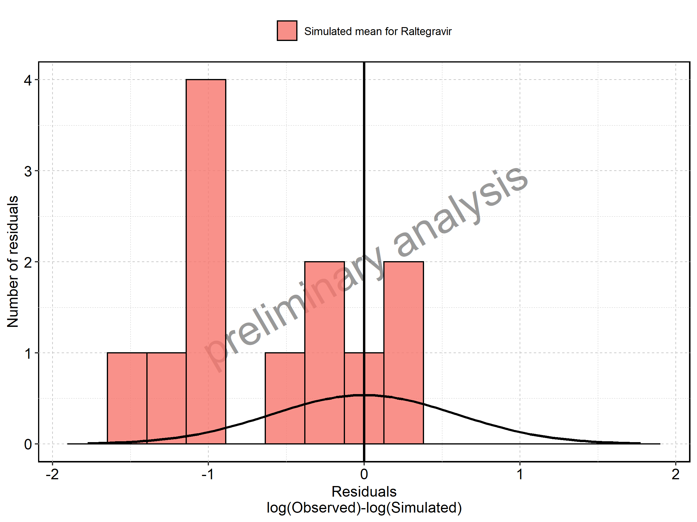

Figure 428: Logarithmic residuals of Filmcoated_tablet_400mg_sd for Raltegravir 400mg filmcoated tablet as quantile-quantile plot. Data source: Data/Raltegravir_PK.txt.

## 2.3. Residuals across all simulations

Figure 429: Distribution of residuals for Larson 2013 8y-18y 400mg FCT meal, Filmcoated_tablet_400mg_sd

Figure 430: Residuals for Larson 2013 8y-18y 400mg FCT meal, Filmcoated_tablet_400mg_sd as quantile-quantile plot.

# 3. Demography

Figure 431: Age-dependence of Height for Larson 2013 8y-18y 400mg FCT meal in comparison to Filmcoated_tablet_400mg_sd. Profiles are plotted in a linear scale.

Figure 432: Age-dependence of Height for Larson 2013 8y-18y 400mg FCT meal in comparison to Filmcoated_tablet_400mg_sd. Profiles are plotted in a logarithmic scale.

Figure 433: Age-dependence of Height for Larson 2013 8y-18y 400mg FCT meal. Profiles are plotted in a linear scale.

Figure 434: Age-dependence of Height for Larson 2013 8y-18y 400mg FCT meal. Profiles are plotted in a logarithmic scale.

Figure 435: Age-dependence of Height for Filmcoated_tablet_400mg_sd. Profiles are plotted in a linear scale.

Figure 436: Age-dependence of Height for Filmcoated_tablet_400mg_sd. Profiles are plotted in a logarithmic scale.

Figure 437: Age-dependence of Weight for Larson 2013 8y-18y 400mg FCT meal in comparison to Filmcoated_tablet_400mg_sd. Profiles are plotted in a linear scale.

Figure 438: Age-dependence of Weight for Larson 2013 8y-18y 400mg FCT meal in comparison to Filmcoated_tablet_400mg_sd. Profiles are plotted in a logarithmic scale.

Figure 439: Age-dependence of Weight for Larson 2013 8y-18y 400mg FCT meal. Profiles are plotted in a linear scale.

Figure 440: Age-dependence of Weight for Larson 2013 8y-18y 400mg FCT meal. Profiles are plotted in a logarithmic scale.

Figure 441: Age-dependence of Weight for Filmcoated_tablet_400mg_sd. Profiles are plotted in a linear scale.

Figure 442: Age-dependence of Weight for Filmcoated_tablet_400mg_sd. Profiles are plotted in a logarithmic scale.

Figure 443: Age-dependence of BMI for Larson 2013 8y-18y 400mg FCT meal in comparison to Filmcoated_tablet_400mg_sd. Profiles are plotted in a linear scale.

Figure 444: Age-dependence of BMI for Larson 2013 8y-18y 400mg FCT meal in comparison to Filmcoated_tablet_400mg_sd. Profiles are plotted in a logarithmic scale.

Figure 445: Age-dependence of BMI for Larson 2013 8y-18y 400mg FCT meal. Profiles are plotted in a linear scale.

Figure 446: Age-dependence of BMI for Larson 2013 8y-18y 400mg FCT meal. Profiles are plotted in a logarithmic scale.

Figure 447: Age-dependence of BMI for Filmcoated_tablet_400mg_sd. Profiles are plotted in a linear scale.

Figure 448: Age-dependence of BMI for Filmcoated_tablet_400mg_sd. Profiles are plotted in a logarithmic scale.

Figure 449: Age-dependence of Gender for Larson 2013 8y-18y 400mg FCT meal in comparison to Filmcoated_tablet_400mg_sd. Profiles are plotted in a linear scale.

Figure 450: Age-dependence of Gender for Larson 2013 8y-18y 400mg FCT meal in comparison to Filmcoated_tablet_400mg_sd. Profiles are plotted in a logarithmic scale.

Figure 451: Age-dependence of Gender for Larson 2013 8y-18y 400mg FCT meal. Profiles are plotted in a linear scale.

Figure 452: Age-dependence of Gender for Larson 2013 8y-18y 400mg FCT meal. Profiles are plotted in a logarithmic scale.

Figure 453: Age-dependence of Gender for Filmcoated_tablet_400mg_sd. Profiles are plotted in a linear scale.

Figure 454: Age-dependence of Gender for Filmcoated_tablet_400mg_sd. Profiles are plotted in a logarithmic scale.

