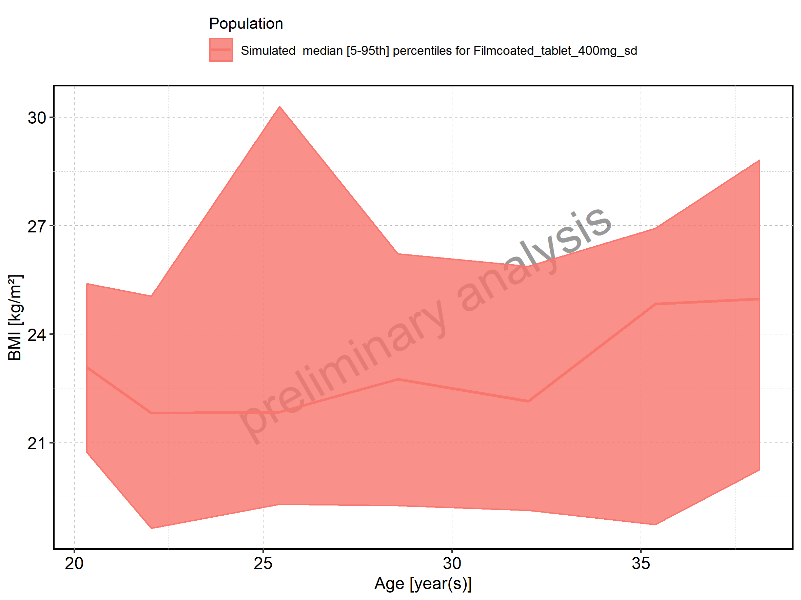

# Demography

Figure: Age-dependence of Height for Larson 2013 8y-18y 400mg FCT meal in comparison to Filmcoated_tablet_400mg_sd. Profiles are plotted in a linear scale.

Figure: Age-dependence of Height for Larson 2013 8y-18y 400mg FCT meal in comparison to Filmcoated_tablet_400mg_sd. Profiles are plotted in a logarithmic scale.

Figure: Age-dependence of Height for Larson 2013 8y-18y 400mg FCT meal. Profiles are plotted in a linear scale.

Figure: Age-dependence of Height for Larson 2013 8y-18y 400mg FCT meal. Profiles are plotted in a logarithmic scale.

Figure: Age-dependence of Height for Filmcoated_tablet_400mg_sd. Profiles are plotted in a linear scale.

Figure: Age-dependence of Height for Filmcoated_tablet_400mg_sd. Profiles are plotted in a logarithmic scale.

Figure: Age-dependence of Weight for Larson 2013 8y-18y 400mg FCT meal in comparison to Filmcoated_tablet_400mg_sd. Profiles are plotted in a linear scale.

Figure: Age-dependence of Weight for Larson 2013 8y-18y 400mg FCT meal in comparison to Filmcoated_tablet_400mg_sd. Profiles are plotted in a logarithmic scale.

Figure: Age-dependence of Weight for Larson 2013 8y-18y 400mg FCT meal. Profiles are plotted in a linear scale.

Figure: Age-dependence of Weight for Larson 2013 8y-18y 400mg FCT meal. Profiles are plotted in a logarithmic scale.

Figure: Age-dependence of Weight for Filmcoated_tablet_400mg_sd. Profiles are plotted in a linear scale.

Figure: Age-dependence of Weight for Filmcoated_tablet_400mg_sd. Profiles are plotted in a logarithmic scale.

Figure: Age-dependence of BMI for Larson 2013 8y-18y 400mg FCT meal in comparison to Filmcoated_tablet_400mg_sd. Profiles are plotted in a linear scale.

Figure: Age-dependence of BMI for Larson 2013 8y-18y 400mg FCT meal in comparison to Filmcoated_tablet_400mg_sd. Profiles are plotted in a logarithmic scale.

Figure: Age-dependence of BMI for Larson 2013 8y-18y 400mg FCT meal. Profiles are plotted in a linear scale.

Figure: Age-dependence of BMI for Larson 2013 8y-18y 400mg FCT meal. Profiles are plotted in a logarithmic scale.

Figure: Age-dependence of BMI for Filmcoated_tablet_400mg_sd. Profiles are plotted in a linear scale.

Figure: Age-dependence of BMI for Filmcoated_tablet_400mg_sd. Profiles are plotted in a logarithmic scale.

Figure: Age-dependence of Gender for Larson 2013 8y-18y 400mg FCT meal in comparison to Filmcoated_tablet_400mg_sd. Profiles are plotted in a linear scale.

Figure: Age-dependence of Gender for Larson 2013 8y-18y 400mg FCT meal in comparison to Filmcoated_tablet_400mg_sd. Profiles are plotted in a logarithmic scale.

Figure: Age-dependence of Gender for Larson 2013 8y-18y 400mg FCT meal. Profiles are plotted in a linear scale.

Figure: Age-dependence of Gender for Larson 2013 8y-18y 400mg FCT meal. Profiles are plotted in a logarithmic scale.

Figure: Age-dependence of Gender for Filmcoated_tablet_400mg_sd. Profiles are plotted in a linear scale.

Figure: Age-dependence of Gender for Filmcoated_tablet_400mg_sd. Profiles are plotted in a logarithmic scale.

