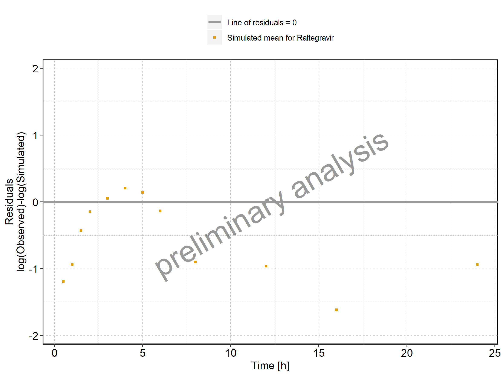
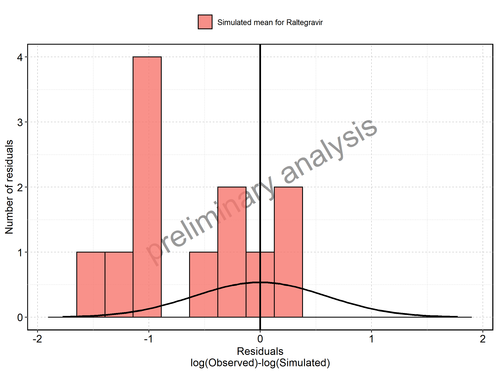
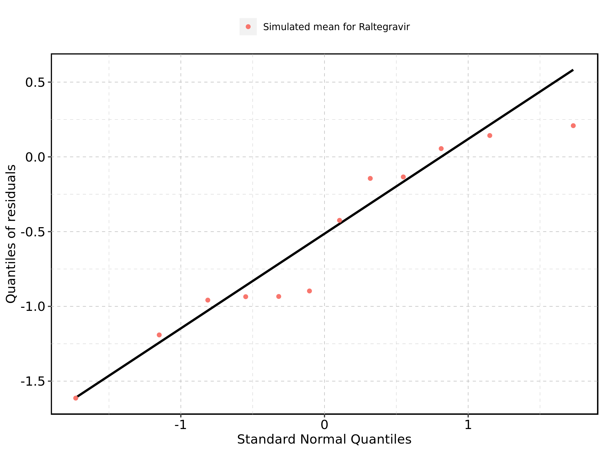
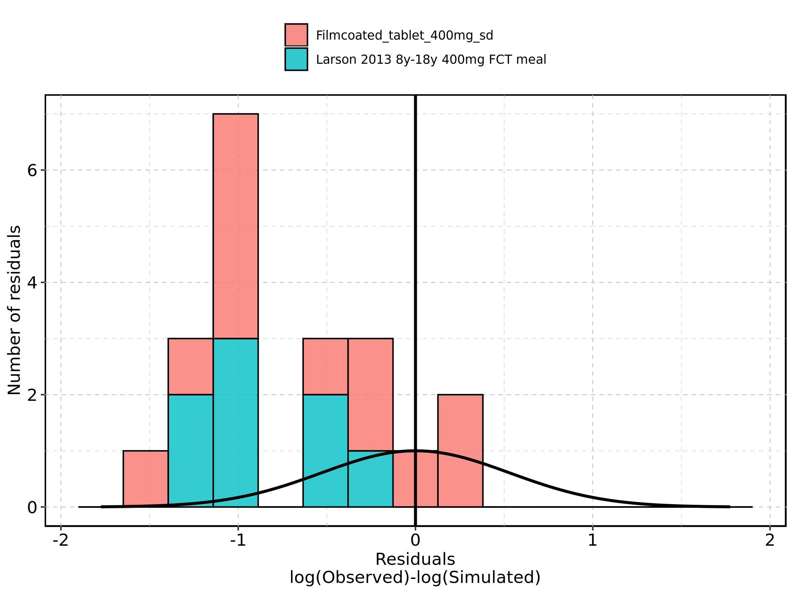
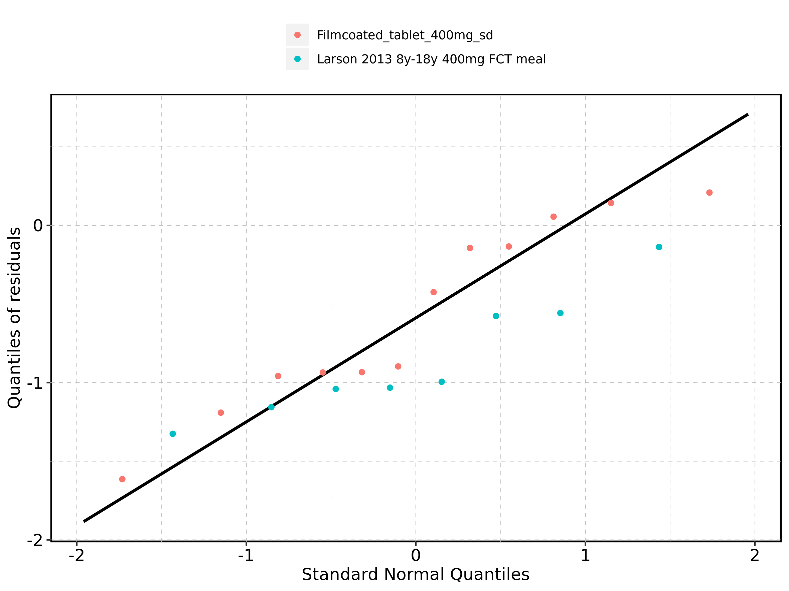

# Time profiles and residual plots

## Time profiles and residual plots for Larson 2013 8y-18y 400mg FCT meal

Figure: Predicted vs observed of Larson 2013 8y-18y 400mg FCT meal for Larson 2013 8-18y meal. Data source: Data/Raltegravir_PK.txt. Predictions and observations are plotted in a linear scale.

-totalRange.png)

Figure: Predicted vs observed of Larson 2013 8y-18y 400mg FCT meal for Larson 2013 8-18y meal. Data source: Data/Raltegravir_PK.txt. Predictions and observations are plotted in a logarithmic scale.

-totalRange.png)

Figure: Logarithmic residuals vs predicted values of Larson 2013 8y-18y 400mg FCT meal for Larson 2013 8-18y meal. Data source: Data/Raltegravir_PK.txt.

-totalRange.png)

Figure: Logarithmic residuals vs time of Larson 2013 8y-18y 400mg FCT meal for Larson 2013 8-18y meal. Data source: Data/Raltegravir_PK.txt.

Figure: Logarithmic residuals distribution of Larson 2013 8y-18y 400mg FCT meal for Larson 2013 8-18y meal. Data source: Data/Raltegravir_PK.txt.

Figure: Logarithmic residuals of Larson 2013 8y-18y 400mg FCT meal for Larson 2013 8-18y meal as quantile-quantile plot. Data source: Data/Raltegravir_PK.txt.

## Time profiles and residual plots for Filmcoated_tablet_400mg_sd

Figure: Predicted vs observed of Filmcoated_tablet_400mg_sd for Raltegravir 400mg filmcoated tablet. Data source: Data/Raltegravir_PK.txt. Predictions and observations are plotted in a linear scale.

-totalRange.png)

Figure: Predicted vs observed of Filmcoated_tablet_400mg_sd for Raltegravir 400mg filmcoated tablet. Data source: Data/Raltegravir_PK.txt. Predictions and observations are plotted in a logarithmic scale.

-totalRange.png)

Figure: Logarithmic residuals vs predicted values of Filmcoated_tablet_400mg_sd for Raltegravir 400mg filmcoated tablet. Data source: Data/Raltegravir_PK.txt.

-totalRange.png)

Figure: Logarithmic residuals vs time of Filmcoated_tablet_400mg_sd for Raltegravir 400mg filmcoated tablet. Data source: Data/Raltegravir_PK.txt.

Figure: Logarithmic residuals distribution of Filmcoated_tablet_400mg_sd for Raltegravir 400mg filmcoated tablet. Data source: Data/Raltegravir_PK.txt.

Figure: Logarithmic residuals of Filmcoated_tablet_400mg_sd for Raltegravir 400mg filmcoated tablet as quantile-quantile plot. Data source: Data/Raltegravir_PK.txt.

## Residuals across all simulations

Figure: Distribution of residuals for Larson 2013 8y-18y 400mg FCT meal, Filmcoated_tablet_400mg_sd

Figure: Residuals for Larson 2013 8y-18y 400mg FCT meal, Filmcoated_tablet_400mg_sd as quantile-quantile plot.

